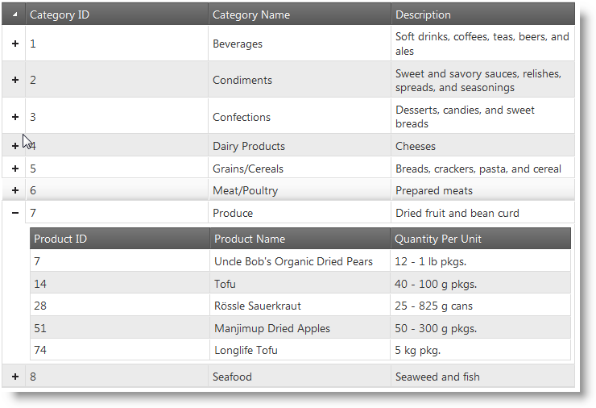

<!--
|metadata|
{
    "fileName": "ighierarchicalgrid-overview",
    "controlName": "igHierarchicalGrid",
    "tags": ["Getting Started","Grids"]
}
|metadata|
-->

# igHierarchicalGrid Overview

# Topic Overview

## Purpose

This topic provides conceptual information about the igHierarchicalGrid™ including information regarding features, binding to data sources, requirements, templates, and interaction.

## In this topic

This topic contains the following sections:

-   Main Features
    -   [Features overview](#features-overview)
    -   [Columns and layouts](#columns-layouts)
    -   [Load on demand](#load-on-demand)
    -   [Inheritance](#inheritance)
    -   [Events API](#events-api)
    -   [Styling and Theming](#styling-theming)
-   [ASP.NET MVC helper](#aspnet-mvc-helper)
-   [Binding Requirements](#binding-requirements)

# Introduction

The `igHierarchicalGrid` is a control for displaying hierarchical data with multiple levels and multiple layouts (relationships) on the same level. Because the `igHierarchicalGrid` uses internally the flat `igGrid` all its features are also available for the `igHierarchicalGrid`. This topic discusses the `igHierarchicalGrid`-specific features and will only provide links to the `igGrid`-specific features.

The picture below shows the `igHierarchicalGrid` with one of its rows expanded.

## Main Features

###  Features overview

The table below briefly explains the main `igHierarchicalGrid`-specific features. 

- [Columns](): Lets you choose whether do define the columns by hand or to let the igHierarchicalGrid do it automatically.
- [Column Layouts](): Creates a layout or lets the igHierarchicalGrid do it automatically.
- [Load On Demand](): Loads data to a row when the row is expanded.
- [Inheritance](): Allows child layouts to inherit their parents’ features.
- [Events](): The igHierarchicalGrid has events responsible for expanding and collapsing the child row and populating the child layouts.
 - rowExpanding
 - rowExpanded
 - rowCollapsing
 - rowCollapsed
 - childrenPopulating
 - childrenPopulated
- [Animation and Styling](): A set of API properties that allow you to change the expand/collapse animation.

An addition to the the specific features, the igHierarchicalGrid uses all igGrid features:

-   [Paging]()
-   [Sorting]()
-   [Filtering]()
-   [Updating]()
-   [Selection]()
-   [Summaries]()
-   [Row Selectors]()
-   [Group By]()
-   [Resizing]()
-   [Hiding]()
-   [Tooltips]()
-   [Feature Chooser]()

##  Columns and Layouts
Defining a column is the same like defining column in a flat grid. Inside the columns collection, you define the columns to display, together with the column-settings.

The property that is used to set the layout options that are not inherited from the parent is called columnLayouts. Inside this object you can define the child layout objects and their respective options.

### Related Topics

[Columns and Layouts]()

## Load on demand

If you want to load only the visible data, the igHierarchicalGrid allows you to do this by first loading the parent data only and after that loading every the column layout data.

### Related Topics
- [igHierarchicalGrid Load on Demand](igHierarchicalGrid-Load-on-Demand.html)

### Related samples
- [igHierarchicalGrid Load on Demand](%%SamplesUrl%%/hierarchical-grid/load-on-demand)

##  Inheritance

If you want the same feature for the child layouts as they are configured on the parent, you can use inheritance – define the feature in the parent layout and then enable inheritance for the lower levels.

### Related Topics
- [igHierarchicalGrid Feature Inheritance](igHierarchicalGrid-Feature-Inheritance.html)

##  Events API

The igHierarchicalGrid uses internally all igGrid feature events. In addition to that, he has some specific events for expanding and collapsing rows and populating a child grid.

### Related Topics
- [igHierarchicalGrid Events API](igHierarchicalGrid-Events-API.html)

##  Styling and Theming

The igHierarchicalGrid has plenty of properties that allow you to change the animation behavior when expanding and collapsing child layouts. It also supports all classes of the jQuery UI CSS Framework. This enables you apply styling using third-party tools, like jQuery Theme Switcher.

### Related Topics
- [igHierarchicalGrid Styling and Theming](igHierarchicalGrid-Styling-and-Theming.html)

##  ASP.NET MVC helper

You can use the ASP.NET MVC Helper for managed code languages to configure the igHierarchicalGrid. The MVC wrapper for the igHierarchicalGrid uses the same code as the flat igGrid wrapper. That’s why, as it is in the flat igGrid, the features’ logic is automatically handled by the MVC wrapper and you don’t need to create implementation for features like paging, sorting, filtering, summaries, as the requests It from these features are handled internally.

### Related Topics
- [Initializing the igHierarchicalGrid](igHierarchicalGrid-Initializing.html)

##  Binding Requirements

The igHierarchicalGrid is a jQuery UI Widget and therefore has a requirement for the jQuery and jQuery UI JavaScript libraries. In addition, there are several Ignite UI JavaScript resources that the igHierarchicalGrid uses for shared functionality and data binding. These JavaScript references are required whether the igHierarchicalGrid is used in JavaScript or in ASP.NET MVC. When using the igHierarchicalGrid in ASP.NET MVC, the Infragistics.Web.Mvc assembly is required to configure the igHierarchicalGrid with .NET languages.

Data structures can be any of the following:
- Well-formed JSON or XML supplied locally or from a web server, including servers that supports oData protocol.
- IQueryable in ASP.NET MVC

