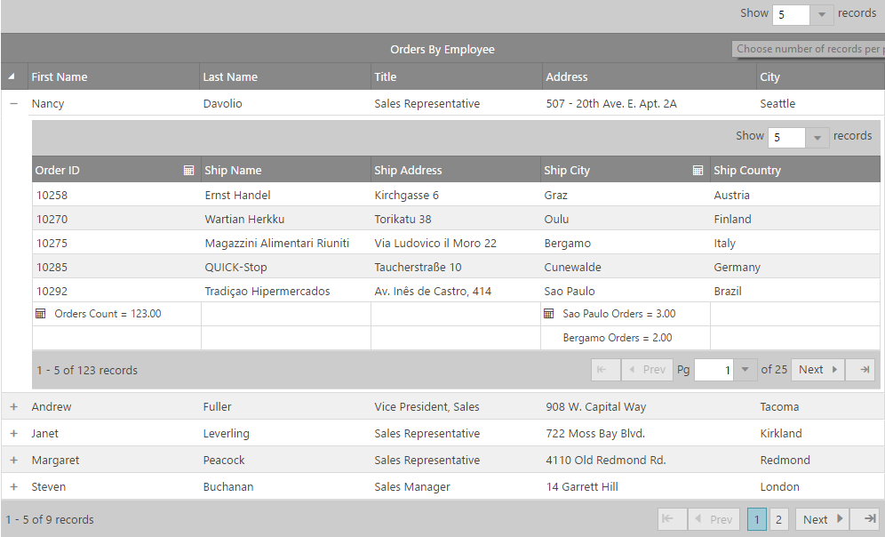
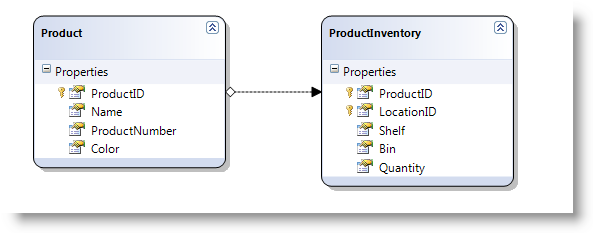

<!--
|metadata|
{
    "fileName": "ighierarchicalgrid-initializing",
    "controlName": "igHierarchicalGrid",
    "tags": ["Getting Started","Grids","How Do I"]
}
|metadata|
-->

# Initializing igHierarchicalGrid


## Topic Overview

### Purpose
This topic demonstrates how to initialize the igHierarchicalGrid™ in both jQuery and MVC.

### In this topic
This topic contains the following sections:

-   [Introduction](#introduction)
-   [Preview](#preview)
-   [Requirements](#requirements)
-   [Initializing a jQuery igHierarchicalGrid](#initializing-jquery)
-   [Initializing a MVC igHierarchicalGrid](#initializing-mvc)
-   [Related Topics](#related-topics)

## <a id="introduction"></a> Introduction
Bellow following are the main igHierarchicalGrid properties that are typically used with initialization. They are same as the properties of the flat igGrid.

-   `key` – the ID of a column layout
-   `dataSource` – the data source that the igHierarchicalGrid takes the data from
-   `initialDataBindDepth` – The level of hierarchy, at which the igHierarchicalGrid will initially bind the data source
-   `responseDataKey` – the object that holds the collection of the row elements.
-   `primaryKey` – the primary key of a child layout
-   `foreignKey` – the foreign key of a child layout

These properties are used in the example procedure that follows.

## <a id="preview"></a>Preview
Following is a preview of the final result.



## <a id="requirements"></a>Requirements
### General Requirements 
-   jQuery-specific requirements

    -   An HTML web page with a grid connected to a data source
    -   A table tag in the body of the HTML page to serve as a container for the grid

    **In HTML:**

    ```html
    <table id="hierarchicalGrid">
    </table>
    ```

-   MVC-specific requirements
    -   An MVC 2 or MVC 3 project in MS Visual Studio® with a grid connected to a data source
    -   A reference to the MVC dll (stores the MVC IG wrappers)

### Scripting Requirements 
The required scripts for both jQuery and MVC sample are the same because the MVC wrappers just render a jQuery widget.

The following scripts are required to run the grid and its grouping functionality:

-   The jQuery library script
-   The jQuery User Interface (UI) library
-   The IG library script (This is obfuscated code for the controls)

The following code sample demonstrates the scripts as added to the header code of the HTML file.

**In HTML:**

```html
<script type="text/javascript" src="jquery.min.js"></script>
<script type="text/javascript" src="jquery-ui.min.js"></script>
<script type="text/javascript" src="infragistics.core.js"></script><script type="text/javascript" src="infragistics.lob.js"></script>
```

### Database Requirements 
For the purpose of this example only:

-   jQuery – Northwind database

-   MVC – Adventure Works database.

## <a id="initializing-jquery"></a>Initializing a jQuery igHierarchicalGrid 

The sample below demonstrates how to bind igHierarchicalGrid to JSON data source.

<div class="embed-sample">
   [igHierarchicalGrid JSON Binding](%%SamplesEmbedUrl%%/hierarchical-grid/json-binding)
</div>

## <a id="initializing-mvc"></a>Initializing a MVC igHierarchicalGrid 
1.  Create the LINQ to SQL model. 
2.  Create an MVC Controller method.

    Create MVC Controller method that will get data from the Model and will call the View

    **In MVC:**

    ```csharp
    public ActionResult Default()
    {
        var ctx = new AdventureWorksDataContext("ConnString");
        var ds = ctx.Products;

        return View("Events", ds);
     }
    ```

3.  Define the igHierarchicalGrid.

    **In ASPX:**

    ```csharp
    <%= Html.Infragistics()
    .Grid(Model)
    .ID("grid1")
    .LoadOnDemand(false)
    .AutoGenerateColumns(true)
    .PrimaryKey("ProductID")
    .AutoGenerateLayouts(false)
    .ColumnLayouts(layouts => {
        layouts.For(x => x.ProductInventories)
            .PrimaryKey("LocationID")
            .ForeignKey("ProductID")
            .AutoGenerateColumns(false)
            .Columns(childcols1 =>
            {
                childcols1.For(x => x.ProductID);
                childcols1.For(x => x.LocationID);
                childcols1.For(x => x.Shelf);
                childcols1.For(x => x.Bin);
                childcols1.For(x => x.Quantity);
            });
    })
    .Width("750px")
    .DataBind()
    .Render()%>
    ```
         

4.  Save the project.
5.  (Optional) Verify the result.

To verify the result, run your application. You should see the igHierarchicalGrid (as shown in the Preview above).

## <a id="related-topics"></a>Related Topics 
Following are some other topics you may find useful.

-   [igHierarchicalGrid Overview](igHierarchicalGrid-Overview.html)
-   [Grid Properties Reference](%%jQueryApiUrl%%/ui.igGrid#options)
-   [igHierarchicalGrid Properties Reference](%%jQueryApiUrl%%/ui.ighierarchicalgrid#options)
