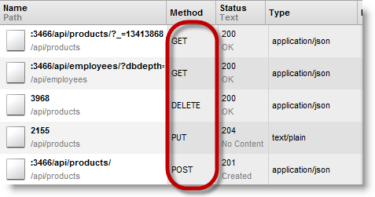
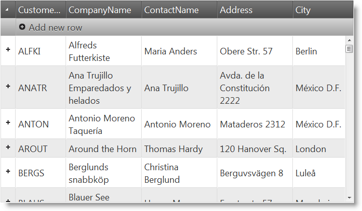

<!--
|metadata|
{
    "fileName": "ighierarchicalgrid-binding-to-rest-services",
    "controlName": "igHierarchicalGrid",
    "tags": ["Data Binding","Grids","How Do I"]
}
|metadata|
-->

# Binding igHierarchicalGrid to REST Services

## Topic Overview

### Purpose

This topic explains how to bind the igHierarchicalGrid™ to a REST Service.

### Required Background

The following lists the topics, concepts and external articles required as a prerequisite to understanding this topic:

- [REST Updating (igGrid)](igGrid-REST-Updating.html):  This topic explains igGrid support for REST services.
- [igHierarchicalGrid Overview](igHierarchicalGrid-Overview.html): This topic provides conceptual information about the `igHierarchicalGrid` including information regarding features, binding to data sources, requirements, templates, and interaction.
- [Initializing igHierarchicalGrid](igHierarchicalGrid-Initializing.html): This topic demonstrates how to initialize the igHierarchicalGrid in both jQuery and MVC.
- [Load-on-Demand (igHierarchicalGrid)](igHierarchicalGrid-Load-on-Demand.html): This topic demonstrates the two ways to load data to the `igHierarchicalGrid` – at once and on demand.


### In this topic

This topic contains the following sections:

-   [Introduction](#introduction)
-   [Binding to REST Service in JavaScript – Example](#binding-to-rest-services)
-   [Related Content](#related-content)


## <a id="introduction"></a> Introduction

### igHierarchicalGrid binding to REST Service summary

The igHierarchicalGrid REST Support has additional details to consider when compared to igGrid REST Support.

In order to enable REST support for the igHierarchicalGrid you need to set the [rest](%%jQueryApiUrl%%/ui.ighierarchicalgrid#options) option to `true`. For a load-on-demand scenario (`initialDataBindDepth=-1`) when root layout REST settings `url` is defined, then child layouts do not inherit the Url from the [restSettings](%%jQueryApiUrl%%/ui.iggrid#options). Instead, the Url is generated from both the root `restSettings` and the child layout configuration.

Child layouts request URLs are constructed the following way:

```
Url/RootPrimaryKeyID/Child1LayoutName/Child1PrimaryKeyID/Child2LayoutName/Child2PrimaryKeyID
```

Example: 

```
/api/customers/ANATR/orders/10308
```

where

```
Url = /api/customers/,	
RootPrimaryKeyID = ANATR,
Child1LayoutName = orders,
Child1PrimaryKeyID = 10308
```

For the child layouts, you can define [batch](%%jQueryApiUrl%%/ui.iggrid#options) and [template](%%jQueryApiUrl%%/ui.iggrid#options) options. If you want to use a template for the child layout then you should also define a template for the root `restSettings` because the child layout template is concatenated with the root template.

> Note: The child layout Batch option is not copied from the root `restSettings`. If you want batch mode for the whole grid then you should define `restSettings` for each child layout and set its Batch option to `true`.

In order to support load-on-demand with remote binding, there is a `dbdepth` parameter which is sent in the GET request. Use it to decide how many levels of data to return to the grid. This parameter is equivalent to the `igHierarchicalGrid.initialDataBindDepth` option.

Note: The igHierarchicalGrid `restSettings` cannot be set dynamically. If you want to change the `restSettings` then you should recreate the grid.

In the following screenshot you can see the REST request made by the igHierarchicalGrid when the [`saveChanges`](%%jQueryApiUrl%%/ui.ighierarchicalgrid#methods) method is executed.



## <a id="binding-to-rest-services"></a> Binding to REST Service in JavaScript – Example

### Introduction

This procedure explains how to configure the *igHierarchicalGrid* to bind to REST service. Server side implementation is not described, because the grid REST support is server agnostic.

The *igHierarchicalGrid* will be configured to use REST service which exposes data from the `Customers` and `Orders` tables of the `Northwind` database.

REST Service accepts the following URLs for the `Customers` data:

Http Method/Verb | Request body | URL parameter placeholder | Example
------------- | ------------- | ------------- | -------------
GET | Array| /api/customers | /api/customers
POST | Single object | /api/customers | /api/customers
PUT | Single object | /api/customers/{customerId} | /api/customers/ALFKI
DELETE | Empty | /api/customers/{customerId} | /api/customers/ALFKI

REST Service accepts the following URLs for the `Orders` data:

Http Method/Verb | Request body | URL parameter placeholder | Example
------------- | ------------- | ------------- | -------------
GET | Array | /api/customers/{customerId}/orders | /api/customers/ALFKI/orders
POST | Single object | /api/customers/{customerId}/orders | /api/customers/ALFKI/orders
PUT | Single object | /api/customers/{customerId}/orders/{orderId} | /api/customers/ALFKI/orders/10643
DELETE | Empty | /api/customers/{customerId}/orders/{orderId} | /api/customers/ALFKI/orders/10643

### Preview

The following screenshot is a preview of the final result.



### Prerequisites

To complete the procedure, you need the following:

-   Ignite UI JavaScript and Theme Files

## Steps

The following steps demonstrate how to configure the *igHierarchicalGrid* to bind to REST service.

### Step 1: Reference the required JavaScript files.

Include the required JavaScript references

**In HTML:**

```html
<script src="js/jquery.min.js"></script>
<script src="js/jquery-ui.min.js"></script>
<script src="js/infragistics.loader.js"></script>
```

### Step ​2: Define the HTML placeholder for the *igHierarchicalGrid*.

Create `TABLE` element inside the `BODY` of your page. Assign to id attribute a value `grid1`.

**In HTML:**

```html
<table id="grid1"></table>
```

### Step ​3: Initialize the Infragistics Loader.

**In JavaScript:**

```js
$.ig.loader({
    scriptPath: 'js',
    cssPath: 'css',
    resources: 'igHierarchicalGrid.Updating'
});
```

> **Note:** The Infragistics loader is a quick and efficient way to reference the required files. However, you can reference them manually. For more information, see the "[Using JavaScript Resouces in Ignite UI](Deployment-Guide-JavaScript-Resources.html)" topic in the [Related Content](#related-content) section.

### Step ​4. Initialize the *igHierarchicalGrid*.

​1. Define root layout and options

**In JavaScript:**

```js
$.ig.loader(function () {
    $("#grid1").igHierarchicalGrid({
        dataSource: "/api/customers/",
        primaryKey: "CustomerID",
        initialDataBindDepth: 0,
        rest: true,
        autoGenerateColumns: false,
        width: "700px",
        height: "400px",
        defaultColumnWidth: "140px",
        columns: [
            { headerText: "Customer ID", key: "CustomerID", dataType: "string", width: "100px" },
            { headerText: "Company Name", key: "CompanyName", dataType: "string", width: "150px" },
            { headerText: "Contact Name", key: "ContactName", dataType: "string", width: "150px" },
            { headerText: "Address", key: "Address", dataType: "string", width: "150px" },
            { headerText: "City", key: "City", dataType: "string", width: "100px" }
        ],
        features: [
            {
                name: "Updating",
                editMode: 'row',
                columnSettings: [{
                    columnKey: 'CustomerID',
                    readOnly: true
                }]
            }
        ]
    });
});
```

In the above code `igHierarchicalGrid` is configured with row updating. The grid GET request is configured by setting `dataSource` to `/api/customers/`. REST support is enabled by setting rest to true. The grid is configured in load-on-demand mode by setting `initialDataBindDepth` to `0`.

> **Note:** REST GET request is not defined in the `restSettings` option, but uses `dataSource` instead.

​2. Define root layout REST settings

- Add the following code to the *igHierarchicalGrid* configuration:

**In JavaScript:**

```js
restSettings: {
    create: {
        url: "/api/customers/"
    },
    update: {
        url: "/api/customers/"
    },
    remove: {
        url: "/api/customers/"
    }
}
```

When `url` is defined in the REST settings then *igHierarchicalGrid* automatically constructs the request URL as described in the [Introduction](#introduction) section.

If you want to define custom request URLs you should define template property on all layouts as described in step 3 and step 5.

​3. (Optional) Define root layout REST settings using templates

 - Add the following code to the *igHierarchicalGrid* configuration:

**In JavaScript:**

```js
restSettings: {
    create: {
        template: "/api/customers/"
    },
    update: {
        template: "/api/customers${id}"
    },
    remove: {
        template: "/api/customers${id}"
    }
}
```

In the above code the default request URLs is achieved by using template. Template can be used where REST service URL scheme doesn’t match the default URLs generated by *igHierarchicalGrid*.

> **Note:** When you use template, then you should define template for each level of the igHierarchicalGrid.

​4. Define child layout and options

Add the following code to the *igHierarchicalGrid* configuration:

**In JavaScript:**

```js
columnLayouts: [
    {
        key: "Orders",
        foreignKey: "CustomerID",
        primaryKey: "OrderID",
        width: "100%",
        autoGenerateColumns: false,
        columns: [
            { headerText: "OrderID", key: "OrderID", width: "10%", dataType: "number" },
            { headerText: "ShipName", key: "ShipName", width: "10%", dataType: "string" },
            { headerText: "ShipAddress", key: "ShipAddress", width: "10%", dataType: "string" }
        ],
        features: [
            {
                name: "Updating",
                editMode: 'row',
                columnSettings: [{
                    columnKey: 'OrderID',
                    readOnly: true
                }]
            }
        ]
    }
]
```

Orders child layout is defined with row updating feature also. The `restSettings` are not defined, because they are inherited from the root layout.

​5. (Optional) Define child layout REST settings using templates
 
- Add the following code to the Orders layout configuration:

**In JavaScript:**

```js
restSettings: {
    create: {
        template: "orders/"
    },
    update: {
        template: "orders${id}"
    },
    remove: {
        template: "orders${id}"
    }
}
```

If root `restSettings` are defined with template then templates should be used in the child layouts also. This step is an addition to step 3. Child layout request URLs are constructed by concatenating the templates on each level with its parent level, that’s why the template for the orders `restSettings` contains only orders part of the `Url`.

> **Note:** In the template you can use only `${id}` placeholder. This placeholder is mapped to the respective layout primary key.

## <a id="related-content"></a> Related Content

### Topics

The following topics provide additional information related to this topic.

- [REST Updating (igGrid)](igGrid-REST-Updating.html): This topic explains *igGrid* support for REST services.
- [Binding to ASP.NET MVC Web API (igHierarchicalGrid)](igHierarchicalGrid-Binding-to-WebAPI.html): This topic explains how to bind the igHierarchicalGrid to a Web API Service.

### Resources

The following material (available outside the Infragistics family of content) provides additional information related to this topic.

- [Getting Started with ASP.NET Web API](http://www.asp.net/web-api): ASP.NET Web API is a framework that makes it easy to build HTTP services that reach a broad range of clients, including browsers and mobile devices. ASP.NET Web API is an ideal platform for building REST-ful applications on the .NET Framework.


 

 


