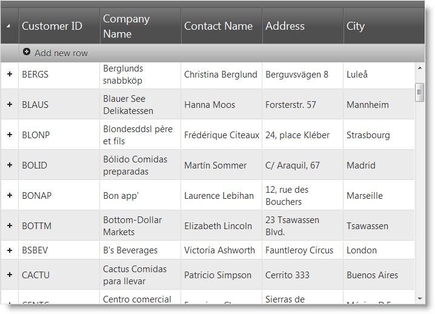
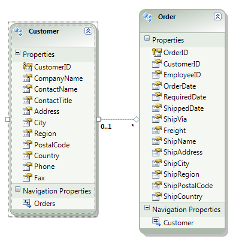

<!--
|metadata|
{
    "fileName": "ighierarchicalgrid-binding-to-webapi",
    "controlName": "igHierarchicalGrid",
    "tags": ["Data Binding","Grids","How Do I"]
}
|metadata|
-->

# Binding to ASP.NET MVC WebAPI

## Topic Overview

### Purpose
This topic will explain how to bind the igHierarchicalGrid™ to a Web API Service.

### Required background
The following list includes links to topics useful as background information for understanding this topic.

- [REST Updating (igGrid)](igGrid-REST-Updating.html): This topic explains igGrid support for REST services.
- [igHierarchicalGrid Overview](igHierarchicalGrid-Overview.html): This topic provides conceptual information about the igHierarchicalGrid including information regarding features, binding to data sources, requirements, templates, and interaction.
- [Initializing igHierarchicalGrid](igHierarchicalGrid-Initializing.html): This topic demonstrates how to initialize the igHierarchicalGrid in both jQuery and MVC.
- [Load-on-Demand (igHierarchicalGrid)](igHierarchicalGrid-Load-on-Demand.html): This topic demonstrates the two ways to load data to the igHierarchicalGrid – at once and on demand.

### In this topic

This topic contains the following sections:

-   [Binding to ASP.NET MVC Web API – Conceptual Overview](#overview)
-   [Binding to ASP.NET MVC Web API – Example](#example)
-   [Related Content](#related-content)

## <a id="overview"></a> Binding to ASP.NET MVC Web API – Conceptual Overview

### Binding to REST Service summary

Binding the igHierarchicalGrid to an MVC4 Web API is a two stage process:

-   Configure REST settings on the client
-   Configure REST on the server

By default, Web API supports JSON, XML, and form-url-encoded data serialization. The `$.ig.RESTDataSource` supports JSON serialization by default. JSON is used in this example.

#### Requirements

Following are the general requirements for binding to an ASP.NET MVC 4 Web API.

-   ASP.NET MVC 4

#### Steps

Following are the general conceptual steps for binding to an ASP.NET MVC 4 Web API.

​1. Setup the model
2. Initialize the *igHierarchicalGrid* with the REST settings
3. Configure routing for the child layout on the server
4. Configure controller actions for the *igHierarchicalGrid* root layout
5. Configure controller actions for the *igHierarchicalGrid* child layout


## <a id="example"></a> Binding to ASP.NET MVC Web API – Example

### Introduction

This sample explains how to bind the igHierarchicalGrid in load-on-demand mode. REST settings are shown using the default non-batch mode.

The example is using data from the `Customers` and `Orders` tables of the `Northwind` database.

### Preview

The following screenshot is a preview of the final result.



### Prerequisites

To complete the procedure, you need the following:

-   Microsoft ® Visual Studio 2010 or newer installed
-   MVC 4 Framework installed
-   Northwind Database installed
-   Infragistics.Web.Mvc.dll
-   Ignite UI JavaScript and Theme Files

### Steps

The following steps demonstrate how to bind igHierarchicalGrid to MVC 4 Web API.

### Step ​1: Setup the project

1. Create the project
  - From the Visual Studio menu choose File-> New Project
  - From the Installed Templates on the left choose Visual C#->Web
  - In the projects list at the center choose ASP.NET MVC 4 Web Application
  - In the Name field enter “igHierarchicalGridRESTSample” and press the OK button
  - From the “New ASP.NET MVC Project” dialog choose Web API and press the OK button

2. Add a reference to the `Infragistics.Web.Mvc.dll`
  - Right click on the References folder and choose Add Reference…
  - Locate the `Infragistics.Web.Mvc.dll` from the .NET tab or alternatively Browse for it.

3. Add reference to Ignite UI Scripts
  - Copy the Ignite UI distributable files to your project Scripts directory
  - In the `_Layout.cshtml` file under the `Views\Shared` folder add the reference to Infragistics loader

**In HTML:**

```html
<script src="../../Scripts/jquery-1.6.2.js" type="text/javascript"></script>
<script src="../../Scripts/jquery-ui-1.8.11.js" type="text/javascript"></script>
<script type="text/javascript" src="../../Scripts/Infragistics/js/infragistics.loader.js"></script>
```

In the `_Layout.cshtml` file under `Views\Shared` folder delete the following lines

**In C#:**

```csharp
@Scripts.Render("~/bundles/modernizr")
@Scripts.Render("~/bundles/jquery")
```

## Step ​2: Setup the model

### Create the entity model
Add an ADO.NET Entity Data Model for the *Customers* and `Orders` tables in the `Northwind` Database and name it `NorthwindModel`.



### Create the Customer and Order model classes
You only need a subset of the `Customer` and `Order` fields so create separate classes which hold only the data needed for this example.

  - Create the `Customer` class
  - Add a new class to the Models folder and name it `Customer.cs`

Add the following properties to the `Customer.cs` file:

**In C#:**

```csharp
public class Customer
{
    public string CustomerID { get; set; }
    public string CompanyName { get; set; }
    public string ContactName { get; set; }
    public string Address { get; set; }
    public string City { get; set; }
    public List<Order> Orders { get; set; }
}
```

 - Create the `Order` class
   - Add a new class to the Models folder and name it `Order.cs`
   - Add the following properties to the Order.cs file:

**In C#:**

```csharp
public class Order
{
    public int OrderID { get; set; }
    public string ShipName { get; set; }
    public string ShipAddress { get; set; }
}
```

## Step ​3: Initialize the *igHierarchicalGrid* with REST settings

### Configure the Home controller
Replace the `Index` action method with the following code:

**In C#:**

```csharp
public ActionResult Index()
{
    NorthwindModel.NorthwindEntities db = new NorthwindModel.NorthwindEntities();
    var customers = from c in db.Customers
                    select new Customer() { CustomerID = c.CustomerID, CompanyName = c.CompanyName, ContactName = c.ContactName, City = c.City, Address = c.Address };
    return View(customers.AsQueryable());
}
```

To configure load-on-demand in the `Index` action method, define which root layout is bound to the Customers data and which child layout is bound to the Orders data. Enable REST support by setting the `Rest` property to `true`. Also, define the `RestSettings` property and the Updating feature.

### Configure the Home view

Define a strongly typed model

**In C#:**

```csharp
@model IQueryable<igHierarchicalGridRESTSample.Models.Customer>
```

Reference the `Infragistics.Web.Mvc.dll` assembly

**In C#:**

```csharp
@using Infragistics.Web.Mvc
```

Define the Infragistics loader

**In C#:**

```csharp
@Html.Infragistics().Loader().ScriptPath("~/Scripts/Infragistics/js/").CssPath("~/Scripts/Infragistics /css/").Render()
```

> Note: You must change the `ScriptPath` and `CssPath` to match your Ignite UI file locations.

Define the grid:

**In C#:**

```csharp
@(Html.Infragistics().Grid(Model).
    ID("grid1").
    AutoGenerateColumns(false).
    AutoGenerateLayouts(false).
    Height("500px").
    Width("700px").
    ResponseDataKey(String.Empty).
    PrimaryKey("CustomerID").
    LoadOnDemand(true).
    Rest(true).
    Columns(column =>
    {
        column.For(x => x.CustomerID).HeaderText("Customer ID").DataType("string");
        column.For(x => x.CompanyName).HeaderText("Company Name").DataType("string");
        column.For(x => x.ContactName).HeaderText("Contact Name").DataType("string");
        column.For(x => x.Address).HeaderText("Address").DataType("string");
        column.For(x => x.City).HeaderText("City").DataType("string");
    }).
    ColumnLayouts(layouts => {
        layouts.For(x => x.Orders).
            ResponseDataKey(String.Empty).
            Width("100%").
            ForeignKey("CustomerID").
            PrimaryKey("OrderID").
            AutoGenerateColumns(false).
            AutoGenerateLayouts(false).
            Columns(childcolumn =>
            {
                childcolumn.For(x => x.OrderID).HeaderText("Order ID").DataType("number");
                childcolumn.For(x => x.ShipAddress).HeaderText("Ship Address").DataType("string");
                childcolumn.For(x => x.ShipName).HeaderText("Ship Name").DataType("string");
            }).Features(features => features.Updating().EditMode(GridEditMode.Row));
    }).
    RestSettings(rest =>
    {
        rest.RestSetting().        Create(r => r.RestVerbSetting().Url("/api/customers/").Batch(false)).
        Update(r => r.RestVerbSetting().Url("/api/customers/").Batch(false)).
        Remove(r => r.RestVerbSetting().Url("/api/customers/").Batch(false));
    }).
    Features(f => f.Updating()).
    DataSourceUrl("/api/customers/").
    Render())
```

## Step ​4: Configure routing for the child layout on the server

By default, the *igHierarchicalGrid* child layouts’ request URLs are constructed the following way:

```
Url/RootPrimaryKeyID/Child1LayoutName/Child1PrimaryKeyID/Child2LayoutName/Child2PrimaryKeyID
```

Example: 

```
/api/customers/ANATR/orders/10308
```

where

```
Url = /api/customers/,
RootPrimaryKeyID = ANATR,
Child1LayoutName = orders,
Child1PrimaryKeyID = 10308
```

ASP.NET Web API doesn’t handle this route by default, so a route handler should be added to the route table.

Alternatively you can customize the `restSettings.create.Template`, `restSettings.Update.Template` and `restSettings.remove.Template `properties to customize the requests URLs to match your REST Service configuration.

In the `RouteConfig.cs` file in the `App_Start` folder, add the route for the child layout in the `RegisterRoutes` method.

**In C#:**

```csharp
routes.MapHttpRoute(
    name: "ChildApi",
    routeTemplate: "api/{parentcontroller}/{parentid}/{controller}/{id}",
    defaults: new { parentcontroller = "customers", id = RouteParameter.Optional }
);
```

A request `url: /api/customers/ANATR/orders/10308` is handled the following way:

```
"api/{parentcontroller}" = "/api/customers",
"{parentid}" = “ANATR”,
"{controller}" = "orders",
"{id}" = 10308
```

A GET request on this URL executes the `GetOrders(“ANATR”)` method in the `OrdersController`.

More details regarding the `OrdersController` are found in step 6).

## Step ​5: Configure controller actions for the *igHierarchicalGrid* root layout

### 1. Create a Customers controller
Add a new empty Web API controller to the Controllers folder and name it `CustomersController.cs`.

> **Note:** The difference between normal ASP.NET MVC controllers and Web API controllers is that the former inherit from the Controller class and the later inherit from the `ApiController` class.

### 2. Add a NorthwindModel private field

**In C#:**

```csharp
private NorthwindModel.NorthwindEntities db = new NorthwindModel.NorthwindEntities();
```

### ​3. Define the GET controller action

Add a new method to the `CustomersController` to handle the grid’s GET requests:

**In C#:**

```csharp
public IEnumerable<Customer> GetCustomers(int dbdepth)
{
    var customers = from c in db.Customers
                    select new Customer() { CustomerID = c.CustomerID, CompanyName = c.CompanyName, ContactName = c.ContactName, City = c.City, Address = c.Address };
    return customers;
}
```

In the `GetCustomers` method, wrap the data from the `Customers` table in the `Customer` object defined earlier. You can use the `dbdepth` parameter to examine if the grid is defined as load on demand or not and return the correct hierarchy of data.

> **Note:** For the sake of simplicity, this example doesn’t use the [Repository design pattern](http://msdn.microsoft.com/en-us/library/ff649690.aspx) but instead directly accesses the Entity Framework API to modify the data store.

### ​4. Define the PUT controller action

Add the new method to the `CustomersController` to handle the grid’s PUT requests:

**In C#:**

```csharp
public HttpResponseMessage PutCustomer(string id, Customer customer)
{
    if (ModelState.IsValid && id == customer.CustomerID)
    {
        NorthwindModel.Customer changedCustomer = new NorthwindModel.Customer()
        {
            CustomerID = customer.CustomerID,
            CompanyName = customer.CompanyName,
            ContactName = customer.ContactName,
            Address = customer.Address,
            City = customer.City
        };
        db.Customers.Attach(changedCustomer);
        db.ObjectStateManager.ChangeObjectState(customer, EntityState.Modified);
        try
        {
            db.SaveChanges();
        }
        catch (DbUpdateConcurrencyException)
        {
            return Request.CreateResponse(HttpStatusCode.NotFound);
        }
        return Request.CreateResponse(HttpStatusCode.OK, customer);
    }
    else
    {
        return Request.CreateResponse(HttpStatusCode.BadRequest);
    }
}
```

The `PutCustomer` method is executed when there is a PUT request, i.e. when a customer is updated. The id parameter is mapped according to the `{id}` placeholder in the route template. The `Customer` parameter is constructed from the default model binder.

The default model binder is checked for errors using the `ModelState.IsValid` property. If the model is valid then a new `Customer` instance is attached to the `Customers` entity and its object state is set to `EntityState.Modified`. Finally the changed customer is saved to the database by calling the `SaveChanges` method and a proper status code is sent to the client as described in the REST specification.

### ​5. Define the POST controller action
Add a new method to the `CustomersController` to handle the grid’s POST requests:

**In C#:**

```csharp
public HttpResponseMessage PostCustomer(Customer customer)
{
    if (ModelState.IsValid)
    {
        NorthwindModel.Customer newCustomer = new NorthwindModel.Customer() {
            CustomerID = customer.CustomerID,
            CompanyName = customer.CompanyName,
            ContactName = customer.ContactName,
            Address = customer.Address,
            City = customer.City
        };
        db.Customers.AddObject(newCustomer);
        db.SaveChanges();
        HttpResponseMessage response = Request.CreateResponse(HttpStatusCode.Created, customer);
        response.Headers.Location = new Uri(Url.Link("DefaultApi", new { id = customer.CustomerID }));
        return response;
    }
    else
    {
        return Request.CreateResponse(HttpStatusCode.BadRequest);
    }
}
```

The `PostCustomer` method is executed when there is a POST request i.e. a new customer is created. The `Customer` parameter is constructed from the default model binder.

The default model binder is checked for errors using the `ModelState.IsValid` property. If the model is valid, then a new `Customer` instance is attached to the `Customers` entity with the `AddObject` method.

Finally, the customer is saved to the database by calling the `SaveChanges` method and a proper status code is sent to the client as described in the REST specification.

### ​6. Define the DELETE controller action

Add new method to the `CustomersController` which will handle grid’s DELETE requests:

**In C#:**

```csharp
public HttpResponseMessage DeleteCustomer(string id)
{
    NorthwindModel.Customer customer = db.Customers.Single(c => c.CustomerID == id);
    if (customer == null)
    {
        return Request.CreateResponse(HttpStatusCode.NotFound);
    }
    db.Customers.DeleteObject(customer);
    try
    {
        db.SaveChanges();
    }
    catch (DbUpdateConcurrencyException)
    {
        return Request.CreateResponse(HttpStatusCode.NotFound);
    }
    return Request.CreateResponse(HttpStatusCode.OK, customer);
}
```

The `DeleteCustomer` method is executed when there is a `DELETE` request, i.e. a customer is deleted. The id parameter is mapped according to the `{id}` placeholder in the route template.

In the method, the customer is extracted from the `Customers` entity by its `CustomerID` and passed to the `DeleteObject` method. Finally, the `SaveChanges` method deletes the customer from the database and the proper status code is sent to the client.

## Step ​6: Configure controller actions for the igHierarchicalGrid Orders child layout

### ​1. Create an Orders controller

Add a new empty Web API controller to the Controllers folder and name it `OrdersController.cs`

### ​2. Add a `NorthwindModel` private field

**In C#:**

```csharp
private NorthwindModel.NorthwindEntities db = new NorthwindModel.NorthwindEntities();
```

### ​3. Define the GET controller action

> **Note:** In order for the GET controller action to be called, the igHierarchicalGrid should be configured to use load-on-demand

Add a new method to the `OrdersController` to handle the grid’s GET requests:

**In C#:**

```csharp
public IEnumerable<Order> GetOrders(string parentid)
{
    var orders = from o in db.Orders
                    where o.CustomerID == parentid
                    select new Order() { OrderID = o.OrderID, ShipAddress = o.ShipAddress, ShipName = o.ShipName };
    return orders;
}
```

The `GetOrders` method wraps the data from the `Orders` entity in the `Order` object defined earlier. The `parentid` parameter is used to filter the data by foreign key. The `parentid` parameter is mapped from the `{parentid}` placeholder in the route template.

### 4. Define the PUT controller action

Add a new method to the `OrdersController` to handle the grid’s PUT requests:

**In C#:**

```csharp
public HttpResponseMessage PutOrder(int id, Order order)
{
    if (ModelState.IsValid && id == order.OrderID)
    {
        NorthwindModel.Order changedOrder = new NorthwindModel.Order()
        {
            OrderID = order.OrderID,
            ShipAddress = order.ShipAddress,
            ShipName = order.ShipName
        };
        db.Orders.Attach(changedOrder);
        db.ObjectStateManager.ChangeObjectState(order, EntityState.Modified);
        try
        {
            db.SaveChanges();
        }
        catch (DbUpdateConcurrencyException)
        {
            return Request.CreateResponse(HttpStatusCode.NotFound);
        }
        return Request.CreateResponse(HttpStatusCode.OK, order);
    }
    else
    {
        return Request.CreateResponse(HttpStatusCode.BadRequest);
    }
}
```

The `PutOrder` method is executed when there is a `PUT` request, i.e. when an order is updated. The id parameter is mapped from the `{id}` placeholder in the route template. The `Order` parameter is constructed from the default model binder.

The default model binder is checked for errors using the `ModelState.IsValid` property. If the model is valid then a new `Order` instance is attached to the `Orders` entity and its object state is set to `EntityState.Modified`. Finally the changed order is saved to the database by calling the `SaveChanges` method and a proper status code is sent to the client as described in the REST specification.

### ​5. Define the POST controller action

Add a new method to the `OrdersController` to handle the grid’s `POST` requests:

**In C#:**

```csharp
public HttpResponseMessage PostOrder(Order order)
{
    if (ModelState.IsValid)
    {
        NorthwindModel.Order newOrder = new NorthwindModel.Order()
        {
            OrderID = order.OrderID,
            ShipAddress = order.ShipAddress,
            ShipName = order.ShipName
        };
        db.Orders.AddObject(newOrder);
        db.SaveChanges();
        HttpResponseMessage response = Request.CreateResponse(HttpStatusCode.Created, order);
        response.Headers.Location = new Uri(Url.Link("DefaultApi", new { id = order.OrderID }));
        return response;
    }
    else
    {
        return Request.CreateResponse(HttpStatusCode.BadRequest);
    }
}
```

The `PostOrder` method is executed when there is a POST request, i.e. a new order is created. The `Order` parameter is constructed from the default model binder.

The default model binder is checked for errors using the `ModelState.IsValid` property. If the model is valid, then a new `Order` instance is attached to the `Orders` entity via the `AddObject` method. 

Finally, the order is saved to the database by calling the `SaveChanges` method and a proper status code is sent to the client as described in the REST specification.

### 6. Define the DELETE controller action

Add a new method to the `OrdersController` to handle the grid’s `DELETE` requests:

**In C#:**

```csharp
public HttpResponseMessage DeleteOrder(int id)
{
    NorthwindModel.Order order = db.Orders.Single(o => o.OrderID == id);
    if (order == null)
    {
        return Request.CreateResponse(HttpStatusCode.NotFound);
    }
    db.Orders.DeleteObject(order);
    try
    {
        db.SaveChanges();
    }
    catch (DbUpdateConcurrencyException)
    {
        return Request.CreateResponse(HttpStatusCode.NotFound);
    }
    return Request.CreateResponse(HttpStatusCode.OK, order);
}
```

The `DeleteOrder` method is executed when there is a `DELETE` request, i.e. an order is deleted. The id parameter is mapped from the `{id}` placeholder in the route template.

The order is extracted from the `Orders` entity by its `OrderID` and passed to the `DeleteObject` method. Finally, the `SaveChanges` method deletes the order from the database and the proper status code is sent to the client.


## <a id="related-content"></a>Related Content

### Topics

The following topics provide additional information related to this topic.

- [REST Updating (igGrid)](igGrid-REST-Updating.html): This topic explains *igGrid* support for REST services.
- [Binding to REST Services (igHierarchicalGrid)](igHierarchicalGrid-Binding-to-REST-Services.html): This topic explains how to bind the igHierarchicalGrid to a REST Service.

### Resources
The following material (available outside the Infragistics family of content) provides additional information related to this topic.

- [Getting Started with ASP.NET Web API](http://www.asp.net/web-api): ASP.NET Web API is a framework that makes it easy to build HTTP services that reach a broad range of clients, including browsers and mobile devices. ASP.NET Web API is an ideal platform for building RESTful applications on the .NET Framework.
