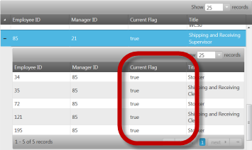
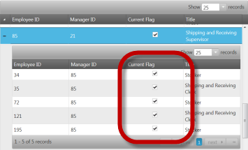

<!--
|metadata|
{
    "fileName": "ighierarchicalgrid-columns-and-layouts",
    "controlName": "igHierarchicalGrid",
    "tags": ["Grids","Layouts"]
}
|metadata|
-->

# Columns and Layouts (igHierarchicalGrid)

## Topic Overview

### Purpose

This topic demonstrates how to define columns and layouts in the igHierarchicalGrid™ including through auto-generation.

### In this topic

This topic contains the following sections:

-   [Features overview](#overview)
-   [Defining Columns](#defining-columns)
-   [Defining Layouts](#layouts)
-   [Auto-generate Columns and Layouts](#auto)
-   [Check Column](#checkbox-column)
-   [Related Topics](#related-topics)

## <a id="overview"></a> Features overview

The list below provides brief descriptions of the Columns features of the igHierarchicalGrid.

- [Columns](%%jQueryApiUrl%%/ui.ighierarchicalgrid#options): Defines the columns in the grid.
- [Layouts](%%jQueryApiUrl%%/ui.ighierarchicalgrid#options): Defines the layouts in the grid.

## <a id="defining-columns"></a> Defining Columns

When defining columns, you can configure some individual column settings, like the data binding. the header text, and the column width. For more information about the available options, see the columns property. The code below  demonstrates setting of some basic options when defining columns.

**In Javascript:**

```js
$("#hgrid1").igHierarchicalGrid({
       autogenerateColumns: false,
       columns: [
           { key: "OrderID", headerText: "OrderID", dataType: "number"},
           { key: "Name", headerText: "MovieName", type: "string"},
           { key: "Date", headerText: "Date"", type: "date"}
       ]
});
```

**In ASPX:**

```csharp
<%= Html.Infragistics().Grid(Model)
        .ID("grid1")
        .AutoGenerateColumns(false)
        .Columns(column =>
        {
                column.For(x => x.OrderID).HeaderText("OrderID").DataType("number");
                column.For(x => x.Name).HeaderText("Name"). DataType("string");
                column.For(x => x.Date).HeaderText("Date").HeaderText("date");
        })
        .DataBind()
        .Render()%>
```

**Note:** In order to display dates properly in the grid, the following requirements must be met:

-   The type of the column must be of date type
-   Incoming data complying to Microsoft .NET JSON serializer format

For example, if the above requirements are met, the following incoming data string

```
/Date(1097655307263)/
```

will be interpreted by the igHierarchicalGrid as


## <a id="layouts"></a> Defining Layouts

### Introduction

Layouts are the definitions of the column structure and features of the child grids at a particular level. In a layout you can define the same options as in the igGrid definition plus some properties describing the relationships with the parent igGrid. Child layouts can be defined inside a layout which allows for creating multi-level layout hierarchies.

### Property settings
Child layouts are defined through a property of the igHierarchicalGrid, called `columnLayouts`. (See the Multiple Levels and Layouts sample.)

### Code example
The code below demonstrates how to define a child layout.

**In Javascript:**

```js
$("#grid1").igHierarchicalGrid({
    autoGenerateColumns: true,
    childrenDataProperty: "Orders",
    autoGenerateLayouts: false,
    columnLayouts: [
        {
            key: "Orders",
            responseDataKey: 'd.results',
            autoGenerateColumns: true
        }
    ]
});
```

**In ASPX:**

```csharp
<%= Html.Infragistics()
        .Grid(Model)
        .ID("grid1")
        .AutoGenerateLayouts(false)
        .ColumnLayouts(layouts => {
             layouts.For(x => x.ProductInventories)
                .PrimaryKey("LocationID")
                .ForeignKey("ProductID")
                .AutoGenerateColumns(true)
             });
        })
        .DataBind()
        .Render()%>
```

### Load on demand considerations
To load the data for the igHierarchicalGrid on demand, you must explicitly define the primary and foreign keys of every layout. This is the only way through which the igHierarchicalGrid can form correct requests when using the Load On Demand feature.

## <a id="auto"></a> Auto-generate Columns and Layouts

### Introduction
If you don’t need to define neither the columns nor layouts, you can let the igHierarchicalGrid to configure columns and layouts automatically. When the grid auto-generates the layouts automatically, it takes the structure of attached data source. This can be done either on the client or on the server .

### Property Settings
Auto-generating layouts works by recursively analyzing the data source structure. If the objects' types contain public properties that are of IEnumerable/IQueryable type, they are assumed that they define a parent-child relationships and thus a layout is generated for these relationships. For example, you can bind to a list of Customers, and that list can have a property called `Orders` which is of type IQueryable.

### Code example
The code below demonstrates how to auto-generate columns in jQuery and MVC. To see this example code in action, refer to the Auto-generate sample.

**In Javascript:**

```js
$("#grid1").igHierarchicalGrid({
    autoGenerateColumns: true,
    autoGenerateLayouts: true,
});
```

**In ASPX:**

```csharp
<%= Html.Infragistics()
        .Grid(Model)
        .ID("grid1")
        .AutoGenerateColumns(true)
        .AutoGenerateLayouts(true)
        .DataBind()
        .Render()%>
```

### Additional considerations
It's important to know that using `autogenerate` columns and `autogenerate` layouts saves implementation time and can be used when the site is in development. But it is always preferable to define columns and layouts manually, when the application is running in a production environment. This is because the performance is better and you have control over the data that is rendered to the client.

**Note:** Updating feature requires `dataType` property to be set when `autoGenerateColumns` is set to false. That's because Updating feature uses primary key to synchronize records between the grid and the underlying data source and the primary key is compared by value and type.

## <a id="checkbox-column"></a>Rendering Checkboxes on a Column
By default for a column which contains Boolean data types, the igHierarchicalGrid shows a string saying true or false. You have, however, the option to make igHierarchicalGrid columns display Boolean data as checked or unchecked checkboxes to indicate, respectively, the true and false states of the data items. You render checkboxes on a column by setting the `renderCheckboxes` property to true. Rendering checkboxes requires setting the `dataType` property of the column to bool.

The example code that follows renders a checkbox on the Current Flag column as shown in the illustration on the right.

Without Checkbox | With Checkbox
---------------- | ---------------- 
 | 

**In Javascript:**

```js
$("#hierarchicalGrid1").igHierarchicalGrid({
            // enabling render checkboxes on a column
            renderCheckboxes: true,
            columns: [ { 
                    key: "ProductID", 
                    headerText: "ProductID", 
                    dataType: "number" 
                }, { 
                    key: "Code", 
                    headerText: "Code", 
                    dataType: "string" 
                }, { 
                    key: "InStock", 
                    headerText: "In Stock", 
                    dataType: "bool"
                }, {
                    headerText: "Order Date", 
                    key: "OrderDate", 
                    dataType: "date"
                }, {
                    headerText: "List Price", 
                    key: "ListPrice", 
                    dataType: "number", 
                    format: "currency"
                }
            ],
            columnLayouts: [ {
                    // enabling render checkboxes on a column
                    renderCheckboxes: true,
                    columns: [ { 
                            key: "ProductID", 
                            headerText: "ProductID", 
                            dataType: "number" 
                        }, { 
                            key: "StoreCode", 
                            headerText: "Store Code", 
                            dataType: "string" 
                        }, { 
                            key: "Quantity", 
                            headerText: "Quantity",
                            dataType: "number"
                        }, { 
                            key: "Ship", 
                            headerText: "Quantity", 
                            // note: rendering checkboxes on a column required to set dataType to "bool"
                            dataType: "bool"
                        }
                    ]
                }
            ]
        });
```

**In ASPX:**

```csharp
<%= Html.Infragistics().Grid(Model).ID("hierarchicalGrid1").LoadOnDemand(false).AutoGenerateColumns(false).AutoGenerateLayouts(false).PrimaryKey("EmployeeID").RenderCheckboxes(true).Columns(column => 
            {
                column.For(x => x.EmployeeID).HeaderText(this.GetGlobalResourceObject("HierarchicalGrid", "EmployeeID").ToString()).DataType("number");
                column.For(x => x.ManagerID).HeaderText(this.GetGlobalResourceObject("HierarchicalGrid", "ManagerID").ToString()).DataType("number");
                column.For(x => x.Title).HeaderText(this.GetGlobalResourceObject("HierarchicalGrid", "Title").ToString()).DataType("string");
                column.For(x => x.CurrentFlag).HeaderText(this.GetGlobalResourceObject("HierarchicalGrid", "CurrentFlag").ToString()).DataType("bool");
                column.For(x => x.SalariedFlag).HeaderText(this.GetGlobalResourceObject("HierarchicalGrid", "SalariedFlag").ToString()).DataType("bool");
            })
            .ColumnLayouts(layouts => {
                layouts.For(x => x.Employees).ForeignKey("EmployeeID").AutoGenerateColumns(false).AutoGenerateLayouts(false).RenderCheckboxes(true).Columns(childcolumn =>
                    {
                        childcolumn.For(x => x.EmployeeID).HeaderText(this.GetGlobalResourceObject("HierarchicalGrid", "EmployeeID").ToString()).DataType("number");
                        childcolumn.For(x => x.ManagerID).HeaderText(this.GetGlobalResourceObject("HierarchicalGrid", "ManagerID").ToString()).DataType("number");
                        childcolumn.For(x => x.Title).HeaderText(this.GetGlobalResourceObject("HierarchicalGrid", "Title").ToString()).DataType("string");
                        childcolumn.For(x => x.CurrentFlag).HeaderText(this.GetGlobalResourceObject("HierarchicalGrid", "CurrentFlag").ToString()).DataType("bool");
                        childcolumn.For(x => x.SalariedFlag).HeaderText(this.GetGlobalResourceObject("HierarchicalGrid", "SalariedFlag").ToString()).DataType("bool");
                    })
                    .Features(features => {
                        features.Selection().Mode(SelectionMode.Row);
                        features.Updating().EnableAddRow(false).EditMode(GridEditMode.Row).EnableDeleteRow(false).ColumnSettings(columnSettings =>
                        {
                            columnSettings.ColumnSetting().ColumnKey("EmployeeID").ReadOnly(true);
                            columnSettings.ColumnSetting().ColumnKey("ManagerID").ReadOnly(true);
                        });
                        features.Paging().Type(OpType.Local);
                        features.Sorting();
                    });
            })
            .Features(features => {
                    features.Selection().Mode(SelectionMode.Row);
                    features.Updating().EnableAddRow(false).EditMode(GridEditMode.Row).EnableDeleteRow(false).ColumnSettings(columnSettings =>
                    {
                        columnSettings.ColumnSetting().ColumnKey("EmployeeID").ReadOnly(true);
                        columnSettings.ColumnSetting().ColumnKey("ManagerID").ReadOnly(true);
                    });
                    features.Paging().Type(OpType.Local);
                    features.Sorting();
            }).DataBind().Height("500px").Render()
            %>
```

## <a id="related-topics"></a> Related Topics

Following are some other topics you may find useful.

- [Initializing the igHierarchicalGrid](igHierarchicalGrid-Initializing.html)
- [igHierarchicalGrid Properties Reference](%%jQueryApiUrl%%/ui.ighierarchicalgrid#options)

 

 


