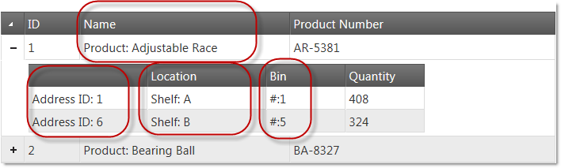

<!--
|metadata|
{
    "fileName": "creating-a-basic-column-template-in-ighierarchicalgrid",
    "controlName": "igHierarchicalGrid",
    "tags": []
}
|metadata|
-->

# Creating a Basic Column Template in igHierarchicalGrid

## Topic Overview

### Purpose
This topic demonstrates how to create basic column template for the `igHierarchicalGrid`.

## <a id="creating-basic-column-template"></a> Creating a Basic Colum Template in igHierarchicalGrid


## Introduction
In this example basic column templates are applied to the hierarchical grid. Only the columns circled with red have assigned column templates.

### Preview

The following screenshot is a preview of the final result.



#### Steps

The following steps demonstrate how to create basic column template into the igHierarchicalGrid

​1. Prepare an html page

To prepare the html page, add an igLoader and configure it to load igHierarchicalGrid resources.

**In Javascript:**

```js
<script src="http://localhost/ig_ui/js/infragistics.loader.js"></script>
<script type="text/javascript">
$.ig.loader({
      scriptPath: "http://localhost/ig_ui/js/",
      cssPath: "http://localhost/ig_ui/css/",
      resources: "igHierarchicalGrid"
});
</script>
```

​2. Add and apply the column template

  - Add sample data to the page and table tag to the body of the page.

**In Javascript:**

```js
<script type="text/javascript">
 var productsInventories = [{
      "ProductID": 1,
      "Name": "Adjustable Race",
      "ProductNumber": "AR-5381",
      "ProductInventories": {
            "Records": [
				{"ProductID": 1, "LocationID": 1, "Shelf": "A", "Bin": 1, "Quantity": 408}, 
                {"ProductID": 1, "LocationID": 6, "Shelf": "B", "Bin": 5, "Quantity": 324}             ]
      }
}, {
      "ProductID": 2,
      "Name": "Bearing Ball",
      "ProductNumber": "BA-8327",
      "ProductInventories": {
            "Records": [
				{"ProductID": 2, "LocationID": 1, "Shelf": "A","Bin": 2, "Quantity": 427}
			]
      }
}]</script>
```

**In HTML:**

```html
<body>
<table id="grid1"></table>
</body>
```

 - Add `igHierarchicalGrid` with column templates set on both root and child levels.

**In Javascript:**

```js
<script type="text/javascript">
$.ig.loader(function () {
      $("#grid1").igHierarchicalGrid({
            initialDataBindDepth: 1,
            odata: true,
            dataSource: productsInventories,
            dataSourceType: "json",
            width: "700",
            autoGenerateColumns: false,
            autoGenerateLayouts: false,
            primaryKey: "ProductID",
            columns: [
                  { key: "ProductID", headerText: "ID ", width: "70px" },
                  { key: "Name", headerText: "Name", width: "265px", template: "Product: ${Name}" },
                  { key: "ProductNumber", headerText: "Product Number", dataType: "string", width: "150px" }
            ],
            columnLayouts: [
                  {
                        key: "ProductInventories",
                        responseDataKey: "Records",
                        autoGenerateColumns: false,
                        autoGenerateLayouts: false,
                        generateCompactJSONResponse: false,
                        primaryKey: "LocationID",
                        foreignKey: "ProductID",
                        columns: [
                            { key: "LocationID", headerText: " ", width: "150px", template: "Address ID: ${LocationID}" },
                            { key: "Shelf", headerText: "Location", width: "150px", template: "Shelf: ${Shelf}" },
                            { key: "Bin", headerText: "Bin", width: "100px", template: "#:${Bin}" },
                            { key: "Quantity", headerText: "Quantity", width: "100px" }
                        ]
                  }
            ]
      });
});</script>
```


## Related Content
- [Infragistics Templating Engine](igTemplating-Overview.html): This section contains topics covering the use the Infragistics® Templating Engine.
