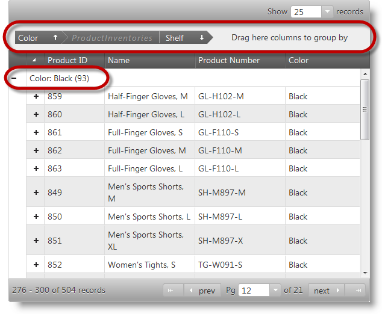

<!--
|metadata|
{
    "fileName": "ighierarchicalgrid-grouping-enabling-and-configuring",
    "controlName": "igHierarchicalGrid",
    "tags": []
}
|metadata|
-->

# Enabling and Configuring Grouping (igHierarchicalGrid)

## Topic Overview

### Purpose

This topic demonstrates, with code examples, how to enable and configure the Grouping feature of the igHierarchicalGrid™ control in both jQuery and MVC.

#### Required background

The following lists includes the topics required as a prerequisite to understanding this topic.

- [igHierarchicalGrid Overview](igHierarchicalGrid-Overview.html): This topic provides conceptual information about the igHierarchicalGrid including information regarding features, binding to data sources, requirements, templates, and interaction.
- [Initializing the igHierarchicalGrid](igHierarchicalGrid-Initializing.html): This topic demonstrates how to initialize the igHierarchicalGrid in both jQuery and MVC.

#### In this topic

This topic contains the following sections:

-   [Enabling and Configuring Grouping – Conceptual Overview](#concepts)
-   [Code Example: Enabling and Configuring Grouping in jQuery](#jquery-example)
-   [Code Example: Enabling and Configuring Grouping in MVC](#mvc-example)
-   [Related Content](#related-content)

## <a id="concepts"></a>Enabling and Configuring Grouping – Conceptual Overview
#### Enabling and Configuring grouping summary

Grouping is a standard grid feature and is configured by accessing a grid feature object with option name equal to "`GroupBy`". If you provide a feature object with that name and no other settings, you will get a grid control with its GroupBy area visible, but in a normal (ungrouped) state. The end user will be able to drag columns to this area or choose columns from the GroupBy dialog to have grouping by certain columns.

If you need to have the grid grouped by some column at startup, you explicitly have to set the columns that you want to be grouped. You can also set any additional properties you might want to configure, like the sorting direction inside the group, initial expand state or empty group by area text.

A hierarchical grid can only have one group by area displaying and managing grouped columns from all layouts. You cannot produce a hierarchical grid with grouping only enabled for a particular layout.

The picture below shows a hierarchical grid in which the values of the Color column on the root level are used to group and arrange the data in the grid. That is to say the grid is grouped by its Color column on the root level. The child level in the grid shows data from the `ProductInventories` table grouped based on the data in the Shelf column. Note that columns that serve as grouping criteria display their values in a group header row and in the group by area (if the area is enabled).



Grouping can be performed either locally or remotely (on the server) through setting the type property. Specifying the Grouping type is not mandatory as the control automatically assigns a grouping type setting based on the assigned data source. If the data source is local, then grouping will also be local. If the data source is remote, then grouping will be remote.


## <a id="jquery-example"></a> Code Example: Enabling and Configuring Grouping in jQuery
### Description

Demonstrates how to enable the grouping feature of a hierarchical grid in jQuery and set some common options.

For this example, you are expected to know how to create an igHierarchicalGrid control in general along with which scripts and CSS resources to include. For more information, refer to the igHierarchicalGrid Overview topic.

### Code

The code, in this example, initializes a hierarchical data grid and binds it to an array object with a two-level hierarchy of tables: Products on the root level and `ProductInventories` on the child level.

Configure the Grouping feature on the root and child levels by assigning a feature object to the features option of the grid and of the `columnLayout` respectively. The important setting there is the assignment name: "GroupBy" that tells the control to enable grouping behavior on the particular level.

The root level Grouping feature object specifies that:

-   Grouping must be performed locally: `type: "local"`.
-   The grouping area must be displayed on the top of the grid: `groupByAreaVisibility: "top"`.
-   GroupBy related options must be propagated to the child levels where applicable: `inherit: true`.
-   The Color column must be grouped initially: `columnKey: "Color"`, `isGroupBy: true`.
-   The user must be forbidden to group the Name column `columnKey: "Name"`, `allowGrouping: false`.

The root level Grouping feature object specifies that:

-   Grouping must be performed locally: `type: "local"`.
-   The Shelf column must be grouped initially: `columnKey: "Shelf"`, `isGroupBy: true`.

**In JavaScript:**

```js
$("#grid").igHierarchicalGrid({
    initialDataBindDepth: 1,
    dataSource: productsInventories,
    dataSourceType: 'json',
    responseDataKey: "Records",
    autoGenerateColumns: false,
    autoGenerateLayouts: false,
    columns: [
        { key: "ProductID", headerText: 'Product ID', width: "150px" },
        { key: "Name", headerText: 'Name', width: "265px" },
        { key: "ProductNumber", headerText: 'ProductNumber', dataType: "string",            width: "150px" },
        { key: "Color", headerText: 'Color', dataType: "string", width: "150px" },
    ],
    columnLayouts: [
        {
            key: "ProductInventories",
            responseDataKey: "Records",
            autoGenerateColumns: false,
            primaryKey: "ProductID,LocationID",
            foreignKey: "ProductID",
            columns: [
                { key: "ProductID", headerText: 'ProductID', width: "130px" },
                { key: "LocationID", headerText: 'AddressID', width: "130px" },
                { key: "Shelf", headerText: 'Shelf', width: "100px" },
                { key: "Bin", headerText: 'Bin', width: "60px" },
                { key: "Quantity", headerText: 'Quantity', width: "80px" },
            ],
            features: [{
                name: "GroupBy",
                type: "local",
                columnSettings: [{ columnKey: "Shelf", isGroupBy: true }]
            }]
        }
    ],
    features: [{
            name: "GroupBy",
            type: "local",
            groupByAreaVisibility: "top",
            inherit: true,
            columnSettings: [
                { columnKey: "Color", isGroupBy: true },
                { columnKey: "Name", allowGrouping: false }
            ]
    }]
});
```


## <a id="mvc-example"></a> Code Example: Enabling and Configuring Grouping in MVC
### Description

Demonstrates how to enable the grouping feature of a hierarchical grid in ASP.NET MVC and set some common options.

For this example, you are expected to know how to create an igHierarchicalGrid control in in ASP.NET MVC along with which scripts and CSS resources to include. For more information, refer to the [igHierarchicalGrid Overview](igHierarchicalGrid-Overview.html) topic.

### Code

The code, in this example, initializes a hierarchical data grid and binds it to a view model array object with a two-level hierarchy of tables: Products on the root level and ProductInventories on the child level.

Configure the Grouping feature on the root and child levels by passing a GridGroupByWrapper object to the Features method of the grid helper and of the ColumnLayout respectively. The important setting there is the call to the GroupBy() method, which tells the control to enable grouping behavior on the particular level.

The root level GroupBy wrapper object specifies that:

-   The grouping area must be displayed on the top of the grid: `GroupByAreaVisibility(GroupAreaVisibility.Top)`.
-   GroupBy related options must be propagated to the child levels where applicable: `Inherit(true)`.
-   The Color column must be grouped initially: `settings.ColumnSetting().ColumnKey("Color").IsGroupBy(true)`.
-   The user must be forbidden to group the Name column `settings.ColumnSetting().ColumnKey("Name").AllowGrouping(false)`.

The root level Grouping feature object specifies that:

-   Grouping must be performed locally: `Type(OpType.Local)`.
-   The Shelf column must be grouped initially: `setting.ColumnSetting().ColumnKey("Shelf").IsGroupBy(true)`.

**In ASPX:**

```csharp
<%= Html.Infragistics().Grid(Model).ID("grid")
    .AutoGenerateLayouts(false)
    .AutoGenerateColumns(false)
    .ColumnLayouts(layouts => {
        layouts.For(x => x.ProductInventories).Columns(inventories =>
        {
            inventories.For(x => x.ProductID).Width("100px").HeaderText("ProductID"));            inventories.For(x => x.Bin).Width("100px").HeaderText("Bin"));            inventories.For(x => x.Quantity).Width("100px").HeaderText("Quantity"));            inventories.For(x => x.Shelf).Width("100px").HeaderText("Shelf"));        })
        .Features(feature => {
            feature.GroupBy().ColumnSettings(setting =>
            {
                setting.ColumnSetting().ColumnKey("Shelf").IsGroupBy(true);
            });
        });
    })
    .Columns(cols => {
        cols.For(x => x.ProductID).Width("100px").HeaderText("ProductID"));        cols.For(x => x.Name).Width("150px").HeaderText("Name"));        cols.For(x => x.ProductNumber).Width("150px").HeaderText("ProductNumber"));        cols.For(x => x.Color).Width("100px").HeaderText("Color"));
    })
    .Features(feature => {
        feature.GroupBy()
            .GroupByAreaVisibility(GroupAreaVisibility.Top)
            .Inherit(true)
            .ColumnSettings(settings => {
                settings.ColumnSetting().ColumnKey("Color").IsGroupBy(true);
                settings.ColumnSetting().ColumnKey("Name").AllowGrouping(false);
            });
    })
    .DataBind()
    .Render() 
%>
```


## <a id="related-content"></a> Related Content

The following topics provide additional information related to this topic.

- [igHierarchicalGrid Overview](igHierarchicalGrid-Overview.html): This topic provides conceptual information about the igHierarchicalGrid including information regarding features, binding to data sources, requirements, templates, and interaction.
- [Initializing the igHierarchicalGrid](igHierarchicalGrid-Initializing.html): This topic demonstrates how to initialize the igHierarchicalGrid in both jQuery and MVC.


 

 


