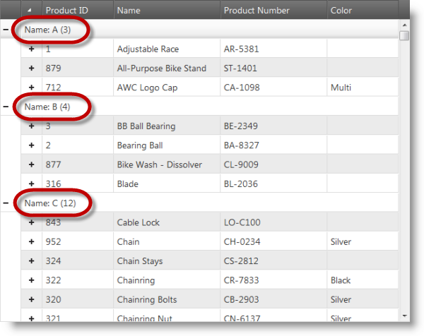

<!--
|metadata|
{
    "fileName": "ighierarchicalgrid-grouping-custom",
    "controlName": "igHierarchicalGrid",
    "tags": []
}
|metadata|
-->

# Configuring Custom Grouping (igHierarchicalGrid)


## Topic Overview
#### Purpose

Demonstrates how to configure a custom grouping function using the `groupComparerFunction` option.

#### Required background

The following table lists the topics required as a prerequisite to understanding this topic.

Topic | Purpose
---|---
[igHierarchicalGrid Overview](igHierarchicalGrid-Overview.html) | An overview of the igHierarchicalGrid™ including information regarding features, binding to data sources, requirements, templates, and interaction.
[Initializing igHierarchicalGrid](igHierarchicalGrid-Initializing.html) | Demonstrates how to initialize the igHierarchicalGrid in both jQuery and MVC.
[Grouping Overview (igHierarchicalGrid)](igHierarchicalGrid-Grouping-Overview.html) | Introduces the igHierarchicalGrid control’s grouping function.


#### In this topic

This topic contains the following sections:

-   [Configure Custom Grouping Function](#configure)
-   [Related Content](#related-content)

## <a id="configure"></a> Configure Custom Grouping Function
#### Introduction

Procedural demonstration of configuring an igHierarchicalGrid control to use a custom grouping function.

In this example, create a grouping `comparer` function that groups rows together by their first letter.

#### Preview

The following screenshot previews the results.



#### Steps

These steps demonstrate how to create a custom grouping function and assign it to the grouping feature of a hierarchical grid.

1. Create the custom grouping function.

    The function in the code below groups values by their first character.

    The interface for custom grouping functions consisting of three arguments:

    -   `columnSetting`: the column settings object for the column for which custom grouping is configured (e.g. in the example below this is the `columnSettings` assigned for the Name column; see Step 2 in this walkthrough)
    -   `val1`: the first value to be compared
    -   `val2`: the second value to be compared

    **In JavaScript:**

    ```js
    function firstLetterGroupComparer(columnSetting, val1, val2) {
        if (val1 !== null && val2 !== null && val1.substring(0, 1) === val2.substring(0, 1)) {
            columnSetting.customGroupName = val1.substring(0, 1);
            return true;
        } else if (val1 !== null && val2 !== null && val1.substring(0, 1) !== val2.substring(0, 1)) {
            columnSetting.customGroupName = val1.substring(0, 1);
            return false;
        } else if (val1 === null && val2 !== null) {
            columnSetting.customGroupName = val2.substring(0, 1);
            return false;
        } else if (val1 !== null && val2 === null) {
            columnSetting.customGroupName = val1.substring(0, 1);
            return false;
        }
        return false;
    }
    ```

    Except for the custom logic in the if and the first else if statements, it is important to mark the last two else if statements, which cover the case where there is only one defined value with the other being undefined. This must always be taken into account when writing comparer functions.

2. Configure the grid to use the custom function.

    Configure the custom grouping function in the grid so that the controls could call it when grouping data.

    In JavaScript  In the `groupComparerFunction: "firstLetterGroupComparer"` assignment for the Name column, the grid object’s configuration calls the `firstLetterGroupComparer()` function whenever the grouping operation is performed on the data from the Name column.

    **In JavaScript:**

    ```js
    ...
    features: [
    {
        name: "GroupBy",
        type: "local",
        groupByAreaVisibility: "hidden",
        inherit: true,
        columnSettings: [{
                columnKey: "Name",
                isGroupBy: true,
                groupComparerFunction: "firstLetterGroupComparer",
                allowGrouping: false
        }]
    }]
    ...
    ```

    ASP.NET MVC  As with the previous JavaScript example, here, the method call `GroupByComparerFunction("firstLetterGroupComparer")` of the grid wrapper configures the grid to use the `firstLetterGroupComparer()` function for grouping on the Name column.

    **In ASPX:**

    ```csharp
    ...
    .Features(feature => {
        feature.GroupBy().Type(OpType.Local).Inherit(true)
            .GroupByAreaVisibility(GroupAreaVisibility.Hidden)
            .ColumnSettings(setting =>
            {
                setting.ColumnSetting().ColumnKey("Name")
                    .IsGroupBy(true)
                    .GroupByComparerFunction("firstLetterGroupComparer")
                    .AllowGrouping(false);
            });
    })
    ...
    ```


## <a id="related-content"></a> Related Content
#### Topics

The following topic provides additional information related to this topic.

- [Enabling and Configuring Grouping](igHierarchicalGrid-Grouping-Enabling-and-Configuring.html): This topic explains how to add grouping functionality to the igHierarchicalGrid control.

#### Samples

The following sample provides additional information related to this topic.

- [Grouping Customization](%%SamplesUrl%%/grid/grouping-customization): This sample demonstrates defining custom grouping by assigning a function which implements custom grouping logic.


 

 


