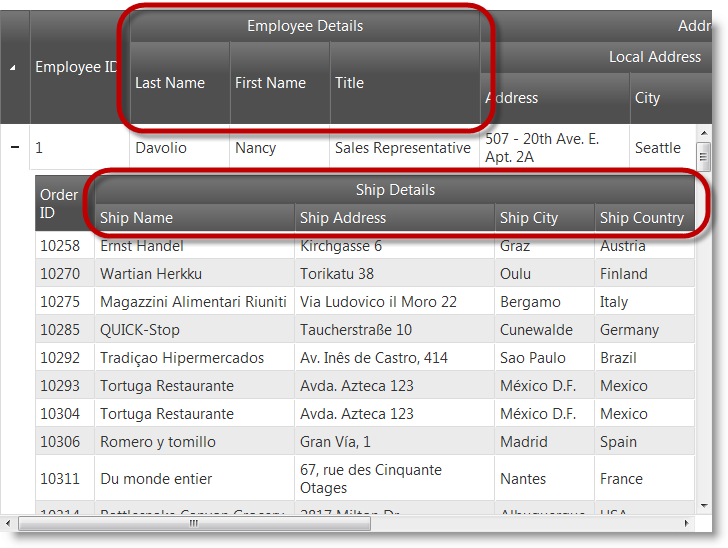
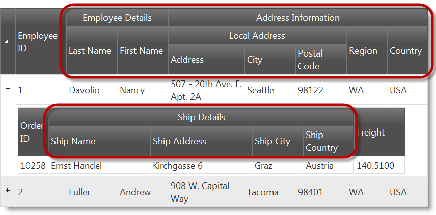
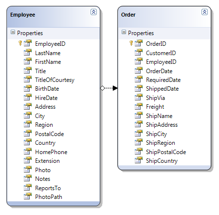

<!--
|metadata|
{
    "fileName": "ighierarchicalgrid-multicolumnheaders-configuring",
    "controlName": "igHierarchicalGrid",
    "tags": ["Grids","How Do I","Layouts"]
}
|metadata|
-->

# Configuring Multi-Column Headers (igHierarchicalGrid)


## Topic Overview
### Purpose

This topic explains how to configure the igHierarchicalGrid™ Multi-Column Headers feature.

#### Required background

The following topics are prerequisites to understanding this topic:

- [igHierarchicalGrid Overview](igHierarchicalGrid-Overview.html): This topic provides conceptual information about the *igHierarchicalGrid* including information regarding features, binding to data sources, requirements, templates, and interaction.
- [Initializing the igHierarchicalGrid](igHierarchicalGrid-Initializing.html): This topic demonstrates how to initialize the *igHierarchicalGrid* in both jQuery and MVC.
- [Multi-Column Headers (igGrid)](igGrid-MultiColumnHeaders-MultiColumnHeaders.html): This topic explains the *igGrid* multi-column headers feature.

#### In this topic

This topic contains the following sections:

-   [Introduction](#introduction)
-   [Configuring Multi-Column Headers in JavaScript](#headers-in-javascript)
-   [Configuring Multi-Column Headers in ASP.NET MVC](#headers-in-mvc)
-   [Related Content](#related-content)

## <a id="introduction"></a> Introduction

### Multi-column headers summary

The multi-column headers feature provides header grouping functionality. In the *columns* array*,* each object has a new option called [`group`](%%jQueryApiUrl%%/ui.iggrid_hg#options). This option accepts an array of column definitions. The group option is cascading meaning that you can group multi-column headers together. When defining a grouped column, you can set the [`headerText`](%%jQueryApiUrl%%/ui.iggrid_hg#options), [`key`](%%jQueryApiUrl%%/ui.iggrid_hg#options) and the [`rowspan`](%%jQueryApiUrl%%/ui.iggrid_hg#options) options. The `headerText` option is used to set the group caption, key is used to identify the column group, and `rowspan` is used to adjust the span of the group header cell.  The feature functionality is exposed off of the objects in the columns array. However as with other features, you must add the multi-column headers feature to the features array and also reference the necessary JavaScript files specific for the feature.  In the following screenshot there is a multi-column header configured for the FirstName, `LastName` and Title columns in the root layout of the igHierarchicalGrid. In the child layout, there is a multi-column header configured for the `ShipName`, `ShipAddress`, `ShipCity` and `ShipCountry` columns.



> Note: You can use hierarchical grid `columns` option API `$('.selector').igHierarchicalGrid('option', 'columns')` and `columnLayouts` option API `$('.selector').igHierarchicalGrid('option', 'columnLayouts')` to get multi-column headers hierarchy.

## <a id="headers-in-javascript"></a> Configuring Multi-Column Headers in JavaScript
### Introduction

This procedure guides you through the process of configuring multi-column headers in the igHierarchicalGrid.

### Preview

The following screenshot is a preview of the final result.



### Steps

The following steps demonstrate how to configure multi-column headers in the igHierarchicalGrid.


1. Reference the required JavaScript and CSS files.

	This code snippet uses the Infragistics loader to reference the Multi-Column Headers feature
	
	**In HTML:**
	
	```html
	<script src="jquery.min.js" type="text/javascript"></script>
	<script src="jquery-ui.min.js" type="text/javascript"></script> 
	<script src="infragistics.loader.js"></script>
	```
	
	**In JavaScript:**
	
	```js
	<script type="text/javascript">
	    $.ig.loader({
	        scriptPath: "http://localhost/ig_ui/js/",
	        cssPath: "http://localhost/ig_ui/css/",
	        resources: "igHierarchicalGrid.MultiColumnHeaders"
	    });
	</script>
	```

2. Define the sample data.

	Next, a JavaScript array of objects is created to bind to the igHierarchicalGrid.
	
	**In JavaScript:**
	
	```js
	var northwind = [{
	      "EmployeeID": 1,
	      "LastName": "Davolio",
	      "FirstName": "Nancy",
	      "Title": "Sales Representative",
	      "TitleOfCourtesy": "Ms.",
	      "BirthDate": "/Date(-664761600000)/",
	      "HireDate": "/Date(704678400000)/",
	      "Address": "507 - 20th Ave. E.rnApt. 2A",
	      "City": "Seattle",
	      "Region": "WA",
	      "PostalCode": "98122",
	      "Country": "USA",
	      "HomePhone": "(206) 555-9857",
	      "Extension": "5467",
	      "Notes": "Education includes a BA in psychology from Colorado State University in 1970.",
	      "ReportsTo": 2,
	      "PhotoPath": "http://accweb/emmployees/davolio.bmp",
	      "Orders": [{
	                  "OrderID": 10258,
	                  "CustomerID": "ERNSH",
	                  "EmployeeID": 1,
	                  "OrderDate": "/Date(837561600000)/",
	                  "RequiredDate": "/Date(839980800000)/",
	                  "ShippedDate": "/Date(838080000000)/",
	                  "ShipVia": 1,
	                  "Freight": "140.5100",
	                  "ShipName": "Ernst Handel",
	                  "ShipAddress": "Kirchgasse 6",
	                  "ShipCity": "Graz",
	                  "ShipRegion": null,
	                  "ShipPostalCode": "8010",
	                  "ShipCountry": "Austria"
	            }
	    ]}, {
	      "EmployeeID": 2,
	      "LastName": "Fuller",
	      "FirstName": "Andrew",
	      "Title": "Vice President, Sales",
	      "TitleOfCourtesy": "Dr.",
	      "BirthDate": "/Date(-563846400000)/",
	      "HireDate": "/Date(713750400000)/",
	      "Address": "908 W. Capital Way",
	      "City": "Tacoma",
	      "Region": "WA",
	      "PostalCode": "98401",
	      "Country": "USA",
	      "HomePhone": "(206) 555-9482",
	      "Extension": "3457",
	      "Notes": "Andrew received his BTS commercial in 1974.",
	      "ReportsTo": null,
	      "PhotoPath": "http://accweb/emmployees/fuller.bmp",
	      "Orders": [{
	                  "OrderID": 10265,
	                  "CustomerID": "BLONP",
	                  "EmployeeID": 2,
	                  "OrderDate": "/Date(838252800000)/",
	                  "RequiredDate": "/Date(840672000000)/",
	                  "ShippedDate": "/Date(839808000000)/",
	                  "ShipVia": 1,
	                  "Freight": "55.2800",
	                  "ShipName": "Blondel pu00e8re et fils",
	                  "ShipAddress": "24, place Klu00e9ber",
	                  "ShipCity": "Strasbourg",
	                  "ShipRegion": null,
	                  "ShipPostalCode": "67000",
	                  "ShipCountry": "France"
	        }
	    ]}];
	```

3. Define the HTML placeholder

	**In HTML:**
	
	```html
	<table id="grid1"></table>
	```

4. Instantiate the igHierarchicalGrid

	In the following code, there are two groups defined in the root layout.  The first is named **Employee Details** which contains the `LastName` and `FirstName` columns.
	
	The second is called **Address Information** and includes the `Country` and `Region` columns as well as another group column. The inner group is named **Local Address** and contains the `Address`, `City` and `PostalCode` columns.
	
	In the **Orders** layout, there is one multi-column header group. Its name is **Ship Details** and contains the `ShipName`, `ShipAddress`, `ShipCity` and `ShipCountry` columns.
	
	**In JavaScript:**
	
	```js
	$.ig.loader(function () {
	    $("#grid1").igHierarchicalGrid({
	        features: [
	            {
	                name: "MultiColumnHeaders",
	                inherit: true
	            }
	        ],
	        initialDataBindDepth: -1,
	        dataSource: northwind,
	        autoGenerateColumns: false,
	        primaryKey: "EmployeeID",
	        columns: [
	            { key: "EmployeeID", headerText: "Employee ID", dataType: "number", width: "100px" },
	            { headerText: "Employee Details",
	                group: [
	                    { key: "LastName", headerText: "Last Name", width: "100px" },
	                    { key: "FirstName", headerText: "First Name", width: "100px" }
	                ]
	            },
	            { headerText: "Address Information",
	            group: [
	                { headerText: "Local Address",
	                group: [
	                { headerText: "Address", key: "Address", width: "150px" },
	                { headerText: "City", key: "City", width: "100px" },
	                { headerText: "Postal Code", key: "PostalCode", width: "100px" }
	                ]},
	                { headerText: "Region", key: "Region", width: "80px" },
	                { headerText: "Country", key: "Country", width: "80px" }
	            ]}
	        ],
	        childrenDataProperty: "Orders",
	        autoGenerateLayouts: false,
	        columnLayouts: [
	            {
	                key: "Orders",
	                autoGenerateColumns: false,
	                primaryKey: "OrderID",
	                columns: [
	                    { key: "OrderID", headerText: "Order ID", width: "60px" },
	                    { headerText: "Ship Details",
	                        group: [
	                            { key: "ShipName", headerText: "Ship Name", width: "200px" },
	                            { key: "ShipAddress", headerText: "Ship Address", width: "200px" },
	                            { key: "ShipCity", headerText: "Ship City", width: "100px" },
	                            { key: "ShipCountry", headerText: "Ship Country", width: "100px" }
	                        ]
	                    },
	                    { key: "Freight", headerText: "Freight", width: "100px" }
	                ]
	            }
	        ]
	    });
	});
	```


## <a id="headers-in-mvc"></a> Configuring Multi-Column Headers in ASP.NET MVC
### Introduction

This procedure guides you through the process of configuring multi-column headers in the igHierarchicalGrid.

### Preview

The following screenshot is a preview of the final result.


### Requirements

To complete the procedure, you need the following:

-   Microsoft ® Visual Studio 2010 or newer installed
-   MVC 3 Framework or newer installed
-   Northwind Database installed
-   Infragistics.Web.Mvc.dll added to an ASP.NET MVC project
-   Ignite UI JavaScript and theme files added to an ASP.NET MVC project

### Steps

The following steps demonstrate how to configure multi-column headers in
the igHierarchicalGrid.

​1. Reference the required JavaScript and CSS files.

In the `Index.cshtml` View, add the required JavaScript references and instantiate the Infragistics loader.

The following code snippet is using the Infragistics loader to reference the Multi-Column Headers feature

**In HTML:**

```html
<script src="jquery.min.js" type="text/javascript"></script>
<script src="jquery-ui.min.js" type="text/javascript"></script> 
<script src="infragistics.loader.js"></script>
```

**In C#:**

```csharp
@Html.Infragistics()
.Loader()
.ScriptPath("http://localhost/ig_ui/js/")
.CssPath("http://localhost/ig_ui/css/")
.Resources("igGrid.MultiColumnHeaders")
.Render()
```

​2. Define the model

Add an ADO.NET Entity Data Model for the Employees and Orders tables in the Northwind Database and name it `NorthwindModel`.



​3. Define the view

Open the `Index.cshtml` View and add the code below.

In the code, there are two groups defined in the root layout.  The first is named **Employee Details** and contains the `LastName` and `FirstName` columns.

The second is called **Address Information** and includes the `Country` and `Region` columns as well as another group column. The inner group is named **Local address** and contains the `Address`, `City` and `PostalCode` columns.

In the Orders layout there is one multi-column header group. Its name is **Ship Details** and contains the `ShipName`, `ShipAddress`, `ShipCity` and `ShipCountry` columns.

**In C#:**

```csharp
@Html.Infragistics().Grid(Model)
.ID("grid1")
.LoadOnDemand(false)
.AutoGenerateLayouts(false)
.AutoGenerateColumns(false)
.ColumnLayouts(layouts =>
{
    layouts.For(x => x.Orders)
    .AutoGenerateColumns(false)
    .AutoGenerateLayouts(false)
    .Columns(cols =>
    {
        cols.For(x => x.OrderID).Width("100px").HeaderText("Order ID");
        cols.MultiColumnHeader().HeaderText("Ship Details").Group(c =>
        {
            c.For(x => x.ShipName).Width("200px").HeaderText("Ship Name");
            c.For(x => x.ShipAddress).Width("200px").HeaderText("Ship Address");
            c.For(x => x.ShipCity).Width("100px").HeaderText("Ship City");
            c.For(x => x.ShipCountry).Width("100px").HeaderText("Ship Country");
        });
        cols.For(x => x.Freight).Width("100px").HeaderText("Freight");
    })
    .Features(feature =>
    {
        feature.MultiColumnHeaders();
    });
})
.Columns(cols =>
{
    cols.For(x => x.EmployeeID).Width("100px").HeaderText("Employee ID");
    cols.MultiColumnHeader().HeaderText("Employee Details").Group(c =>
    {
        c.For(x => x.LastName).Width("100px").HeaderText("Last Name");
        c.For(x => x.FirstName).Width("100px").HeaderText("FirstName");
    });
    cols.MultiColumnHeader().HeaderText("Address Information").Group(c =>
    {
        c.MultiColumnHeader().HeaderText("Local Address").Group(c2 =>
        {
            c2.For(x => x.Address).Width("150px").HeaderText("Address");
            c2.For(x => x.City).Width("100px").HeaderText("City");
            c2.For(x => x.PostalCode).Width("100px").HeaderText("Postal Code");
        });
        c.For(x => x.Region).Width("80px").HeaderText("Region");
        c.For(x => x.Country).Width("100px").HeaderText("Country");
    });
})
.Features(feature => 
{ 
    feature.MultiColumnHeaders(); 
})
.Height("500px")
.Width("100%")
.DataBind()
.Render()
```

​4. Define the controller

In the Home controller’s `Index` action method, extract the Employees and Orders data from the Northwind database and return it with the view:

**In C#:**

```csharp
public ActionResult Index()
{
    var dataContext = new NorthwindDataContext();
    var employees = dataContext.Employees.AsQueryable();
    return View(employees);
}
```

## <a id="related-content"></a>Related Content
### Topics

The following topics provide additional information related to this topic.

- [igHierarchicalGrid Features](igHierarchicalGrid-Features-LandingPage.html): Landing page for topics related to igHierarchicalGrid features.
- [igHierarchicalGrid Feature Inheritance](igHierarchicalGrid-Feature-Inheritance.html): This demonstrates how to inherit features in the child layouts of the igHierarchicalGrid.
- [Row Selectors](igHierarchicalGrid-Row-Selectors-LandingPage.html): Landing page for topics related to the igHierarchicalGrid Row Selectors feature.
- [Selection](jQuery-igHierarchical-Grid-Selection-Landing-Page.html): Landing page for topics related to the igHierarchicalGrid Selection feature.
- [Grouping Overview](igHierarchicalGrid-Grouping-Overview.html): This topic introduces the igHierarchicalGrid control’s grouping feature as well as provides an overview of the configurable aspects of the feature.