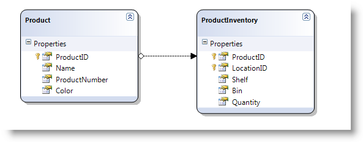

<!--
|metadata|
{
    "fileName": "ighierarchicalgrid-load-on-demand",
    "controlName": "igHierarchicalGrid",
    "tags": ["Data Binding","Grids","Performance"]
}
|metadata|
-->

# Load-on-Demand (igHierarchicalGrid)


## Topic Overview
## Purpose
This topic demonstrates the two ways to load data to the *igHierarchicalGrid*™ – all at once and on demand.

## In this topic
This topic contains the following sections:

-   [Introduction](#introduction)
-   [Loading the Whole Data Set](#wholeDataSet)
    -   [Loading the whole data set in jQuery](#wholeDataSetJQuery)
    -   [Loading the whole data set in MVC](#wholeDataSetMVC)
-   [Loading Data on Demand](#loadOnDemand)
    -   [Loading data on demand in jQuery](#loadOnDemandJQuery)
    -   [Loading data on demand in MVC](#loadOnDemandMVC)
        -   [Load On Demand parameters in MVC](#loadOnDemandParams)
-   [Related Topics](#relTopics)
-   [Related Samples](#relSamples)

## <a id="introduction"></a> Introduction
If Load On Demand is disabled on the client, the whole data set will be retrieved from the server; if it is enabled, only the needed data set will be retrieved. With JSON format, when Load On Demand is enabled, a JSON file without child data will be generated.

Load On Demand works differently for the igHierarchicalGrid, depending on whether jQuery widget is used or an MVC igHierarchicalGrid helper. The widget doesn’t have a specific property for Load On Demand, but can achieve this effect using the oData protocol, meaning the data must come from a remote server supporting that protocol.

The MVC igHierarchicalGrid wrapper, on the other hand, has a Load On Demand property and if that property is set to true, the wrapper internally will send a JSON without children data to the client.

The text blocks that follow demonstrate how to implement each of these two approaches.

## <a id="wholeDataSet"></a> Loading the Whole Data Set 
### <a id="wholeDataSetJQuery"></a> Loading the whole data set in jQuery 
To load the whole data set at once in jQuery, you need:

-   A hierarchical data source like the following JSON: Hierarchical Adventrueworks Data
-   To set the bind level

 

**In Javascript:**

```js
$("#gridAllData").igHierarchicalGrid({
    odata: false,
    initialDataBindDepth: 1,
    dataSource: jsonAllData
}
```

**Note:**

The value of `initialDataBindDepth` is set to `1`, if the level of the hierarchy in data source is also `1`. If you don’t know how many levels the data source has, just set the value to `-1`, which means that the igHierarchicalGrid will bind all the levels.

### <a id="wholeDataSetMVC"></a> Loading the whole data set in MVC 
For MVC, just configure the data not to be loaded on demand (`LoadOnDemand = false`).

**In C#:**

```csharp
GridModel allDataGridModel = new GridModel();
allDataGridModel.LoadOnDemand = false;
```

## <a id="loadOnDemand"></a> Loading Data on Demand 
### <a id="loadOnDemandJQuery"></a> Loading data on demand in jQuery 
To load all data on demand for jQuery you need:

-   A Hierarchical data source like the following JSON: oData Adventrueworks Data
-   To set the `oData` property to `true`, which means we will use the oData protocol to load data on demand.
-   To set the bind level of the igHierarchicalGrid to zero, because when loading data on demand, only the parent data loads initially.

     

**In Javascript:**

```js
$("#gridAllData").igHierarchicalGrid({
    odata: true,
    initialDataBindDepth: 0,
    dataSource: jsonoData
});
```


### <a id="loadOnDemandMVC"></a> Loading data on demand in MVC 
When configuring Load On Demand in MVC, the igHierarchicalGrid cannot be initialized in the View. Instead, you need to set all igHierarchicalGrid properties in either the Controller or in the Model. To load all data on demand for jQuery you need to set the `LoadOnDemand` property equal to `true` and call the `GetData` method.

For proper setup, you need a method that returns the required data. This means if we have an igHierarchicalGrid with two levels of hierarchy, we need to have one method that will return the parent data and another that will return the data for the child layout.

**In C#:**

```csharp
public ActionResult Index()
{
    GridModel productModel = GetProductModel();
    return View(productModel);
}
/* configures the parent layout */ 
private GridModel GetProductModel()
{
    GridModel gridModel = new GridModel();
    gridModel.AutoGenerateColumns = true;
    gridModel.AutoGenerateLayouts = false;
    gridModel.LoadOnDemand = true;
    gridModel.DataSourceUrl = Url.Action("BindProduct");
    GridColumnLayoutModel childModel = GetProductInventoryModel();
    gridModel.ColumnLayouts.Add(childModel);
    
    return gridModel;
}


/* configures the child layout */ 


private GridColumnLayoutModel GetProductInventoryModel()
{
    GridColumnLayoutModel childModel = new GridColumnLayoutModel();
    childModel.Key = "ProductInventory";
    childModel.PrimaryKey = "LocationId";
    childModel.ForeignKey = "ProductId";
    childModel.DataSourceUrl = Url.Action("BindProductInventory");


    return childModel;
}
```

The `DataSourceUrl` methods, should return the data in `JSONResult` format because the igHierarchicalGrid requires that. The igHierarchicalGrid has a method with such functionality – [GetData()](Infragistics.Web.Mvc~Infragistics.Web.Mvc.GridModel~GetData%28%29.html). So what you need is to get the data from your source, set it to the igHierarchicalGrid and call its method.

**Code Listing 1**: A method that returns data for the parent level

**In C#:**

```csharp
public JsonResult BindProduct()
{
    var ctx = new AdventureWorksDataContext(@"ConnString");
    var ds = ctx.Products.Take(3);
    GridModel productModel = GetProductModel();
    productModel.DataSource = ds;
    return productModel.GetData();
}
```

**Code Listing 2**: A method that returns data for the child level

**In C#:**

```csharp
public JsonResult BindProductInventory(string path, string layout)
{
    var ctx = new AdventureWorksDataContext(@"ConnString");
    var ds = ctx.ProductInventories;
    GridColumnLayoutModel productInventoryModel = GetProductInventoryModel();
    productInventoryModel.DataSource = ds;
    return productInventoryModel.GetData(path, layout);
}
```

When you bind child layout on demand it is important to use `GridColumnLayoutModel` instance of the child itself as shown in **Code Listing 2**. 

### <a id="loadOnDemandParams"></a> Load On Demand parameters in MVC 

When igHierarchicalGrid loads data on demand, it makes an internal request and sets the required parameters. These parameters tell the method which layout data is needed. The MVC igHierarchicalGrid wrapper cares about this internally, so you just need to define the data method with these parameters and then pass them to the `GetData` method. (Code Listing 2) The parameters are:

-   Path
-   Layout

The path has the following format: `PrimaryKeyID/ChildKeyID1/childKeyID2[layout_name]`. For example when the path is in the format `1[0]/2[0]`, it specifies the first child layout of the third child row of the first layout of the second parent row.

An empty root returns the root grid, so when you call the data method for the parent grid (Code Listing 1) you don’t need any parameters.

For the two examples above (Code Listing 1 and Code Listing 2), the data has the following relations:



## <a id="relTopics"></a> Related Topics 
- [igHierarchicalGrid Overview](igHierarchicalGrid-Overview.html)
- [Initializing the igHierarchicalGrid](igHierarchicalGrid-Initializing.html)
- [igHierarchicalGrid Properties Reference](%%jQueryApiUrl%%/ui.ighierarchicalgrid#options)

## <a id="relSamples"></a> Related Samples 
- [igHierarchicalGrid Load On Demand](%%SamplesUrl%%/hierarchical-grid/load-on-demand)