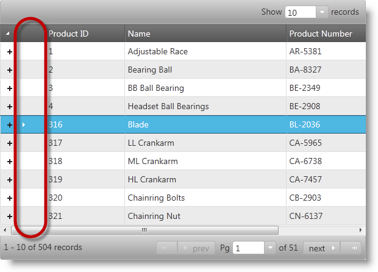

<!--
|metadata|
{
    "fileName": "ighierarchicalgrid-enabling-rowselectors",
    "controlName": "igHierarchicalGrid",
    "tags": []
}
|metadata|
-->

# Enabling Row Selectors (igHierarchicalGrid)

## Topic Overview

### Purpose
Demonstrates, with code examples, how to enable the igHierarchicalGrid™ control’s Row Selectors feature in jQuery and ASP.NET MVC.

### Required background
The following table lists the topics required as a prerequisite to understanding this topic.

Topic | Purpose
----- | ---------
[igHierarchicalGrid Overview](igHierarchicalGrid-Overview.html) | Provides conceptual information about the igHierarchicalGrid including information regarding features, binding to data sources, requirements, templates, and interaction.
[Initializing the igHierarchicalGrid](igHierarchicalGrid-Initializing.html) | Demonstrates how to initialize the igHierarchicalGrid in both jQuery and MVC.

### In this topic
-   [Introduction](#introduction)
-   [Code Example: Enabling RowSelectors in jQuery](#enabling-rowselectors-in-jquery)
-   [Code Example: Enabling RowSelectors in MVC](#enabling-rowselectors-in-mvc)
-   [Related Content**](#related-content)

## <a id="introduction"></a> Introduction

### Introduction to row selection
The igRowSelectors™ widget facilitates the user's row selection by displaying a separate row selection column. Displayed to the right of the first data column in the root and child views, the special row selection column can be configured to contain check boxes (for easier multiple selection) and/or consecutive row numbers. The Row Selection feature is all about the user experience in terms of both the user interface and his or her interaction with the grid. The actual selection behavior is carried out by the `igGridRowSelectors` feature. Although, the Row Selection function is typically used together with the Selection feature it can be used alone for its row numbering capability. If configured, the Selection feature activates and selects the corresponding row when the user clicks in a row selection cell or checks the row selection check box.

The following screenshot, illustrates how the *igHierarchicalGrid* control, with row selection enabled, renders a data grid. As shown below, the row selector column is encircled by a red ellipse for emphasis.



The row selection functionality is managed by the `name` property of the igHierarchicalGrid’s features option. To enable row selection point the name property to `name: RowSelectors`. When enabled, row selection is indicated by the presence of the row selection column to the right of the expand/collapse buttons column of the grid as illustrated below.

The row selection column gives the user the ability to select the current row or the first cell of the current row by clicking on it depending on the separate Selection feature’s configuration. The grid’s response to this event depends on the Selection feature’s `mode` setting: `row` or `cell`. Additionally, checkboxes may be rendered in the row selection column; thus allow easier multiple selections. Finally, consecutive numbering of the rows, a common business requirement, can be rendered in the grid.

> Note:Keep in mind that `RowSelectors` behavior is per layout. Only one layout can have selection at a time, so if you select/ check a row in a different layout, the selected rows from the previous layout will become unselected.

## <a id="enabling-rowselectors-in-jquery"></a> Code Example: Enabling RowSelectors in jQuery

### Description
Using jQuery to create a simple data array and instantiate an igHierarchicalGrid with Row Selectors enabled.

#### Code
The following code snippet demonstrates how to set up a hierarchical JavaScript object to be displayed in the grid:

**In HTML:**

```html
<script type="text/javascript">
    var data = {
        "Records": [{
            "ProductID": 1,
            "Name": "Adjustable Race",
            "ProductNumber": "AR-5381",
            "Color": null,
            "ProductInventories": {
                "Records": [
                    { "ProductID": 1, "LocationID": 1, "Shelf": "A", "Bin": 1, "Quantity": 408 },
                    { "ProductID": 1, "LocationID": 6, "Shelf": "B", "Bin": 5, "Quantity": 324 },
                    { "ProductID": 1, "LocationID": 50, "Shelf": "A", "Bin": 5, "Quantity": 353 }
                ],
                "TotalRecordsCount": 0,
                "Metadata": {}
            }
        }, {
            "ProductID": 2,
            "Name": "Bearing Ball",
            "ProductNumber": "BA-8327",
            "Color": null,
            "ProductInventories": {
                "Records": [
                    { "ProductID": 2, "LocationID": 1, "Shelf": "A", "Bin": 2, "Quantity": 427 },
                    { "ProductID": 2, "LocationID": 6, "Shelf": "B", "Bin": 1, "Quantity": 318 },
                    { "ProductID": 2, "LocationID": 50, "Shelf": "A", "Bin": 6, "Quantity": 364 }
                ],
                "TotalRecordsCount": 0,
                "Metadata": {}
            }
        }]
    };
</script>
```

First, create an igHierarchicalGrid control inside the `$(document).ready()` event handler and call its Row Selection feature. We recommend enabling the control’s Selection feature for best results.

> **Note:** Keep in mind that Row Selectors can still be used even with Selection disabled. Rendering row numbering is one example where this is useful. In order to prevent an exception from being thrown set the `requiredSelection()` option to false when using this configuration.

**In JavaScript:**

```js
$(function () {
    $("#grid").igHierarchicalGrid({
        initialDataBindDepth: 1,
        dataSource: data,
        dataSourceType: "json",
        responseDataKey: "Records",
        autoGenerateColumns: false,
        autoGenerateLayouts: false,
        primaryKey: "ProductID",
        columns: [
            { key: "ProductID", headerText: "ID", width: "130px" },
            { key: "Name", headerText: "Product Name", width: "265px" },
            { key: "ProductNumber", headerText: "SKU #", width: "150px" },
            { key: "Color", headerText: "Color", width: "150px"}
        ],
        columnLayouts: [
            {
                key: "ProductInventories",
                responseDataKey: "Records",
                autoGenerateColumns: false,
                autoGenerateLayouts: false,
                primaryKey: "LocationID",
                foreignKey: "ProductID",
                columns: [
                    { key: "ProductID", headerText: "ID", width: "100px" },
                    { key: "LocationID", headerText: "Location", width: "100px" },
                    { key: "Shelf", headerText: "Shelf", width: "100px" },
                    { key: "Bin", headerText: "Bin", width: "100px" },
                    { key: "Quantity", headerText: "Quantity", width: "100px" }
                ]
            }
        ],
        features: [
            {
                name: 'RowSelectors',
                enableCheckBoxes: false,
                enableRowNumbering: true,
                inherit: true
            },
            {
                name: 'Selection',
                multipleSelection: true,
                mode: 'row'
            }
        ]
    });
});
```


## <a id="enabling-rowselectors-in-mvc"></a> Code Example: Enabling RowSelectors in MVC

### Description
Using the MVC helper to create a controller method to supply data to a MVC view and instantiate an igHierarchicalGrid with Row Selection feature enabled.

### Code
Creating a MVC Controller method to get data from the Model and call the View.

**In C#:**

```csharp
public ActionResult Default()
{
    var context = new AdventureWorksDataContext(this.DataRepository.GetDataContext().Connection);
    return View(context.Products);
}
```

**In Visual Basic:**

```vb
Public Function [Default]() As ActionResult
    Dim context = New AdventureWorksDataContext(Me.DataRepository.GetDataContext().Connection)
    Return View(context.Products)
End Function
```

Instantiate the igHierarchicalGrid with the Row Selectors feature enabled.

> **Note:** Keep in mind that Row Selectors can still be used even with selection disabled. Rendering row numbering is one example where this is useful. In order to prevent an exception from being thrown set the `requiredSelection()` option to false when using this configuration.

**In ASPX:**

 ```csharp
 <%= Html.Infragistics()
        .Grid(Model)
        .ID("grid")
        .Features(features => 
        {
            features.RowSelectors().Inherit(true);
            features.Selection().Mode(SelectionMode.Row).MultipleSelection(true);
        })
        .AutoGenerateColumns(false)
        .Columns(column =>
        {
            column.For(x => x.ProductID).HeaderText("ID").Width("130px");
            column.For(x => x.Name).HeaderText("Name").Width("265px");
            column.For(x => x.ProductNumber).HeaderText("SKU #").Width("150px");
            column.For(x => x.Color).HeaderText("Color").Width("150px");
        })
        .PrimaryKey("ProductID")
        .AutoGenerateLayouts(false)
        .ColumnLayouts(layouts =>
        {
            layouts.For(x => x.ProductInventories)
                .PrimaryKey("LayoutID")
                .ForeignKey("ProductID")
                .AutoGenerateColumns(false)
                .Columns(column =>
                    {
                        column.For(x => x.LocationID).HeaderText("Location");
                        column.For(x => x.Shelf).HeaderText("Shelf");
                        column.For(x => x.Bin).HeaderText("Bin");
                        column.For(x => x.Quantity).HeaderText("Quantity");
                    });
        })
        .DataBind()
        .Render()
%>
 ```


## <a id="related-content"></a> Related Content

### Topics
Additional topics providing information related to this topic.

- [Configuring Row Selectors (igHierarchicalGrid)](igHierarchicalGrid-Configuring-RowSelectors.html): Explains, with code examples, how to configure the igHierarchicalGrid *control’s* Row Selection feature.
- [Columns and Layouts (igHierarchicalGrid)](igHierarchicalGrid-Columns-and-Layouts.html):  Explains various ways, including auto-configuration, of using the igHierarchicalGrid control to define columns and layouts.

### Samples
The following samples provide additional information related to this topic.

- [Row Selectors](%%SamplesUrl%%/hierarchical-grid/selection-rowselectors): Demonstrates the usage of RowSelectors in igHierarchicalGrid.

