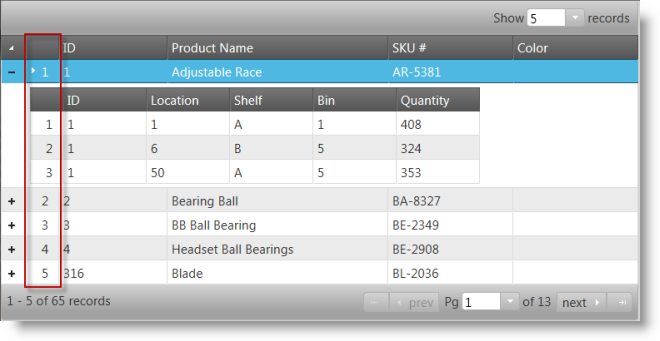
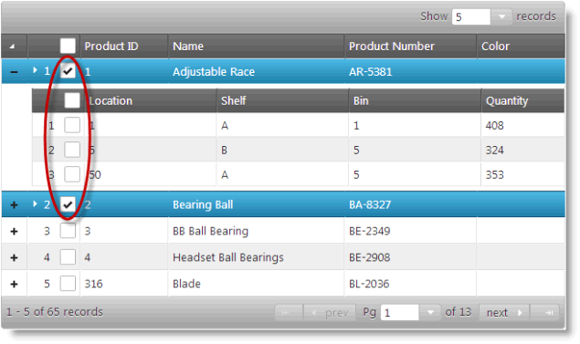
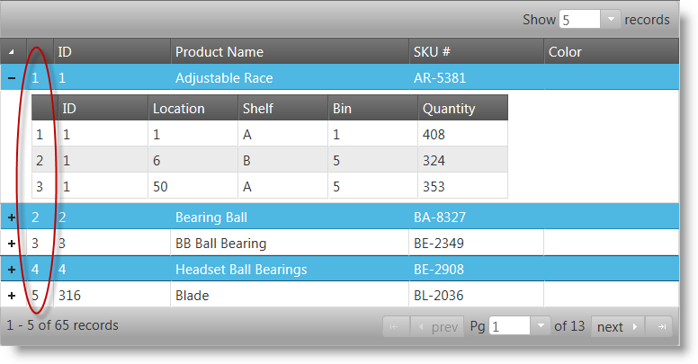
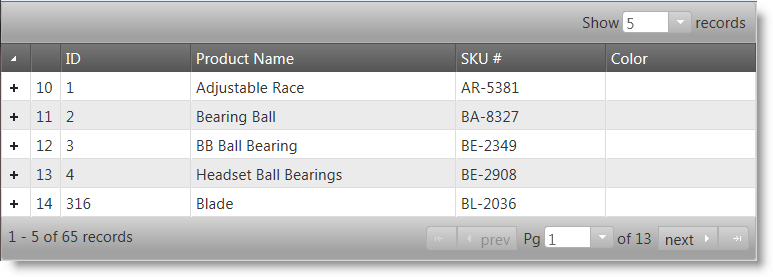
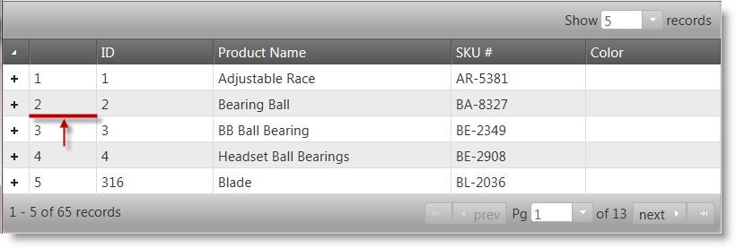

<!--
|metadata|
{
    "fileName": "ighierarchicalgrid-configuring-rowselectors",
    "controlName": "igHierarchicalGrid",
    "tags": []
}
|metadata|
-->

# Configuring Row Selectors (igHieararchicalGrid)

## Topic Overview

### Purpose
Demonstrates, with code examples, how to configure the igHierarchicalGrid™ control’s Row Selection feature.

### Required background
The following lists includes the topics required as a prerequisite to understanding this topic.

- [igHierarchicalGrid Overview](igHierarchicalGrid-Overview.html): Provides conceptual information about the igHierarchicalGrid control, including: features, data binding, requirements, templates, and interaction.
- [Initializing the igHierarchicalGrid](igHierarchicalGrid-Initializing.html): Demonstrates how to initialize the igHierarchicalGrid using both jQuery and MVC.
- [Enabling Row Selection in igHierarchicalGrid](igHierarchicalGrid-Enabling-RowSelectors.html): Demonstrates how to enable the *igHierarchicalGrid* control’s row selection using jQuery and ASP.NET MVC.

### In this topic

This topic contains the following sections:

-   [Row Selection Configuration Summary](#summary)
-   [Enabling Multiple Rows Selection](#enabling-multiple-row-selection)
-   [Adding Selection Checkboxes](#adding-selection-checkboxes)
-   [Enabling Row Numbering](#enabling-row-numbering)
-   [Configuring Seed to the Default Numbering](#configuring-seed)
-   [Setting the Width of the Row Selector Column](#setting-row-selector-column-width)
-   [Related Content](#related-content)


## <a id="summary"></a> Row Selection Configuration Summary

### Row selection configuration chart

Here are the configurable aspects of the row selection feature. These aspects are managed through the respective properties of the igGridRowSelectors widget. Detailed explanations and examples of some of the behaviors and features of the widget follow the table.

Configurable aspects | Details | Properties
-------------------- | ------- | -----------
Selection of multiple rows | By default multiple row selection is enabled. This is controlled through the igGridSelection control. | [multipleSelection](%%jQueryApiUrl%%/ui.iggridselection_hg#options) (igGridSelection™)
Selection with checkboxes | Enables checkboxes in the Row Selectors column. | [enableCheckBoxes](%%jQueryApiUrl%%/ui.iggridrowselectors_hg#options)
Row numbering | When enabled, allows row numbering of the Row Selectors column. | [enableRowNumbering](%%jQueryApiUrl%%/ui.iggridselection_hg#options)
Row numbering starting value | Allows Row numbering to start from a custom value. | [rowNumberingSeed](%%jQueryApiUrl%%/ui.iggridselection_hg#options)
Width of the row selectors column | Sets the width of the row selector column. | [rowSelectorColumnWidth](%%jQueryApiUrl%%/ui.iggridselection_hg#options)
Require a Selection to configure | Causes the control to throw an exception if the Selection feature is disabled. | [requireSelection](%%jQueryApiUrl%%/ui.iggridselection_hg#options)

> **Note**:Keep in mind that `RowSelectors` behavior is per layout. Only one layout can have selection at a time, so if you select/check a row in a different layout, the selected rows from the previous layout will become unselected. For more information see the [Known Issues and Limitations (igHierarchicalGrid)](igHierarchicalGrid-Known-Issues.html) topic.

## <a id="enabling-multiple-row-selection"></a> Enabling Multiple Rows Selection

### Overview

Initializing the Selection feature for the grid enables cell or row selection using the *igHierarchicalGrid* control’s Row Selection feature. This does not automatically initialize the selection feature you must enable it if you need it. The Row Selection can still be used without the selection feature, for example for row numbering.

### Example

In the picture below, Row Selection and Selection features are enabled. A red rectangle designates the Row Selectors column.



### Code

**In HTML:**

```html
<script type="text/javascript">
    $(function () {
        $("#grid").igHierarchicalGrid({
            initialDataBindDepth: 1,
            dataSource: data,
            dataSourceType: "json",
            responseDataKey: "Records",
            autoGenerateColumns: true,
            autoGenerateLayouts: true,
            primaryKey: "ID",
            features: [
                {
                    name: "RowSelectors",
                    inherit: true
                },
                {
                    name: "Selection",
                    multipleSelection: true,
                    mode: "row"
                }
            ]
        });
    });
</script>
```

**In ASPX:**

```csharp
<%= Html.Infragistics()
        .Grid(Model)
        .ID("grid")
        .Features(features =>
            {
                features.RowSelectors().Inherit(true);
                features.Selection().Mode(SelectionMode.Row).MultipleSelection(true);
                features.Paging().Type(OpType.Local).PageSize(5);
            })
        .AutoGenerateColumns(true)
        .AutoGenerateLayouts(true)
        .DataBind()
        .Render()
%>
```


## <a id="adding-selection-checkboxes"></a> Adding Selection Checkboxes

### Overview

Checkboxes are added by setting the igGridRowSelectors control’s `enableCheckBoxes` property to true. It is recommended that you use multiple-selection if checkboxes are enabled. This will allow the user to select multiple rows without holding down the Ctrl key. When Row Selectors checkboxes are enabled the multiple-selection behavior persists across pages.

### Example

The picture below shows a hierarchical grid with row selectors checkboxes enabled. The red ellipse emphasis the checkboxes on the first two master rows.



### Code

**In HTML:**

```html
<script type="text/javascript">
    $(function () {
        $("#grid").igHierarchicalGrid({
            initialDataBindDepth: 1,
            dataSource: data,
            dataSourceType: "json",
            responseDataKey: "Records",
            autoGenerateColumns: true,
            autoGenerateLayouts: true,
            primaryKey: "ID",
            features: [
                {
                    name: "RowSelectors",
                    enableCheckBoxes: true
                    inherit: true
                },
                {
                    name: "Selection",
                    multipleSelection: true,
                    mode: "row"
                },
                {
                    name: "Paging",
                    type: "local"
                }
            ]
        });
    });
</script>
```

**In ASPX:**

```csharp
<%= Html.Infragistics()
    .Grid(Model)
    .ID("grid")
    .Features(features =>
        {
            features.RowSelectors().EnableCheckBoxes(true).Inherit(true);
            features.Selection().Mode(SelectionMode.Row).MultipleSelection(true);
            features.Paging().Type(OpType.Local);
        })
    .AutoGenerateColumns(true)
    .AutoGenerateLayouts(true)
    .DataBind()
    .Render()
%>
```


## <a id="enabling-row-numbering"></a> Enabling Row Numbering

### Overview

You can also render sequential row numbering for all rows in the row selector column in a grid. This is managed through the `rowNumbering` option of the `igGridRowSelectors` widget.

### Example

The following screenshot illustrates the rendering of a grid with row selectors enabled:



### Code

**In HTML:**

```html
<script type="text/javascript">
    $(function () {
        $("#grid").igHierarchicalGrid({
            initialDataBindDepth: 1,
            dataSource: data,
            dataSourceType: "json",
            responseDataKey: "Records",
            autoGenerateColumns: true,
            autoGenerateLayouts: true,
            primaryKey: "ID",
            features: [
                {
                    name: "RowSelectors",
                    enableRowNumbering: true
                    inherit: true
                },
                {
                    name: "Selection",
                    multipleSelection: true,
                    mode: "row"
                }
            ]
        });
    });
</script>
```

**In ASPX:**

```csharp
<%= Html.Infragistics()
    .Grid(Model)
    .ID("grid")
    .Features(features =>
        {
            features.RowSelectors().EnableRowNumbering(true).Inherit(true);
            features.Selection().Mode(SelectionMode.Row).MultipleSelection(true);
            features.Paging().Type(OpType.Local);
        })
    .AutoGenerateColumns(true)
    .AutoGenerateLayouts(true)
    .DataBind()
    .Render()
%>
```


## <a id="configuring-seed"></a> Configuring Seed to the Default Numbering

### Overview

The first number for sequential row numbering can be manually configured by assigning a seed value. This is managed through the `rowNumberingSeed` option of the `igGridRowSelectors` widget.

### Example

The screenshot below demonstrates how a grid with offset row numbering looks:



### Code

**In HTML:**

```html
<script type="text/javascript">
    $(function () {
        $("#grid").igHierarchicalGrid({
            initialDataBindDepth: 1,
            dataSource: data,
            dataSourceType: "json",
            responseDataKey: "Records",
            autoGenerateColumns: true,
            autoGenerateLayouts: true,
            primaryKey: "ID",
            features: [
                {
                    name: "RowSelectors",
                    enableRowNumbering: true,
                    rowNumberingSeed: 9,
                    inherit: true
                },
                {
                    name: "Selection",
                    multipleSelection: true,
                    mode: "row"
                }
            ]
        });
    });
</script>
```

**In ASPX:**

```csharp
<%= Html.Infragistics()
    .Grid(Model)
    .ID("grid")
    .Features(features =>
        {
            features.RowSelectors().Inherit(true)
                .EnableRowNumbering(true).RowNumberingSeed(9);
            features.Selection().Mode(SelectionMode.Row)
                .MultipleSelection(true);
            features.Paging().Type(OpType.Local);
        })
    .AutoGenerateColumns(true)
    .AutoGenerateLayouts(true)
    .DataBind()
    .Render()
%>
```

## <a id="setting-row-selector-column-width"></a> Setting the Width of the Row Selector Column

### Overview

Configure the row selector column’s width of through the igGridRowSelectors widget’s `rowSelectorColumnWidth` option. The width can be set in pixels (`75px`) as well as in percent (`10%`). If no value is set then the widget automatically sets the width is to an appropriate value.

### Example

The following screenshot below illustrates the rendering of a grid’s row selector column with its width set to 75 pixels. The enlarged width is emphasized with the red arrow and line.



### Code

**In HTML:**

```html
<script type="text/javascript">
    $(function () {
        $("#grid").igHierarchicalGrid({
            initialDataBindDepth: 1,
            dataSource: data,
            dataSourceType: "json",
            responseDataKey: "Records",
            autoGenerateColumns: true,
            autoGenerateLayouts: true,
            primaryKey: "ID",
            features: [
                {
                    name: "RowSelectors",
                    enableRowNumbering: true,
                    rowSelectorColumnWidth: "75px",
                    inherit: true
                },
                {
                    name: "Selection",
                    multipleSelection: true,
                    mode: "row"
                }
            ]
        });
    });
</script>
```

**In ASPX:**

```csharp
<%= Html.Infragistics()
    .Grid(Model)
    .ID("grid")
    .Features(features =>
        {
            features.RowSelectors().Inherit(true)
                .EnableRowNumbering(true).RowSelectorsColumnWidth("75px");
            features.Selection().Mode(SelectionMode.Row).MultipleSelection(true);
            features.Paging().Type(OpType.Local);
        })
    .AutoGenerateColumns(true)
    .AutoGenerateLayouts(true)
    .DataBind()
    .Render()
%>
```

## <a id="related-content"></a> Related Content

### Topics

The following topics provide additional information related to this topic.

- [Enabling Row Selectors](igHierarchicalGrid-Enabling-RowSelectors.html): Demonstrates, with code examples, how to enable the Row Selection feature in jQuery and in ASP.NET MVC.
- [Known Issues and Limitations (igHierarchicalGrid)](igHierarchicalGrid-Known-Issues.html): This topic summarizes the known issues and limitations of the igHierarchicalGrid control.

### Samples
The following samples provide additional information related to this topic.

- [Row Selectors](%%SamplesUrl%%/hierarchical-grid/selection-rowselectors): Demonstrates the usage of `RowSelectors` in igHierarchicalGrid.
