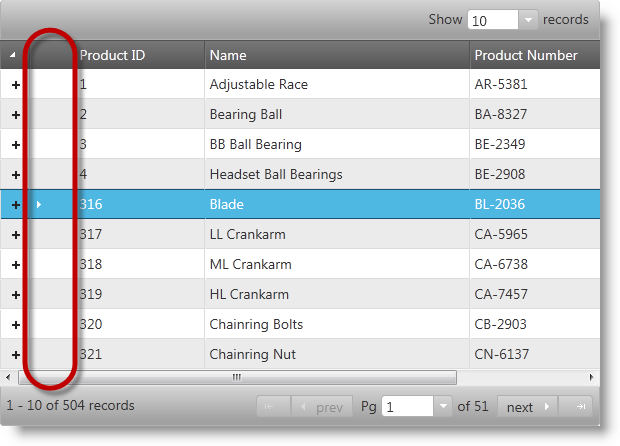

<!--
|metadata|
{
    "fileName": "ighierarchicalgrid-row-selectors-landingpage",
    "controlName": "igHierarchicalGrid",
    "tags": []
}
|metadata|
-->

# Row Selectors (igHierarchicalGrid)

## In This Group of Topics
Row Selection is a feature of the igHierarchicalGrid™ control, which facilitates the user's row selection by displaying a separate row selection column. Displayed to the right of the first data column in the root and child views, the special row selection column can be configured to contain either check boxes (for easier multiple selection) and/or consecutive row numbers. The Row Selection feature is all about the user experience in terms of both the user interface and his or her interaction with the grid. The actual selection behavior is carried out by the `igGridRowSelectors` feature. Although, the Row Selection is typically used together with the Selection feature it can be used alone for its row numbering capability. If configured, the Selection feature activates and selects the corresponding row when the user clicks in a row selection cell or checks the row selection check box.

The following screenshot, illustrates how the igHierarchicalGrid control, with row selection enabled, renders a data grid. As shown below, the row selector column is encircled by a red ellipse for emphasis.

#### Topics

Additional topics covering the implementation of the Row Selection feature.

- [Enabling Row Selectors](igHierarchicalGrid-Enabling-RowSelectors.html): Explains, with code examples, how to enable the Row Selection feature in jQuery and in ASP.NET MVC.
- [Configuring Row Selectors](igHierarchicalGrid-Configuring-RowSelectors.html): Demonstrates, with code examples, how to configure the igHierarchicalGrid control’s Row Selection feature.
- [Row Selector Events](igHierarchicalGrid-RowSelectors-Events.html): Additional reference and usage information about the events related to the igHierarchicalGrid control’s Row Selection feature.