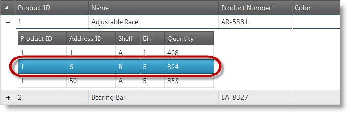
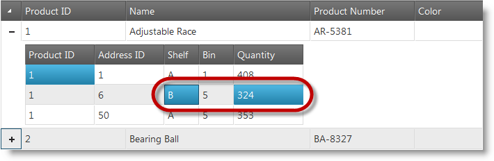

<!--
|metadata|
{
    "fileName": "jquery-ighierarchical-grid-selection-overview",
    "controlName": "igHierarchicalGrid",
    "tags": []
}
|metadata|
-->

# Selection Overview (igHierarchicalGrid)

## Topic Overview
### Purpose

This topic provides you with a brief introduction to igHierarchicalGrid™ Selection feature.

### Required background

The following topics are required as a prerequisite to understanding this topic.

- [igHierarchicalGrid Overview](igHierarchicalGrid-Overview.html): This topic provides conceptual information about the igHierarchicalGrid™ including information regarding features, binding to data sources, requirements, templates, and interaction.
- [Initializing the igHierarchicalGrid](igHierarchicalGrid-Initializing.html): This topic demonstrates how to initialize the igHierarchicalGrid™ in both jQuery and MVC.

### In this topic

This topic contains the following sections:

-   [Introduction](#introduction)
-   [Features](#features)
    -   [Row selection](#row-selection)
    -   [Cell selection](#cell-selection)
-   [Related Content](#related-content)

##  Introduction

The selection feature enables the selection of the rows and cells in the igHierarchicalGrid™ control. Its functionality closely follows the Microsoft® Windows Explorer™ and Microsoft® Excel™ selection and activation behaviors.

Hierarchical Grid selection comes with robust client-side-event support, providing the necessary tools for managing the control’s behavior at run time.

> **Note:** To enable drag-select functionality on touch-enabled devices, you need to include the [jQuery Mobile](http://jquerymobile.com/) library on your page.

##  Features

###  Row selection

To enable row selection, you must enable the selection feature by setting the mode property to row (note that the row selection is the default behavior).

After enabling row selection, users can select a row by clicking on any of the row’s cells. If activation property is set to true you can use the keyboard to select rows. Rows can be selected in code by using the API.

#### Related Topics:

-   [Enabling igHierarchicalGrid Selection](jQuery-igHierarchical-Grid-Features-Selection-Enabling-igHierarchical-Grid-Selection.html)

###  Cell selection

To enable cell selection, you must set the selection mode property to cell when initializing the selection behavior.

There are several ways to select a cell after enabling cell selection. First, users can select a cell by clicking on it or by navigating to it with the keyboard. Keyboard navigation is enabled by setting activation property to true. You can also select and unselect cells in code by using the API.

#### Related Topics:

-   [Enabling igHierarchicalGrid Selection](jQuery-igHierarchical-Grid-Features-Selection-Enabling-igHierarchical-Grid-Selection.html)

##  Related Content
### Topics

The following topics provide additional information related to this topic.

- [Enabling igHierarchicalGrid Selection](jQuery-igHierarchical-Grid-Features-Selection-Enabling-igHierarchical-Grid-Selection.html): This topic explains how to configure igHierarchicalGrid™ with Selection feature in both jQuery and ASP.NET MVC.
- [Selecting and Deselecting Rows and Cells Programmatically in igHierarchicalGrid](jQuery-igHierarchical-Grid-Selecting-and-Deselecting-Rows-and-Cell-Programmatically-in-igHierarchicalGrid.html): This topic discusses how to use the API for selecting and deselecting rows and cells in igHierarchicalGrid.
- [igGrid Selection](igGrid-Selection-Overview.html): This topic explains Selection feature in igGrid.

### Samples

The following sample provides additional information related to this topic.

- [Selection](%%SamplesUrl%%/hierarchical-grid/selection-rowselectors): This sample demonstrates configuration of selection feature in igHierarchicalGrid.

### Resources

The following material (available outside the Infragistics family of content) provides additional information related to this topic.

- [jQuery Mobile](http://jquerymobile.com): Home page of the jQuery Mobile JavaScript library