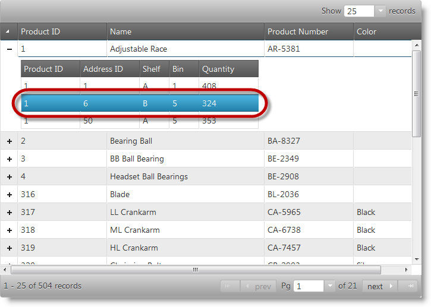
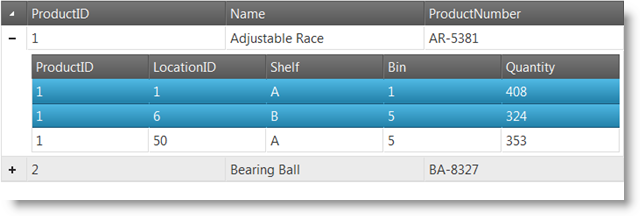
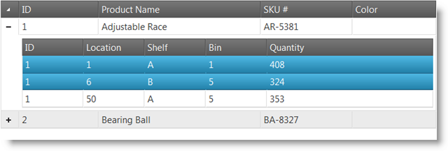
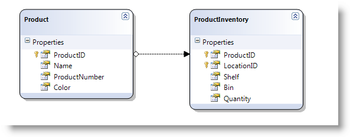

<!--
|metadata|
{
    "fileName": "jquery-ighierarchical-grid-features-selection-enabling-ighierarchical-grid-selection",
    "controlName": "igHierarchicalGrid",
    "tags": []
}
|metadata|
-->

# Enabling Selection (igHierarchicalGrid)

## Topic Overview
### Purpose

This topic explains how to configure igHierarchicalGrid™ with Selection feature in both jQuery and ASP.NET MVC.

### Required background

The following topics are required as a prerequisite to understanding this topic.

- [igHierarchicalGrid Overview](igHierarchicalGrid-Overview.html): This topic provides conceptual information about the igHierarchicalGrid™ including information regarding features, binding to data sources, requirements, templates, and interaction.
- [Initializing the igHierarchicalGrid](igHierarchicalGrid-Initializing.html): This topic demonstrates how to initialize the igHierarchicalGrid™ in both jQuery and MVC.

### In this topic

This topic contains the following sections:

-   [Introduction](#introduction)
-   [Enabling Selection in jQuery](#jquery)
-   [Enabling Selection in ASP.NET MVC](#mvc)
-   [Related Content](#related-content)

## <a id="introduction"></a> Introduction
### Introduction to the igHierarchicalGrid Selection control

The selection feature enables selection of rows and cells of the igHierarchicalGrid control.



## <a id="jquery"></a> Enabling Selection in jQuery
### Introduction
This procedure shows how to create JavaScript data object and instantiate an igHierarchicalGrid with Selection feature enabled in jQuery.

### Preview
The following screenshot is a preview of the final result.



#### Steps

The following steps demonstrate how to enable Selection in igHierarchicalGrid.

1.  Including script and style references

	In order to use `igHierarchicalGrid` you need to include its code which is located in the `infragistics.lob.js` combined file, its stylesheet definitions which are located in `infragistics.css` file and theming information located in `infragistics.theme.css`. You also need to include jQuery framework, jQuery UI framework and Modernizr on which Infragistics controls are dependent. This is done by the following code:
	
	**In HTML:**
	
	```html
	<link rel="stylesheet" href="infragistics.css" />
	<link rel="Stylesheet" href="infragistics.theme.css" />
	<link rel="Stylesheet" href="jquery.ui.all.css" />
	<script src="modernizr-1.7.min.js"></script>
	<script src="jquery.min.js"></script>
	<script src="jquery-ui.min.js"></script>
	<script src="infragistics.core.js"></script><script src="infragistics.lob.js"></script>
	```

2.  Setting up a data source

	The data source which is used in this example is Java Script object. This object has one property Records which is of type array. It is not mandatory to use Records as the name of the property. Property name is configurable in `igHierarchicalGrid` through the property `responseDataKey`. To create a hierarchy you have to define an object which has a property with the same name in sub objects.  In the example below you can see that the data variable is an object with a single property Records which is an array. To define a hierarchy of objects the Records array has a `ProductInventories` property which is an object itself and also has a Records property.
	
	**In JavaScript:**
	
	```js
	<script type="text/javascript">
	    var data = {
	        "Records": [{
	            "ProductID": 1,
	            "Name": "Adjustable Race",
	            "ProductNumber": "AR-5381",
	            "Color": null,
	            "ProductInventories": {
	                "Records": [
	                    { "ProductID": 1, "LocationID": 1, "Shelf": "A", "Bin": 1, "Quantity": 408 },
	                    { "ProductID": 1, "LocationID": 6, "Shelf": "B", "Bin": 5, "Quantity": 324 },
	                    { "ProductID": 1, "LocationID": 50, "Shelf": "A", "Bin": 5, "Quantity": 353 }
	                ],
	                "TotalRecordsCount": 0,
	                "Metadata": {}
	            }
	        }, {
	            "ProductID": 2,
	            "Name": "Bearing Ball",
	            "ProductNumber": "BA-8327",
	            "Color": null,
	            "ProductInventories": {
	                "Records": [
	                    { "ProductID": 2, "LocationID": 1, "Shelf": "A", "Bin": 2, "Quantity": 427 },
	                    { "ProductID": 2, "LocationID": 6, "Shelf": "B", "Bin": 1, "Quantity": 318 },
	                    { "ProductID": 2, "LocationID": 50, "Shelf": "A", "Bin": 6, "Quantity": 364 }
	                ],
	                "TotalRecordsCount": 0,
	                "Metadata": {}
	            }
	        }]
	    };
	</script>
	```

3.  Defining the HTML placeholder

	Define the HTML TABLE element which will be used to hold the `igHierarchicalGrid`.
	
	**In HTML:**
	
	```html
	<table id="grid"></table>
	```      

4.  Creating `igHierarchicalGrid` with Selection feature enabled

	Inside the `$(document).ready()` event handler create an instance of `igHierarchicalGrid` and define a `Selection` feature object in the features array. The property name which is responsible for the hierarchy is defined in `responseDataKey`.
	
	**In JavaScript:**
	
	```js
	<script type="text/javascript">
	$(function () {
	    $("#grid").igHierarchicalGrid({
	        initialDataBindDepth: 1,
	        dataSource: data,
	        dataSourceType: "json",
	        responseDataKey: "Records",
	        autoGenerateColumns: true,
	        autoGenerateLayouts: true,
	        primaryKey: "ProductID",
	        features: [
	            {
	                name: 'Selection',
	                multipleSelection: true,
	                mode: 'row'
	            }
	        ]
	    });
	});
	</script>
	```

## <a id="mvc"></a> Enabling Selection in ASP.NET MVC
### Introduction

This procedure shows how to create `igHierarchicalGrid` with Selection feature enabled in ASP.NET MVC.

#### Preview

The following screenshot is a preview of the final result.



#### Requirements

To complete the procedure, you need the following entities:

-   ASP.NET MVC3
-   AdventureWorks database

### Steps

The following steps demonstrate how to enable Selection feature of `igHierarchicalGrid` in ASP.NET MVC.


1)  Setting up the project
  1.  Create a new MVC 3 project.
  2.  Add a reference to the Infragistics.Web.Mvc.dll
  3.  Include the AdventureWorks database in the project.
  4.  Include the script and the style references as shown in the code snippet below.

**In HTML:**

```html
<link rel="stylesheet" href="infragistics.css" />
<link rel="Stylesheet" href="infragistics.theme.css" />
<link rel="Stylesheet" href="jquery.ui.all.css" />
<script src="modernizr-1.7.min.js"></script>
<script src="jquery.min.js"></script>
<script src="jquery-ui.min.js"></script>
<script src="infragistics.core.js"></script><script src="infragistics.lob.js"></script>
```

2)  Creating LINQ to SQL model

Create LINQ to SQL model from the AdventureWorks database. Use the `Product` and `ProductInventories` tables.



3)  Creating MVC Controller method

Create an MVC Controller method that will get data from the Model and will call the View.

**In C#:**

```csharp
public ActionResult Default(){
    var ctx = new AdventureWorksDataContext("ConnString");
    var ds = ctx.Products;
    return View("Products", ds);
}
```

4)  Defining the `igHierarchicalGrid` with Selection feature enabled

Define the `igHierarchicalGrid` with Selection feature enabled, by including the code snippet that follows.

**In ASPX:**

```csharp
<%= Html.Infragistics()
        .Grid(Model)
        .ID("grid")
        .Features(features =>
        {
         features.Selection().Mode(SelectionMode.Row).MultipleSelection(true);
        })
        .AutoGenerateColumns(false)
        .AutoGenerateLayouts(false)
        .PrimaryKey("ProductID")
        .DataBind()
        .Render()
%>
```

## <a id="related-content"></a> Related Content
### Topics

The following topics provide additional information related to this topic.

- [igHierarchicalGrid Selection Overview](jQuery-igHierarchical-Grid-Selection-Overview.html): Describes Selection feature of igHierarchicalGrid.
- [igHierarchicalGrid Columns and Layouts](igHierarchicalGrid-Columns-and-Layouts.html): Demonstrates how to define columns and layouts in igHierarchicalGrid including through auto-configuration.
- [igHierarchicalGrid Feature Inheritance](igHierarchicalGrid-Feature-Inheritance.html): Demonstrates how to inherit features in the child layouts in igHierarchicalGrid.

### Samples

The following samples provide additional information related to this topic.

- [Selection](%%SamplesUrl%%/hierarchical-grid/selection-rowselectors): This sample demonstrates configuration of selection in igHierarchicalGrid.