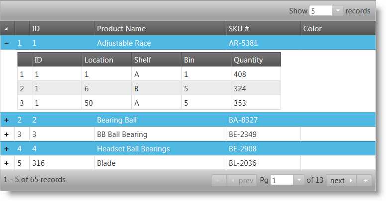

<!--
|metadata|
{
    "fileName": "jquery-ighierarchical-grid-selection-landing-page",
    "controlName": "igHierarchicalGrid",
    "tags": []
}
|metadata|
-->

# Selection (igHierarchicalGrid)

## Introduction

The selection feature enables the selection of the rows and cells of the igHierarchicalGrid™ control. Its functionality closely follows the Microsoft® Windows Explorer™ and Microsoft® Excel™ selection and activation behaviors.

Hierarchical Grid selection comes with robust client-side-event support, providing the necessary tools for managing the control’s behavior at run time.

## Topics

Detailed information regarding igHierarchicalGrid Selection is covered in the following topics and sections:

- [igHierarchicaGrid Selection Overview](jQuery-igHierarchical-Grid-Selection-Overview.html): This topic provides you with a brief introduction to igHierarchicalGrid™ Selection feature.
- [Enabling igHierarchicalGrid Selection](jQuery-igHierarchical-Grid-Features-Selection-Enabling-igHierarchical-Grid-Selection.html): This topic explains how to configure igHierarchicalGrid™ with Selection feature in both jQuery and ASP.NET MVC.
- [Selecting and Deselecting Rows and Cells Programmatically in igHierarchicalGrid](jQuery-igHierarchical-Grid-Selecting-and-Deselecting-Rows-and-Cell-Programmatically-in-igHierarchicalGrid.html): This topic explains how to use the API for selecting and deselecting rows and cells in igHierarchicalGrid™.