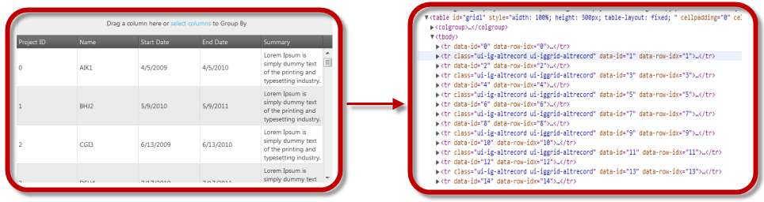

<!--
|metadata|
{
    "fileName": "ighierarchicalgrid-virtualization-overview",
    "controlName": "igHierarchicalGrid",
    "tags": []
}
|metadata|
-->

# Virtualization Overview (igHierarchicalGrid)

## Topic Overview
### Purpose
This topic introduces the Virtualization feature of the igHierarchicalGrid™ control.

## Introduction
#### Virtualization summary
Virtualization is a feature of the igHierarchicalGrid control that reduces the number of the active in-memory DOM objects. Virtualization achieves complete transparency in user experience as compared to a non-virtualized grid.

The igHierarchicalGrid support virtualization type is continuous. Using Virtualization, you can easily bind data to sources that contain millions of records and still render a large portion of data once on the client.

## Supported Virtualization Type
#### Supported virtualization type summary

- [Continuous Virtualization](#continuous_virtualization): A pre-defined number of rows is rendered in the grid.

## Continuous Virtualization 
Continuous Virtualization uses a pre-defined number of rows. As the user scrolls down/up the virtualization determines whether the currently rendered rows are sufficient to display the next/previous portion of rows. If not, the current portion of rows is being disposed and the required portion of rows is recreated. Thus, having 1000 data rows will be displayed by only say 30 as opposed to 1000 row tables which significantly loads the DOM structure.

Each row in the igHierarchicalGrid control could span on several lines. Thus, row height may vary from row to row. To determine which rows should be displayed after a scroll takes place, the virtualization calculates the average row height. However, this average row height is just an approximate estimation, because its calculation based on the currently rendered rows and not on all available rows. From here, each time when it is being scrolled, the rows about to be displayed are estimated. This might lead to incorrect scroller position when the scroller is at the top/end positions. The virtualization checks for such situations after each scroll and corrects scroller’s position if necessary.

The picture on the left demonstrates a grid with 1,000 records loaded at on the client. The picture on the right shows the 30 HTML table elements that actually exist in the DOM to support the virtualized grid.

### Related Topics:
-   [Enabling and Configuring Virtualization](igHierarchicalGrid-Enabling-and-Configuring-Virtualization.html)

## Related Content
#### Topics

The following topics provide additional information related to this topic.

- [Enabling and Configuring Virtualization](igHierarchicalGrid-Enabling-and-Configuring-Virtualization.html): This topic explains how to enable Continuous Virtualization feature of the igHierarchicalGrid control.

 

 

