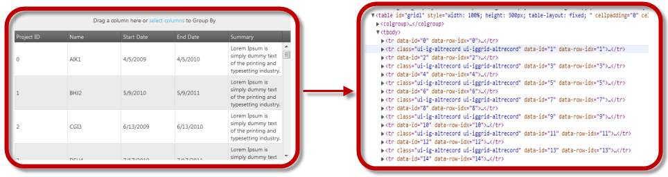

<!--
|metadata|
{
    "fileName": "ighierarchicalgrid-enabling-and-configuring-virtualization",
    "controlName": "igHierarchicalGrid",
    "tags": []
}
|metadata|
-->

# Enabling and Configuring Virtualization (igHierarchicalGrid)

## Topic Overview

### Purpose
This topic explains, with code examples, how to enable and configure the Continuous Virtualization feature in the igHierarchicalGrid™.


### Enabling Virtualization Overview

#### Enabling Virtualization summary
- Virtualization is enabled by setting the [`virtualization`](%%jQueryApiUrl%%/ui.iggrid_hg#options) property to `true`. The type of Virtualization is specified though setting the [`virtualizationMode`](%%jQueryApiUrl%%/ui.iggrid_hg#options) property to continuous.
- Enabling virtualization without specifying its type sets it to `Continuous` (the default Virtualization type).
- The virtualization feature cannot function without having height defined in the grid.

## Enabling and Configuring Continuous Virtualization

### Overview

Continuous Virtualization is enabled by setting the `virtualization` option of the igGrid control to `true` and `virtualization` mode to `continuous`. The height of the grid is configurable.

### Example

The following table demonstrates how to configure `Continuous` Virtualization for both rows and columns with row height of 400 pixels.

Property | Value
-------- | --------
[virtualization](%%jQueryApiUrl%%/ui.iggrid_hg#options) | true
[virtualizationMode](%%jQueryApiUrl%%/ui.iggrid_hg#options) | continuous
[height](%%jQueryApiUrl%%/ui.iggrid_hg#options) | 400px



### Code

The following code configures the setting in the Example.

**In JavaScript:**

```js
$("#hierarchicalGrid1").igHierarchicalGrid({
        virtualization: true,
        virtualizationMode: 'continuous',
        height: '400px'
});
```

**In ASPX:**

```csharp
<%= Html.Infragistics().Grid(Model).ID("hierarchicalGrid1").LoadOnDemand(false).AutoGenerateColumns(false).AutoGenerateLayouts(false).PrimaryKey("ProjectID").Columns(column => 
            {
                column.For(x => x.ProjectID)
                  .HeaderText(this.GetGlobalResourceObject("HierarchicalGrid", "ProjectID")
                  .ToString());
                column.For(x => x.Name)
                  .HeaderText(this.GetGlobalResourceObject("HierarchicalGrid", "Name")
                  .ToString());
                column.For(x => x.StartDate)
                  .HeaderText(this.GetGlobalResourceObject("HierarchicalGrid", "StartDate")
                  .ToString());
                column.For(x => x.EndDate)
                  .HeaderText(this.GetGlobalResourceObject("HierarchicalGrid", "EndDate")
                  .ToString());
            })
            .Virtualization(true)
            .VirtualizationMode(VirtualizationMode.Continuous)
            .ColumnLayouts(layouts => {
                layouts.For(x => x.Scrums)
                   .PrimaryKey("ScrumID")
                   .ForeignKey("ProjectID")
                   .AutoGenerateColumns(false)
                   .AutoGenerateLayouts(false)
                  .Columns(childcolumn =>
                    {
                        childcolumn.For(x => x.ScrumID)
                  .HeaderText(this.GetGlobalResourceObject("HierarchicalGrid", "ScrumID")
                  .ToString());
                        childcolumn.For(x => x.ProjectID)
                  .HeaderText(this.GetGlobalResourceObject("HierarchicalGrid", "ProjectID")
                  .ToString());
                        childcolumn.For(x => x.Summary)
                  .HeaderText(this.GetGlobalResourceObject("HierarchicalGrid", "Summary")
                  .ToString());
                        childcolumn.For(x => x.Notes)
                  .HeaderText(this.GetGlobalResourceObject("HierarchicalGrid", "Notes")
                  .ToString());
                    })
                    .Virtualization(true)
                    .VirtualizationMode(VirtualizationMode.Continuous)
                    .Height("400px")
}).DataBind().Height("500px").Render()
%>
```

## Related Content

### Topics
The following topics provide additional information related to this topic.

- [Virtualization Overview](igHierarchicalGrid-Virtualization-Overview.html): This topic introduces the Virtualization feature of the igHierarchicalGrid control.


 

 


