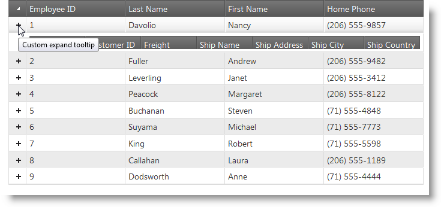

<!--
|metadata|
{
    "fileName": "ighierarchicalgrid-styling-and-theming",
    "controlName": "igHierarchicalGrid",
    "tags": ["Grids","Styling","Theming"]
}
|metadata|
-->

# Styling igHierarchicalGrid

## Topic Overview
### Purpose
This topic demonstrates how to style the igHierarchicalGrid™ using themes, the Theme Switcher tool, and its internal animation properties.

### In this topic

This topic contains the following sections:

-   [Introduction](#introduction)
-   [Styling Using Themes](#styling_using_themes)
    -   [Required CSS and themes](#required_css)
    -   [Adding Required Themes to a Website](#adding_required_themes)
    -   [Infragistics and Metro Themes](#ig_theme)
    -   [Changing the colors dynamically](#changing_the_colors_dynamically)
-   [Using Animations](#using_animations)
    -   [Animation reference](#animation_reference)
    -   [Animation code example](#animation_code_example)
-   [Related Topics](#related_topics)
-   [Related Resources](#related_resources)

## <a id="introduction"></a> Introduction
All the jQuery controls use the jQuery UI CSS Framework class conventions. The igHierarchicalGrid and all its features also are styled following these standards. That’s why you can easily integrate the Hierarchical Grid with third-part tools for styling controls, like Theme Switcher. In this topic you will also learn how to use the available animation properties of the igHierarchicalGrid, but first which are the needed resource you have to include so that control displays properly.

## <a id="styling_using_themes"></a> Styling Using Themes 
### <a id="required_css"></a> Required CSS and Themes 

The %%ProductName%%™ Hierarchical grid, like other jQuery widgets, utilizes the jQuery UI CSS Framework for styling. Included in %%ProductName%% are custom jQuery UI themes called Infragistics and Metro. These themes provide a professional and attractive design to all Infragistics and standard jQuery UI widgets.

In addition to the Infragistics and Metro themes, there is a structure directory, which is required for the basic CSS layout of the Infragistics widgets.

### <a id="adding_required_themes"></a> Adding Required Themes to a Website 

The Infragistics and Metro themes are located in the installed directory within the css folder. To add the themes to your application, copy the whole css folder (including structure and themes directories) into your site’s location.

> **Note:** When using Infragistics Loader, the folder structure must be preserved. Thus the loader will work as expected. If some of the themes are not used they can be deleted, but the structure should remain the same.

**Figure 1:** Included theme folders upon product install


## <a id="ig_theme"></a> Infragistics and Metro Themes 

The Infragistics Theme is a custom theme which includes all of the styles typically found in a jQuery UI theme. This theme may be replaced by a different theme but for the jQuery widgets to display correctly a reference to file `{IG Resources root}/css/structure/infragistics.css` is required..

Metro theme is implementation of the clean, modern and fast Metro design language. It has the same requirements for `{IG Resources root}/css/structure/infragistics.css` like Infragistics theme.

When using a theme other than the Infragistics (or Metro) theme, the igHierarchicalGrid has some additional styling points that may need customization to achieve a complete design (depending on the igHierarchicalGrid’s enabled features and theme).

The igHierarchicalGrid control requires having a link to the stylesheet of a standard jQuery UI theme. For the IG Theme, you must include reference to the theme’s stylesheet in the page:

#### Listing 1: Manual CSS reference to Infragistics theme

**In HTML:**

```html
<link href="css/themes/infragistics/infragistics.theme.css" rel="stylesheet" type="text/css" />
<link href="css/structure/modules/infragistics.ui.grid.css" rel="stylesheet" type="text/css" />
```

#### Listing 2: CSS reference to Infragistics theme in ASP.NET MVC

**In HTML:**

```html
<%@ Import Namespace="Infragistics.Web.Mvc" %>
<!DOCTYPE html>
<html>
<head runat="server">
<link href="<%= Url.Content("~/css/themes/infragistics/infragistics.theme.css") %>” rel="stylesheet" type="text/css" />
<link href="<%= Url.Content("~/css/structure/modules/infragistics.ui.grid.css") %>” rel="stylesheet" type="text/css" />
```

### Metro Theme

The Metro Theme is referenced after the jQuery Theme. The following stylesheets are required when using the igHierarchicalGrid control:

#### Listing 3 : Manual CSS reference to the Metro theme

**In HTML:**

```html
<link href="css/themes/metro/infragistics.theme.css " rel="stylesheet" type="text/css" />
<link href="css/structure/modules/infragistics.ui.grid.css" rel="stylesheet" type="text/css" />
```

#### Listing 4 : CSS reference to the Metro theme in ASP.NET MVC

**In HTML:**

```html
<%@ Import Namespace="Infragistics.Web.Mvc" %>
<!DOCTYPE html>
<html>
<head runat="server">
<link href="<%= Url.Content("~/css/themes/metro/infragistics.theme.css ") %>” rel="stylesheet"  type="text/css" />
<link href="<%= Url.Content("~/css/structure/modules/infragistics.ui.grid.css") %>” rel="stylesheet" type="text/css" />
```

### <a id="changing_the_colors_dynamically"></a> Changing the colors dynamically 

Because the igHierarchicalGrid follows the convention of the jQuery UI CSS Framework, you can apply the Theme Switcher tool to change the colors IgHierarchicalGrid dynamically. The Theme Switcher is a third party tool that can style controls which use the jQuery UI CSS Framework class conventions (See [Theme Switcher](http://docs.jquery.com/UI/Theming/ThemeSwitcher)for details.) Such a control is also the Hierarchical Grid.


## <a id="using_animations"></a> Using Animations 
### <a id="animation_reference"></a> Animation reference 

The IgHierarchicalGrid has a set of properties that allow you to modify the expand and collapse animation, as well as change the text the tooltip displays (in both expanded and collapsed states. The table below provides a reference for the animation management properties for both jQuery and MVC.


jQuery Property | MVC Property | Description
---|---|---
[expandCollapseAnimation](%%jQueryApiUrl%%/ui.ighierarchicalgrid#options:expandCollapseAnimations) | [ExpandCollapseAnimation](Infragistics.Web.Mvc~Infragistics.Web.Mvc.GridModel~ExpandCollapseAnimations.html) | Enables/disables the expand/collapse animation.
[animationDuration](%%jQueryApiUrl%%/ui.ighierarchicalgrid#options:animationDuration) | [AnimationDuration](Infragistics.Web.Mvc~Infragistics.Web.Mvc.GridModel~AnimationDuration.html) | Sets the length of the animation in milliseconds.
[expandTooltip](%%jQueryApiUrl%%/ui.ighierarchicalgrid#options:expandTooltip) | [ExpandTooltip](Infragistics.Web.Mvc~Infragistics.Web.Mvc.GridModel~ExpandTooltip.html) | Tooltip upon hovering over an expanded cell.
[collapseTooltip](%%jQueryApiUrl%%/ui.ighierarchicalgrid#options:collapseTooltip) | [CollapseTooltip](Infragistics.Web.Mvc~Infragistics.Web.Mvc.GridModel~CollapseTooltip.html) | Tooltip upon hovering over an collapsed cell.


### <a id="animation_code_example"></a> Animation code example 

The code example below demonstrates how to set the animation properties of the igHierarchicalGrid. The following picture shows an expand animation in progress.





In jQuery

```
$("#grid1").igHierarchicalGrid({
    expandCollapseAnimations: true,
    animationDuration: 1000,
    expandTooltip: "Custom expand tooltip",
    collapseTooltip: "Custom collapse tooltip"
}

```

In MVC

```
<%= Html.Infragistics()
    .Grid(Model)
    .ID("grid1")
    .ExpandCollapseAnimations(true)
    .AnimationDuration(1000)
    .ExpandTooltip("Custom expand Text"))
    .CollapseTooltip("Custom collapse Text"))
    .DataBind()
    .Render()%>
```

## <a id="related_topics"></a> Related Topics 
Following are some other topics you may find useful.

-   [igHierarchicalGrid Overview](igHierarchicalGrid-Overview.html)
-   [Getting Started with the igHierarchicalGrid](igHierarchicalGrid-Initializing.html)
-   [igHierarchicalGrid Properties Reference](%%jQueryApiUrl%%/ui.ighierarchicalgrid#options)

## <a id="related_resources"></a> Related Resources 
-   [Theme Switcher](http://docs.jquery.com/UI/Theming/ThemeSwitcher)