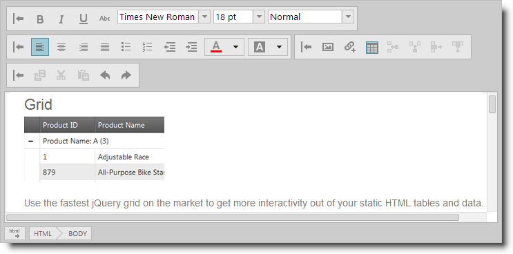
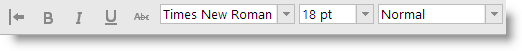
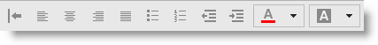
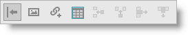

<!--
|metadata|
{
    "fileName": "ightmleditor-overview",
    "controlName": "igHtmlEditor",
    "tags": ["Getting Started"]
}
|metadata|
-->

# igHtmlEditor Overview

##Topic Overview

### Purpose

This topic provides an overview of the `igHtmlEditor`™ and its features.

### In This Topic

This topic contains the following sections:

-   [Introduction](#introduction)
-   [Toolbars Overview](#overview)
    -   [Text toolbar](#text-toolbar)
    -   [Formatting toolbar](#formatting-toolbar)
    -   [Insert object toolbar](#inset-object)
    -   [Copy/Paste toolbar](#copy-paste)
    -   [Custom toolbars](#custom-toolbar)
-   [Related Content](#related-content)
    -   [Topics](#topics)
    -   [Samples](#samples)
    -   [Resources](#resources)

##Introduction

### Introduction to the igHtmlEditor

The `igHtmlEditor` is a text editor control for creating and formatting online content. It has standard HTML editing capabilities.

Its options include managing the font face and size, the text alignment, as well as image, hyperlink and table support. These options are divided into four toolbars: text toolbar, formatting toolbar, insert object toolbar, copy/paste toolbar. Toolbars can be expanded and collapsed, and shown or hidden. You can also enable/disable or show/hide the toolbar controls within each toolbar.

You can extend the `igHtmlEditor` functionality by creating custom toolbars.

The `igHtmlEditor` control has two modes: The first is the design mode or WYSIWYG (What You See Is What You Get) mode. The second mode is the source view mode. Users can swap between modes by pressing the “HTML” button in the lower left corner of the control.

The `igHtmlEditor` control is implemented as an IFRAME element. Editing capabilities are enabled by setting the [contenteditable](http://blog.whatwg.org/the-road-to-html-5-contenteditable) attribute of the IFRAME’s BODY element to true.

##Toolbars Overview

The following table summarizes the main features of the `igHtmlEditor` control. Additional details are available after following the summary table.

Feature|Description
---|---
[Text toolbar](#text-toolbar)|Contains buttons and drop-downs for formatting text at the character level.
[Formatting toolbar](#formatting-toolbar)|Contains buttons for formatting text at the paragraph level and for managing the text and background colors.
[Insert object toolbar](#inset-object)|Contains buttons for inserting various types of content.
[Copy/Paste toolbar](#copy-paste)|Contains buttons for the clipboard functions (cut/copy/paste) and the general editing options (undo/redo).
[Custom toolbars](#custom-toolbar)|You can extend the igHtmlEditor‘s default functionality by creating custom toolbars.

### Related Topics

-   [Configuring Toolbars and Buttons](igHtmlEditor-Configuring-Toolbars-and-Buttons.html)

### Text toolbar

The text toolbar contains buttons and drop-downs for formatting text at the character level.

Its default buttons and drop-downs are (left to right) :

-   Bold
-   Italic
-   Underline
-   Strikethrough
-   Increase Font Size
-   Decrease Font Size
-   Font face drop-down
-   Font size drop-down
-   Heading drop-down

### Formatting toolbar

The formatting toolbar contains buttons for formatting text at the paragraph level and for managing the text and background colors.

Its default buttons and drop-down buttons are (left to right):

-   Align Left
-   Center
-   Align Right
-   Justify
-   Bullets and Numbering drop-down button
-   Indent drop-down button
-   Font color drop-down button
-   Background color drop-down button

### Insert object toolbar

The insert object toolbar contains buttons for inserting various types of content.

Its default buttons are (left to right):

-   Insert Image
-   Insert Link
-   Insert Table
-   Add Row
-   Add Column
-   Remove Row
-   Remove Column

###Copy/Paste toolbar

The copy/paste toolbar contains the buttons for the clipboard functions (cut/copy/paste) and the general editing options (undo/redo).

Its default buttons are (left to right):

-   Copy
-   Cut
-   Paste
-   Undo
-   Redo

### Custom toolbars

You can extend the igHtmlEditor’s default functionality by creating custom toolbars. A custom toolbar can contain buttons or combo boxes.

Custom toolbars can have all the capabilities of the standard toolbars. You can expand and collapse them, show and hide them, or enable and disable the controls in them. Custom toolbars are created by adding an object literal to the `customToolbars` array.

##Related Content

### Topics

The following topics provide additional information related to this topic.

-	[Adding igHtmlEditor](igHtmlEditor-Adding-igHtmlEditor.html): This topic explains how to add the `igHtmlEditor` to a web page.

-	[Working with the igHtmlEditor](igHtmlEditor-Working-with-igHtmlEditor.html): This is a group of topics explaining how to configure the `igHtmlEditor` and manage it programmatically.

### Samples

The following samples provide additional information related to this topic.

-	[Edit Content](%%SamplesUrl%%/html-editor/edit-content): In this forum post example, an initial piece of content provided in the HTML Editor.

-	[Custom Toolbars and Buttons](%%SamplesUrl%%/html-editor/custom-toolbars-and-buttons): This sample demonstrates how the HtmlEditor control works as an email client. This implementation features a custom toolbar where you can add a signature to the message.

-	[API and Events](ightmleditor-modifying-contents-programmatically#api-and-events-demo): This sample demonstrates how to handle events in the Html Editor control and API usage.

### Resources

The following material (available outside the Infragistics family of content) provides additional information related to this topic.

-	[The Road to HTML 5: contentEditable](http://blog.whatwg.org/the-road-to-html-5-contenteditable): This is a blog post explaining the contentEditable attribute used to provide rich-text editing capabilities in a browser.

 

 

