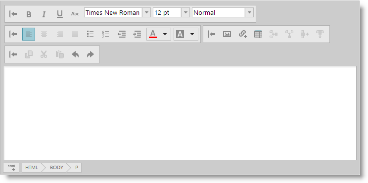

<!--
|metadata|
{
    "fileName": "ightmleditor-adding-ightmleditor",
    "controlName": "igHtmlEditor",
    "tags": ["Getting Started","How Do I"]
}
|metadata|
-->

# Adding igHtmlEditor


##Topic Overview


### Purpose

This topic explains how to add an `igHtmlEditor`™ to a web page.

### Required Background

The following table lists the topics required as a prerequisite to understanding this topic.


-	[igHtmlEditor Overview](igHtmlEditor-Overview.html): This topic provides an overview of the `igHtmlEditor` and its features.

-	[Using Infragistics Loader](Using-Infragistics-Loader.html): This topic explains how to manage the required resources to work with Ignite UI using the Infragistics Loader.


##Adding a igHtmlEditor to Web Page


### Introduction

This procedure takes you step-by-step toward adding an `igHtmlEditor` to web page.

### Preview

The following screenshot is a preview of the final result.



### Overview

The following is a conceptual overview of the process:

[1. Referencing the required JavaScript files](#reference-scripts)

[2. Initializing the igHtmlEditor in JavaScript](#initialize-htmlEditor)

[3. (Optional) Initializing the igHtmlEditor in an ASP.NET MVC Razor View](#mvc-initialize-htmlEditor)

### Steps

The following steps demonstrate how to add the `igHtmlEditor` to a web page.


1. <a id="reference-scripts"></a> Reference the required JavaScript files.

	Include the required JavaScript references

	**In HTML:**

	```html
	<script src="js/jquery.min.js"></script>
    <script src="js/jquery-ui.min.js"></script>
    <script src="js/infragistics.loader.js"></script>
	```

2. <a id="initialize-htmlEditor"></a> Initialize the igHtmlEditor in JavaScript.

	If you are using Infragistics MVC Wrappers then you should instantiate `igHtmlEditor` in ASP.NET MVC View as shown in step 3.

	1. Define the HTML placeholder for the editor

		**In HTML:**

		```html
		<div id="htmlEditor"></div>
		```
	
	2. Initialize the Infragistics Loader

		**In JavaScript:**

		```js
		$.ig.loader({
	        scriptPath: 'js',
	        cssPath: 'css',
	        resources: 'igHtmlEditor'
	    });
		```

		>**Note:** The Infragistics loader is a quick and efficient way to reference the required files. However, you can reference them manually. For more information, see the "[Using JavaScript Resouces in Ignite UI](Deployment-Guide-JavaScript-Resources.html)" topic in the [Related Content](#related-content) section.

	3. Initialize the igHtmlEditor

		**In JavaScript:**

		```js
		$.ig.loader(function () {
	        $('#htmlEditor').igHtmlEditor({inputName: "Post"});
	    });
		```

3. <a id="mvc-initialize-htmlEditor"></a> (Optional) Initialize the igHtmlEditor in an ASP.NET MVC Razor View.

	This example demonstrates how to initialize the `igHtmlEditor` in an ASP.NET MVC Application using the Infragistics loader.

	1. Initialize the Infragistics Loader

		**In C#:**
	
		 ```csharp
		 @(Html.Infragistics().Loader().ScriptPath(Url.Content ("js")).CssPath(Url.Content("css")).Render())
		 ```

		The Resources method invocation is not required when using the Infragistics Loader ASP.NET MVC Helper because the loader infers which resources to include based off of the other Infragistics helpers used in a given View. This is only valid if the Ignite UI controls are also instantiated with ASP.NET MVC helpers.

	2. Initialize the igHtmlEditor

		**In C#:**

		```csharp
		@Html.Infragistics().HtmlEditor().ID("igHtmlEditor").Render()
		```


## <a id="related-content"></a>Related Content


### Topics

The following topics provide additional information related to this topic.

-	[Working with the igHtmlEditor](igHtmlEditor-Working-with-igHtmlEditor.html): This is a group of topics explaining how to configure the `igHtmlEditor` and manage it programmatically.

-	[Styling and Theming (igHtmlEditor)](igHtmlEditor-Styling-and-Theming.html): This topic explains, with code examples, how to customize the look-and-feel of the `igHtmlEditor`.

-	[Using JavaScript Resources in Ignite UI](Deployment-Guide-JavaScript-Resources.html): This topic explains how to manage the required resources to work with the Ignite UI within a Web application.


### Samples

The following samples provide additional information related to this topic.

-	[Edit Content](%%SamplesUrl%%/html-editor/edit-content): In this forum post example, an initial piece of content provided in the HTML Editor.

-	[Custom Toolbars and Buttons](%%SamplesUrl%%/html-editor/custom-toolbars-and-buttons): This sample demonstrates how the HtmlEditor control works as an email client. This implementation features a custom toolbar where you can add a signature to the message.


 

 


