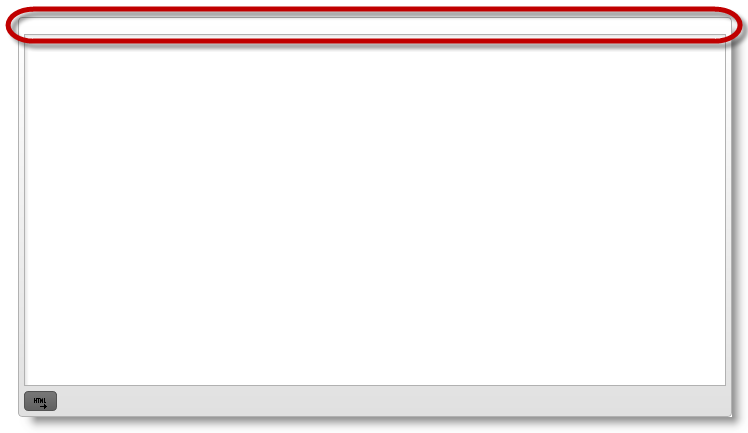
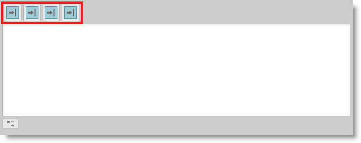
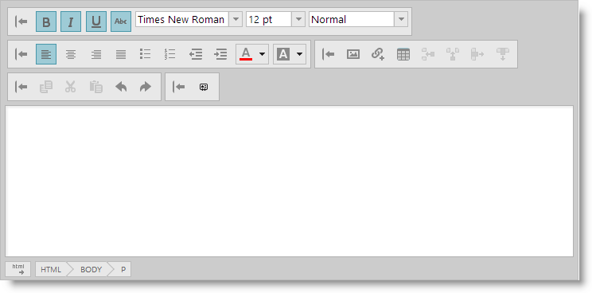
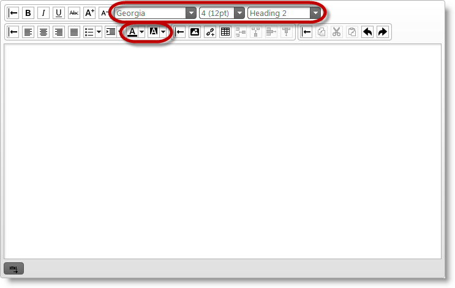

<!--
|metadata|
{
    "fileName": "ightmleditor-configuring-toolbars-and-buttons",
    "controlName": "igHtmlEditor",
    "tags": ["How Do I"]
}
|metadata|
-->

# Configuring Toolbars and Buttons


##Topic Overview


### Purpose

This topic explains how to configure `igHtmlEditor`™ toolbars and buttons.

### Required Background

The following table lists the topics required as a prerequisite to understanding this topic.


-	[igHtmlEditor Overview](igHtmlEditor-Overview.html): This topic explains the features of `igHtmlEditor`.

-	[Adding igHtmlEditor](igHtmlEditor-Adding-igHtmlEditor.html): This topic explains how to add `igHtmlEditor` to a web page.


### In This Topic

This topic contains the following sections:

-   [Control Configuration Summary](#config-summary)
-   [Hide toolbar](#hide-toolbar)
-   [Collapse toolbar](#collapse-toolbar)
-   [Toggle button state](#toggle-button)
-   [Set button tooltip](#set-button)
-   [Configure text options](#config-text-options)
-   [Related Content](#related-content)


##<a id="config-summary"></a>Control Configuration Summary


### Control configuration overview

The following table lists the configurable aspects of the `igHtmlEditor` control toolbars. Additional details are available after the summary table.

<table class="table">
	<thead>
		<tr>
			<th>Configurable aspects</th>
			<th>Details</th>
			<th>Properties</th>
		</tr>
	</thead>
	<tbody>
		<tr>
			<td>[Hide toolbar](#hide-toolbar)</td>
            <td>Toolbars can be visible or hidden. All toolbars are initially visible.You can use the properties on the right to toggle toolbars visibility state.</td>
			<td>
              <ul>
              	<li>showTextToolbar</li>
                <li>showFormattingToolbar</li>
                <li>showInsertObjectToolbar</li>
                <li>showCopyPasteToolbar</li>
              </ul>
            </td>
		</tr>
		<tr>
			<td>[Collapse toolbar](#collapse-toolbar)</td>
            <td>Toolbars can be expanded or collapsed. All toolbars are initially
expanded. You can use the properties on the right to toggle the toolbar
expanded/collapsed state.</td>
			<td>              
            	<ul>
                  <li>toolbarSettings</li>
                  <li>isExpanded</li>
              	</ul>
            </td>
		</tr>
		<tr>
			<td>[Toggle button state](#toggle-button)</td>
			<td>Some of the toolbar buttons can be toggled on initialization. For
example bold, italic, underline buttons can be toggled on initialization</td>
			<td>              
            	<ul>
                  <li>isBold</li>
                  <li>isItalic</li>
                  <li>isUnderline</li>
                  <li>isStrikethrough</li>
                  <li>isJustifyleft</li>
                  <li>isJustifycenter</li>
                  <li>isJustifyright</li>
                  <li>isJustifyfull</li>
              	</ul>
            </td>
		</tr>
        		<tr>
			<td>[Set button tooltip](#set-button)</td>
			<td>Each toolbar button has a tooltip. Use properties on the right to change the button tooltip.

**Note:** Tooltips are localizable. If you want to localize the `igHtmlEditor`
then set the locale code in the Infragistics Loader.</td>
			<td>              
            	<ul>
                  <li>italicButtonTooltip</li>
                  <li>boldButtonTooltip</li>
                  <li>underlineButtonTooltip</li>
                  <li>decreaseFontTooltip</li>
                  <li>increaseFontTooltip</li>
                  <li>fontSizeComboTooltip</li>
                  <li>fontFamilyComboTooltip</li>
                  <li>textColorPickerTooltip</li>                  
                  <li>textBackgroundColorPickerTooltip</li>
                  <li>formatListTooltip</li>
                  <li>bulletsTooltip</li>
                  <li>numbersTooltip</li>
                  <li>alignmentTooltip</li>
                  <li>leftAlignmentTooltip</li>
                  <li>centerAlignmentTooltip</li>
                  <li>rightAlignmentTooltip</li>                  
                  <li>indentTooltip</li>
                  <li>decreaseIndentTooltip</li>                  
                  <li>increaseIndentTooltip</li>
                  <li>spacingTooltip</li>
                  <li>tableTooltip</li>
                  <li>rowsLabel</li>
                  <li>columnsLabel</li>
                  <li>tableRowsLabelTooltip</li>
                  <li>tableColumnsLabelTooltip</li>
                  <li>insertImageTooltip</li>
                  <li>insertUrlTooltip</li>
                  <li>insertVideoTooltip</li>
              	</ul>
            </td>
		</tr>
        		<tr>
			<td>[Configure text options](#config-text-options)</td>
			<td>You can configure the initial text values for:
               <ul>
                  <li>Font family</li>
                  <li>Font size</li>
                  <li>Text color</li>
                  <li>Text background color</li>
                  <li>Selected format (heading)</li>
              	</ul>
            </td>
			<td>              
            	<ul>
                  <li>selectedFontFamily</li>
                  <li>selectedFontSize</li>
                  <li>selectedTextColor</li>
                  <li>selectedTextBackgroundColor</li>
                  <li>selectedFormat</li>
                </ul>
            </td>
		</tr>
	</tbody>
</table>


##<a id="hide-toolbar"></a>Hide toolbar


### Overview

In order to hide a toolbar, set the show `<toolbarName>` option to false, where `<toolbarName>` is the name of the toolbar and can have the following values:

-   TextToolbar
-   FormattingToolbar
-   InsertObjectToolbar
-   CopyPasteToolbar
-   `<CustomToolbarName>`

In cases where you have a custom toolbar defined, use the show `<CustomToolbarName>` option to set its visibility state.

### Option settings

The following table maps the desired configuration to option settings.

In order to:|Use this option:|And set it to:
---|---|---
Hide text toolbar|showTextToolbar|false
Hide formatting toolbar|showFormattingToolbar|false
Hide insert object toolbar|showInsertObjectToolbar|false
Hide copy paste toolbar|showCopyPasteToolbar|false
Hide custom toolbar|show `<MyCustomToolbarName>`|false


### Example

The screenshot below demonstrates how the igHtmlEditor looks as a result of the following settings:

Property|Value
---|---
showTextToolbar|false
showFormattingToolbar|false
showInsertObjectToolbar|false
showInsertObjectToolbar|false
show `<MyCustomToolbarName>`|false




The toolbar area is empty because all the standard toolbars are hidden. Here is the code to accomplish this:

**In JavaScript:**

```js
$('#htmlEditor').igHtmlEditor({
    showTextToolbar: false,
    showFormattingToolbar: false,
    showInsertObjectToolbar: false,
    showCopyPasteToolbar: false,
    showMyCustomToolbar: false,
    customToolbars: [{
        name: "myCustomToolbar",
        // myCustomToolbar definition
    }]
});
```


##<a id="collapse-toolbar"></a>Collapse toolbar


### Overview

In order to initially collapse the text toolbar, set the isExpanded option to false. You need to define an object literal in `toolbarSettings` and set its name option to the name of the toolbar. Then, use the isExpanded option to expand/collapse the toolbar.

Toolbar names:

-   textToolbar
-   formattingToolbar
-   insertObjectToolbar
-   copyPasteToolbar
-  ` <customToolbarName>`

where `<customToolbarName>` is the name of the custom toolbar.

### Property settings

The following table maps the desired configuration to property settings.

In order to:|Use this property:|And set it to:
---|---|---
Collapse text toolbar|isExpanded|false
Collapse formatting toolbar|isExpanded|false
Collapse insert object toolbar|isExpanded|false
Collapse copy paste toolbar|isExpanded|false
Collapse custom toolbar|isExpanded|false


### Example

The screenshot below demonstrates how the `igHtmlEditor` looks as a result of the following settings:

Property|Value
---|---
isExpanded|false




In the example above, the standard toolbars are collapsed. Here is the code to accomplish this:

**In JavaScript:**

```js
$('#htmlEditor').igHtmlEditor({
    toolbarSettings: [
    {
        name: "textToolbar",
        isExpanded: false
    },
    {
        name: "formattingToolbar",
        isExpanded: false
    },
    {
        name: "insertObjectToolbar",
        isExpanded: false
    },
    {
        name: "copyPasteToolbar",
        isExpanded: false
    }],
    customToolbars: [{
        name: "myCustomToolbar",
        isExpanded: false,
        // myCustomToolbar settings
    }]
});
```


##<a id="toggle-button"></a>Toggle button state


### Overview

Some of the buttons in the toolbars can be toggled. Toggling options are in the respective toolbar object.

### Property settings

The following table maps the desired configuration to property settings.

In the text toolbar object:

In order to:|Use this property:|And set it to:
---|---|---
Toggle Bold button on|isBold|true
Toggle Italic button on|isItalic|true
Toggle Underline button on|isUnderline|true
Toggle Strikethrough button on|isStrikethrough|true


In Formatting toolbar:

In order to:|Use this property:|And set it to:
---|---|---
Toggle Justify left button on|isJustifyleft|true
Toggle Justify right button on|isJustifyright|true
Toggle Justify center button on|isJustifycenter|true
Toggle Justify full button on|isJustifyfull|true


>**Note:** Only one text alignment option will be applied i.e. they are mutually exclusive.

### Example

The screenshot below demonstrates how the `igHtmlEditor` looks as a result
of the following settings:

Property|Value
---|---
isJustifycenter|true
isBold|true
isItalic|true
isUnderline|true
isStrikethrough|true




In the example above, all text toolbar buttons which can be toggled are pressed because they work independently from each other. For the formatting toolbar, only the `isJustifycenter` option is toggled on. Here is the code which accomplishes this:

**In JavaScript:**

```js
$('#htmlEditor').igHtmlEditor({
    toolbarSettings: [
    {
        name: "textToolbar",
        isBold: true,
        isItalic: true,
        isUnderline: true,
        isStrikethrough: true
    },
    {
        name: "formattingToolbar",
        isJustifycenter: true,
    }]
});
```


##<a id="set-button"></a>Set button tooltip


### Overview

Each toolbar button has a tooltip. Here is a list of buttons and their respective properties grouped by toolbar.

>**Note:** Tooltips are localizable. If you just want to localize `igHtmlEditor` the set you locale code in the Infragistics loader..

### Option settings

The following table maps the desired configuration to option settings.

In Text toolbar object:

In order to:|Use this option:|And set it to:
---|---|---
Set Bold button tooltip|boldButtonTooltip|"Bold"
Set Italic button tooltip|italicButtonTooltip|"Italic"
Set Underline button tooltip|underlineButtonTooltip|"Underline"
Set Strikethrough button tooltip|strikethroughButtonTooltip|"Strikethrough"
Set Decrease font button tooltip|decreaseFontButtonTooltip|"Decrease font"
Set Increase font button tooltip|increaseFontButtonTooltip|"Increase font"


In Formatting toolbar:

In order to:|Use this property:|And set it to:
---|---|---
Set Align Text Left button tooltip|justifyleftButtonTooltip|"Align Text Left"
Set Align Text Center button tooltip|justifycenterButtonTooltip|"Center"
Set Align Text Right button tooltip|justifyrightButtonTooltip|"Align Text Right"
Set Justify button tooltip|justifyfullButtonTooltip|"Justify"


In Insert object toolbar object:

In order to:|Use this property:|And set it to:
---|---|---
Set Insert Picture button tooltip|imageButtonTooltip|"Insert Picture"
Set Insert Hyperlink button tooltip|linkButtonTooltip|"Insert Hyperlink"
Set Table button tooltip|tableButtonTooltip|"Table"
Set Add Row button tooltip|addRowButtonTooltip|"Add Row"
Set Add Column button tooltip|addColumnButtonTooltip|"Add Column"
Set Remove Row button tooltip|removeRowButtonTooltip|"Remove Row"
Set Remove Column button tooltip|removeColumnButtonTooltip|"Remove Column"


In Copy paste toolbar object:

In order to:|Use this property:|And set it to:
---|---|---
Set Copy button tooltip|copyButtonTooltip|"Copy"
Set Cut button tooltip|cutButtonTooltip|"Cut"
Set Paste button tooltip|pasteButtonTooltip|"Paste"
Set Undo button tooltip|undoButtonTooltip|"Undo"
Set Redo button tooltip|redoButtonTooltip|"Redo"


### Example

The following example shows how to set buttons tooltips:

**In JavaScript:**

```js
$('#htmlEditor').igHtmlEditor({
    toolbarSettings: [
    {
        name: "textToolbar",
        boldButtonTooltip: "Bold",
        italicButtonTooltip: "Italic",
        underlineButtonTooltip: "Underline",
        strikethroughButtonTooltip: "Strikethrough",
        decreaseFontButtonTooltip: "Decrease font",
        increaseFontButtonTooltip: "Increase font",
    },
    {
        name: "formattingToolbar",
        justifyleftButtonTooltip: "Align Text Left",
        justifycenterButtonTooltip: "Center",
        justifyrightButtonTooltip: "Align Text Right",
        justifyfullButtonTooltip: "Justify"
    },
    {
        name: "insertObjectToolbar",
        imageButtonTooltip: "Insert Picture",
        linkButtonTooltip: "Insert Hyperlink",
        tableButtonTooltip: "Table",
        addRowButtonTooltip: "Add Row",
        addColumnButtonTooltip: "Add Column",
        removeRowButtonTooltip: "Remove Row",
        removeColumnButtonTooltip: "Remove Column"
    },
    {
        name: "copyPasteToolbar",
        copyButtonTooltip: "Copy",
        cutButtonTooltip: "Cut",
        pasteButtonTooltip: "Paste",
        undoButtonTooltip: "Undo",
        redoButtonTooltip: "Redo"
    }
    ]
});
```


##<a id="config-text-options"></a>Configure text options


### Overview

You can configure text options for:

-   Font family
-   Font size
-   Text color
-   Text background color

### Option settings

The following table maps the desired configuration to option settings.

In order to:|Use this option:|And set it to:
---|---|---
Set text font family|selectedFontFamily|"Georgia"
Set text font size|selectedFontSize|"4"
Set text color|selectedTextColor|"black"
Set text back color|selectedTextBackgroundColor|"white"
Set text format (heading)|selectedFormat|"h2"


### Example

The screenshot below demonstrates how the `igHtmlEditor` looks as a result
of the following settings:

Property|Value
---|---
selectedFontFamily|"Georgia"
selectedFontSize|"4"
selectedTextColor|"black"
selectedTextBackgroundColor|"white"
selectedFormat|"h2"




Here is the code which accomplishes this:

**In JavaScript:**

```js
$('#htmlEditor').igHtmlEditor({
    toolbarSettings: [
    {
        name: "textToolbar",
        selectedFontFamily: "Georgia",
        selectedFontSize: "4",
        selectedFormat: "h2"
    },
    {
        name: "formattingToolbar",
        selectedTextColor: "black",
        selectedTextBackgroundColor: "white"
    },
    ]
});
```


##<a id="related-content"></a>Related Content


### Topics

The following topics provide additional information related to this topic.

-	[Saving the HTML Content Programmatically](igHtmlEditor-Saving-HTML-Content.html): This topic explains how to save `igHtmlEditor` content to a web server.

-	[Modifying Contents Programmatically](igHtmlEditor-Modifying-Contents-Programmatically.html): This topic explains how to modify the `igHtmlEditor` contents by using the API.


### Samples

The following samples provide additional information related to this topic.

-	[Edit Content](%%SamplesUrl%%/html-editor/edit-content): In this forum post example, an initial piece of content provided in the HTML Editor.

-	[Custom Toolbars and Buttons](%%SamplesUrl%%/html-editor/custom-toolbars-and-buttons): This sample demonstrates how the HtmlEditor control works as an email client. This implementation features a custom toolbar where you can add a signature to the message.

-	[API and Events](ightmleditor-modifying-contents-programmatically#api-and-events-demo): This sample demonstrates how to handle events in the Html Editor control and API usage.


 

 


