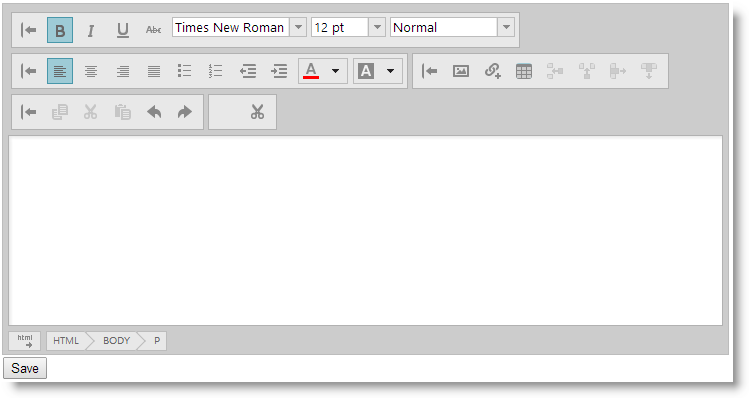

<!--
|metadata|
{
    "fileName": "ightmleditor-saving-html-content",
    "controlName": "igHtmlEditor",
    "tags": ["How Do I","MVC"]
}
|metadata|
-->

# Saving the HTML Content Programmatically


##Topic Overview


### Purpose

This topic explains how to save `igHtmlEditor`™ content to a web server.

### Required Background


-   ASP.NET Request Validation

**Topics**

-	[igHtmlEditor Overview](igHtmlEditor-Overview.html): This topic explains the features of the `igHtmlEditor`.

-	[Adding igHtmlEditor](igHtmlEditor-Adding-igHtmlEditor.html): This topic explains how to add the `igHtmlEditor` to a web page.

**External Resources**

-   Understanding Request Validation in ASP.NET MVC 3
-   Request Validation - Preventing Script Attacks


### In This Topic

This topic contains the following sections:

-   [Posting the HTML content in an ASP.NET MVC Form](#asp-net-mvc-form)
    -   [Introduction](#asp-net-mvc-introduction)
    -   [Preview](#asp-net-mvc-preview)
    -   [Requirements](#asp-net-mvc-requirements)
    -   [Overview](#asp-net-mvc-overview)
    -   [Steps](#asp-net-mvc-steps)
-   [Sending the HTML content in an AJAX call](#ajax-call)
    -   [Introduction](#ajax-call-introduction)
    -   [Preview](#ajax-call-review)
    -   [Requirements](#ajax-call-requirements)
    -   [Overview](#ajax-call-overview)
    -   [Steps](#ajax-call-steps)
-   [Related Content](#related-content)
    -   [Topics](#topics)
    -   [Samples](#samples)


##<a id="asp-net-mvc-form"></a>Posting the HTML content in an ASP.NET MVC 3 Form


###<a id="asp-net-mvc-introduction"></a> Introduction

This procedure shows you how to configure an `igHtmlEditor` in an ASP.NET MVC application. Because the `igHtmlEditor` contains HTML code, you have to work with ASP.NET Request Validation. Request Validation is a security feature that prevents users from posting potentially malicious code like JavaScript and HTML to the server.

In ASP.NET MVC 3, you can turn off request validation on a per property basis. To do this, add the `AllowHtml` attribute to the property on which you store the `igHtmlEditor` content.

In ASP.NET MVC 2, you can turn off request validation on a per object basis. Add the `ValidateInput` attribute to the controller method.

###<a id="asp-net-mvc-preview"></a> Preview

The following screenshot is a preview of the final result.



###<a id="asp-net-mvc-requirements"></a> Requirements

To complete the procedure, you need the following:

-   An ASP.NET MVC 3 project with included Ignite UI resources

###<a id="asp-net-mvc-overview"></a> Overview

This topic takes you step-by-step toward configuring the `igHtmlEditor` in an ASP.NET MVC 3 Form. The following is a conceptual overview of the process:

[1. Defining the Model](#mvc-define-model)

[2. Defining the Controller](#mvc-define-controller)

[3. Defining the igHtmlEditor in the View](#mvc-define-view)

###<a id="asp-net-mvc-steps"></a> Steps

The following steps demonstrate how to configure the `igHtmlEditor` in an ASP.NET MVC 3 project.

1. <a id="mvc-define-model"></a>Define the Model.

	a. Create a *ForumPost* class

	**In C#:**

	```csharp
	public class ForumPost
    {
        public int Id { get; set; }
        public string User { get; set; }
        public string Title { get; set; }
        public DateTime DatePosted { get; set; }
        public string Post { get; set; }
    }
	```

	b. Add the `AllowHtml` attribute to the Post property.

	**In C#:**

    ```csharp
    [AllowHtml]
	public string Post { get; set; }
    ```

2. <a id="mvc-define-controller"></a>Define the Controller.

	a. Define an `AddPost` action method in your controller

	This method returns the default view.

	**In C#:**

	```csharp
	public ActionResult AddPost()
    {
        return View();
    }
	```

	b. Define a `SavePost` action method in your controller

	This method has one parameter which is the object instance of the model class, `ForumPost`. `SaveForumPost` is a helper method in which the content is saved to a database. After saving the forum post the user is shown the `ListForumPosts` view, which shows the list of the forum posts.

	For MVC 3

	**In C#:**

	```csharp
	public ActionResult SavePost(ForumPost forumPost)
    {
        SaveForumPost(forumPost);
        return View("ListForumPosts");
    }
    private void SaveForumPost(ForumPost forumPost)
    {
        //Save forum post to database
    }
	```

	For MVC 2

	**In C#:**

	```csharp
	[ValidateInput(false)]
    public ActionResult SavePost(ForumPost forumPost)
    {
        SaveForumPost(forumPost);
        return View("ListForumPosts");
    }
	```

3. <a id="mvc-define-view"></a>Define the `igHtmlEditor` in the View.

	Define an `AddPost` View.

	a. Add a strongly typed model to the View

	This model allows you to use the `HtmlEditorFor` helper method with ASP.NET MVC model binding.

	**In C#:**

    ```csharp
    @model igHtmlEditor.Models.ForumPost
    ```

	b. Initialize the igHtmlEditor in the view

	Use HtmlEditorFor to initialize the `igHtmlEditor` for a specific field of the model.

	**In C#:**

    ```csharp
    @Html.Infragistics().HtmlEditorFor(m => m.Post).ID("igHtmlEditor").Width("500px").Height("500px").Render()
    ```


##<a id="ajax-call"></a>Sending the HTML content in an AJAX call


###<a id="ajax-call-introduction"></a> Introduction

This procedure shows you how to post `igHtmlEditor` content in an AJAX call to an ASP.NET MVC 3 action. ASP.NET Request Validation is also applied here.

>**Note:** You can easily use this code in an ASP.NET Web Forms project.

###<a id="ajax-call-review"></a> Preview

The following screenshot is a preview of the final result.


###<a id="ajax-call-requirements"></a> Requirements

To complete the procedure, you need the following:

-   An ASP.NET MVC 3 project with included Ignite UI resources

###<a id="ajax-call-overview"></a> Overview

This topic takes you step-by-step toward sending the `igHtmlEditor` content in an AJAX call. The following is a conceptual overview of the process:

[1. Defining the form](#define-form)

[2. Initializing the igHtmlEditor](#init-editor)

[3. Defining the AJAX function](#define-ajax-function)

[4. Defining the server Action Method](#define-server-action)

###<a id="ajax-call-steps"></a> Steps

The following steps demonstrate how to configure the `igHtmlEditor` in an ASP.NET MVC 3 project to be used in an AJAX POST request.

1. <a id="define-form"></a>Define the form

	Define the form in HTML:

	**In HTML:**

	```html
	<form id="forumPostForm" method="post" action="/Home/SavePost">
        <div id="htmlEditor"></div>
        <input type="button" onclick="postHtmlEditorContent();" value="Save" />
    </form>
	```

	or in Razor:

	**In C#:**

	```csharp
	@using (Html.BeginForm("SavePost", "Home", FormMethod.Post, new { id = "forumPostForm" }))
    {
        @Html.Infragistics().HtmlEditorFor(m => m.Post).ID("htmlEditor").Render()
        <input type="button" onclick="postHtmlEditorContent();" value="Save" />
    }
	```

2. <a id="init-editor"></a>Initialize the igHtmlEditor

	Initialize with the Infragistics loader and set the `inputName` option in order to get the content in a named action parameter or model field.

	**In JavaScript:**

	```js
	$.ig.loader(function () {
        $('#htmlEditor').igHtmlEditor({inputName: "Post"});
    });
	```

	Initialize in Razor with the HtmlEditorFor method and bind the editor to 	the model field.

	**In C#:**

    ```csharp
    @Html.Infragistics().HtmlEditorFor(m => m.Post).ID("htmlEditor").Render()
    ```

3. <a id="define-ajax-function"></a>Define the Ajax function

	Define a JavaScript function to post the form in an AJAX call. When you use model binding, the model object is constructed out of the box as  the method parameter.

	**In JavaScript:**

	```js
	function postHtmlEditorContent() {
        // serialize the form
        var data = $("#forumPostForm").serialize();
        // post the form as an ajax call
        $.ajax({
            type: "POST",
            url: "/Home/SavePost",
            data: data,
            dataType: "text"
        });
    }
	```

4. <a id="define-server-action"></a>Define the server Action Method

	Create an action method defined with a `ForumPost` parameter. When the AJAX call is processed it will create a `ForumPost` instance populated with the values of the form. The `SaveForumPost` method is used to save to persistent storage.

	**In C#:**

	```csharp
	public ActionResult SavePost(ForumPost forumPost)
    {
        SaveForumPost(forumPost);
        return View("ListForumPosts");
    }
    private void SaveForumPost(ForumPost forumPost)
    {
        //Save forum post to database
    }
	```


##<a id="related-content"></a>Related Content


###<a id="topics"></a> Topics

The following topics provide additional information related to this topic.

-	[Configuring Toolbars and Buttons](igHtmlEditor-Configuring-Toolbars-and-Buttons.html): This topic explains how to configure `igHtmlEditor` toolbars and buttons.

-	[Modifying Contents Programmatically](igHtmlEditor-Modifying-Contents-Programmatically.html): This topic explains how to modify `igHtmlEditor` contents by using the API.


###<a id="samples"></a> Samples

The following samples provide additional information related to this topic.

-	[Edit Content](%%SamplesUrl%%/html-editor/edit-content): In this forum post example, an initial piece of content provided in the HTML Editor.


 

 


