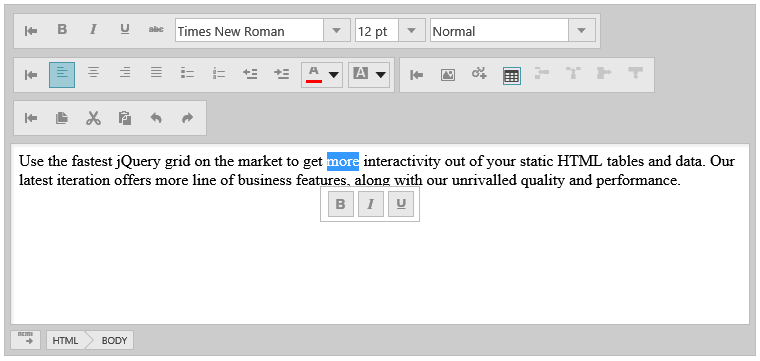

<!--
|metadata|
{
    "fileName": "ightmleditor-typescript-support",
    "controlName": "igHtmlEditor",
    "tags": ["typescript"]
}
|metadata|
-->

# TypeScript Support (igHtmlEditor)

## Topic Overview
This topic shows how to configure `igHtmlEditor` to work with TypeScript.

### In this topic

This topic contains the following sections:

-   [Preview](#Preview)
-   [Requirements](#Requirements)
-   [Overview](#Overview)
-   [Steps](#Steps)
    -   [Create the HTML](#create_html_markup)
    -   [Add the TypeScript code](#typescript_code)
-   [Related Content](#Related_Content)

### <a id="Preview"></a>Preview
The following screenshot is a preview of the final result.



### <a id="Requirements"></a>Requirements
In order to run this sample, you need to have:
-   The required Ignite UI JavaScript and CSS files
-   The required Ignite UI TypeScript definitions

### <a id="Overview"></a>Overview
This topic takes you step-by-step toward creating an `igHtmlEditor` and TypeScript code to go with it.

### <a id="Steps"></a>Steps

<a id="create_html_markup"></a>Create the HTML - we are going to have one `igHtmlEditor`.

**In HTML:**
```html
<div id="htmlEditor">
    Use the fastest jQuery grid on the market to get more interactivity out of your static HTML tables and data. Our latest iteration offers more line of business features, along with our unrivalled quality and performance.
</div>

<div id="toolbarHolder">
    <div id="text"></div>
</div>
```

<a id="typescript_code"></a>Create the TypeScript code - we are adding a standalone toolbar when a text is being selected. It will support bold, italic and underline actions.

**In TypeScript:**
```typescript
/// <reference path="http://www.igniteui.com/js/typings/jquery.d.ts" />
/// <reference path="http://www.igniteui.com/js/typings/jqueryui.d.ts" />
/// <reference path="http://www.igniteui.com/js/typings/igniteui.d.ts" />

function getSelectionCoords() {
    var sel = window.frames[0].document.getSelection(), range;
    var x = 0, y = 0;
    if (sel) {
        if (sel.type != "Control") {
            range = sel.getRangeAt(0).getClientRects()[0];
            x = range.left;
            y = range.bottom + 2*range.height;
        }
    } else if (window.frames[0].document.getSelection()) {
        var selection = window.frames[0].document.getSelection();
        if (selection.rangeCount) {
            range = selection.getRangeAt(0).cloneRange();
            if (range.getClientRects) {
                range.collapse(true);
                var rect = range.getClientRects()[0];
                if (rect) {
                    x = rect.left;
                    y = rect.top;
                }
            }
        }
    }

    return {
        x: x,
        y: y + 118
    };
}

function selectionIs(sel, state) {
    var range, isState = false;
    if (window.frames[0].document.getSelection) {
        if (sel && sel.getRangeAt && sel.rangeCount) {
            range = sel.getRangeAt(0);
            sel.removeAllRanges();
            sel.addRange(range);
        }
    }
    if (window.frames[0].document.queryCommandState) {
        isState = window.frames[0].document.queryCommandState(state);
    }
    return isState;
}

$(function () {
     var $iframe,
        mouseMoveCoord,
        $htmlEditor = $("#htmlEditor"),
        $toolbarHolder = $("#toolbarHolder"),
        $textToolbar = $("#text"),
        height = $('html').hasClass('touch') ? 500 : 350;

    $toolbarHolder.hide();

    $htmlEditor.igHtmlEditor({
        width: "750px",
        height: height,
        inputName: "htmlEditor"
    });
 
    $textToolbar.igToolbar({
        "name": "textToolbar",
        "displayName": "Toolbar text",
        "isExpanded": true,
        "collapseButtonIcon": "ui-igbutton-collapse",
        "expandButtonIcon": "ui-igbutton-expand",
        "items": [{
            "name": "Bold",
            "type": "button",
            "scope": null,
            "props": {
                "allowToggling": {
                    "value": true
                },
                "isBold": {
                    "value": false,
                    "action": "_isSelectedAction"
                },
                "boldButtonTooltip": {
                    "value": "Bold",
                    "action": "_tooltipAction"
                },
                "boldButtonIcon": {
                    "value": "ui-igbutton-bold",
                    "action": "_buttonIconAction"
                }
            }
        }, {
                "name": "Italic",
                "type": "button",
                "props": {
                    "isItalic": {
                        "value": false,
                        "action": "_isSelectedAction"
                    },
                    "italicButtonTooltip": {
                        "value": "Italic",
                        "action": "_tooltipAction"
                    },
                    "italicButtonIcon": {
                        "value": "ui-igbutton-italic",
                        "action": "_buttonIconAction"
                    }
                }
            }, {
                "name": "Underline",
                "type": "button",
                "props": {
                    "isUnderline": {
                        "value": false,
                        "action": "_isSelectedAction"
                    },
                    "underlineButtonTooltip": {
                        "value": "Underline",
                        "action": "_tooltipAction"
                    },
                    "underlineButtonIcon": {
                        "value": "ui-igbutton-underline",
                        "action": "_buttonIconAction"
                    }
                }
            }]
    });

    $iframe = $('#htmlEditor_editor');

    $iframe.contents().find("body").on("mouseup", function (ev) {
        var userSelection,
            userSelectionString,
            $bold = $textToolbar.find("div[id*='Bold']"),
            $italic = $textToolbar.find("div[id*='Italic']"),
            $underline = $textToolbar.find("div[id*='Underline']"),
            coord = getSelectionCoords();

        if (window.frames[0].document.getSelection) {
            userSelection = window.frames[0].document.getSelection();
            userSelectionString = userSelection.toString();
        } else {
            userSelection = window.frames[0].document.activeElement;
            userSelectionString = userSelection.textContent;
        }
        if (userSelectionString !== "") {
            $toolbarHolder.parent().css({
                position: 'relative'
            });

            $toolbarHolder.css({
                top: coord.y,
                left: coord.x,
                position: 'absolute'
            });

            mouseMoveCoord = {
                x: ev.pageX,
                y: ev.pageY
            };

            if (selectionIs(userSelection, "bold")) {
                $bold.igToolbarButton("activate");
            }

            if (selectionIs(userSelection, "italic")) {
                $italic.igToolbarButton("activate");
            }

            if (selectionIs(userSelection, "underline")) {
                $underline.igToolbarButton("activate");
            }

            $iframe.contents().find("body").on("mousemove", function (ev) {
                if (userSelectionString !== "") {
                    if (mouseMoveCoord &&
                        ((Math.abs(mouseMoveCoord.x - ev.pageX) > 50) ||
                        (Math.abs(mouseMoveCoord.y - ev.pageY) > 50))) {

                        $toolbarHolder.fadeOut();
                    } else {
                        $toolbarHolder.fadeIn();
                    }
                }
            });

            $iframe.contents().find("body").on("keydown", function (ev) {
                if (ev.keyCode === 66 && ev.ctrlKey) {
                    $bold.igToolbarButton("toggle");
                }

                if (ev.keyCode === 73 && ev.ctrlKey) {
                    $italic.igToolbarButton("toggle");
                }

                if (ev.keyCode === 85 && ev.ctrlKey) {
                    $underline.igToolbarButton("toggle");
                }
            });

            $toolbarHolder.fadeIn();
        } else {
            $iframe.contents().find("body").off("mousemove");
            $iframe.contents().find("body").off("keydown")

                    $toolbarHolder.hide();
            if ($bold.igToolbarButton) {
                $bold.igToolbarButton("deactivate");
            }

            if ($italic) {
                $italic.igToolbarButton("deactivate");
            }

            if ($underline) {
                $underline.igToolbarButton("deactivate");
            }
        }
    });

    $(document).on("igtoolbarbuttonclick", function (ev) {
        var command = $(ev.target).attr("id").replace($textToolbar.attr("id") + "_item_", "");
        $htmlEditor.igHtmlEditor("executeAction", command.toLowerCase());
    });

    $(document).on("ightmleditoractionexecuting", function (ev, ui) {
        var $button = $textToolbar.find("div[id*='" + ui.actionName + "']");

        if ($button.igToolbarButton) {
            $textToolbar.find("div[id*='" + ui.actionName + "']").igToolbarButton("toggle");
        }
    });
});
```

### <a id="Related_Content"></a>Related Content
The following topic provides additional information related to this topic:
-   [Using Ignite UI with TypeScript](Using-Ignite-UI-with-TypeScript.html) - This topic contains an overview for using the Ignite UI type definitions for TypeScript.