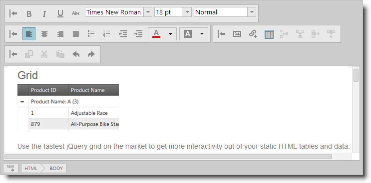

<!--
|metadata|
{
    "fileName": "ightmleditor-working-with-ightmleditor",
    "controlName": "igHtmlEditor",
    "tags": []
}
|metadata|
-->

# Working with the igHtmlEditor

### Introduction

This section explains how to use the `igHtmlEditor`™.

### Topics

Detailed information regarding using the `igHtmlEditor` is covered in the following topics:

-	[Configuring Toolbars and Buttons](igHtmlEditor-Configuring-Toolbars-and-Buttons.html):  This topic explains how to configure `igHtmlEditor` toolbars and buttons.

-	[Saving the HTML Content Programmatically](igHtmlEditor-Saving-HTML-Content.html): This topic explains how to save `igHtmlEditor` content to server.

-	[Modifying Contents Programmatically](igHtmlEditor-Modifying-Contents-Programmatically.html):  This topic explains how to modify `igHtmlEditor` contents by using the API.

 

 

