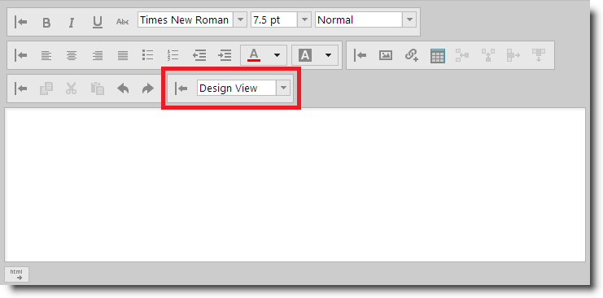
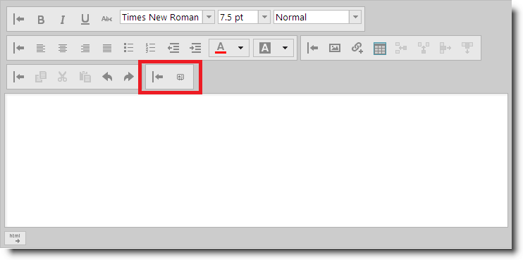
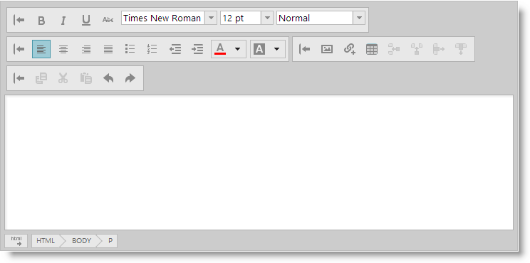
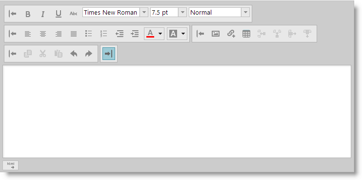

<!--
|metadata|
{
    "fileName": "ightmleditor-configuring-custom-toolbars",
    "controlName": "igHtmlEditor",
    "tags": ["Extending"]
}
|metadata|
-->

# Configuring Custom Toolbars


##Topic Overview


### Purpose

This topic describes how to configure custom toolbars in the `igHtmlEditor`™.

### Required background

The following topics are prerequisites to understanding this topic:

-	[igHtmlEditor Overview](igHtmlEditor-Overview.html):  This topic describes the features of the `igHtmlEditor`.

-	[Adding igHtmlEditor](igHtmlEditor-Adding-igHtmlEditor.html):  This topic describes how to add an igHtmlEditor to a web page.

-	[Configuring Toolbars and Buttons](igHtmlEditor-Configuring-Toolbars-and-Buttons.html): This topic explains how to configure `igHtmlEditor` toolbars and buttons.


### In this topic

This topic contains the following sections:

-   [Introduction](#introduction)
-   [Control Configuration Summary](#config-summary)
-   [Add custom toolbar](#add-custom-toolbar)
-   [Hide custom toolbar](#hide-custom-toolbar)
-   [Collapse custom toolbar](#collapse-custom-toolbar)
-   [Related Content](#related-content)


##<a id="introduction"></a>Introduction


### Introduction to the igHtmlEditor custom toolbars

The igHtmlEditor control supports adding custom-defined toolbars. Custom toolbars are very similar to the standard toolbars. They can be visible or hidden, expanded or collapsed.

Custom toolbars currently support two types of controls:

-   Button
-   Combo

The following screenshot shows an igHtmlEditor with a custom toolbar defined. This toolbar contains a button and a combo:




##<a id="config-summary"></a>Control Configuration Summary


The following table lists the configurable aspects of adding a custom button to the `igHtmlEditor` control. Additional details are available after the table.

<table class="table">
<thead>
	<tr>
		<th>Configurable aspects</th>
		<th>Details</th>
		<th>Properties</th>
	</tr>
</thead>
<tbody>
	<tr>
		<td>[Add custom toolbar](#add-custom-toolbar)</td>
		<td>Use the customToolbars array to define a custom toolbar.</td>
		<td>
        	<ul>
            	<li>customToolbars</li>
                <li>customToolbars.name</li>
                <li>customToolbars.collapseButtonIcon</li>
                <li>customToolbars.expandButtonIcon</li>
                <li>customToolbars.items</li>
            </ul>
         </td>
	</tr>
	<tr>
		<td>[Hide custom toolbar](#hide-custom-toolbar)</td>
		<td>Use autogenerated property show `<customToolbarName\>`. </td>
		<td><ul><li>show</li></ul></td>
	</tr>
	<tr>
		<td>[Collapse custom toolbar](#collapse-custom-toolbar)</td>
		<td>Use *expanded* property on the custom toolbar literal.</td>
		<td><ul><li>customToolbars.expanded</li></ul></td>
	</tr>
</tbody>
</table>

##<a id="add-custom-toolbar"></a>Add custom toolbar


### Overview

In order to create a custom toolbar, you should define the `customToolbars` option of the `igHtmlEditor`. Custom toolbars have all the functionality of the standard toolbars. For example, a custom toolbar can be expanded or collapsed, visible or hidden. Currently custom toolbars can contain button and combo controls. You define these controls in the `items` property.

### Property settings

The following table maps the desired configuration to property settings.

In order to:|Use this property:|And set it to:
---|---|---
Set the name of the toolbar|name|Custom defined string. For example: "myCustomToolbar".
Set the initial state of the toolbar to be expanded|expanded|true
Set the collapse button icon|collapseButtonIcon|"ui-igbutton-collapse"
Set the expand button icon|expandButtonIcon|"ui-igbutton-expand"
Add items to the toolbar|items|Array of object literals. For details on each object properties see [Adding a Button to a Custom Toolbar](igHtmlEditor-Adding-Button-to-Custom-Toolbar.html) and [Adding a Combo Box to a Custom Toolbar](igHtmlEditor-Adding-Combo-to-Custom-Toolbar.html)


### Example

The screenshot below demonstrates how the `igHtmlEditor` looks as a result of the following settings:

Property|Value
---|---|---
name|"customToolbar"
collapseButtonIcon|"ui-igbutton-collapse"
expandButtonIcon|"ui-igbutton-expand"




>**Note:** You can see that the toolbar has no controls in it. That’s because there are none defined. See [Adding a Button to a Custom Toolbar](igHtmlEditor-Adding-Button-to-Custom-Toolbar.html#walkthrough) and [Adding a Combo Box to a Custom Toolbar](igHtmlEditor-Adding-Combo-to-Custom-Toolbar.html#walkthrough) sections..

The code snippet below defines a custom toolbar named "customToolbar" with no items in it.

**In JavaScript:**

```js
<script type="text/javascript">
$("#htmlEditor").igHtmlEditor({
    customToolbars: [
    {
        name: "customToolbar",
        collapseButtonIcon: "ui-igbutton-collapse",
        expandButtonIcon: "ui-igbutton-expand",
        items: [
           //define items here
        ]
    }]
});
<script>
```


##<a id="hide-custom-toolbar"></a>Hide custom toolbar


### Overview

In order to hide a custom toolbar you should use the property which is generated like this:

`show< customToolbarName >`

where `<customToolbarName>` is the name of the custom toolbar.

### Property settings

The following table maps the desired configuration to property settings.

In order to:|Use this property:|And set it to:
---|---|---
Hide custom toolbar|show`<customToolbarName>`|false


### Example

The screenshot below demonstrates how the `igHtmlEditor` looks as a result
of the following settings:

Property|Value
---|---
showMyCustomToolbar|false
customToolbars.name|"myCustomToolbar"
collapseButtonIcon|"ui-igbutton-collapse"
expandButtonIcon|"ui-igbutton-expand"




>**Note:** You cannot see the custom toolbar in the screenshot, because it is hidden.

Here is the code:

**In JavaScript:**

```js
<script type="text/javascript">
$("#htmlEditor").igHtmlEditor({
    showMyCustomToolbar: false,
    customToolbars: [
    {
        name: "myCustomToolbar",
        collapseButtonIcon: "ui-igbutton-collapse",
        expandButtonIcon: "ui-igbutton-expand"
        // toolbar definition here
    }]
});
<script>
```


##<a id="collapse-custom-toolbar"></a>Collapse custom toolbar


### Overview

In order to collapse the custom toolbar you should set the expanded property to false.

### Property settings

The following table maps the desired configuration to property settings.

In order to:|Use this property:|And set it to:
---|---|---
Collapse custom toolbar|expanded|false


### Example

The screenshot below demonstrates how the `igHtmlEditor` looks as a result
of the following settings:

Property|Value
---|---
name|"customToolbar"
expanded|false
collapseButtonIcon|"ui-igbutton-collapse"
expandButtonIcon|"ui-igbutton-expand"




Here is the code:

**In JavaScript:**

```js
<script type="text/javascript">
$("#htmlEditor").igHtmlEditor({
    customToolbars: [
    {
        name: "customToolbar",
        expanded: false,
        collapseButtonIcon: "ui-igbutton-collapse",
        expandButtonIcon: "ui-igbutton-expand",
        items: [
           //define items here
        ]
    }]
});
<script>
```


##<a id="related-content"></a>Related Content


### Topics

The following topics provide additional information related to this topic.

-	[Adding a Button to a Custom Toolbar](igHtmlEditor-Adding-Button-to-Custom-Toolbar.html): This topic describes how to add button to custom toolbar in the igHtmlEditor.

-	[Adding a Combo Box to a Custom Toolbar](igHtmlEditor-Adding-Combo-to-Custom-Toolbar.html):  This topic describes how to add combo to custom toolbar in the igHtmlEditor.


### Samples

The following samples provide additional information related to this topic.

-	[Custom Toolbars and Buttons](%%SamplesUrl%%/html-editor/custom-toolbars-and-buttons):  This sample demonstrates how the HtmlEditor control works as an email client. This implementation features a custom toolbar where you can add a signature to the message.


 

 

