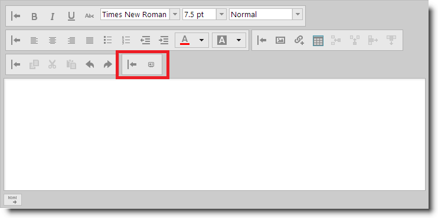

<!--
|metadata|
{
    "fileName": "ightmleditor-adding-button-to-custom-toolbar",
    "controlName": "igHtmlEditor",
    "tags": ["Extending"]
}
|metadata|
-->

# Adding a Button to a Custom Toolbar


##Topic Overview


### Purpose

This topic describes how to add a button to a custom toolbar in the `igHtmlEditor`™.

### Required background

The following topics are prerequisites to understanding this topic:


-	[igHtmlEditor Overview](igHtmlEditor-Overview.html):  This topic describes the features of the `igHtmlEditor`.

-	[Adding igHtmlEditor](igHtmlEditor-Adding-igHtmlEditor.html): This topic describes how to add an `igHtmlEditor` to a web page.

-	[Configuring Toolbars and Buttons](igHtmlEditor-Configuring-Toolbars-and-Buttons.html): This topic explains how to configure `igHtmlEditor` toolbars and buttons.

-	[Configuring Custom Toolbars](igHtmlEditor-Configuring-Custom-Toolbars.html): This topic describes how to configure a custom toolbar for the `igHtmlEditor`.


### In this topic

This topic contains the following sections:

-   [Introduction](#introduction)
-   [Control Configuration Summary](#config-summary)
-   [Walkthrough: Adding button to custom toolbar in JavaScript](#walkthrough)
    -   [Introduction](#walkthrough-introduction)
    -   [Preview](#preview)
    -   [Overview](#overview)
    -   [Steps](#steps)
-   [Related Content](#related-content)
    -   [Topics](#topics)
    -   [Samples](#samples)


##<a id="introduction"></a>Introduction


### Introduction to the igHtmlEditor custom toolbars

The `igHtmlEditor` control supports adding custom-defined toolbars. Custom toolbars currently support two types of controls:

-   Button
-   Combo

The following screenshot shows an `igHtmlEditor` with a custom toolbar defined with one button in it.




##<a id="config-summary"></a>Control Configuration Summary


The following table lists the configurable aspects of adding a custom button to the `igHtmlEditor` control. Additional details are available after the table.

<table class="table">
	<thead>
		<tr>
			<th>Configurable aspects</th>
			<th>Details</th>
			<th>Options</th>
		</tr>
	</thead>
	<tbody>
		<tr>
			<td>Add button to custom toolbar</td>
			<td>In order to define a button in a custom toolbar, add an object literal with the properties on the right to the items array of the customToolbars option.</td>
			<td><ul><li> `name` – this property defines the name of the button.</li><li>`type` – this property must be set to “button”</li><li>`scope` – this property should be set to this</li><li>`handler` – this is the name of the function which will be fired when
    the button is clicked</li><li>`props` – object literal with nested objects. Each nested object can
    have two properties: value and action</li></ul></td>
		</tr>
	</tbody>
</table>


##<a id="walkthrough"></a>Walkthrough: Adding a button to a custom toolbar in JavaScript


###<a id="walkthrough-introduction"></a> Introduction

This procedure guides you through the process of adding a button to a custom toolbar in the `igHtmlEditor`.

In this example, the editor is used as an email editor and you define a custom toolbar and button which inserts an email signature into the content of the editor.

###<a id="preview"></a> Preview

The following screenshot is a preview of the final result.


###<a id="overview"></a> Overview

Following is a conceptual overview of the process:

[1. Referencing the required scripts](#reference-scripts)

[2. Defining the CSS for the button](#define-css)

[3. Initializing igHtmlEditor](#initialize-editor)

[4. Defining the custom toolbar](#define-custom-toolbar)

[5. Defining the button](#define-the-button)

[6. Defining the button click handler](#define-the-click-handler)

###<a id="steps"></a> Steps

The following steps demonstrate how to add a button to a custom toolbar.


1. <a id="reference-scripts"></a>Reference the required scripts

	1. Include mandatory references

		References to the jQuery and jQuery UI JavaScript files are mandatory. Also, reference the Infragistics loader which is a quick way to load the required Infragistics resources:

		**In HTML:**

		```html
		<script type="text/javascript" src="jquery.min.js"></script>
	    <script type="text/javascript" src="jquery-ui.min.js"></script>
	    <script type="text/javascript" src="infragistics.loader.js"></script>
		```

	2. Use the Infragistics Loader to load the `igHtmlEditor` files

		Define the loader to reference the required `igHtmlEditor` files.

		**In JavaScript:**

		```js
		<script type="text/javascript">
	        $.ig.loader({
	            scriptPath: "js",
	            cssPath: "css",
	            resources: "igHtmlEditor"
	        });
	    </script>
		```

2. <a id="define-css"></a>Define the CSS for the button

	Define a CSS rule that applies an image as the button’s backround:

	**In CSS:**

	```css
	<style type="text/css">
        span.ui-icon.ui-icon-contact
        {
            background-image: url(../content/theme/images/ui-icons_222222_256x240.png); 
            background-position: -192px -128px;
        }
    </style>
	```

3. <a id="initialize-editor"></a>Initialize `igHtmlEditor`

	The following code initializes the `igHtmlEditor` in the loader’s callback function:

	**In JavaScript:**

	```js
	<script type="text/javascript">
        $.ig.loader(function () {
            $("#htmlEditor").igHtmlEditor({
                width: "100%",
                inputName: "htmlEditor"
            });
        });
    </script>
	```

4. <a id="define-custom-toolbar"></a>Define the custom toolbar

	Define the "eMailSignature" custom toolbar which holds the button that appends an email signature to the editor contents.

	**In JavaScript:**

	```js
	<script type="text/javascript">
        $.ig.loader(function () {
            $("#htmlEditor").igHtmlEditor({
                width: "100%",
                inputName: "htmlEditor",
                customToolbars: [
                {
                    name: "eMailSignature",
                    collapseButtonIcon: "ui-igbutton-collapse",
                    expandButtonIcon: "ui-igbutton-expand",
                    items: []
                }]
            });
        });
    </script>
	```

5. <a id="define-the-button"></a>Define the button

	The following code defines a button which adds an email signature to the contents of the editor.

	Each custom button must be defined in the items array of the custom toolbar.

	Below are the descriptions of the button options:

	-   `name` – this option defines the name of the button.
	-   `type` – this option defines the kind of the toolbar item which we define. You should set it to “button” in order to define the button.
	-   `scope` – this option defines the execution scope of the click handler of the button. Set it to “this”.
	-   `handler` – this option defines the click handler. You can set it to the name of the function which will handle the click event.
	-   `props` – this is a compound object property which defines most of the button functionality. Here is the definition:

		```
		<customDefinedIdentifier> : {			
			value: <valueToBePassedToTheActionHandler>,			
			action: "<predefinedActionHandler>"			
		},
		```

	where:

	-	<*customDefinedIdentifier \*> is a custom string literal used for API manipulation.

	-	<*predefinedActionHandler \*> is the name of a handler and can be one of the following:

		-   "_tooltipAction" – accepts a tooltip string.
		-   "_isSelectedAction" – accepts a Boolean value.
		-   "_buttonIconAction" – accepts a string matching the CSS class name applied to the button.

	-	<*valueToBePassedToTheActionHandler \*> is the value passed to the action handler.

	**In JavaScript:**

	```js
	items: [{
    	name: "appendSignature",
		type: "button",
		handler: appendSignature,
		scope: this,
		props: {
	    	isImage: {
	        	value: false,
	        	action: '_isSelectedAction'
	    	},
	    	imageButtonTooltip: {
	        	value: "Insert signature",
	        	action: '_tooltipAction'
	    	},
	    	imageButtonIcon: {
	        	value: "ui-icon-contact",
	        	action: '_buttonIconAction'
	    	}
		}	        
	}]
	```

6. <a id="define-the-click-handler"></a>Define the button click handler

	Define the click handler of the button. This function appends a predefined string to the content of the editor.

	**In JavaScript:**

	```js
	<script type="text/javascript">
        function appendSignature(ui) {
            var currentContent = $("#htmlEditor").igHtmlEditor("getContent", "html");
            var signature = "Jon Doe<br/>Acme Corp<br/>555-1111";
            $("#htmlEditor").igHtmlEditor("setContent", currentContent + signature, "html");
        }
    </script>
	```


##<a id="related-content"></a>Related Content


###<a id="topics"></a> Topics

The following topics provide additional information related to this topic.


-	[Adding a Combo Box to a Custom Toolbar](igHtmlEditor-Adding-Combo-to-Custom-Toolbar.html): This topic describes how to add a combo box to a custom toolbar in the `igHtmlEditor`.


###<a id="samples"></a> Samples

The following samples provide additional information related to this topic.

-	[Custom Toolbars and Buttons](%%SamplesUrl%%/html-editor/custom-toolbars-and-buttons): This sample demonstrates how the HtmlEditor control works as an email client. This implementation features a custom toolbar where you can add a signature to the message.


 

 


