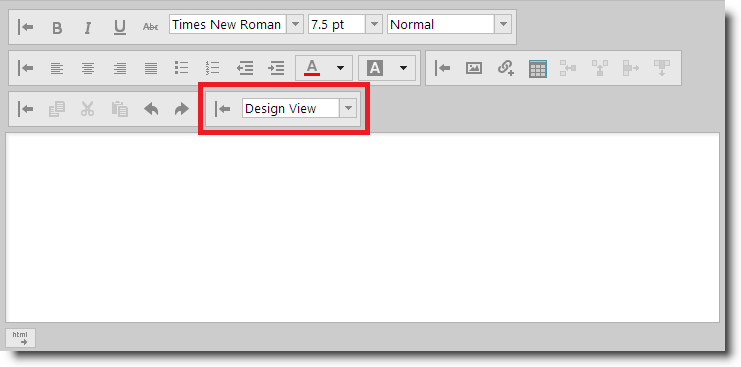

<!--
|metadata|
{
    "fileName": "ightmleditor-adding-combo-to-custom-toolbar",
    "controlName": "igHtmlEditor",
    "tags": ["Extending"]
}
|metadata|
-->

# Adding a Combo Box to a Custom Toolbar


##Topic Overview


### Purpose

This topic describes how to add a combo box to a custom toolbar in the `igHtmlEditor`™.

### Required background

The following topics are prerequisites to understanding this topic:


-	[igHtmlEditor Overview](igHtmlEditor-Overview.html):  This topic describes the features of `igHtmlEditor`.

-	[Adding igHtmlEditor](igHtmlEditor-Adding-igHtmlEditor.html): This topic describes how to add an `igHtmlEditor` to a web page.

-	[Configuring Toolbars and Buttons](igHtmlEditor-Configuring-Toolbars-and-Buttons.html): This topic explains how to configure `igHtmlEditor` toolbars and buttons.

-	[Configuring Custom Toolbars](igHtmlEditor-Configuring-Custom-Toolbars.html): This topic describes how to configure a custom toolbar for the `igHtmlEditor`.


### In this topic

This topic contains the following sections:

-   [Introduction](#introduction)
-   [Control Configuration Summary](#config-summary)
-   [Walkthrough: Adding combo to custom toolbar in JavaScript](#walkthrough)
    -   [Introduction](#introduction)
    -   [Preview](#preview)
    -   [Overview](#overview)
    -   [Steps](#steps)
-   [Related Content](#related-content)
    -   [Topics](#topics)
    -   [Samples](#samples)


##<a id="introduction"></a>Introduction


### Introduction to the igHtmlEditor custom toolbars

The `igHtmlEditor` control supports adding custom-defined toolbars. Custom toolbars currently support two types of controls:

-   Button
-   Combo

The following screenshot shows the `igHtmlEditor` with a combo box defined in a custom toolbar.




##<a id="config-summary"></a>Control Configuration Summary

The following table lists the configurable aspects of adding a custom combo to the `igHtmlEditor` control. Additional details are available after the table.

<table class="table">
	<thead>
		<tr>
			<th>Configurable aspects</th>
			<th>Details</th>
			<th>Options</th>
		</tr>
	</thead>
	<tbody>
		<tr>
			<td>Add a combo to a custom toolbar</td>
			<td>In order to define a combo in a custom toolbar you add an object literal with the options on the right to the items array of `customToolbars` option.</td>
			<td><ul><li> `name` – this property defines the name of the combo.</li><li>`type` – this property must be set to “combo”</li><li>`scope` – this property should be set to this</li><li>`handler` – this property defines the selected handler. Set it to the name of the function which handles the event.</li><li>`props` – object literal with nested objects. Each nested object can have two properties: value and action</li></ul></td>
		</tr>
	</tbody>
</table>


##<a id="walkthrough"></a>Walkthrough: Adding a combo to a custom toolbar in JavaScript


###<a id="walkthrough-introduction"></a> Introduction

This procedure will guide you through the process of adding a combo to a custom toolbar in the `igHtmlEditor`.

In this example, the custom toolbar holds a combo which allows the user to switch between source view and design view of the editor.

###<a id="preview"></a> Preview

The following screenshot is a preview of the final result.


###<a id="overview"></a> Overview

Following is a conceptual overview of the process:

[1. Referencing the required scripts](#reference-scripts)

[2. Initializing igHtmlEditor](#initialize-editor)

[3. Defining the custom toolbar](#define-custom-toolbar)

[4. Defining the combo](#define-the-button)

[5. Defining the combo selected handler](#define-the-click-handler)

###<a id="steps"></a> Steps

The following steps demonstrate how to add a combo to a custom toolbar.

1. <a id="reference-scripts"></a> Reference the required scripts

	1. Include mandatory references

		jQuery, jQuery UI are mandatory. Also, reference the Infragistics Loader to easily reference the required resources:

		**In HTML:**

		```html
		<script type="text/javascript" src="jquery.min.js"></script>
	    <script type="text/javascript" src="jquery-ui.min.js"></script>
	    <script type="text/javascript" src="infragistics.loader.js"></script>
		```

	2. Use the Infragistics Loader to load `igHtmlEditor` files

		Define the loader to reference the required `igHtmlEditor` resources
	
		**In JavaScript:**
	
		```js
		<script type="text/javascript">
	        $.ig.loader({
	            scriptPath: "js",
	            cssPath: "css",
	            resources: "igHtmlEditor"
	        });
	    </script>
		```

2. <a id="initialize-editor"></a> Initialize `igHtmlEditor`

	The following code initializes the `igHtmlEditor` in the loader callback function:

	**In JavaScript:**

	```js
	<script type="text/javascript">
        $.ig.loader(function () {
            $("#htmlEditor").igHtmlEditor({
                width: "100%",
                inputName: "htmlEditor"
            });
        });
    </script>
	```

3. <a id="define-custom-toolbar"></a> Define the custom toolbar

	Define the “codeView” custom toolbar which holds a combo box to switch between the design view and HTML view of the editor.

	**In JavaScript:**

	```js
	<script type="text/javascript">
        $.ig.loader(function () {
            $("#htmlEditor").igHtmlEditor({
                width: "100%",
                inputName: "htmlEditor",
                customToolbars: [
                {
                    name: "codeView",
                    collapseButtonIcon: "ui-igbutton-collapse",
                    expandButtonIcon: "ui-igbutton-expand",
                    items: []
                }
                ]
            });
        });
    </script>
	```

4. <a id="define-the-button"></a> Define the combo

	The following code defines a combo which switches between the design view and HTML view of the editor.

	Each custom combo must be defined in the *items* array of the custom toolbar.

	Here is the explanation of the options of the combo:

	-   `name` – this option defines the name of the combo.
	-   `type` – this option defines the kind of the toolbar item which we define. You should set it to “combo” in order to define the combo.
	-   `scope` – this property defines the execution scope of the selected handler of the combo. Set it to this.
	-   `handler` – this property defines the selected handler. Set it to the name of the function which handles the event.
	-   `props` – this is a compound object property which defines most of the     combo functionality. Here is the definition:

		```
		<customDefinedIdentifier> : {			
			value: <valueToBePassedToTheActionHandler>,			
			action: "<predefinedActionHandler>"			
		}, 
		```
		where: 
	
		-	`<customDefinedIdentifier>` is a custom string literal which can be used for API manipulation.
	
		-	`<predefinedActionHandler>` is the name of an internal function which sets anoption of the internal `igCombo` and can be one of these:

			-   _comboDataSourceAction – accepts data source which can be a collection of objects with text/value properties. This function sets the igCombo.dataSource option.
			-   _comboWidthAction – accepts a number for the width of the combo. This function sets the igCombo.width option.
			-   _comboHeightAction – accepts a number for the height of the combo. This function sets the igCombo.height option.
			-   _comboDropDownListWidth – accepts a number for the pixel width of the combo when it is in a drop-down state. This function sets the igCombo.dropDownWidth option.
			-   _comboSelectedItem – accepts a value to be selected in the combo. This function sets the igCombo.selectedItems option.
	
		-	`<valueToBePassedToTheActionHandler>` is the value (argument) passed to the action handler.
	
		**In JavaScript:**
	
		```js
	    items: [{
	        name: "toggleViewSource",
	        type: "combo",
	        handler: switchView,
	        scope: this,
	        props: {
	        toggleViewSourceComboWidth: {
	            value: 115,
	            action: "_comboWidthAction"
	        },
	        toggleViewSourceItemsListWidth: {
	            value: 115,
	            action: "_comboDropDownListWidth"
	        },
	        toggleViewSourceDataSource: {
	            value: [{text: "HTML View", value: "HTML View"}, {text: "Design View", value: "Design View"}],
	            action: "_comboDataSourceAction"
	        },
	        selectedToggleViewSourceItem: {
	            value: "Design View",
	            action: "_comboSelectedItem"
	        }
	        }
	    }]
		```

	In the example above, the `toggleViewSourceComboWidth` property sets the combo width to 115 pixels. The `toggleViewSourceItemsListWidth` property sets the combo drop-down list width to 115 pixels. The
	`toggleViewSourceDataSource` property sets the combo data source and
	`selectedToggleViewSourceItem` sets the combo’s selected item to “Design View”.

5. <a id="define-the-click-handler"></a> Define the combo selected handler

	Define the selected handler of the combo. This function fires the click event of the button which toggles between design view and HTML view.
	
	**In JavaScript:**

	```js
	<script type="text/javascript">
        function switchView(el, obj) {
            //find the toggle viewsource button and simulate click
            $(".ui-igbutton-viewsource-icon").click();
            //enable combo from the custom toolbar, because it's disabled when editor is in HTML view
            $("#htmlEditor_toolbars_toggleViewSourceToolbar_item_toggleViewSource").igCombo("enable");
        } 
    </script>
	```


##<a id="related-content"></a>Related Content

###<a id="topics"></a> Topics

The following topics provide additional information related to this topic.


-	[Adding a Button to a Custom Toolbar](igHtmlEditor-Adding-Button-to-Custom-Toolbar.html): This topic describes how to add a button to a custom toolbar in the `igHtmlEditor`.


###<a id="samples"></a> Samples

The following samples provide additional information related to this topic.

-	[Custom Toolbars and Buttons](%%SamplesUrl%%/html-editor/custom-toolbars-and-buttons): This sample demonstrates how the HtmlEditor control works as an email client. This implementation features a custom toolbar where you can add a signature to the message.


 

 


