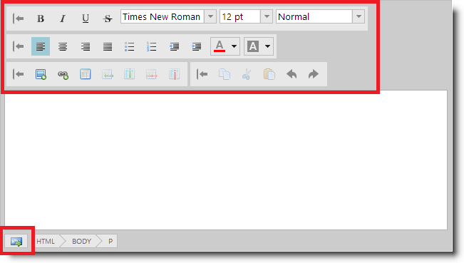

<!--
|metadata|
{
    "fileName": "ightmleditor-styling-and-theming",
    "controlName": "igHtmlEditor",
    "tags": ["Styling","Theming"]
}
|metadata|
-->

# Styling and Theming

##Topic Overview

### Purpose

This topic explains how to apply styles to the `igHtmlEditor`™ control.

### Required background

The following table lists the topics, concepts, and articles required as a prerequisite to understanding this topic.

-   CSS Sprites

**Topics**

-	[igHtmlEditor Overview](igHtmlEditor-Overview.html): This topic describes the features of the `igHtmlEditor`.

-	[Adding igHtmlEditor](igHtmlEditor-Adding-igHtmlEditor.html): This topic describes how to add an `igHtmlEditor` to a web page.

-	[Configuring Toolbars and Buttons](igHtmlEditor-Configuring-Toolbars-and-Buttons.html): This topic explains how to configure the `igHtmlEditor` toolbars and buttons.

-	[Styling and Theming Ignite UI](Deployment-Guide-Styling-and-Theming.html): This topic provides instructions on setting up your application for design time, options for using CSS in production and an overview on creating or customizing a theme.

**External Resources**

-   [CSS Sprites: Image Slicing’s Kiss of Death](http://www.alistapart.com/articles/sprites/)
-   [CSS Sprites: What They Are, Why They’re Cool, and How To Use Them](http://css-tricks.com/css-sprites/)

### In this topic

This topic contains the following sections:

-   [Introduction](#introduction)
-   [Themes Overview](#overview)
-   [Button styles reference](#style-reference)
-   [Related Content](#related-content)

##Introduction

### Introduction to igHtmlEditor styling and theming

The `igHtmlEditor` can be used with two themes provided by Infragistics. These are the Infragistics theme and Metro theme. In addition, you can change button background images by using the appropriate styles.

In the following screenshot you can see the `igHtmlEditor` with custom button icons applied and no icon borders.

##Themes Overview

### Introduction

Ignite UI™ utilizes the jQuery UI CSS Framework for styling and theming purposes. Infragistics and metro are jQuery UI themes provided by Infragistics for use in your application.

Detailed information for applying these themes is available in the [Styling and Theming Ignite UI](Deployment-Guide-Styling-and-Theming.html) topic.

The `igHtmlEditor` specifically is not supported with jQuery UI themes and the Theme Roller tool because the styles of the jQuery UI themes override the `igHtmlEditor` button styles causing the buttons display incorrect icons from the jQuery UI themes.

You can however override the Infragistics themes to customize the styles applied to the `igHtmlEditor` using the reference below.

### Themes summary

The following table summarizes the themes available for the `igHtmlEditor`.

<table cellspacing="0" cellpadding="0" class="table">
	<tbody>
		<tr>
			<th colspan="2">
				Theme
			</th>

			<th>
				Description
			</th>
		</tr>

		<tr>
			<td>
				IG Theme
			</td>

			<td>
				Path: {IG CSS root}/themes/Infragistics/

				File: infragistics.theme.css
			</td>

			<td>
				This theme defines general visual features for all Ignite UI controls.
			</td>
		</tr>

		<tr>
			<td>
				Metro Theme
			</td>

			<td>
				Path: {IG CSS root}/themes/metro/

				File: infragistics.theme.css
			</td>

			<td>
				The Metro theme is an implementation of the clean, modern and fast Metro design language.
			</td>
		</tr>
	</tbody>
</table>

The Metro theme is an implementation of the clean, modern and fast Metro
design language.

##Button styles reference

### Button style reference summary

The following table summarizes the purpose and functionality of the `igHtmlEditor` control’s featured button styles.

>**Note:** The best way to apply multiple button background images is by [using sprites](http://www.alistapart.com/articles/sprites/).

Style|Description
---|---
.ui-igbutton .ui-igbutton-collapse|Defines the background image for the collapse button.
.ui-igbutton .ui-igbutton-expand|Defines the background image for the expand button.
.ui-igbutton .ui-igbutton-redo|Defines the background image for the redo button.
.ui-igbutton .ui-igbutton-undo|Defines the background image for the undo button.
.ui-igbutton .ui-igbutton-increasefontsize|Defines the background image for the increase font size button.
.ui-igbutton .ui-igbutton-decreasefontsize|Defines the background image for the decrease font size button.
.ui-igbutton .ui-igbutton-viewsource-icon|Defines the background image for the view source button.
.ui-igbutton .ui-igbutton-addimage|Defines the background image for the add image button.
.ui-igbutton .ui-igbutton-addlink|Defines the background image for the add link button.
.ui-igbutton .ui-igbutton-copy|Defines the background image for the copy button.
.ui-igbutton .ui-igbutton-cut|Defines the background image for the cut button.
.ui-igbutton .ui-igbutton-paste|Defines the background image for the paste button.
.ui-igbutton .ui-igbutton-table|Defines the background image for the table button.
.ui-igbutton .ui-igbutton-addrow|Defines the background image for the add row button.
.ui-igbutton .ui-igbutton-addcolumn|Defines the background image for the add column button.
.ui-igbutton .ui-igbutton-removerow|Defines the background image for the remove row button.
.ui-igbutton .ui-igbutton-removecolumn|Defines the background image for the remove column button.
.ui-igbutton .ui-igbutton-justifyleft|Defines the background image for the justify left button.
.ui-igbutton .ui-igbutton-justifycenter|Defines the background image for the justify center button.
.ui-igbutton .ui-igbutton-justifyright|Defines the background image for the justify right button.
.ui-igbutton .ui-igbutton-justifyfull|Defines the background image for the justify full button.
.ui-igbutton .ui-igbutton-forecolor|Defines the background image for the fore color button.
.ui-igbutton .ui-igbutton-backcolor|Defines the background image for the back color button.
.ui-igbutton .ui-igbutton-bold|Defines the background image for the bold button.
.ui-igbutton .ui-igbutton-italic|Defines the background image for the italic button.
.ui-igbutton .ui-igbutton-underline|Defines the background image for the underline button.
.ui-igbutton .ui-igbutton-strikethrough|Defines the background image for the strikethrough button.
.ui-igbutton .ui-igbutton-indent|Defines the background image for the indent button.
.ui-igbutton .ui-igbutton-removeindent|Defines the background image for the remove indent button.
.ui-igbutton .ui-igbutton-unorderedlist|Defines the background image for the unordered list button.
.ui-igbutton .ui-igbutton-orderedlist|Defines the background image for the ordered list button.

##Related Content

### Topics

The following topics provide additional information related to this topic.

-	[Known issues and limitations (igHtmlEditor)](igHtmlEditor-Known-Issues.html):  This document describes the known issues and limitations of `igHtmlEditor`.

### Samples

The following samples provide additional information related to this topic.

-	[Custom Icons and Styles](%%SamplesUrl%%/html-editor/custom-icons-and-styles): Since the `igHtmlEditor` control doesn't support the jQuery UI CSS Framework for styling, the standard Infragistics theme and the Windows UI themes are supported by default. This sample demonstrates how to customize `igHtmlEditor` look and feel by using CSS styles.

 

 

