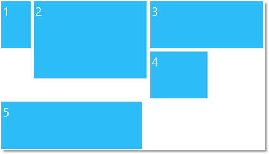

<!--
|metadata|
{
    "fileName": "iglayoutmanager-overview",
    "controlName": "igLayoutManager",
    "tags": ["How Do I","Layouts"]
}
|metadata|
-->

# igLayoutManager Overview

##Topic Overview

### Purpose

This topic explains the Ignite UI®  control conceptually and provides information on the supported layouts and their uses.

### In this topic

This topic contains the following sections:

-   [Introduction](#introduction)
    -   [igLayoutManager summary](#iglayoutmanager)
    -   [RWD support](#rwd-support)
-   [Supported Layouts](#supported-layouts)
    -   [Supported layouts summary chart](#supported-layouts-summary-chart)
    -   [Border layout](#border-layout)
    -   [Column layout](#column-layout)
    -   [Flow layout](#flow-layout)
    -   [Grid layout](#grid-layout)
    -   [Vertical layout](#vertical-layout)
-   [Requirements](#requirements)
-   [Related Content](#related-content)
    -   [Topics](#topics)
    -   [Samples](#samples)
    -   [Resources](#resources)

##Introduction

### igLayoutManager summary

The `igLayoutManager` is a layout control for managing the overall HTML page layout in Web applications by arranging the page elements in pre-defined (but customizable) layout patterns (called “layouts”). The `igLayoutManager` achieves this by positioning the containers in the page according to the selected layout. The control can be used for organizing web pages, as well as single-page applications. The following picture demonstrates an HTML page arrangement resulting from a customized version of the [Column layout](#column-layout) of the `igLayoutManager`.

The `igLayoutManager` is an easy-to-use and efficient alternative to using tables or manually creating a layout through `
` elements. It allows you to achieve the most popular web page arrangements, in countless variations, in just a fraction of the time that the standard approach would require.

The `igLayoutManager` supports several layouts (See [**Supported Layouts**](#supported-layouts-summary-chart).) each customizable to a different degree. With the [Border layout](#border-layout), for example, you can manage the visibility of the individual elements, as well as the relative width of each of them; in the [Grid layout](#grid-layout), what is configurable is the number of columns and rows, the margins between items, the spread-over (spanning) of an item across multiple rows and columns, and the arrangement (and the user permission for it) of the items themselves, and other. The [**Column layout**](#column-layout) is, architecturally, just set of defined CSS classes so you can pre-define all of them to achieve any desired effect, and so on.

The desired layout is selected by setting the [layoutMode](%%jQueryApiUrl%%/ui.iglayoutmanager#options) property of the `igLayoutManager` control. The default layout is the [**Column layout**](#column-layout). For details on configuring and customizing layouts, refer to the [Adding igLayoutManager](igLayoutManager-Adding.html) and [Configuring igLayoutManager](igLayoutManager-Configuring-layouts.html) topics.

### RWD support

The layouts of the `igLayoutManager` control inherently support Responsive Web Design (RWD) and fluid web design. This means that they, “out of the box”, respond to changes to the width of the browser’s viewport, either through item resizing (= fluid design) or through design adaptations (= RWD).

Both the fluid and the responsive behaviors are enabled and disabled based on whether the container and the elements in it have their widths set absolutely (in pixels) or relative (in percentages).

The following table explains how defining the widths’ types affect the design of the layouts.

If the container width is in…|and the items’ widths are…|then the design is:
---|---|---
percentages|percentages|fluid
percentages|pixels|responsive
pixels|any|neither fluid nor responsive

##Supported Layouts

### Supported layouts summary chart

The following table summarizes the layouts of the `igLayoutManager` control. Further details about each layout are available after this summary table and in the [Configuring igLayoutManager](igLayoutManager-Configuring-layouts.html) topic.

Layout|Description|Looks like…
---|---|---
[Border layout](#border-layout)|The Border layout  divides the container into the following elements (regions) – Header, Footer, Body, and Left and Right Sidebars. Each element stores a separate content item.|
[Column layout](#column-layout)|In that layout container is divided into 12 columns. Each set of those columns is placed in separate row and content items can span horizontally over several columns.|
[Flow layout](#flow-layout)|With the Flow layout, the content items arrange from left to right and wrap onto a new line (to the utmost-left) when they reach the right edge of the container.|
[Grid layout](#grid-layout)|With the Grid layout, the items arrange in grid system of a customizable number of columns and rows. Content items can span horizontally over several columns and vertically over several rows. |
[Vertical layout](#vertical-layout)|With Vertical layout, the content items are ordered on top of one another from top to bottom thus forming a single-column arrangement.|

### Border layout

The Border layout divides the container into the following elements (regions) – Header, Footer, Body, Left Sidebar, and Right Sidebar. Each element stores a separate item.

The Border layout is suitable for a variety of the most common layout needs – such as layouts for newspapers, sites with ad areas, blogs, etc...

Region|Class name
---|---
Header|[header](%%jQueryApiUrl%%/ui.iglayoutmanager#options)
Footer|[footer](%%jQueryApiUrl%%/ui.iglayoutmanager#options)
Left Sidebar|[left](%%jQueryApiUrl%%/ui.iglayoutmanager#options)
Right Sidebar|[right](%%jQueryApiUrl%%/ui.iglayoutmanager#options)
Body|[center](%%jQueryApiUrl%%/ui.iglayoutmanager#options)

>**Note:**If there are any children that do not have any of the above classes, they will not be used.

The visibility of the Header, Footer,and Sidebars is configurable, as well as the relative width of the Body and the Left Sidebar and Right Sidebars.

The following pictures demonstrate the effect of the fluid design of the Border layout.

Enlarged browser viewport|Diminished browser viewport
---|---
|

### Column layout

With the Column Layout, the container is divided into 12 columns. Each set of 12 consecutive columns is placed in separate row. The rows and columns are made of DIV sections. That layout itself consists of defined CSS classes with measurement in percentages. They are applied to the HTML in order to achieve the desired column arrangement.

The main benefit of this approach is the extremely fast implementation of the layout: you start with blank web page and, just by including the framework, you are able to achieve the desired layout.

Content items that are wider than the column can span over several columns. The picture below demonstrates the first four content items spanned over tree columns each and wrapped in a row; the single item on the second row spanned over seven columns and, on the third (last) row, the first item spanned over two columns and the second item – over five columns.

Unlike the [Grid layout](#grid-layout), the Column layout needs a minimum CSS set to work properly and has the simplest markup structure of all layouts, You need to assign just a row class to a` 
` element and a `<colN>` class to its children elements and you will have the layout running without even instantiating the `igLayoutManager`.

The following pictures demonstrate the effect of the fluid design of the Column layout.

Enlarged browser viewport|Diminished browser viewport
---|---
|

Responsiveness in the Column layout is implemented through [CSS media queries](http://css-tricks.com/css-media-queries/). This means that there are predefined CSS classes for the different ranges of viewport widths (1200 pixels or more, between 768 and 979 pixels, and 767 pixels or less).

The following pictures demonstrate the effect of the responsive design of the Column layout.

Enlarged browser viewport|Diminished browser viewport
---|---
|

### Flow layout

With the Flow layout, the content items arrange from left to right and wrap onto a new line (to the utmost-left again) when they reach the right edge of the container. The items’ order follows the sort order of the array through which they are supplied to the `igLayoutManager` control. The following picture schematically presents how nine items will be arranged when the container’s width allows for only seven of them in one row.

The Flow layout enables for automatic arrangement of numerous content items thus saving you the work of specifying the placement of each item explicitly. The Flow layout can be applied to many different designs. For example, rather than a grid of items, you could adjust the spacing to create a single line of items along the scrolling dimension. Items can also be of different sizes, which yields something more asymmetrical than a traditional grid but that still has a linear flow to it.

>**Note:**With items that are not uniform in size, the logic of the browser’s rendering engine can affect the arrangement. In the following picture, the space usage efficiency logic of the browser causes item 4 to wrap to the right of item 2 and beneath item 3 (and not to the utmost-left under item 1) because item 2 is disproportionally higher than the other items in the row and item 1 – too narrow to accommodate item 4 in the resulting free space beneath it.

The following pictures demonstrate the effects of both fluid and responsive designs of the Column layout (items are both resized and re-positioned on the next row).

Enlarged browser viewport|Diminished browser viewport
---|---
|

### Grid layout

With the Grid layout, the items arrange in grid system consisting of columns and rows defined as` 
` elements. The number of columns and rows count is customizable, as well as columns’ width and height. You can also choose if the items should rearrange to fit in the container when it is resized. The animated transitions duration is configurable, too.

The following picture presents four items will arranged in a 2x2 grid (2 columns and 2 rows).

Rows and columns can be spanned for accommodating items of different sizes. Note that items can only have sizes that are multiples of the grid cell size in the respective dimension (width or height). The following picture presents schematically 4 items of different sizes arranged in a 3x3 grid. The topmost-left cell spans over the adjacent cells one column to the right and one row downwards. On the third row, the utmost-left cell spans to the right over all across all 3 columns.

The Grid layout is customizable in terms of number of columns and rows, cell size, items’ span across rows and columns and the cells’ margins and colors.

The Grid layout gives a substantial visual and structural balance of web-sites you can create with it. The Grid layout will help you keep all your design elements aligned and in its place.

Unlike the [**Column layout**](#column-layout), the Grid layout allows you to set the number of columns that you would like the grid to have and also their width and height so that you can personalize the layout to the higher degree. Another advantage that the Grid layout gives you is the option to disable the rearrangement of items when the container is resized. You can also set the animation duration when the items are rearranged.

The following pictures demonstrate the effect of the fluid design of the Grid layout.

Enlarged browser viewport|Diminished browser viewport
---|---
|

The following pictures demonstrate the effect of the responsive design of the Grid layout.

Normal browser viewport|Enlarged browser viewport
---|---
|

### Vertical layout

With Vertical layout, the content items are ordered on top of one another from top to bottom thus forming a single-column arrangement. The items in the Vertical layout can have variable heights and widths.

The Vertical layout is suitable for usage when programing for mobile devices. It can be the best choice for news feeds, live sports results streaming, etc.

The items in the Vertical layout can have variable heights and widths and you can only have only one column with this layout.

The following pictures demonstrate the effect of the fluid design of the Vertical layout.

Enlarged browser viewport|Diminished browser viewport
---|---
|

##Requirements

The `igLayoutManager` control is a jQuery UI widget and, therefore, depends on the jQuery and jQuery UI libraries. References to these resources are needed nevertheless, in spite of the use of pure jQuery or ASP.NET MVC helpers. The Infragistics.Web.Mvc assembly is required when the control is used in the context of ASP.NET MVC.

For the full requirements listing, refer to the [Adding igLayoutManager](igLayoutManager-Adding.html) topic.

##Related Content

### Topics

The following topics provide additional information related to this topic.

-	[Adding igLayoutManager](igLayoutManager-Adding.html): This topic demonstrates, with code examples, how to add the `igLayoutManager` control to an HTML page using either pure HTML, JavaScript, or ASP.MVC implementations.

-	[Configuring igLayoutManager](igLayoutManager-Configuring-layouts.html): This topic explains, with code examples, how to configure the different layouts supported by the the `igLayoutManager` control.

-	[Handling Events(igLayoutManager)](igLayoutManager-Handling-Events.html): This topic explains, with code examples, how to attach event handlers to the `igLayoutManager` control.

-	[igLayoutManager Accessibility Compliance](igLayoutManager-Accessibility-Compliance.html): This topic explains the accessibility features of the `igLayoutManager` control and provides information on how to achieve accessibility compliance for pages containing this control.

-	[Known Issues and Limitations (igLayoutManager)](igLayoutManager-Known-Issues-and-Limitations.html): This topic provides information about the known issues and limitations of the `igLayoutManager` control.

-	[jQuery and ASP.NET MVC Helper API Links (igLayoutManager)](igLayoutManager-jQuery-and-ASP.NET-MVC-Helper-API-Links-.html):This topic provides links to the API documentation for the jQuery and its ASP.NET MVC helper class for the `igLayoutManager` control.

### Samples

The following samples provide additional information related to this topic.

-	[ASP.NET MVC Basic Usage](%%SamplesUrl%%/layout-manager/aspnet-mvc-helper): This sample demonstrates using the ASP.NET MVC helper for the Layout Manager control.

-	[Border Layout from HTML Markup](%%SamplesUrl%%/layout-manager/border-layout-markup): This sample demonstrates initializing the `igLayoutManager` control’s Border layout from the HTML markup by assigning *"center"*/*"left"*/*"right"*/*"header"*/*"footer"* CSS classes.

-	[Border Layout – Initializing with JavaScript](help/iglayoutmanager-adding.html#js-steps): This sample demonstrates initializing the `igLayoutManager` control’s Border layout from JavaScript, by handling [`itemRendered`](%%jQueryApiUrl%%/ui.iglayoutmanager#events:itemRendered) events and assigning content to the created regions.

-	[Responsive Column Layout](%%SamplesUrl%%/layout-manager/column-layout-markup): This sample demonstrates how the `igLayoutManager` control’s Column layout can be used by assigning classes to items thus specifying the area their content will span over. This sample does not use JavaScript initialization code: it is done with CSS and HTML only.

-	[Responsive Flow Layout](%%SamplesUrl%%/layout-manager/flow-layout): This sample demonstrates the responsiveness of the `igLayoutManager` control’s Flow layout with various item sizes set either in pixels or percentages and setting the number of items in the `igLayoutManager`'s options without the need for any initial markup.

-	[Grid Layout with colspan and rowspan Support](%%SamplesUrl%%/layout-manager/grid-layout): This sample demonstrates the ability of the `igLayoutManager` control’s Grid layout to allow items to have arbitrary position in a grid with a predefined size including for items with different rowspan and colspan settings.

-	[Responsive Vertical Layout](%%SamplesUrl%%/layout-manager/vertical-layout): This sample s demonstrates the responsiveness of the `igLayoutManager` control’s Vertical layout with various item sizes set either in pixels or percentages and setting the number of items in the `igLayoutManager`'s options without the need for any initial markup.

### Resources

The following material (available outside the Infragistics family of content) provides additional information related to this topic.

-	[A List Apart: Responsive Web Design](http://alistapart.com/article/responsive-web-design): This article explains the main principles of the Responsive Web Design.

 

 

