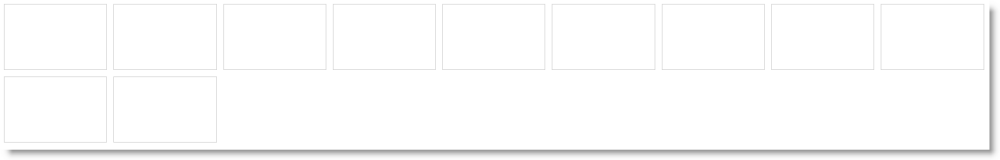

<!--
|metadata|
{
    "fileName": "iglayoutmanager-adding",
    "controlName": "igLayoutManager",
    "tags": ["How Do I","Layouts"]
}
|metadata|
-->

# Adding igLayoutManager


##Topic Overview


### Purpose

This topic demonstrates, with code examples, how to add the `igLayoutManager`™ control to an HTML page using either pure HTML or JavaScript implementation.

### Required background

The following topics are prerequisites to understanding this topic:

-	[igLayoutManager Overview](igLayoutManager-Overview.html): This topic explains the `igLayoutManager` control conceptually and provides information on the supported layouts and their uses.


### In this topic

This topic contains the following sections:

-   [Adding igLayoutManager – Conceptual Overview](#conceptual-overview)
    -   [Adding igLayoutManager summary](#summary)
    -   [Requirements](#requirements)
    -   [Steps](#steps)
-   [Adding igLayoutManager to the HTML Markup – Procedure](#adding-igLayoutManager)
    -   [Introduction](#introduction)
    -   [Preview](#preview)
    -   [Prerequisites](#prerequisites)
    -   [Steps](#html-markup-steps)
-   [Adding igLayoutManager to the HTML Markup – Using JavaScript – Procedure](#js-procedure)
    -   [Introduction](#js-introduction)
    -   [Preview](#js-preview)
    -   [Prerequisites](#js-prerequisites)
    -   [Steps](#js-steps)
-   [Adding igLayoutManager in the ASP.NET MVC – Procedure](#mvc-procedure)
    -   [Introduction](#mvc-introduction)
    -   [Preview](#mvc-preview)
    -   [Prerequisites](#mvc-prerequisites)
    -   [Steps](#mvc-steps)
-   [Related Content](#related-content)
    -   [Topics](#topics)
    -   [Samples](#samples)


##<a id="conceptual-overview"></a>Adding igLayoutManager – Conceptual Overview


### <a id="summary"></a>Adding igLayoutManager summary

The `igLayoutManager` initializes on an unordered list (`<ul>`) element with list items (`<li>`) elements or `<div>` elements. The list can be created in any of the following ways:

-   Directly in the HTML markup the `<li>` or `<div>` elements can be defined in the HTML markup of the host element, and upon initialization, the control will add the respective CSS classes
-   As an array of item objects in the control options

With this approach, an [items](%%jQueryApiUrl%%/ui.iglayoutmanager#options) collection and the [itemCount](%%jQueryApiUrl%%/ui.iglayoutmanager#options) property are used and the `igLayoutManager` generates the corresponding markup.

>**Note:**When defining the number of items using the `itemCount` property, you should not define any items in the markup. Defining items in the markup together with setting the `itemCount` is an undefined scenario and will result in adding the items defined with `itemCount` property to those defined in the markup.

### <a id="requirements"></a>Requirements

The following table summarizes the requirements for `igLayoutManager` control.

<table cellspacing="0" cellpadding="0" class="table">
	<tbody>
		<tr>
			<th>
				Requirement / Required Resource
			</th>

			<th>
				Description
			</th>

			<th>
				What you need to do…
			</th>
		</tr>

		<tr>
			<td>
				jQuery and jQuery UI JavaScript resources
			</td>

			<td>
				Ignite UI is built on top of these frameworks:

				<ul>
					<li><a class="ig-topic-link" href="http://jquery.com/" target="_blank">jQuery</a></li>

					<li><a class="ig-topic-link" href="http://jqueryui.com/" target="_blank">jQuery UI</a></li>
				</ul>
			</td>

			<td>
				Add script references to both libraries in the &lt;head&gt; section of your page.
			</td>
		</tr>

		<tr>
			<td>
				igLayoutManager JavaScript resources
			</td>

			<td>
				The igLayoutManager functionality of the Ignite UI library is distributed across several files. You can load the required resources in one of the following ways:

				<ul>
					<li>(Recommended) <a href="Using-Infragistics-Loader.html" data-auto-update-caption="true">**Using Infragistics Loader**</a> (igLoader™). You only need to include a script reference to igLoader on your page.</li>

					<li>Load the required resources manually. You need to use the dependencies listed in the table below.</li>
				</ul>

				The following table lists the Ignite UI library dependences related to the igLayoutManager control. These resources need to be referred to explicitly if you chose to load resources manually (i.e. not to use igLoader).

				<table cellspacing="0" cellpadding="0">
					<tbody>
						<tr>
							<th>
								JS Resource
							</th>

							<th>
								Description
							</th>
						</tr>

						<tr>
							<td>infragistics.ui.layoutmanager.js</td>

							<td>
								The igLayoutManager control
							</td>
						</tr>
					</tbody>
				</table><br>
			</td>

			<td>
				Add one of the following:

				<ul>
					<li>A reference to igLoader</li>

					<li>A reference to all the required JavaScript files (listed in the table on the left).</li>
				</ul>
			</td>
		</tr>

		<tr>
			<td>
				IG theme

				*(Optional)*
			</td>

			<td>
				This theme contains the visual styles for the Ignite UI library. The theme file is:

				{IG CSS root}/themes/Infragistics/infragistics.theme.css
			</td>

			<td></td>
		</tr>

		<tr>
			<td>
				igLayoutManager structure
			</td>

			<td>
				The styles from the following CSS file are used for rendering various elements of the control:

				{IG CSS root}/structure/modules/infragistics.ui.layout.css
			</td>

			<td>
				Add style reference to the file in your page.
			</td>
		</tr>
	</tbody>
</table>


>**Note:**It is recommended to use the `igLoader` component to load JavaScript and CSS resources. For information on how to do this, refer to the [Adding Required Resources Automatically with the Infragistics Loader](Using-Infragistics-Loader.html) topic. In addition to that, in the online [Ignite UI Samples Browser](%%SamplesUrl%%), you can find some specific examples on how to use the `igLoader` with the `igLayoutManager` component.

### <a id="steps"></a>Steps

Following are the general conceptual steps for adding `igLayoutManager` to an HTML page.

1. Adding the HTML element to host the `igLayoutManager` control

2. Instantiating `igLayoutManager` and specify the layout


##<a id="adding-igLayoutManager"></a>Adding igLayoutManager to the HTML Markup – Procedure


### <a id="introduction"></a>Introduction

This procedure guides you through the steps of adding an `igLayoutManager` control with Flow layout and default settings to an HTML page. This is a pure HTML/JavaScript implementation. It uses the Infragistics Loader (`igLoader`) component to load all Ignite UI resources needed by the `igLayoutManager` control. The markup is also defined in an HTML page. The `igLayoutManager` initializes directly in the HTML markup (i.e on an `<ul>` element with `<li>` elements).

For other scenarios, refer to [Configuring igLayoutManager](igLayoutManager-Configuring-layouts.html).

### <a id="preview"></a>Preview

The following screenshot is a preview of the result.



### <a id="prerequisites"></a>Prerequisites

The required resources added and properly referenced. (For a conceptual overview of those resources, see [**Requirements**](#requirements).) These include:

-   The required files added to their appropriate locations:
    -   The required jQuery and jQueryUI JavaScript resources added to a folder named Scripts in the directory where your web page resides.
    -   The Ignite UI CSS files added to a folder named Content/ig (For details, see the [**Styling and Theming Ignite UI**](Deployment-Guide-Styling-and-Theming.html) topic).
    -   The Ignite UI JavaScript files added to a folder of your web site or application named Scripts/ig (For details, see the [**Using JavaScript Resources in Ignite UI**](Deployment-Guide-JavaScript-Resources.html) topics).
-   The required JavaScript resources referenced in the `<head>` section of the page.

    **In HTML:**

    ```html
    <script  type="text/javascript" src="Scripts/jquery.js"></script>
    <script  type="text/javascript" src="Scripts/jquery-ui.js"></script>
    ```

-   The `igLoader` component referenced on the page.

    **In HTML:**

    ```html
    <script  type="text/javascript" src="Scripts/ig/infragistics.loader.js"></script>
    ```

-   The `igLoader` **component** instantiated:

    **In HTML:**

    ```html
    <script type="text/javascript">
        $.ig.loader({
            scriptPath: "Scripts/ig/",
            cssPath: "Content/ig/",
            resources: "igLayoutManager"
        });
    </script>
    ```

### <a id="html-markup-steps"></a>Steps

The following steps demonstrate how to add a basic `igLayoutManager` control to a web page with Flow layout.

1. Add the HTML element to host the `igLayoutManager` control.

	Add an HTML `<ul>` element to host the `igLayoutManager` control on the HTML page.

	**In HTML:**

	```html
	<ul id="layout">
        <li></li>
        <li></li>
        <li></li>
        <li></li>
        <li></li>
        <li></li>
        <li></li>
        <li></li>
        <li></li>
        <li></li>
        <li></li>
    </ul>
	```

2. Instantiate `igLayoutManager` and specify the layout.

	Add the initialization code to a script element in the HTML page. The initialization code creates `igLayoutManager` instance in the `<ul>` element added in step 1.

	The following code creates an instance of the `igLayoutManager` control.

	**In JavaScript:**

	```js
	$.ig.loader(function () {
        //  Create a basic igLayoutManager control
        $("#layout").igLayoutManager({
            layoutMode: "flow"
        });
    });
	```


##<a id="js-procedure"></a>Adding igLayoutManager to the HTML Markup Using JavaScript – Procedure


### <a id="js-introduction"></a>Introduction

This procedure guides you through the steps of adding an `igLayoutManager` control with basic functionality to an HTML page using a pure HTML/JavaScript implementation. It uses the Infragistics Loader component to load all Ignite UI resources needed by the `igLayoutManager` control. The `igLayoutManager` initializes as an array of item objects in the control options (i.e. on a blank `<ul>` element, and the number of items is provided inside the instance of `igLayoutManager` using the [`itemCount`](%%jQueryApiUrl%%/ui.iglayoutmanager#options) property).

### <a id="js-preview"></a>Preview

The following screenshot is a preview of the final result.


### <a id="js-prerequisites"></a>Prerequisites

The required resources added and properly referenced. (For a conceptual overview of those resources, see [Requirements](#requirements).) These include:

-   The required files added to their appropriate locations:
    -   The required jQuery and jQueryUI JavaScript resources added to a folder named Scripts in the directory where your web page resides.
    -   The Ignite UI CSS files added to a folder named Content/ig (For details, see the [**Styling and Theming Ignite UI**](Deployment-Guide-Styling-and-Theming.html) topic).
    -   The Ignite UI JavaScript files added to a folder of your web site or application named Scripts/ig (For details, see the [**Using JavaScript Resources in Ignite UI**](Deployment-Guide-JavaScript-Resources.html) topics).
-   The required JavaScript resources referenced in the `<head>` section of the page.

    **In HTML:**

    ```html
    <script  type="text/javascript" src="Scripts/jquery.js"></script>
    <script  type="text/javascript" src="Scripts/jquery-ui.js"></script>
    ```

-   The `igLoader` component referenced on the page.

    **In HTML:**

    ```html
    <script  type="text/javascript" src="Scripts/ig/infragistics.loader.js"></script>
    ```

-   The `igLoader` component instantiated:

    **In HTML:**

    ```html
    <script type="text/javascript">
        $.ig.loader({
            scriptPath: "Scripts/ig/",
            cssPath: "Content/ig/",
            resources: "igLayoutManager"
        });
    </script>
    ```

### <a id="js-steps"></a>Steps

The following steps demonstrate how to add a basic `igLayoutManager` control with Flow layout to an HTML page using JavaScript implementation. For other scenarios, read at [Configuring igLayoutManager](igLayoutManager-Configuring-layouts.html).


1. Add an HTML element to host `igLayoutManager`.

	Add an HTML `<ul>` element to host `igLayoutManager` on the HTML page.

	**In HTML:**

	```html
	<ul id="layout">
    </ul>
	```

2. Instantiate `igLayoutManager` and specify the layout.

	Add the initialization code to a script element in the HTML page. The initialization code creates `igLayoutManager` instance in the `<ul>` element added in step 1.

	The following code creates an instance of the `igLayoutManager` control.

	**In JavaScript:**

	```js
	$.ig.loader(function () {
        //  Create a basic igLayoutManager control
        $("#layout").igLayoutManager({
            layoutMode: "flow",
            itemCount: 11,
        });
    });
	```

#### Sample ilustrating an alternative approach when using itemRendered event:

The following sample demonstrates initializing the Layout Manager control's Border layout from JavaScript, by handling [`itemRendered`](%%jQueryApiUrl%%/ui.iglayoutmanager#events:itemRendered) events and assigning content to the created regions.

<div class="embed-sample">
   [%%SamplesEmbedUrl%%/layout-manager/border-layout](%%SamplesEmbedUrl%%/layout-manager/border-layout)
</div>


##<a id="mvc-procedure"></a>Adding igLayoutManager in the ASP.NET MVC – Procedure 

### <a id="mvc-introduction"></a>Introduction

This procedure guides you through the steps of adding an `igLayoutManager` with basic functionality to an ASP.NET MVC view. The example uses the ASP.NET MVC syntax together with the required Loader configuration. The `igLayoutManager` initializes as an array of item objects in the control options (i.e. on a blank `<ul>` element, and the number of items is provided inside the instance of `igLayoutManager` using the [`itemCount`](%%jQueryApiUrl%%/ui.iglayoutmanager#options) property).

### <a id="mvc-preview"></a>Preview

The following screenshot is a preview of the final result.


### <a id="mvc-prerequisites"></a>Prerequisites

The required resources added and properly referenced. (For a conceptual overview of those resources, see Prerequisites.) These include:

-   The required files added to their appropriate locations:
    -   The required jQuery and jQueryUI JavaScript resources added to a folder named Scripts in the directory where your web page resides.
    -   The Ignite UI CSS files added to a folder named Content/ig (For details, see the [**Styling and Theming Ignite UI**](Deployment-Guide-Styling-and-Theming.html) topic).
    -   The Ignite UI JavaScript files added to a folder of your web site or application named Scripts/ig (For details, see the [**Using JavaScript Resources in Ignite UI**](Deployment-Guide-JavaScript-Resources.html) topics).
-   The required JavaScript resources referenced in the `<head>` section of the page.

    **In HTML:**

    ```html
    <script  type="text/javascript" src="Scripts/jquery.js"></script>
    <script  type="text/javascript" src="Scripts/jquery-ui.js"></script>
    ```

-   The `igLoader` component referenced on the page.

    **In HTML:**

    ```html
    <script  type="text/javascript" src="Scripts/ig/infragistics.loader.js"></script>
    ```

-   The `igLoader` component instantiated in ASP.NET view:

    **In ASPX:**

    ```csharp
    @(Html.Infragistics()
            .Loader()     
            .ScriptPath("http://localhost/ig_ui/js/")
            .CssPath("http://localhost/ig_ui/css/")
            .Render()
    )
    ```

### <a id="mvc-steps"></a>Steps

The following steps demonstrate how to add a basic `igLayoutManager` control with Flow Layout to an ASP.NET MVC application.


1. Add the `igLayoutManager` control.

	Add an HTML `<ul>` element to host `igLayoutManager` on the HTML page.

	**In HTML:**

    ```html
    <ul id="layout"></ul>
    ```

2. Instantiate `igLayoutManager`

	The following code creates an instance of the `igLayoutManager` control.

	**In ASPX:**

	```csharp
	@(Html.Infragistics()
        .ID("layout")
        .LayoutMode("flow")
        .ItemCount(11)
        .Render()
    )
	```


##<a id="related-content"></a>Related Content


### <a id="topics"></a>Topics

The following topics provide additional information related to this topic.

-	[Configuring igLayoutManager](igLayoutManager-Configuring-layouts.html): This topic explains, with code examples, how to configure the different layouts supported by the the `igLayoutManager` control.

-	[Handling Events(igLayoutManager)](igLayoutManager-Handling-Events.html): This topic explains, with code examples, how to attach event handlers to the `igLayoutManager` control.

-	[igLayoutManager Accessibility Compliance](igLayoutManager-Accessibility-Compliance.html): This topic explains the accessibility features of the `igLayoutManager` control and provides information on how to achieve accessibility compliance for pages containing this control.

-	[Known Issues and Limitations (igLayoutManager)](igLayoutManager-Known-Issues-and-Limitations.html): This topic provides information about the known issues and limitations of the `igLayoutManager` control.

-	[jQuery and ASP.NET MVC Helper API Links (igLayoutManager)](igLayoutManager-jQuery-and-ASP.NET-MVC-Helper-API-Links-.html): This topic provides links to the API documentation for jQuery and its ASP.NET MVC helper class for the `igLayoutManager` control.


### <a id="samples"></a>Samples

The following samples provide additional information related to this topic.

-	[ASP.NET MVC Basic Usage](%%SamplesUrl%%/layout-manager/aspnet-mvc-helper): This sample demonstrates using the ASP.NET MVC helper for the Layout Manager control.

-	[Border Layout from HTML Markup](%%SamplesUrl%%/layout-manager/border-layout-markup): This sample demonstrates initializing the `igLayoutManager` control’s Border layout from the HTML markup by assigning *"center"*/*"left"*/*"right"*/*"header"*/*"footer"* CSS classes.

-	[Responsive Column Layout](%%SamplesUrl%%/layout-manager/column-layout-markup):This sample demonstrates how the `igLayoutManager` control’s Column layout can be used by assigning classes to items thus specifying the area their content will span over. This sample does not use JavaScript initialization code: it is done with CSS and HTML only.

-	[Responsive Flow Layout](%%SamplesUrl%%/layout-manager/flow-layout): This sample demonstrates the responsiveness of the `igLayoutManager` control’s Flow layout with various item sizes set either in pixels or percentages and setting the number of items in the `igLayoutManager`'s options without the need for any initial markup.

-	[Grid Layout with colspan and rowspan Support](%%SamplesUrl%%/layout-manager/grid-layout): This sample demonstrates the ability of the `igLayoutManager` control’s Grid layout to allow items to have arbitrary position in a grid with a predefined size including for items with different rowspan and colspan settings.

-	[Responsive Vertical Layout](%%SamplesUrl%%/layout-manager/vertical-layout): This sample s demonstrates the responsiveness of the `igLayoutManager` control’s Vertical layout with various item sizes set either in pixels or percentages and setting the number of items in the `igLayoutManager`'s options without the need for any initial markup.


 

 


