<!--
|metadata|
{
    "fileName": "iglineargauge-overview",
    "controlName": "igLinearGauge",
    "tags": ["Getting Started","How Do I"]
}
|metadata|
-->

# igLinearGauge Overview

##Topic Overview

### Purpose

This topic provides conceptual information about the `igLinearGauge`™ control including its main features, minimum requirements, and user functionality.

### In this topic

This topic contains the following sections:

-   [Introduction](#introduction)

-   [Main Features](#main-features)
    -   [Main features summary](#main-features-summary)
    -   [Main features summary chart](#main-features-chart)
-   [Logical areas and Configurable Visual Elements Summary](#config-visual-elements-summary)
    -   [Logical areas](#logical-areas)
    -   [Configurable visual elements](#config-visual-elements)
-   [Configurable Visual Elements and Related Properties](#config-visual-elements-related-prop)
    -   [Configurable visual elements and related properties summary](#config-visual-elements-related-prop-summary)
    -   [Scale](#scale)
    -   [Needle](#needle)
    -   [Comparative ranges](#comparative-ranges)
    -   [Background](#background-overview)
    -   [Tooltips](#tooltip-overview)
-   [Default Configuration](#default-config)

-   [Requirements](#requirements)

-   [Related Content](#related-content)
    -   [Topics](#topics)
    -   [Samples](#samples)

##Introduction

### igLinearGauge summary

The `igLinearGauge` control is an Ignite UI control which allows for visualizing data in the form of a linear gauge. It provides a simple and concise view of a primary value compared against a scale and one or more comparative ranges.

The `igLinearGauge` control provides you with the ability to create attractive data presentations and has multiple application usage scenarios.

##Main Features

### Main features summary

The features of `igLinearGauge` include configurable orientation and direction, configurable visual elements and tooltips, and more. The control has also a built-in support for animated transitions.

### Main features summary chart

The following table summarizes the main features of the `igLinearGauge` control.

Feature|Description
---|---
Configurable orientation and direction|The `igLinearGauge` control exposes an API for setting the state of its scale’s orientation and direction, so that the look of the gauge can be largely customized. (For details, see the [Configuring the Orientation and Direction (igLinearGauge)](igLinearGauge-Configuring-the-Orientation-and-Direction.html) topic.)
Configurable visual elements|Each of the [visual elements](#config-visual-elements-related-prop) of the linear gauge can be configured in several aspects. (For details, see [Configurable Visual Elements of igLinearGauge and Related Properties](#config-visual-elements-related-prop).)
Animated transitions|The `igLinearGauge` control provides built-in support for animation by its [transitionDuration](%%jQueryApiUrl%%/ui.igLinearGauge#options:transitionDuration) property. The animation effect occurs on loading the control as well as when the value of any of its properties is changed. By default, animated transitions are disabled. Providing a value in milliseconds for the `transitionDuration` property of the control determines the timeframe for swiping the control into view by smoothly visualizing all of its visual elements through a slide effect (from bottom-left to top-right). Setting the value to 0 disables the animated transition. For a sample, demonstrating the animation transition effect, see the [Animated Transitions](%%SamplesUrl%%/linear-gauge/animated-transitions) sample.
Support for tooltips|The built-in tooltips of the `igLinearGauge` control show the values used to create the needle, or the values, corresponding to the different ranges respectively. They are initially styled in accordance with the default look of the control, but their look can be customized by templates. By default, tooltips are disabled. (For details, see  [Configuring the Tooltips (igLinearGauge)](igLinearGauge-Configuring-the-Tooltips.html))

##Logical areas and Configurable Visual Elements Summary

### Logical areas

The user-visible area of the `igLinearGauge` control is logically divided into the following areas: Title area, Reserved area, and Graph area.

Horizontal orientation|Vertical orientation
---|---
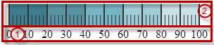|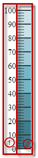

Each of them serves different purpose related to some of the [visual elements](#config-visual-elements) of the `igLinearGauge` control.

-   Reserved area (1) – This area spreads:
    -   Along the scale – the Reserved area begins at either edge of the control and ends to the opposing edge of the control.
    -   Across the scale –
        -   Horizontal Orientation: the Reserved area begins at the bottom edge of the control and extends upwards to the bottom margin of the gauge's scale.
        -   Vertical Orientation: the Reserved area begins at the left edge of the control and extends to the right, up to the left margin of the gauge's scale.

The main purpose of the Reserved area is to provide enough space for the numbering labels of the scale at any orientation – horizontal or vertical (The Reserved area automatically re-sizes when the orientation changes in order to accommodate the specific space requirements for displaying the numbering labels in each of the orientations: in horizontal orientation, the area has to fit the labels’ height and in vertical orientation – their maximum width.) This doesn’t mean that you must necessarily place the numbering labels in the Reserved area: actually, you can position the label row across-the-scale anywhere within the [Graph area](#graph-area). However, even if you place the label row outside Reserved area, this will have no bearing on the spread and location of the Reserved area itself – it remains where it is, automatically defined through the height/width (depending on the orientation) of the numbering labels.

Another aspect in which the Reserved area is significant is the fact that its inner edge specifies the beginning edge of the [Graph area](#graph-area) in the across-the-scale dimension. This is important, because this edge serves as a reference mark for the extent-related properties that position some [visual elements](#config-visual-elements) across the scale. (Positive values for these properties – the most common case – position the visual elements inside the [Graph area](#graph-area) and negative values – inside the Reserved area.)

-   Graph area (2) – The area for displaying the needle, the tick marks, the ranges, and, optionally, the numbering labels of the linear gauge. All extent-related properties for these visual elements (except for labels) are measured against its edges. The Graph area serves not as a placeholder but as a frame of reference for positioning the scale inside the control (More precisely, for positioning the [visual elements](#config-visual-elements-related-prop) of the scale).

Spread of the Graph area:

-   Along the scale – the Graph area begins either edge of the control and ends at the opposing edge of the control. Both the starting and ending positions of the scale are measured against the starting edge of the Graph area (the left edge at horizontal orientation or bottom edge at vertical orientation).
-   Across the scale – the Graph area begins at the edge of the Reserved area (this is the bottom edge of the Graph area in the horizontal orientation or its left edge in the vertical orientation).  The edge of the Graph area that borders with the Reserved area serves as a reference point for the extent-related properties of some of the visual elements of the scale (for positioning these elements across the scale).

 

### Configurable visual elements

The `igLinearGauge` control features the following visual elements (See the picture below):

-   Needle (3) – This is the primary indicator displayed by the control and is visualized as a hovering bar element, which moves along the gauge's scale; its current position along the scale indicates the gauge's value.

-   Comparative range(s) (4) – The ranges are visual elements that highlight a specified range of values on a scale. Their purpose is to visually communicate the qualitative state of the performance bar measure, illustrating at the same times the degree to which it resides within that state.
-   Tick marks (5) –The tick marks serve as a visual division of the scale into intervals in order to increase the readability of the linear gauge.
    -   Major tick marks – The major tick marks are used as primary delimiters on the scale. The frequency they appear at, their extents and style can be controlled by setting the corresponding properties.
    -   Minor tick marks – The minor tick marks represent helper tick marks, which might be used to additionally improve the readability of the scale and can be customized in a way similar to the major ones.
-   Scale labels (6) – The labels indicate the measures on the scale.
-   Border (7) – The line visually delimiting the dimensions of the control.
-   Background (8) – The background on which visual elements is placed is configurable in terms of pattern and color.

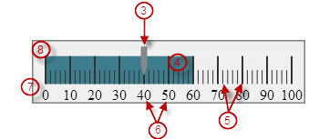

-   Tooltips – show the values used to create the needle, or the values, corresponding to the different ranges respectively.

##Configurable Visual Elements and Related Properties

### Configurable visual elements and related properties summary

There are several specific aspects in which each element can be configured.

The following table provides an overview of the configurable aspects of the visual elements of the `igLinearGauge` control. Further details about the configurable aspects with illustrations and the properties that configure them are available, for each visual element, in the blocks that follow the table:

<table cellspacing="0" cellpadding="0" class="table">
	<tbody>
		<tr>
			<th>
				Visual element
			</th>

			<th>
				Main configurable aspects
			</th>
		</tr>

		<tr>
			<td>
				<a class="ig-topic-link" href="#scale">Scale</a>
			</td>

			<td>
				<ul>
					<li>Position</li>

					<li>Tick marks</li>

					<li>Labels</li>
				</ul>
			</td>
		</tr>

		<tr>
			<td>
				<a class="ig-topic-link" href="#needle">Needle</a>
			</td>

			<td>
				<ul>
					<li>Value indicated</li>

					<li>Width and position</li>

					<li>Look-and-feel (shape)</li>
				</ul>
			</td>
		</tr>

		<tr>
			<td>
				<a class="ig-topic-link" href="#comparative-ranges">Comparative ranges</a>
			</td>

			<td>
				<ul>
					<li>Number (of ranges in the gauge)</li>

					<li>Length, width, and position</li>

					<li>Look-and-feel</li>
				</ul>
			</td>
		</tr>

		<tr>
			<td>
				<a class="ig-topic-link" href="#background-overview">Background</a>
			</td>

			<td>
				<ul>
					<li>Size and position</li>

					<li>Look-and-feel</li>
				</ul>
			</td>
		</tr>

		<tr>
			<td>
				<a class="ig-topic-link" href="#tooltip-overview">Tooltips</a>
			</td>

			<td>
				<ul>
					<li>Display delay</li>
				</ul>
			</td>
		</tr>
	</tbody>
</table>

### Scale

The following pictures illustrate the scale-related extents, listed in the table below.

Extent positioning the scale within the Graph area|Extents configuring the position of the labels
---|---
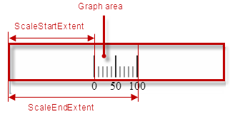|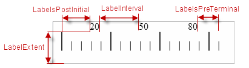

Extents configuring the major tick marks along the scale|Extents configuring the major tick marks across the scale
---|---
|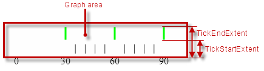

Extents configuring the minor tick marks across the scale

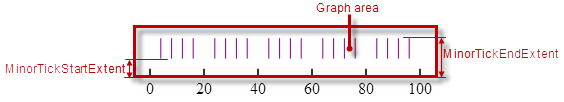

The following table maps the configurable aspects related to the scale of the linear gauge to the `igLinearGauge` properties that manage them.

<table cellspacing="0" cellpadding="0" class="table table-bordered">
	<tbody>
		<tr>
			<th colspan="4">Configurable aspects</th>

			<th>
				Property
			</th>

			<th>Default value</th>
		</tr>

		<tr>
			<th rowspan="2" colspan="4">Position</th>

			<td><a href="%%jQueryApiUrl%%/ui.igLinearGauge#options:scaleStartExtent" target="_blank">scaleStartExtent</a></td>

			<td>0.05</td>
		</tr>

		<tr>
			<td><a href="%%jQueryApiUrl%%/ui.igLinearGauge#options:scaleEndExtent" target="_blank">scaleEndExtent</a></td>

			<td>0.95</td>
		</tr>

		<tr>
			<th rowspan="2" colspan="2">Range and Values</th>

			<th colspan="2">Max value</th>

			<td><a href="%%jQueryApiUrl%%/ui.igLinearGauge#options:minimumValue" target="_blank">minimumValue</a></td>

			<td>0</td>
		</tr>

		<tr>
			<th colspan="2">Min value</th>

			<td><a href="%%jQueryApiUrl%%/ui.igLinearGauge#options:maximumValue" target="_blank">maximumValue</a></td>

			<td>100</td>
		</tr>

		<tr>
			<th rowspan="12">Tick marks</th>

			<th rowspan="7">Major tick marks</th>

			<th rowspan="5" colspan="2">
				Position (within the scale), spacing, and length
			</th>

			<td><a href="%%jQueryApiUrl%%/ui.igLinearGauge#options:interval" target="_blank">interval</a></td>

			<td>
				Not set
			</td>
		</tr>

		<tr>
			<td><a href="%%jQueryApiUrl%%/ui.igLinearGauge#options:ticksPostInitial" target="_blank">ticksPostInitial</a></td>

			<td>0</td>
		</tr>

		<tr>
			<td><a href="%%jQueryApiUrl%%/ui.igLinearGauge#options:ticksPreTerminal" target="_blank">ticksPreTerminal</a></td>

			<td>0</td>
		</tr>

		<tr>
			<td><a href="%%jQueryApiUrl%%/ui.igLinearGauge#options:tickStartExtent" target="_blank">tickStartExtent</a></td>

			<td>0.02</td>
		</tr>

		<tr>
			<td><a href="%%jQueryApiUrl%%/ui.igLinearGauge#options:tickEndExtent" target="_blank">tickEndExtent</a></td>

			<td>0.2</td>
		</tr>

		<tr>
			<th rowspan="2">Look-and-feel</th>

			<th>
				Color
			</th>

			<td><a href="%%jQueryApiUrl%%/ui.igLinearGauge#options:tickBrush" target="_blank">tickBrush</a></td>

			<td>Defined in the default theme</td>
		</tr>

		<tr>
			<th>
				Width
			</th>

			<td><a href="%%jQueryApiUrl%%/ui.igLinearGauge#optionstickStrokeThickness" target="_blank">tickStrokeThickness</a></td>

		<td>2.0</a></td>
		</tr>

		<tr>
			<th rowspan="5">Minor tick marks</th>

			<th colspan="2">
				Number (between two adjacent major tick marks)
			</th>

			<td><a href="%%jQueryApiUrl%%/ui.igLinearGauge#options:minorTickCount" target="_blank">minorTickCount</a></td>

			<td>
				3.0
			</td>
		</tr>

		<tr>
			<th rowspan="2" colspan="2">Position</th>

			<td><a href="%%jQueryApiUrl%%/ui.igLinearGauge#options:minorTickStartExtent" target="_blank">minorTickStartExtent</a></td>

			<td>0.06</td>
		</tr>

		<tr>
			<td><a href="%%jQueryApiUrl%%/ui.igLinearGauge#options:minorTickEndExtent" target="_blank">minorTickEndExtent</a></td>

			<td>0.2</td>
		</tr>

		<tr>
			<th rowspan="2">Look-and-feel</th>

			<th>
				Color
			</th>

			<td><a href="%%jQueryApiUrl%%/ui.igLinearGauge#options:minorTickBrush" target="_blank">minorTickBrush</a></td>

			<td>Defined in the default theme</td>
		</tr>

		<tr>
			<th>
				Width
			</th>

			<td><a href="%%jQueryApiUrl%%/ui.igLinearGauge#options:minorTickStrokeThickness" target="_blank">minorTickStrokeThickness</a></td>

			<td>1.0</td>
		</tr>

		<tr>
			<th rowspan="6">Labels</th>

			<th rowspan="4" colspan="3">
				Position and spacing
			</th>

			<td>
				<a href="%%jQueryApiUrl%%/ui.igLinearGauge#options:labelExtent" target="_blank">labelExtent</a>
			</td>

			<td>0</td>
		</tr>

		<tr>
			<td><a href="%%jQueryApiUrl%%/ui.igLinearGauge#optionslabelInterval" target="_blank">labelInterval</a></td>

			<td>
				Not set
			</td>
		</tr>

		<tr>
			<td><a href="%%jQueryApiUrl%%/ui.igLinearGauge#options:labelsPostInitial" target="_blank">labelsPostInitial</a></td>

			<td>0</td>
		</tr>

		<tr>
			<td><a href="%%jQueryApiUrl%%/ui.igLinearGauge#options:labelsPreTerminal" target="_blank">labelsPreTerminal</a></td>

			<td>0</td>
		</tr>

		<tr>
			<th colspan="3">Number format</th>

			<td><a href="%%jQueryApiUrl%%/ui.igLinearGauge#options:labelFormat" target="_blank">labelFormat</a></td>

			<td>
				Not set
			</td>
		</tr>

		<tr>
			<th colspan="2">Look-and-feel</th>

			<th>
				Color
			</th>

			<td><a href="%%jQueryApiUrl%%/ui.igLinearGauge#options:fontBrush" target="_blank">fontBrush</a></td>

			<td>
				Defined in the default theme
			</td>
		</tr>
	</tbody>
</table>

### Related Topics

-   [Configuring the Scale (igLinearGauge)](igLinearGauge-Configuring-the-Scale.html)

### Needle

The following picture illustrates the needle-related extents, listed in the table below.

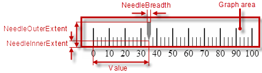

The following table maps the basic configurable aspects related to the needle of the linear gauge to the `igLinearGauge` properties that manage them.

<table cellspacing="0" cellpadding="0" class="table table-bordered">
	<tbody>
		<tr>
			<th colspan="2">
				Configurable aspects
			</th>

			<th>
				Property
			</th>

			<th>
				Default value
			</th>
		</tr>

		<tr>
			<th colspan="2">Value indicated</th>

			<td><a href="%%jQueryApiUrl%%/ui.igLinearGauge#options:value" target="_blank">value</a></td>

			<td>
				Not set
			</td>
		</tr>

		<tr>
			<th colspan="2">Breadth</th>

			<td><a href="%%jQueryApiUrl%%/ui.igLinearGauge#options:needleBreadth" target="_blank">needleBreadth</a></td>

			<td>10.0</td>
		</tr>

		<tr>
			<th rowspan="4">Look-and-feel</th>

			<th>
				Fill color
			</th>

			<td><a href="%%jQueryApiUrl%%/ui.igLinearGauge#options:needleBrush" target="_blank">needleBrush</a></td>

			<td>
				Defined in the default theme
			</td>
		</tr>

		<tr>
			<th>
				Border color
			</th>

			<td><a href="%%jQueryApiUrl%%/ui.igLinearGauge#options:needleOutline" target="_blank">needleOutline</a></td>

			<td>
				Defined in the default theme
			</td>
		</tr>

		<tr>
			<th>
				Border thickness
			</th>

			<td><a href="%%jQueryApiUrl%%/ui.igLinearGauge#options:needleStrokeThickness" target="_blank">needleStrokeThickness</a></td>

			<td>1.0</td>
		</tr>

		<tr>
			<th>
				Shape
			</th>

			<td><a href="%%jQueryApiUrl%%/ui.igLinearGauge#options:needleShape" target="_blank">needleShape</a></td>

			<td>Needle</td>
		</tr>
	</tbody>
</table>

### Related Topics

-   [Configuring the Needle (*igLinearGauge*)](igLinearGauge-Configuring-the-Needle.html)

### Comparative ranges

The following picture illustrates the comparative-ranges-related extents, listed in the table below.

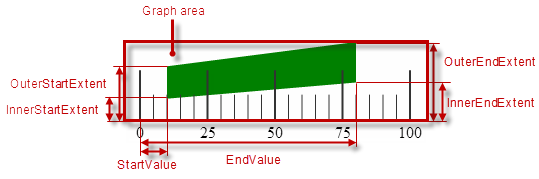

The following table maps the configurable aspects related to the comparative ranges of the linear gauge to the `igLinearGauge` properties that manage them.

<table cellspacing="0" cellpadding="0" class="table table-bordered">
	<tbody>
		<tr>
			<th colspan="2">
				Configurable aspects
			</th>

			<th>
				Property
			</th>

			<th>
				Default value
			</th>
		</tr>

		<tr>
			<th colspan="2">
				Number (of ranges in the gauge)
			</th>

			<td>
				<a href="%%jQueryApiUrl%%/ui.igLinearGauge#options:ranges" target="_blank">ranges</a>
			</td>

			<td>
				Not set
			</td>
		</tr>

		<tr>
			<th rowspan="6" colspan="2">
				Length, width, and position
			</th>

			<td>
				<a href="%%jQueryApiUrl%%/ui.igLinearGauge#options" target="_blank">startValue</a>
			</td>

			<td>
				Not set
			</td>
		</tr>

		<tr>
			<td>
				<a href="%%jQueryApiUrl%%/ui.igLinearGauge#options" target="_blank">endValue</a>
			</td>

			<td>
				Not set
			</td>
		</tr>

		<tr>
			<td>
				<a href="%%jQueryApiUrl%%/ui.igLinearGauge#options" target="_blank">innerStartExtent</a>
			</td>

			<td>
				Not set
			</td>
		</tr>

		<tr>
			<td>
				<a href="%%jQueryApiUrl%%/ui.igLinearGauge#options" target="_blank">innerEndExtent</a>
			</td>

			<td>
				Not set
			</td>
		</tr>

		<tr>
			<td>
				<a href="%%jQueryApiUrl%%/ui.igLinearGauge#options" target="_blank">outerStartExtent</a>
			</td>

			<td>
				Not set
			</td>
		</tr>

		<tr>
			<td>
				<a href="%%jQueryApiUrl%%/ui.igLinearGauge#options" target="_blank">outerEndExtent</a>
			</td>

			<td>
				Not set
			</td>
		</tr>

		<tr>
			<th rowspan="3">Look-and-feel</th>

			<th>
				Fill color
			</th>

			<td>
				<a href="%%jQueryApiUrl%%/ui.igLinearGauge#options:brush" target="_blank">brush</a>
			</td>

			<td>
				Defined in the default theme
			</td>
		</tr>

		<tr>
			<th>
				Border color
			</th>

			<td>
				<a href="%%jQueryApiUrl%%/ui.igLinearGauge#options:outline" target="_blank">outline</a>
			</td>

			<td>
				Defined in the default theme
			</td>
		</tr>

		<tr>
			<th>
				Border thickness
			</th>

			<td>
				<a href="%%jQueryApiUrl%%/ui.igLinearGauge#options:strokeThickness" target="_blank">strokeThickness</a>
			</td>

			<td>
				1.0
			</td>
		</tr>

		<tr>
			<th colspan="2">
				Tooltip
			</th>

			<td>
				<a href="%%jQueryApiUrl%%/ui.igLinearGauge#options:rangeToolTip" target="_blank">rangeToolTip</a>
			</td>

			<td>
				The start and end values of the range separated by a hyphen (-).
			</td>
		</tr>
	</tbody>
</table>

### Related Topics

-   [Configuring Comparative Ranges (*igLinearGauge*)](igLinearGauge-Configuring-Comparative-Ranges.html)

### Background

The following picture illustrates the background-related extents, listed in the table below.

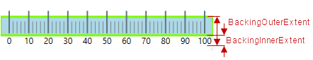

The following table maps the configurable aspects related to the background of the linear gauge to the `igLinearGauge` properties that manage them.

<table class="table table-bordered">
	<thead>
		<tr>
            <th colspan="2">
Configurable aspects
			</th>
            <th>
Property
			</th>
            <th>
Default value
			</th>
        </tr>
	</thead>
	<tbody>
        <tr>
            <th rowspan="2" colspan="2">
Spread and position (across the scale)
			</th>
            <td>
[backingInnerExtent](%%jQueryApiUrl%%/ui.igLinearGauge#options:backingInnerExtent)
			</td>
            <td>0
			</td>
        </tr>
        <tr>
            <td>
[backingOuterExtent](%%jQueryApiUrl%%/ui.igLinearGauge#options:backingOuterExtent)
			</td>
            <td>
1.0
			</td>
        </tr>
        <tr>
            <th rowspan="3">
Look-and-feel
			</th>
            <th>
Color
			</th>
            <td>
[backingBrush](%%jQueryApiUrl%%/ui.igLinearGauge#options:backingBrush)
			</td>
            <td>
Defined in the default theme
			</td>
        </tr>
        <tr>
            <th>
Border color
			</th>
            <td>
[backingOutline](%%jQueryApiUrl%%/ui.igLinearGauge#options:backingOutline)
			</td>
            <td>
Defined in the default theme
			</td>
        </tr>
        <tr>
            <th>
Border thickness
			</th>
            <td>
[backingStrokeThickness](%%jQueryApiUrl%%/ui.igLinearGauge#options:backingStrokeThickness)
			</td>

            <td>
2.0
			</td>
        </tr>
    </tbody>
</table>

### Related Topics

-   [Configuring the Background (igLinearGauge)](igLinearGauge-Configuring-the-Background.html)

### Tooltips

The following table maps the configurable aspects of the `igLinearGauge` control related to tooltips to the properties that manage them.

<table class="table table-bordered">
	<thead>
		<tr>
            <th>
Configurable aspect
			</th>

            <th colspan="2">
Details
			</th>

            <th>
Properties / Events
			</th>

            <th>
Default value
			</th>
        </tr>
	</thead>
	<tbody>
        <tr>
            <th>
Visibility
			</th>
            <td colspan="2">
You can enable/disable tooltips for the igLinearGauge control.
			</td>
            <td>
[showToolTip](%%jQueryApiUrl%%/ui.igLinearGauge#options:showToolTip)
			</td>
            <td>
*False*
			</td>
        </tr>
        <tr>
            <th>
Delay
			</th>
            <td colspan="2">
The timeout before the tooltip appears upon the visual element at mouse hovering is configurable in milliseconds.
			</td>
            <td>
[showToolTipTimeout](%%jQueryApiUrl%%/ui.igLinearGauge#options:showToolTipTimeout)
			</td>
            <td>
*500*
			</td>
        </tr>
        <tr>
            <th rowspan="3">
Value
			</th>
            <td rowspan="3">
You can provide a custom value for the respective tooltip property.
			</td>
            <td>
[Needle](igLinearGauge-Configuring-the-Needle.html)
			</td>
            <td>
[needleToolTip](%%jQueryApiUrl%%/ui.igLinearGauge#options:needleToolTip)
			</td>
            <td>
Depends on whether [needleName](%%jQueryApiUrl%%/ui.igLinearGauge#options:needleName) has been initialized (see [Configuring a Custom Tooltip for the Needle](igLinearGauge-Configuring-the-Tooltips.html#config-custom-tooltip))
			</td>
        </tr>
        <tr>
            <td>
[Comparative Range(s)](igLinearGauge-Configuring-Comparative-Ranges.html)
			</td>
            <td>
[rangeToolTip](%%jQueryApiUrl%%/ui.igLinearGauge#options:rangeToolTip)
			</td>
            <td>
The start and end values of the range separated by a hyphen.
			</td>
        </tr>
    </tbody>
</table>

### Related Topics

-   [Configuring the Tooltips (igLinearGauge)](igLinearGauge-Configuring-the-Tooltips.html)

##Default Configuration

By default, the `igLinearGauge` control is oriented horizontally. It displays with a scale starting at 0 and ending at 100. The major tick marks of the control are located at an interval of 10 and the count of minor tick marks between each pair of major tick marks is 3. There is no title/subtitle displayed, the background color is a variety of light grey. The border is 2 pixels thick colored in dark grey. No needle or ranges are displayed. Animated transitions are disabled.

The following picture demonstrates an `igLinearGauge` displayed with default settings.

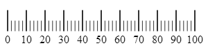

##Requirements

The `igLinearGauge` control is a jQuery UI widget and, therefore, depends on the jQuery and jQuery UI libraries. References to these resources are needed nevertheless, in spite of the use of pure jQuery or ASP.NET MVC helpers. The `Infragistics.Web.Mvc` assembly is required when the control is used in the context of ASP.NET MVC.

In order for the linear gauge to display the needle, the [value](%%jQueryApiUrl%%/ui.igLinearGauge#options:value) property has to be set.

For the full requirements listing, refer to the [Adding igLinearGauge](igLinearGauge-Adding.html) topic.

##Related Content

### Topics

The following topics provide additional information related to this topic.

-	[Adding igLinearGauge](igLinearGauge-Adding.html): This topic explains how to add the `igLinearGauge` control to an %%ProductName%% application.

-	[Configuring igLinearGauge](igLinearGauge-Configuring.html): This is a group of topics explaining how to configure the various aspects of the `igLinearGauge` control including its orientation and direction and visual elements.

-	[jQuery and ASP.NET MVC Helper API Links (igLinearGauge)](igLinearGauge-API-Links.html): This topic provides reference information about the key classes and properties related to the `igLinearGauge` control.

-	[Known Issues and Limitations (igLinearGauge)](igLinearGauge-Known-Issues-and-Limitations.html): This topic provides information about the known issues and limitations of the `igLinearGauge` control.

### Samples

The following samples provide additional information related to this topic.

-	[Basic Configuration](%%SamplesUrl%%/linear-gauge/basic-configuration): This sample demonstrates a simple configuration of the `igLinearGauge` control.

-	[Animated Transitions](%%SamplesUrl%%/linear-gauge/animated-transitions): This sample demonstrates animated transitions between different sets of settings in the `igLinearGauge` control.