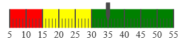
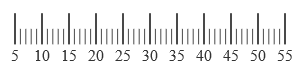
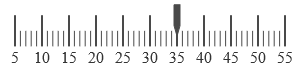

<!--
|metadata|
{
    "fileName": "iglineargauge-adding-to-an-html-page",
    "controlName": "igLinearGauge",
    "tags": ["Getting Started","How Do I"]
}
|metadata|
-->

# Adding igLinearGauge to an HTML Page


##Topic Overview

### Purpose

This topic demonstrates, with code examples, how to add the `igLinearGauge`™ control to an HTML page.

### Required background

The following topics are prerequisites to understanding this topic:

- [igLinearGauge Overview](igLinearGauge-Overview.html): This topic provides conceptual information about the `igLinearGauge`™ control including its main features, minimum requirements, and user functionality.


#### In this topic

This topic contains the following sections:

-   [Adding igLinearGauge to an HTML Page – Conceptual Overview](#overview)
    -   [Adding igLinearGauge summary](#adding-igLeanearGauge)
    -   [Requirements](#requirements)
    -   [Steps](#steps-overview)
-   [Adding igLinearGauge to an HTML Page – Procedure](#adding-to-html-page)
    -   [Introduction](#introduction)
    -   [Preview](#preview)
    -   [Prerequisites](#prerequisites)
    -   [Steps](#steps)
    -   [Full code](#full-code)
-   [Related Content](#related-content)
    -   [Topics](#topics)
    -   [Samples](#samples)


##<a id="overview"></a>Adding igLinearGauge to an HTML Page – Conceptual Overview


### <a id="adding-igLeanearGauge"></a>Adding igLinearGauge summary

To add `igLinearGauge` control to a web page requires an HTML element, a `<div>` to serve as the base for instantiation. The basic configuration of `igLinearGauge` requires providing values for its dimensions - width and height.

### <a id="requirements"></a>Requirements

The following table summarizes the requirements for using the `igLinearGauge` control.

<table cellspacing="0" cellpadding="0" class="table table-bordered">
    <tbody>
        <tr>
            <th>
                Required Resources
            </th>

            <th>
                Description
            </th>

            <th>
                What you need to do…
            </th>
        </tr>

        <tr>
            <td>
                jQuery and jQuery UI JavaScript resources
            </td>

            <td>
                %%ProductName%%™ is built on top of the following frameworks:

                <ul>
                    <li>
                    [jQuery](http://jquery.com/)
                    </li>

                    <li>
                    [jQuery UI](http://jqueryui.com/)
                    </li>
                </ul>
            </td>

            <td>
                Add script references to both libraries in the `<head>` section of your page.
            </td>
        </tr>

        <tr>
            <td>
                General igLinearGauge JavaScript Resources
            </td>

            <td>
                The igLinearGauge control depends on functionality distributed across several files in the %%ProductName%% Library. You can load the required resources in one of the following ways:

                <ul>
                    <li>Use the Infragistics® Loader (igLoader™). You only need to include a script reference to igLoader on your page.</li>

                    <li>Load the required resources manually. You need to use the dependencies listed in the table below.</li>

                    <li>Load the two combined files, containing the logic for all data visualization controls from the %%ProductName%% package - infragistics.core.js, infragistics.dv.js and infragistics.encoding.js (optional).</li>
                </ul>

                The following table lists the %%ProductName%% library dependences related to the igLinearGauge control. These resources need to be referred to explicitly if you chose not to use igLoader or the combined files.

                <table class="table">
                    <tbody>
                        <tr>
                            <th>
                                JS Resource
                            </th>
                            <th>
                                Description
                            </th>
                        </tr>

                        <tr>
                            <td>
                                `infragistics.util.js`<br/>
								`infragistics.util.jquery.js`
                            </td>
                            <td>
                                %%ProductName%% utilities
                            </td>
                        </tr>

                        <tr>
							<td>
								`infragistics.ui.widget.js`
                            </td>
							<td>
								Base igWidget for all Ignite UI widgets.
							</td>
						</tr>

                        <tr>
                            <td>
                                `infragistics.ext_core.js`
                                `infragistics.ext_collections.js`
                                `infragistics.ext_ui.js`
                                `infragistics.dv_jquerydom.js`
                                `infragistics.dv_core.js`
                                `infragistics.dv_geometry.js`
                            </td>
                            <td>
                                Data visualization core functionality
                            </td>
                        </tr>

                        <tr>
							<td>
								`infragistics.dv_interactivity.js`
                            </td>
							<td>
								Provides support for user interaction such as panning, zooming, dragging, etc.
							</td>
						</tr>

                        <tr>
                            <td>
                                `infragistics.lineargauge.js`
                            </td>
                            <td>
                                The igLinearGauge control
                            </td>
                        </tr>

                        <tr>
                            <td>
                                `infragistics.ui.lineargauge.js`
                            </td>
                            <td>
                                The igLinearGauge widget
                            </td>
                        </tr>
                    </tbody>
                </table><br>
            </td>

            <td>
                Add one of the following:

                <ul>
                    <li>A reference to igLoader</li>

                    <li>A reference to all the required JavaScript files (listed in the table on the left).</li>

                    <li>A reference to the combined files and optionally to the file containing the encodings.</li>
                </ul>
            </td>
        </tr>
    </tbody>
</table>


### <a id="steps-overview"></a>Steps

Following are the general conceptual steps for adding `igLinearGauge` to an HTML Page:

1. Creating the target element for storing the `igLinearGauge` control

2. Instantiating the `igLinearGauge` control

3. Configuring the basic rendering options

4. Configuring the scale

5. Adding needle

6. Adding comparative ranges


##<a id="adding-to-html-page"></a>Adding igLinearGauge to an HTML Page – Procedure


### <a id="introduction"></a>Introduction

This procedure adds an instance of `igLinearGauge` to an HTML page and configures its dimensions, its scale and adds a needle and three comparative ranges to it.

The procedure presumes the required resources are added to the header of the HTML page, so it instantiates the `igLinearGauge` control in the document ready event to prevent any errors due to DOM being not fully loaded.

### <a id="preview"></a>Preview

The following screenshot is a preview of the result.



### <a id="prerequisites"></a>Prerequisites

To complete the procedure, you need the required JavaScript and CSS files referenced on the HTML page.

**In HTML:**

```html
<!DOCTYPE html>
<html>
<head>
    <!-- %%ProductName%% Required Combined CSS Files -->
    <link href="../../igniteui/css/themes/infragistics/infragistics.theme.css" rel="stylesheet" />
    <link href="../../igniteui/css/structure/infragistics.css" rel="stylesheet"/>
    <script type="text/javascript" src="../../js/jquery.min.js"></script>
    <script type="text/javascript" src="../../js/jquery-ui.js"></script>
    <!-- Linear Gauge Required JavaScript Files -->
    <script type="text/javascript" src="../../igniteui/js/modules/infragistics.util.js"></script>
    <script type="text/javascript" src="../../igniteui/js/modules/infragistics.util.jquery.js"></script>
    <script type="text/javascript" src="../../igniteui/js/modules/infragistics.ui.widget.js"></script>
    <script type="text/javascript" src="../../igniteui/js/modules/infragistics.ext_core.js"></script>
    <script type="text/javascript" src="../../igniteui/js/modules/infragistics.ext_collections.js"></script>
    <script type="text/javascript" src="../../igniteui/js/modules/infragistics.ext_ui.js"></script>
    <script type="text/javascript" src="../../igniteui/js/modules/infragistics.dv_jquerydom.js" ></script>
    <script type="text/javascript" src="../../igniteui/js/modules/infragistics.dv_core.js"></script>
    <script type="text/javascript" src="../../igniteui/js/modules/infragistics.dv_geometry.js"></script>
    <script type="text/javascript" src="../../igniteui/js/modules/infragistics.dv_interactivity.js"></script>
    <script type="text/javascript" src="../../igniteui/js/modules/infragistics.lineargauge.js"></script>
    <script type="text/javascript" src="../../igniteui/js/modules/infragistics.ui.lineargauge.js"></script>
</head>
<body>
</body>
</html>
```

### <a id="steps"></a>Steps

Follow these steps to add an `igLinearGauge` to an HTML page.


1. Create the target element for storing the `igLinearGauge` control.

    Create a `<div>` element within the HTML body on which to instantiate the `igLinearGauge` control.

    **In HTML:**

    ```html
    <body>
        <!-- Target element for the igLinearGauge -->
          <div id="linearGauge"></div>
    </body>
    ```

2. Instantiate the `igLinearGauge` control.

    Use the selector of the target element defined in step 1 to instantiate the `igLinearGauge` control.

    **In HTML:**

    ```html
    <script type="text/javascript">
        $(function () {                        
            $("#linearGauge").igLinearGauge({
            });
        });
    </script>
    ```

3. Configure the basic rendering options.

    When instantiating the `igLinearGauge`, configure the width and height options.

    **In HTML:**

    ```html
    $("#linearGauge").igLinearGauge({
        width: "300px",
        height: "70px"
    });
    ```

4. Configure the scale.

    In order to customize the values of the scale, you need to set its [minimumValue](%%jQueryApiUrl%%/ui.igLinearGauge#options:minimumValue) and [maximumValue](%%jQueryApiUrl%%/ui.igLinearGauge#options:maximumValue) properties. In this example, the scale will start at 5 and end at 55.

    **In HTML:**

    ```html
    $("#linearGauge").igLinearGauge({
        width: "300px",
        height: "70px",
        minimumValue: "5",
        maximumValue: "55"
    });
    ```

    The changed scale is shown on the following screenshot:

    

5. Add a needle.

    The primary measure of the `igLinearGauge` is visualized by its needle. Its value is managed by the [value](%%jQueryApiUrl%%/ui.igLinearGauge#options:value) property setting. For this example, set the value property to 35.

    **In HTML:**

    ```html
    $("#linearGauge").igLinearGauge({
            …
        value:"35"
    });
    ```

    The following screenshot displays what the `igLinearGauge` control would look so far in the procedure.

    

6. Add comparative ranges.

    In order to compare the value displayed by the performance bar against some meaningful range(s) of values, these comparative ranges need to be displayed on the scale. Comparative ranges are managed by [ranges](%%jQueryApiUrl%%/ui.igLinearGauge#options:ranges) property within which several individual ranges can be defined, each of which having its own starting and ending values ([startValue](%%jQueryApiUrl%%/ui.igLinearGauge#options:startValue) and [endValue](%%jQueryApiUrl%%/ui.igLinearGauge#options)) and color ([brush](%%jQueryApiUrl%%/ui.igLinearGauge#options:brush)). For this example, configure 3 comparative ranges, each of a different shade of gray, starting at the 0, 15, and 30 tick marks of the scale, respectively.

    **In HTML:**

    ```html
    $("#linearGauge").igLinearGauge({
        …
        ranges: [{
            name: 'range1',
            startValue: 0,
            endValue: 15,
            brush: 'red'
        },
        {
            name: 'range2',
            startValue: 15,
            endValue: 30,
            brush: 'yellow'
        },
        {
            name: 'range3',
            startValue: 30,
            endValue: 55,
            brush: 'green'
        }
        ]
    });
    ```

     The final look of the graph is presented below.

    


### <a id="full-code"></a>Full code

Following is the full code for this procedure.

**In HTML:**

```html
<!DOCTYPE html>
<html>
<head>
    <!-- %%ProductName%% Required Combined CSS Files -->
    <link href="../../igniteui/css/themes/infragistics/infragistics.theme.css" rel="stylesheet" />
    <link href="../../igniteui/css/structure/infragistics.css" rel="stylesheet"/>
    <script type="text/javascript" src="../../js/jquery.min.js"></script>
    <script type="text/javascript" src="../../js/jquery-ui.js"></script>
    <!-- Linear Gauge Required JavaScript Files -->
    <script type="text/javascript" src="../../igniteui/js/modules/infragistics.util.js"></script>
    <script type="text/javascript" src="../../igniteui/js/modules/infragistics.util.jquery.js"></script>
    <script src="../../igniteui/js/modules/infragistics.ui.widget.js" type="text/javascript"></script>
    <script type="text/javascript" src="../../igniteui/js/modules/infragistics.ext_core.js"></script>
    <script type="text/javascript" src="../../igniteui/js/modules/infragistics.ext_collections.js"></script>
    <script type="text/javascript" src="../../igniteui/js/modules/infragistics.ext_ui.js"></script>
    <script type="text/javascript" src="../../igniteui/js/modules/infragistics.dv_jquerydom.js" ></script>
    <script type="text/javascript" src="../../igniteui/js/modules/infragistics.dv_core.js"></script>
    <script type="text/javascript" src="../../igniteui/js/modules/infragistics.dv_geometry.js"></script>
    <script type="text/javascript" src="../../igniteui/js/modules/infragistics.lineargauge.js"></script>
    <script type="text/javascript" src="../../igniteui/js/modules/infragistics.ui.lineargauge.js"></script>
    <script type="text/javascript">
        $(function () {             
            $("#linearGauge").igLinearGauge({
                width: "300px",
                height: "70px",
                minimumValue: "5",
                maximumValue: "55",
                value:"35",
                ranges: [{
                    name: 'range1',
                    startValue: 0,
                    endValue: 15,
                    brush: 'red
                },
                {
                    name: 'range2',
                    startValue: 15,
                    endValue: 30,
                    brush: 'yellow'
                },
                {
                    name: 'range3',
                    startValue: 30,
                    endValue: 55,
                    brush: 'green'
                }
                ]
            });
        });
    </script>
</head>
<body>
    <!-- Target element for the igLinearGauge -->
      <div id="linearGauge"></div>
</body>
</html>
```


##<a id="related-content"></a>Related Content


### <a id="topics"></a>Topics

The following topics provide additional information related to this topic.

-   [Adding igLinearGauge to an ASP.NET MVC Application](igLinearGauge-Adding-Using-the-MVC-Helper.html): This topic demonstrates, with code examples, how to add the `igLinearGauge` control to an ASP.NET MVC View using the ASP.NET MVC helper.

-   [jQuery and ASP.NET MVC Helper API Links (igLinearGauge)](igLinearGauge-API-Links.html): This topic provides links to the API reference documentation about the `igLinearGauge` control and the ASP.NET MVC Helper for it.


#### <a id="samples"></a>Samples

The following sample provides additional information related to this topic.

-   [Basic Configuration](%%SamplesUrl%%/linear-gauge/basic-configuration): This sample demonstrates a simple configuration of the `igLinearGauge` control.