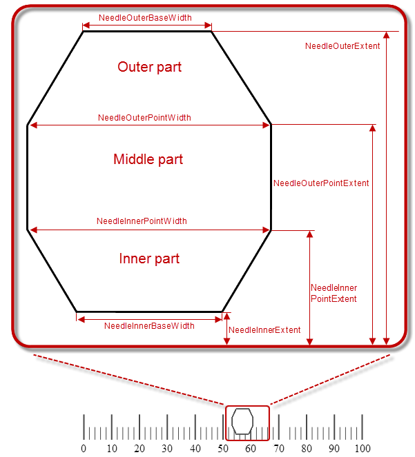
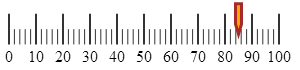
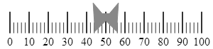

<!--
|metadata|
{
    "fileName": "iglineargauge-configuring-the-needle",
    "controlName": "igLinearGauge",
    "tags": ["Charting","How Do I"]
}
|metadata|
-->

# Configuring the Needle (igLinearGauge)

##Topic Overview

### Purpose

This topic explains, with code examples, how to configure the needle of the `igLinearGauge`™ control. This includes the value indicated by the needle, its width, position, and formatting.

### Required background

The following topics are prerequisites to understanding this topic:

-	[igLinearGauge Overview](igLinearGauge-Overview.html): This topic provides conceptual information about the `igLinearGauge` control including its main features, minimum requirements, and user functionality.

-	[Adding igLinearGauge](igLinearGauge-Adding.html): This is a group of topics explaining how to add the `igLinearGauge` control to an HTML page and an ASP.NET MVC application.


### In this topic

This topic contains the following sections:

-   [Configuring the Needle – Conceptual Overview](#overview)
    -   [Needle configuration summary](#needle-config-summary)
    -   [Needle configuration summary chart](#needle-config-chart)
    -   [Property settings](#property-setting)
-   [Configuring the Needle Shape](#config-needle-shape)
    -   [Needle shape configuration summary](#needle-config-summary)
    -   [Property subsets per part](#subsets-per-part)
    -   [Property subsets per needle shape type](#needle-shape-type)
    -   [Property reference](#property-reference)
-   [Code Examples Summary](#code-example-summary)
-   [Code Example: Configuring a Basic Needle](#basic-needle)
    -   [Description](#basic-needle-description)
    -   [Code](#basic-needle-code)
-   [Code Example: Configuring a Custom Needle](#custom-needle)
    -   [Description](#custom-needle-description)
    -   [Code](#custom-needle-code)
-   [Related Content](#related-content)
    -   [Topics](#topics)
    -   [Samples](#samples)


##<a id="overview"></a>Configuring the Needle – Conceptual Overview

### <a id="needle-config-summary"></a>Needle configuration summary

Configuring the needle includes specifying the needle’s shape and size and its position across and along the scale. Further customizations can include configuring the look-and-feel of the needle (in terms of border thickness and color and fill color) and providing a tooltip.

The shape of the needle is specified by setting the [needleShape](%%jQueryApiUrl%%/ui.igLinearGauge#options:needleShape) property to one of the pre-defined needle shape types or to the custom needle type. The pre-defined needle shapes are

-   Needle
-   Rectangle
-   Trapezoid
-   Triangle

The default needle shape is Needle which defines a rectangular needle body with a triangular point, like this:


The custom needle shape type is specified by setting the `needleShape` property to “Custom”.

The pre-defined shapes are customizable. If you use any of the pre-defined needle shapes without customizing the shape, you are configuring a basic needle. Selecting either a custom shape or further customizing a pre-defined shape through its [extent-type or width-based properties](#config-needle-shape) is considered [configuring a custom needle](#custom-needle).

Along the scale, the needle is always positioned at the value specified by the [value](%%jQueryApiUrl%%/ui.igLinearGauge#options:value) property.

The needle’s position in the across-the-scale dimension is configurable relative to the edges of the Graph area through the [needleInnerExtent](%%jQueryApiUrl%%/ui.igLinearGauge#options:needleInnerExtent) and [needleOuterExtent](%%jQueryApiUrl%%/ui.igLinearGauge#options:needleOuterExtent) properties. The needle shape is configured through the [needleShape](%%jQueryApiUrl%%/ui.igLinearGauge#options:needleShape) property. There are multiple predefined shapes that can be used for the needle. Custom shapes are also supported.


The look-and-feel of the needle can be customized in terms of fill color, border color, and border thickness using the respective properties ([needleBrush](%%jQueryApiUrl%%/ui.igLinearGauge#options:needleBrush), [needleOutline](%%jQueryApiUrl%%/ui.igLinearGauge#options:needleOutline), and [needleStrokeThickness](%%jQueryApiUrl%%/ui.igLinearGauge#options:needleStrokeThickness)).

### <a id="needle-config-chart"></a>Needle configuration summary chart

The following table explains briefly the configurable aspects of `igLinearGauge` control’s needle and maps them to properties that manage them.

<table cellspacing="0" cellpadding="0" class="table">
	<tbody>
		<tr>
			<th colspan="2">Configurable aspects</th>

			<th>
				Details
			</th>

			<th>
				Property
			</th>

			<th>
				Default value
			</th>
		</tr>

		<tr>
			<td colspan="2">Shape type</td>

			<td>
				A value indicating the needle shape
			</td>

			<td><a href="%%jQueryApiUrl%%/ui.igLinearGauge#options:needleShape">needleShape</a></td>

			<td>
				Needle
			</td>
		</tr>

		<tr>
			<td colspan="2">Name</td>

			<td>
				A name for the needle (for displaying in the [tooltip](igLinearGauge-Configuring-the-Tooltips.html#config-custom-tooltip))
			</td>

			<td><a href="%%jQueryApiUrl%%/ui.igLinearGauge#options:needleName">needleName</a></td>

			<td>
				Not set
			</td>
		</tr>

		<tr>
			<td colspan="2">Value to indicate</td>

			<td>
				The value indicated by the needle
			</td>

			<td>
				<a href="%%jQueryApiUrl%%/ui.igLinearGauge#options:value">value</a>
			</td>

			<td>
				Not set
			</td>
		</tr>

		<tr>
			<td rowspan="2" colspan="2">Size and position across the scale</td>

			<td>
				The position of the inner edge of the needle
			</td>

			<td><a href="%%jQueryApiUrl%%/ui.igLinearGauge#options:needleInnerExtent">needleInnerExtent</a></td>

			<td>
				Defined in the default theme
			</td>
		</tr>

		<tr>
			<td>
				The position of the outer edge of the needle
			</td>

			<td><a href="%%jQueryApiUrl%%/ui.igLinearGauge#options:needleOuterExtent">needleOuterExtent</a></td>

			<td>
				Defined in the default theme
			</td>
		</tr>

		<tr>
			<td rowspan="3">Look-and-feel</td>

			<td>
				Fill color of the bar
			</td>

			<td></td>

			<td><a href="%%jQueryApiUrl%%/ui.igLinearGauge#options:needleBrush">needleBrush</a></td>

			<td>
				Defined in the default theme
			</td>
		</tr>

		<tr>
			<td>
				Thickness of the needle’s border
			</td>

			<td>
				Set in pixels
			</td>

			<td><a href="%%jQueryApiUrl%%/ui.igLinearGauge#options:needleStrokeThickness">needleStrokeThickness</a></td>

			<td>
				1.0
			</td>
		</tr>

		<tr>
			<td>
				Color of the needle’s border
			</td>

			<td></td>

			<td><a href="%%jQueryApiUrl%%/ui.igLinearGauge#options:needleOutline">needleOutline</a></td>

			<td>
				Defined in the default theme
			</td>
		</tr>

		<tr>
			<td colspan="2">
				Tooltip
			</td>

			<td>
				Content of the needle’s tooltip
			</td>

			<td><a href="%%jQueryApiUrl%%/ui.igLinearGauge#options:needleToolTip">needleToolTip</a></td>

			<td>Depends on whether <a href="%%jQueryApiUrl%%/ui.igLinearGauge#options:needleName">needleName</a> has been initialized</td>
		</tr>
	</tbody>
</table>


>**Note:**For details in configuring the `tooltip`, see [Configuring a Custom Tooltip for the Needle](igLinearGauge-Configuring-the-Tooltips.html#config-custom-tooltip) in the [Configuring the Tooltips (igLinearGauge)](igLinearGauge-Configuring-the-Tooltips.html) topic.)

### <a id="property-setting"></a>Property settings

The following table maps the desired behavior to its respective property settings.

<table cellspacing="0" cellpadding="0" class="table">
	<tbody>
		<tr>
			<th colspan="2">
				In order to configure:
			</th>

			<th>
				Use this property:
			</th>

			<th>
				And set it to:
			</th>
		</tr>

		<tr>
			<td colspan="2">Shape type</td>

			<td><a href="%%jQueryApiUrl%%/ui.igLinearGauge#options:needleShape">needleShape</a></td>

			<td>
				One of the predefined shapes or “Custom”
			</td>
		</tr>

		<tr>
			<td colspan="2">
				Name
			</td>

			<td><a href="%%jQueryApiUrl%%/ui.igLinearGauge#options">NeedleName</a></td>

			<td>
				A string expressing the name of the needle
			</td>
		</tr>

		<tr>
			<td colspan="2">
				<a name="_Hlk363234548"></a>Value to indicate
			</td>

			<td>
				<a href="%%jQueryApiUrl%%/ui.igLinearGauge#options:value">value</a>
			</td>

			<td>
				The desired value in the measures of the scale
			</td>
		</tr>

		<tr>
			<td rowspan="2" colspan="2">
				Size and position across the scale
			</td>

			<td>
				<a href="%%jQueryApiUrl%%/ui.igLinearGauge#options:needleInnerExtent">needleInnerExtent</a>
			</td>

			<td>
				Across-the-scale position of the inner edge of the needle defined as a relative part of the height/width of the [Graph area](igLinearGauge-Overview.html#graph-area) (depending on the orientation) presented as a fraction of 1 (e.g. 0.2).
			</td>
		</tr>

		<tr>
			<td>
				<a href="%%jQueryApiUrl%%/ui.igLinearGauge#options:needleOuterExtent">needleOuterExtent</a>
			</td>

			<td>
				Across-the-scale position of the outer edge of the needle defined as a relative part of the height/width of the [Graph area](igLinearGauge-Overview.html#graph-area)(depending on the orientation) presented as a fraction of 1 (e.g. 0.2).
			</td>
		</tr>

		<tr>
			<td rowspan="3">
				Look-and-feel
			</td>

			<td>
				Fill color
			</td>

			<td><a href="%%jQueryApiUrl%%/ui.igLinearGauge#options:needleBrush">needleBrush</a></td>

			<td>
				The desired color
			</td>
		</tr>

		<tr>
			<td>
				Border thickness
			</td>

			<td><a href="%%jQueryApiUrl%%/ui.igLinearGauge#options:needleStrokeThickness">needleStrokeThickness</a></td>

			<td>
				The desired value in pixels
			</td>
		</tr>

		<tr>
			<td>
				Border color
			</td>

			<td><a href="%%jQueryApiUrl%%/ui.igLinearGauge#options:needleOutline">needleOutline</a></td>

			<td>
				The desired color
			</td>
		</tr>

		<tr>
			<td>Tooltip</td>

			<td></td>

			<td><a href="%%jQueryApiUrl%%/ui.igLinearGauge#options:needleToolTip">needleToolTip</a></td>

			<td>
				The desired template. (See <a href="igLinearGauge-Configuring-the-Tooltips.html" data-auto-update-caption="true">Configuring the Tooltips (igLinearGauge)</a>.)
			</td>
		</tr>
	</tbody>
</table>


##<a id="config-needle-shape"></a>Configuring the Needle Shape

### <a id="needle-config-summary"></a>Needle shape configuration summary

Configuring the needle shape can be done for either the existing pre-defined shapes or to a custom shape. In the latter case, you can create an entirely new needle shape.

The needle shape is configured by setting the properties controlling the various widths and extents. These properties define the three basic parts which form the desired needle shape. The basic parts are (from top to bottom at vertical orientation):

-   Outer part – the part of the needle that is farthest from the scale
-   Middle part – the part between the Outer segment and the Inner segment. It shares its [width-related properties](#config-needle-shape) with the other two segments.
-   Inner part – the part of the needle that is closest the scale

The following picture illustrates the properties related to the needle shape when horizontal orientation is used. For explanations of the properties, refer to [Property reference](#property-reference).



### Property categories

The properties configuring the needle fall into two general types based on whether they configure the breadth of the needle or its extent from the scale:

-   Extent-type properties ([needleInnerExtent](%%jQueryApiUrl%%/ui.igLinearGauge#options:needleInnerExtent), [needleInnerPointExtent](%%jQueryApiUrl%%/ui.igLinearGauge#options:needleInnerPointExtent), [needleOuterPointExtent](%%jQueryApiUrl%%/ui.igLinearGauge#options:needleOuterPointExtent), [needleOuterExtent](%%jQueryApiUrl%%/ui.igLinearGauge#options:needleOuterExtent))

Configure the needle shape and position in the across-the-scale dimension, relative to the inner edge of the [Graph area](igLinearGauge-Overview.html#graph-area). Their values represent the relative part of the breadth of the Graph area in the across-the-scale dimension presented as a decimal fraction of 1 (e.g. *0.2*), with 0 denoting the inner edge of the graph area and 1 – its outer edge.

-   Width-related properties ([needleInnerBaseWidth](%%jQueryApiUrl%%/ui.igLinearGauge#options:needleInnerBaseWidth), [needleOuterBaseWidth](%%jQueryApiUrl%%/ui.igLinearGauge#options:needleOuterBaseWidth), [needleInnerPointWidth](%%jQueryApiUrl%%/ui.igLinearGauge#options:needleInnerPointWidth), [needleOuterPointWidth](%%jQueryApiUrl%%/ui.igLinearGauge#options:needleOuterPointWidth)) Denote settings defined as a relative part of a base value set with the [needleBreadth](%%jQueryApiUrl%%/ui.igLinearGauge#options:needleBreadth) property. That relative part is presented as a decimal fraction of 1, for example, if the [needleBreadth](%%jQueryApiUrl%%/ui.igLinearGauge#options:needleBreadth) is set to 20 and the needleOuterBaseWidth is 0.5, the actual size of the outer base segment will be 10 pixels (20 x 0.5 = 10).

###Property subsets 

The full set of the properties applies when you are configuring a custom shape(the [needleShape](%%jQueryApiUrl%%/ui.igLinearGauge#options:needleShape) property is “Custom”). To pre-defined shape types, only a subset of these widths and extents apply because drawing these shapes do not require all three basic shapes.

### <a id="subsets-per-part"></a>Property subsets per part

Following are the properties you need to use to use to configure the basic parts of a custom needle:

-   Outer part properties:
    -   [needleOuterExtent](%%jQueryApiUrl%%/ui.igLinearGauge#options:needleOuterExtent)
    -   [needleOuterPointExtent](%%jQueryApiUrl%%/ui.igLinearGauge#options:needleOuterPointExtent) – common for the Outer and Middle basic parts
    -   [needleOuterBaseWidth](%%jQueryApiUrl%%/ui.igLinearGauge#options:needleOuterBaseWidth)
    -   [needleOuterPointWidth](%%jQueryApiUrl%%/ui.igLinearGauge#options:needleOuterPointWidth) – common for the Outer and Middle basic parts
-   Middle part properties:
    -   [needleOuterPointExtent](%%jQueryApiUrl%%/ui.igLinearGauge#options:needleOuterPointExtent) – common for the Outer and Middle basic parts
    -   [needleInnerPointExtent](%%jQueryApiUrl%%/ui.igLinearGauge#options:needleInnerPointExtent) – common for the Inner and Middle basic parts
    -   [needleOuterPointWidth](%%jQueryApiUrl%%/ui.igLinearGauge#options:needleOuterPointWidth) – common for the Outer and Middle basic parts
    -   [needleInnerPointWidth](%%jQueryApiUrl%%/ui.igLinearGauge#options:needleInnerPointWidth) – common for the Inner and Middle basic parts
-   Inner part properties:
    -   [needleInnerPointExtent](%%jQueryApiUrl%%/ui.igLinearGauge#options:needleInnerPointExtent) – common for the Inner and Middle basic parts
    -   [needleInnerExtent](%%jQueryApiUrl%%/ui.igLinearGauge#options:needleInnerExtent)
    -   [needleInnerPointWidth](%%jQueryApiUrl%%/ui.igLinearGauge#options:needleInnerPointWidth) – common for the Inner and Middle basic parts
    -   [needleInnerBaseWidth](%%jQueryApiUrl%%/ui.igLinearGauge#options:needleInnerBaseWidth)

### <a id="needle-shape-type"></a>Property subsets per needle shape type

The following table shows which shape configuration properties you need to set when customizing a particular needle shape type. For details on the meaning of the properties and their settings, see [Property reference](#property-reference).

<table cellspacing="0" cellpadding="0" class="table">
	<tbody>
		<tr>
			<th>
				Needle shape type
			</th>

			<th>
				Properties
			</th>
		</tr>

		<tr>
			<td>Custom</td>

			<td>
				<ul>
					<li><a href="%%jQueryApiUrl%%/ui.igLinearGauge#options:needleBreadth">needleBreadth</a></li>

					<li><a href="%%jQueryApiUrl%%/ui.igLinearGauge#options:needleInnerBaseWidth">needleInnerBaseWidth</a></li>

					<li><a href="%%jQueryApiUrl%%/ui.igLinearGauge#options:needleInnerExtent">needleInnerExtent</a></li>

					<li><a href="%%jQueryApiUrl%%/ui.igLinearGauge#options:needleInnerPointExtent">needleInnerPointExtent</a></li>

					<li><a href="%%jQueryApiUrl%%/ui.igLinearGauge#options:needleInnerPointWidth">needleInnerPointWidth</a></li>

					<li><a href="%%jQueryApiUrl%%/ui.igLinearGauge#options:needleOuterBaseWidth">needleOuterBaseWidth</a></li>

					<li><a href="%%jQueryApiUrl%%/ui.igLinearGauge#options:needleOuterExtent">needleOuterExtent</a></li>

					<li><a href="%%jQueryApiUrl%%/ui.igLinearGauge#options:needleOuterPointExtent">needleOuterPointExtent</a></li>

					<li><a href="%%jQueryApiUrl%%/ui.igLinearGauge#options:needleOuterPointWidth">needleOuterPointWidth</a></li>
				</ul>
			</td>
		</tr>

		<tr>
			<td>Needle</td>

			<td>
				<ul>
					<li>needleBreadth</li>

					<li>needleInnerExtent</li>

					<li>needleInnerPointExtent</li>

					<li>needleInnerPointWidth</li>

					<li>needleOuterBaseWidth</li>

					<li>needleOuterExtent</li>

					<li>needleOuterPointWidth</li>
				</ul>
			</td>
		</tr>

		<tr>
			<td>Rectangle</td>

			<td>
				<ul>
					<li>needleBreadth</li>

					<li>needleInnerBaseWidth</li>

					<li>needleInnerExtent</li>

					<li>needleOuterBaseWidth</li>

					<li>needleOuterExtent</li>
				</ul>
			</td>
		</tr>

		<tr>
			<td>Trapezoid</td>

			<td>
				<ul>
					<li>needleBreadth</li>

					<li>needleInnerBaseWidth</li>

					<li>needleInnerExtent</li>

					<li>needleOuterBaseWidth</li>

					<li>needleOuterExtent</li>
				</ul>
			</td>
		</tr>

		<tr>
			<td>Triangle</td>

			<td>
				<ul>
					<li>needleBreadth</li>

					<li>needleInnerExtent</li>

					<li>needleOuterBaseWidth</li>

					<li>needleOuterExtent</li>
				</ul>
			</td>
		</tr>
	</tbody>
</table>


### <a id="property-reference"></a>Property reference

The following table explains briefly the properties that configure the needle shape and maps them to the shape types and parts to which they apply. The properties are listed alphabetically. (For a visual representation of the meaning of the properties, refer to the illustration in [Needle shape configuration summary](#needle-config-summary).)

<table cellspacing="0" cellpadding="0" class="table">
	<tbody>
		<tr>
			<th>
				Property
			</th>

			<th>
				Part
			</th>

			<th>
				Details
			</th>

			<th>
				Applies when NeedleShape is
			</th>
		</tr>

		<tr>
			<td>
				<a href="%%jQueryApiUrl%%/ui.igLinearGauge#options:needleBreadth">needleBreadth</a>

				
			</td>

			<td>
				All
			</td>

			<td>
				Base width (in pixels) used for defining the width-related properties. The allowed settings are all numeric values greater than 0. Note that values that are too big would make the needle disproportionally large.
			</td>

			<td>
				<ul>
					<li>“custom”</li>

					<li>“needle”</li>

					<li>“rectangle”</li>

					<li>“trapezoid”</li>

					<li>“triangle”</li>
				</ul>
			</td>
		</tr>

		<tr>
			<td><a href="%%jQueryApiUrl%%/ui.igLinearGauge#options:needleInnerBaseWidth">needleInnerBaseWidth</a></td>

			<td>
				Inner
			</td>

			<td>
				Width Breadth of the Inner base segment of the needle inner edge.
			</td>

			<td>
				<ul>
					<li>“custom’</li>

					<li>“rectangle”</li>

					<li>“trapezoid”</li>
				</ul>
			</td>
		</tr>

		<tr>
			<td><a href="%%jQueryApiUrl%%/ui.igLinearGauge#options:needleInnerExtent">needleInnerExtent</a></td>

			<td>
				Inner
			</td>

			<td>
				Across-the-scale position of the inner edge of the inner base segment defined as a relative part of the height/width of the [Graph area](igLinearGauge-Overview.html#graph-area) (depending on the orientation) presented as a fraction of 1 (e.g. 0.2).

				Together with the needleInnerPointExtent property specifies the extent and position across the scale of the Inner part.
			</td>

			<td>
				<ul>
					<li>“custom”</li>

					<li>“needle”</li>

					<li>“rectangle”</li>

					<li>“trapezoid”</li>

					<li>“triangle”</li>
				</ul>
			</td>
		</tr>

		<tr>
			<td><a href="%%jQueryApiUrl%%/ui.igLinearGauge#options:needleInnerPointExtent">needleInnerPointExtent</a></td>

			<td>
				Inner / Middle
			</td>

			<td>
				Across-the-scale position of:

				<ul>
					<li>Inner part’s outer edge</li>

					<li>Middle part’s inner edge</li>
				</ul>

				The position is defined as a relative part of the breadth of the Graph area presented as a fraction of 1 (e.g. 0.2).

				Together with the needleInnerExtent property specifies the extent and position across the scale of the Inner part.

				Together with the needleOuterPointExtent property specifies the extent and position across the scale of the Middle part. Across-the-scale position of the inner point of the needle (the point …), defined as a relative part of the height/width of the Graph area (depending on the orientation) presented as a fraction of 1 (e.g. 0.2).
			</td>

			<td>
				<ul>
					<li>“custom”</li>

					<li>“needle”</li>
				</ul>
			</td>
		</tr>

		<tr>
			<td><a href="%%jQueryApiUrl%%/ui.igLinearGauge#options:needleInnerPointWidth">needleInnerPointWidth</a></td>

			<td>
				Inner /

				Middle
			</td>

			<td>
				Breadth Width of:

				<ul>
					<li>Inner part’s outer edge of the needle)</li>

					<li>Middle part’s inner edge.</li>
				</ul>
			</td>

			<td>
				<ul>
					<li>“custom”</li>

					<li>“needle”</li>
				</ul>
			</td>
		</tr>

		<tr>
			<td><a href="%%jQueryApiUrl%%/ui.igLinearGauge#options:needleOuterBaseWidth">needleOuterBaseWidth</a></td>

			<td>
				Outer
			</td>

			<td>
				Breadth of the Outer part’s outer edge.
			</td>

			<td>
				<ul>
					<li>“custom”</li>

					<li>“needle”</li>

					<li>“rectangle”</li>

					<li>“trapezoid”</li>

					<li>“triangle”</li>
				</ul>
			</td>
		</tr>

		<tr>
			<td><a href="%%jQueryApiUrl%%/ui.igLinearGauge#options:needleOuterExtent">needleOuterExtent</a></td>

			<td>
				Inner
			</td>

			<td>
				Across-the-scale position of the outer base segment defined as a relative part of the height/width of the Graph area (depending on the orientation) presented as a fraction of 1 (e.g. 0.2)

				Across-the-scale position of the outer edge of the Outer part defined as a relative part of the breadth of the Graph area presented as a fraction of 1 (e.g. 0.2).Together with the needleOuterPointExtent property specifies the extent and position across the scale of the Inner part.
			</td>

			<td>
				<ul>
					<li>“custom”</li>

					<li>“needle”</li>

					<li>“rectangle”</li>

					<li>“trapezoid”</li>

					<li>“triangle</li>
				</ul>
			</td>
		</tr>

		<tr>
			<td><a href="%%jQueryApiUrl%%/ui.igLinearGauge#options:needleOuterPointExtent">needleOuterPointExtent</a></td>

			<td>
				Outer / Middle
			</td>

			<td>
				Across-the-scale position of:

				<ul>
					<li>Middle part’s outer edge</li>

					<li>Outer part’s inner edge</li>
				</ul>

				The position is defined as a relative part of the breadth of the Graph area presented as a fraction of 1 (e.g. 0.2).

				Together with the needleInnerPointExtent property specifies the extent and position across the scale of the Middle part.

				Together with the needleOuterExtent property specifies the extent and position across the scale of the Outer part. Across-the-scale position of the outer edge of the Middle part defined as a relative part of the height/width of the Graph area (depending on the orientation) presented as a fraction of 1 (e.g. 0.2).
			</td>

			<td>
				“custom”
			</td>
		</tr>

		<tr>
			<td><a href="%%jQueryApiUrl%%/ui.igLinearGauge#options:needleOuterPointWidth">needleOuterPointWidth</a></td>

			<td>
				Outer / Middle
			</td>

			<td>
				Breadth of:

				<ul>
					<li>Middle part’s outer edge</li>

					<li>Outer part’s inner edge</li>
				</ul>
			</td>

			<td>
				<ul>
					<li>“custom”</li>

					<li>“needle”</li>
				</ul>
			</td>
		</tr>

		<tr>
			<td><a href="%%jQueryApiUrl%%/ui.igLinearGauge#options:needleShape">needleShape</a></td>

			<td>
				Depends on the shape type
			</td>

			<td>
				The shape of needle. (The default is “Needle” which defines a rectangular needle body with a triangle point.) The allowed settings are

				<ul>
					<li>“Custom”</li>

					<li>“Needle” (default)</li>

					<li>“Rectangle”</li>

					<li>“Trapezoid”</li>

					<li>“Triangle”</li>
				</ul>
			</td>

			<td>
				Not applicable to the needleShape property itself.
			</td>
		</tr>
	</tbody>
</table>


##<a id="code-example-summary"></a>Code Examples Summary


The following table lists the code examples included in this topic.

Example|Description
---|---
[Configuring a Basic Needle](#basic-needle)|This example demonstrates setting the default needle with customize the look-and-feel (brown border, 3 pixels thick, and orange fill).
[Configuring a Custom Needle](#custom-needle)|This example demonstrates defining a custom (butterfly-shaped) needle.


##<a id="basic-needle"></a>Code Example: Configuring a Basic Needle

### <a id="basic-needle-description"></a>Description

This example demonstrates setting the default needle with customize the
look-and-feel (brown border, 3 pixels thick, and orange fill).

The screenshot below demonstrates how the `igLinearGauge` looks as a result of the following settings:

Property|Value
---|---
[value](%%jQueryApiUrl%%/ui.igLinearGauge#options:value)|*“85”*
[needleBrush](%%jQueryApiUrl%%/ui.igLinearGauge#options:needleBrush)|*“orange”*
[needleOutline](%%jQueryApiUrl%%/ui.igLinearGauge#options:needleOutline)|*“brown”*
[needleStrokeThickness](%%jQueryApiUrl%%/ui.igLinearGauge#options:needleStrokeThickness)|*“3”*




### <a id="basic-needle-code"></a>Code

Following is the code that implements this example.

**In JavaScript:**

```js
$("#lineargauge").igLinearGauge({
    height:"70px",
    width:"300px",
    value: 85,
    needleBrush: "orange",
    needleOutline: "brown",
    needleStrokeThickness: 3
});
```


##<a id="custom-needle"></a>Code Example: Configuring a Custom Needle

### <a id="custom-needle-description"></a>Description

The screenshot below demonstrates defining a custom (butterfly-shaped) needle as a result of the following settings:

Property|Value
---|---
[needleShape](%%jQueryApiUrl%%/ui.igLinearGauge#options:needleShape)|*custom*
[needleBreadth](%%jQueryApiUrl%%/ui.igLinearGauge#options:needleBreadth)|*50*
[needleInnerBaseWidth](%%jQueryApiUrl%%/ui.igLinearGauge#options:needleInnerBaseWidth)|*0*
[needleInnerPointWidth](%%jQueryApiUrl%%/ui.igLinearGauge#options:needleInnerPointWidth)|*0.3*
[needleOuterPointWidth](%%jQueryApiUrl%%/ui.igLinearGauge#options:needleOuterPointWidth)|*0.35*
[needleOuterBaseWidth](%%jQueryApiUrl%%/ui.igLinearGauge#options:needleOuterBaseWidth)|*0.1*
[needleInnerExtent](%%jQueryApiUrl%%/ui.igLinearGauge#options:needleInnerExtent)|*0.4*
[needleInnerPointExtent](%%jQueryApiUrl%%/ui.igLinearGauge#options:needleInnerPointExtent)|*0.1*
[needleOuterPointExtent](%%jQueryApiUrl%%/ui.igLinearGauge#options:needleOuterPointExtent)|*0.9*
[needleOuterExtent](%%jQueryApiUrl%%/ui.igLinearGauge#options:needleOuterExtent)|*0.6*





###<a id="custom-needle-code"></a> Code

Following is the code that implements this example.

**In JavaScript:**

```js
$("#lineargauge").igLinearGauge({
    height:"70px",
    width:"300px",
    value: 50,
    needleShape: "custom",
    needleInnerExtent: .4,
    needleOuterExtent: .6,
    needleInnerPointExtent: 0.1,
    needleOuterPointExtent: .9,
    needleInnerBaseWidth: 0,
    needleOuterBaseWidth: .1,
    needleInnerPointWidth: .3,
    needleOuterPointWidth: .35
});
```


##<a id="related-content"></a>Related Content

### <a id="topics"></a>Topics

The following topics provide additional information related to this topic.

-	[Configuring the Scale (igLinearGauge)](igLinearGauge-Configuring-the-Scale.html): This topic explains, with examples, how to configure the scale of the `igLinearGauge` control. This includes positioning the scale inside the control and configuring the scale tick marks and labels.

-	[Configuring the Needle (igLinearGauge)](igLinearGauge-Configuring-the-Needle.html): This topic explains, with code examples, how to configure the needle of the `igLinearGauge` control. This includes the needle’s value, width, and formatting.

-	[Configuring Comparative Ranges (igLinearGauge)](igLinearGauge-Configuring-Comparative-Ranges.html): This topic explains, with code examples, how to configure ranges in the `igLinearGauge` control. This includes the number of ranges and their positions, lengths, widths, and formatting.

-	[Configuring the Background (igLinearGauge)](igLinearGauge-Configuring-the-Background.html): This topic explains, with code examples, how to configure a background for the linear gauge. This includes setting the background’s size, position, color, and border.

-	[Configuring the Tooltips (igLinearGauge)](igLinearGauge-Configuring-the-Tooltips.html): This topic explains, with code examples, how to enable the tooltips in the `igLinearGauge` control and configure the delay with which they are displayed.

### <a id="samples"></a>Samples

The following samples provide additional information related to this topic.

-	[Needle Settings](%%SamplesUrl%%/linear-gauge/needle-settings): This sample demonstrates configuring the value needle, by using the predefined shapes, or creating a custom one.


 

 


