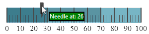
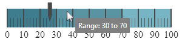

<!--
|metadata|
{
    "fileName": "iglineargauge-configuring-the-tooltips",
    "controlName": "igLinearGauge",
    "tags": ["Charting","How Do I"]
}
|metadata|
-->

# Configuring the Tooltips (igLinearGauge)


##Topic Overview


### Purpose

This topic explains, with code examples, how to enable the tooltips in the `igLinearGauge`™ control and configure the delay with which they are displayed.

### Required background

The following topics are prerequisites to understanding this topic:

-	[igLinearGauge Overview](igLinearGauge-Overview.html): This topic provides conceptual information about the `igLinearGauge` control including its main features, minimum requirements, and user functionality.

-	[Adding igLinearGauge](igLinearGauge-Adding.html):   This is a group of topics demonstrating how to add the `igLinearGauge`™ control to an HTML page and to an ASP.NET MVC application.


### In this topic

This topic contains the following sections:

-   [**Introduction**](#introduction)
    -   [Tooltips configuration summary](#tooltip-summary)
    -   [Tooltips configuration summary chart](#tooltip-summary-chart)
-   [**Enabling/Disabling Tooltips**](#enable-disable-tooltips)
    -   [Overview](#enable-disable-overview)
    -   [Property settings](#enable-disable-settings)
    -   [Code Example](#enable-disable-example)
-   [**Configuring the Tooltip Delay**](#config-tooltip-delay)
    -   [Overview](#delay-overview)
    -   [Property settings](#delay-settings)
    -   [Code Example](#delay-example)
-   [**Configuring a Custom Tooltip for the Needle**](#config-custom-tooltip)
    -   [Overview](#custom-tooltip-overview)
    -   [Property settings](#custom-tooltip-settings)
    -   [Example](#custom-tooltip-example)
-   [**Configuring a Custom Tooltip for the Comparative Ranges**](#comparative-ranges)
    -   [Overview](#comparative-ranges-overview)
    -   [Property settings](#comparative-ranges-settings)
    -   [Example](#comparative-ranges-example)
-   [**Related Content**](#related-content)
    -   [Topics](#topics)


##<a id="introduction"></a>Introduction


### <a id="tooltip-summary"></a>Tooltips configuration summary

The `igLinearGauge` control supports tooltips. They are pre-configured to show the values indicated by the needle and comparative ranges. The tooltip for each of these visual elements is configured individually by a property setting.

Tooltips are configurable in terms of visibility (can be enabled/disabled), delay (the timeout with which the tooltip appears is configurable), and value. Because the value of the tooltips can be set to a custom template, you have a wide array of possibilities to present the information relevant for the specific use case in the most appropriate manner.

By default, tooltips are disabled.

### <a id="tooltip-summary-chart"></a>Tooltips configuration summary chart

The following table maps the configurable aspects of the `igLinearGauge` control related to tooltips to the properties that manage them.

<table cellspacing="0" cellpadding="0" class="table">
	<thead>
		<tr>
            <th>
Configurable aspect
			</th>
            <th colspan="2">
Details
			</th>
            <th>
Properties / Events
			</th>
            <th>
Default value
			</th>
        </tr>
	</thead>
	<tbody>    
        <tr>
            <th>
[Visibility](#enable-disable-tooltips)
			</th>
            <td colspan="2">
You can enable/disable tooltips for the igLinearGauge control.
			</td>
            <td>
[showToolTip](%%jQueryApiUrl%%/ui.igLinearGauge#options:showToolTip)
			</td>
            <td>
False
			</td>
        </tr>
        <tr>
            <th>
[Delay](#config-tooltip-delay)
			</th>
            <td colspan="2">
The timeout before the tooltip appears upon the visual element at mouse hovering is configurable in milliseconds.
			</td>
            <td>
[showToolTipTimeout](%%jQueryApiUrl%%/ui.igLinearGauge#options:showToolTipTimeout)
			</td>
            <td>
500
			</td>
        </tr>
        <tr>
            <th rowspan="3">
Value
			</th>
            <td rowspan="3">
You can provide a custom value for the respective tooltip template property.
			</td>

            <td>
[Needle](#config-custom-tooltip)
			</td>
            <td>
[needleToolTipTemplate](%%jQueryApiUrl%%/ui.igLinearGauge#options:needleToolTipTemplate)
			</td>
            <td>
Depends on whether [needleName](%%jQueryApiUrl%%/ui.igLinearGauge#options:needleName) has been initialized (see [Configuring a Custom Tooltip for the Needle](#config-custom-tooltip))
			</td>
        </tr>
        <tr>
            <td>
[Comparative Range(s)](#comparative-ranges)
			</td>

            <td>
[rangeToolTipTemplate](%%jQueryApiUrl%%/ui.igLinearGauge#options:rangeToolTipTemplate)
			</td>
            <td>
The start and end values of the range separated by a hyphen
			</td>
        </tr>
    </tbody>
</table>


>**Note:** In order to bind to different values of the respective visual element when you change the default tooltip template, you must use the `${Item.Property}` syntax from within the template.


##<a id="enable-disable-tooltips"></a>Enabling/Disabling Tooltips


### <a id="enable-disable-overview"></a>Overview

You can show or hide (default setting) the tooltips on a `igLinearGauge`.

### <a id="enable-disable-settings"></a>Property settings

The following table maps the desired behavior to property settings.

In order to:|Use this property:|And set it to:
---|---|---
Enable tooltips|[showToolTip](%%jQueryApiUrl%%/ui.igLinearGauge#options;showToolTip)|true
Disable tooltips|[showToolTip](%%jQueryApiUrl%%/ui.igLinearGauge#options:showToolTip)|false


### <a id="enable-disable-example"></a>Code Example

The following code example enables the tooltips:

**In JavaScript:**

```js
$("#lineargauge").igLinearGauge({
    …
    showToolTip: true
});
```


##<a id="config-tooltip-delay"></a>Configuring the Tooltip Delay


### <a id="delay-overview"></a>Overview

It is possible to specify a delay by which a tooltip is displayed after the respective visual element has been hovered. The default value is 500 milliseconds.

### <a id="delay-settings"></a>Property settings

The following table maps the desired behavior to property settings.

In order to:|Use this property:|And set it to:
---|---|---
Configure the initial delay before the tooltip is displayed|[showToolTipTimeout](%%jQueryApiUrl%%/ui.igLinearGauge#options:showToolTipTimeout)|The desired value in milliseconds


### <a id="delay-example"></a>Code Example

The following code example sets the tooltip delay to 2000 milliseconds:

**In JavaScript:**

```js
$("#lineargauge").igLinearGauge({
    …
    showToolTip: true,
    showToolTipTimeout: 2000
});
```


##<a id="config-custom-tooltip"></a>Configuring a Custom Tooltip for the Needle


### <a id="custom-tooltip-overview"></a>Overview

The default value of the tooltip is pre-configured depending on whether the [needleName](%%jQueryApiUrl%%/ui.igLinearGauge#options:needleName) property has been initialized.

If the `needleName` property has been initialized, the default format of the tooltip property would be:

    <needleName> : <value>

If the `needleName` property has not been initialized, the default format of the tooltip would be:

    <value>

To change the data (and/or its look-and-feel) presented by the tooltip, you can set it to a custom template.

### <a id="custom-tooltip-settings"></a>Property settings

The following table maps the desired behavior to its respective property settings.

In order to:|Use this property:|And set it to:
---|---|---
Set a custom tooltip for the needle|[needleToolTipTemplate](%%jQueryApiUrl%%/ui.igLinearGauge#options:needleToolTipTemplate)|The id of the desired template.


### <a id="custom-tooltip-example"></a>Example

The screenshot below demonstrates how the tooltip of the `igLinearGauge`’s needle looks as a result of the following settings:

-	Property: [needleToolTipTemplate](%%jQueryApiUrl%%/ui.igLinearGauge#options:needleToolTipTemplate)

-	Value:

	**In HTML:**

	```html
	<script id="needleToolTipTemplate" type="text/x-jquery-tmpl">
	    <span style="background: green; border:black solid 2px; color:white">Current: ${item.value}</span>
	</script>
	```




Following is the code that implements this example.

**In HTML:**

```html
<script id="needleToolTipTemplate" type="text/x-jquery-tmpl">
    <span style="background: green; border:black solid 2px; color:white">Current: ${item.value}</span>
</script>
<script type="text/javascript">
    $(function () {
        $("#lineargauge").igLinearGauge({
            showToolTip: true,
            needleToolTipTemplate: "needleToolTipTemplate"
            …
        });
    });
</script>
```

##<a id="comparative-ranges"></a>Configuring a Custom Tooltip for the Comparative Ranges


### <a id="comparative-ranges-overview"></a>Overview

By default, the tooltips for the comparative ranges display the starting and ending values of the range, separated by a hyphen (i.e. 0 - 34), no matter where exactly over the range the mouse is being hovered. To change these pre-configured settings, you can set a custom template.

### <a id="comparative-ranges-settings"></a>Property settings

The following table maps the desired behavior to its respective property
settings.

In order to:|Use this property:|And set it to:
---|---|---
Set a custom tooltip for the comparative range(s)|[rangeToolTipTemplate](%%jQueryApiUrl%%/ui.igLinearGauge#options:rangeToolTipTemplate)|The id of the desired template


### <a id="comparative-ranges-example"></a>Example

The screenshot below demonstrates displaying the value presented in the tooltip of the comparative range as a result of the following settings:

-	Property: [rangeToolTipTemplate](%%jQueryApiUrl%%/ui.igLinearGauge#options:rangeToolTipTemplate)

-	Value:

	**In HTML:**
	
	```html
	<script id="rangeToolTipTemplate" type="text/x-jquery-tmpl">
	    <span style="padding:5px; background: grey;color: white">Range: ${item.startValue} to ${item.endValue}</span>
	</script>
	```



Following is the code that implements this example.

**In HTML:**

```html
<script id="rangeToolTipTemplate" type="text/x-jquery-tmpl">
    <span style="padding:5px; background: grey;color: white">Range: ${item.startValue} to ${item.endValue}</span>
</script>
<script type="text/javascript">
    $(function () {
        $("#lineargauge").igLinearGauge({
            showToolTip: true,
            needleToolTipTemplate: "needleToolTipTemplate",
            rangeToolTipTemplate: 'rangeToolTipTemplate',
            value: 26,
            height: "70px",
            width: "300px",
            ranges: [
                {
                    name: 'bad',
                    startValue: 0,
                    endValue: 30
                },
                {
                    name: 'acceptable',
                    startValue: 30,
                    endValue: 70
                },
                {
                    name: 'good',
                    startValue: 70,
                    endValue: 100
                }]
        });
    });
</script>
```


##<a id="related-content"></a>Related Content


### <a id="topics"></a>Topics

The following topics provide additional information related to this topic.


-	[Configuring the Scale (igLinearGauge)](igLinearGauge-Configuring-the-Scale.html): This topic explains, with examples, how to configure the scale of the `igLinearGauge` control. This includes positioning the scale inside the control and configuring the scale tick marks and labels.

-	[Configuring the Needle (igLinearGauge)](igLinearGauge-Configuring-the-Needle.html): This topic explains, with examples, how to configure the needle of the `igLinearGauge` control. This includes the value indicated by it, its width, position, and formatting.

-	[Configuring Comparative Ranges (igLinearGauge)](igLinearGauge-Configuring-Comparative-Ranges.html): This topic explains, with code examples, how to configure ranges in the `igLinearGauge` control. This includes the number of ranges and their positions, lengths, widths, and formatting.

-	[Configuring the Background (igLinearGauge)](igLinearGauge-Configuring-the-Background.html): This topic explains, with code examples, how to configure a background for the linear gauge. This includes setting the background’s size, position, color, and border.


 

 


