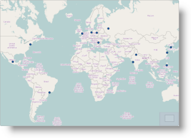
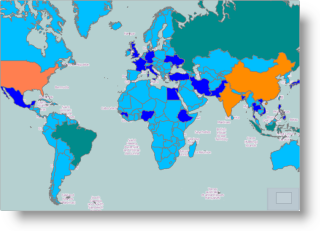
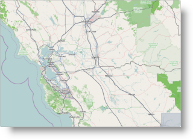
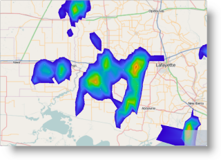
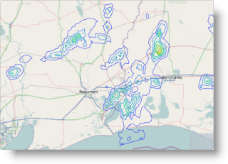

<!--
|metadata|
{
    "fileName": "overview-igmap",
    "controlName": "igMap",
    "tags": ["Charting","Data Presentation","Getting Started"]
}
|metadata|
-->

# igMap Overview

##Topic Overview

### Purpose

This topic provides conceptual information about the `igMap`™ control including its main features, minimum requirements, and user functionality.

### Required background

The following table lists the topics, and concepts required as a prerequisite to understanding this topic.

-   [Geographic Information System](http://en.wikipedia.org/wiki/Geographic_information_system)
-   [Shape Files](http://wiki.openstreetmap.org/wiki/Shapefiles)
-   [Triangulation files](http://vterrain.org/Implementation/Formats/ITF.html)

**Topics**

- [Ignite UI Overview](NetAdvantage-for-jQuery-Overview.html) General information on the Ignite UI™ library.

 

### In this topic

This topic contains the following sections:

-   [Introduction](#introduction)
-   [Supported Map Types](#supported-map-types)
    -   [Supported map types summary](#map-types-summary)
    -   [Supported map types table](#map-types-table)
-   [Minimum Requirements](#min-requirements)
    -   [Introduction](#min-introduction)
    -   [Requirements summary chart](#min-requirements-summary)
-   [Main Features Summary](#main-features)
    -   [Main features summary chart](#main-features-chart)
    -   [Support for different map providers](#different-map-providers)
    -   [Zooming](#zooming)
    -   [Panning](#panning)
    -   [Tooltips](#tooltips)
    -   [Customizable markers](#customizable-markers)
    -   [Customizable look-and-fill of the series](#customizable-appearance)
-   [User Interaction and Usability](#user-interaction)
-   [Data Binding](#data-binding)
-   [Related Content](#related-content)
    -   [Topics](#topics)
    -   [Samples](#samples)

##Introduction

###igMap summary

The `igMap` control is intended to facilitate drawing maps with custom overlays in HTML5 web applications and sites. It uses the **Canvas** tag in HTML5 to plot the actual maps and visualize data on the maps.

Maps rendered by the `igMap` control consist of a background content (the actual geographic map) delivered by a map provider (like Bing® Maps or OpenStreetMap maps) and an overlay which represents the actual custom data you wish to visualize for the user. There are several types of overlays you can render on a map called “map series” or “map types” (see [Supported Map Types](#supported-map-types)).

A map can have an Overview Plus Detail (OPD) panel which serves the user to navigate and to give understanding about the exact location on the world map. The map supports user interactions like panning and zooming with keyboard, with keyboard and mouse actions, or by touch and drag action on touch-enabled devices. For details, see the [Main Features Summary](#main-features) section.

##Supported Map Types

### Supported map types summary

The `igMap` control allows for a variety of series types to be implemented for different visualization purposes. The series are managed by setting `igMap`’s `series.type` property and its respective data binding properties.

See the [Supported map types table](#map-types-table) block for detailed information on supported series types and basic configuration information.

### Supported map types table

The following table displays the supported map (series) types.

<table cellspacing="0" cellpadding="0" class="table">
	<tbody>
		<tr>
			<th>
				Series type
			</th>

			<th>
				Description
			</th>

			<th>
				Series.type property setting
			</th>

			<th>
				Data binding properties
			</th>
		</tr>

		<tr>
			<td>
				Geographic Symbol Series
			</td>

			<td>
				Visualizes markers on the map based on geographic coordinates.

				 Related Topics:

				<ul>
					<li><a class="ig-topic-link" href="igMap-Configuring-Geographic-Symbol-Series.html">Configuring Geographic Symbol Series</a></li>
				</ul>
			</td>

			<td>geographicSymbol</td>

			<td>
				<ul>
					<li><a href="%%jQueryApiUrl%%/ui.igMap#options:series.latitudeMemberPath" target="_blank">latitudeMemberPath</a></li>

					<li><a href="%%jQueryApiUrl%%/ui.igMap#options:series.longitudeMemberPath" target="_blank">longitudeMemberPath</a></li>
				</ul>
			</td>
		</tr>

		<tr>
			<td>
				Geographic Shapes Series
			</td>

			<td>
				Visualizes enclosed areas on a map like countries or regions based on shape data provided by shape (SHP) files or a custom shape data source.

				 Related Topics:

				<ul>
					<li><a class="ig-topic-link" href="igMap-Configuring-Geographic-Shapes.html">Configuring Geographic Shapes Series</a></li>
				</ul>
			</td>

			<td>geographicShape</td>

			<td>
				<ul>
					<li><a href="%%jQueryApiUrl%%/ui.igMap#options:series.shapeDataSource" target="_blank">shapeDataSource</a></li>

					<li><a href="%%jQueryApiUrl%%/ui.igMap#options:series.databaseSource" target="_blank">databaseSource</a></li>

					<li><a href="%%jQueryApiUrl%%/ui.igMap#options:series.shapeMemberPath" target="_blank">shapeMemberPath</a></li>
				</ul>
			</td>
		</tr>

		<tr>
			<td>
				Geographic Polyline Series
			</td>

			<td>
				Visualizes open paths on a map like roads, rivers or daily supply routes based on shape data provided by shape (SHP )files or a custom shape data source.

				  Related Topics:

				<ul>
					<li><a class="ig-topic-link" href="igMap-Configuring-Geographic-Polyline-Series.html">Configuring Geographic Polyline Series</a></li>
				</ul>
			</td>

			<td>geographicPolyline</td>

			<td>
				<ul>
					<li><a href="%%jQueryApiUrl%%/ui.igMap#options:series.shapeDataSource" target="_blank">shapeDataSource</a></li>

					<li><a href="%%jQueryApiUrl%%/ui.igMap#options:series.databaseSource" target="_blank">databaseSource</a></li>

					<li><a href="%%jQueryApiUrl%%/ui.igMap#options:series.shapeMemberPath" target="_blank">shapeMemberPath</a></li>
				</ul>
			</td>
		</tr>

		<tr>
			<td>
				Geographic Scatter Area Series
			</td>

			<td>
				Visualizes colored geographic area based on triangular irregular networks (TINs) defined in a triangulated (ITF) file or other custom triangulation data source. Geographic coordinates and a value member are also needed. This can be used to depict terrain elevation, population density, average/current temperature and others.

				 Related Topics:

				<ul>
					<li><a class="ig-topic-link" href="igMap-Configuring-Geographic-Scatter-Area-Series.html">Configuring Geographic Scatter Area Series</a></li>
				</ul>
			</td>

			<td>geographicScatterArea</td>

			<td>
				<a href="%%jQueryApiUrl%%/ui.igMap#options:series.triangulationDataSource" target="_blank">triangulationDataSource</a>

				Optional:

				<ul>
					<li><a href="%%jQueryApiUrl%%/ui.igMap#options:series.triangleVertexMemberPath1" target="_blank">triangleVertexMemberPath1</a></li>

					<li><a href="%%jQueryApiUrl%%/ui.igMap#options:series.triangleVertexMemberPath2" target="_blank">triangleVertexMemberPath2</a></li>

					<li><a href="%%jQueryApiUrl%%/ui.igMap#options:series.triangleVertexMemberPath3" target="_blank">triangleVertexMemberPath3</a></li>

					<li><a href="%%jQueryApiUrl%%/ui.igMap#options:series.longitudeMemberPath" target="_blank">longitudeMemberPath</a></li>

					<li><a href="%%jQueryApiUrl%%/ui.igMap#options:series.latitudeMemberPath" target="_blank">latitudeMemberPath</a></li>

					<li><a href="%%jQueryApiUrl%%/ui.igMap#options:series.colorMemberPath" target="_blank">colorMemberPath</a></li>
				</ul>
			</td>
		</tr>

		<tr>
			<td>
				Geographic Contour Line Series
			</td>

			<td>
				Visualizes colored closed paths based on triangular irregular networks (TINs) defined in a triangulated (ITF) file or other custom triangulation data source. Geographic coordinates and a value member are also needed. This can be used to depict terrain elevation, population density, average/current temperature or others.

				 Related Topics:

				<ul>
					<li><a class="ig-topic-link" href="igMap-Configuring-Geographic-Contour-Line-Series.html">Configuring Geographic Contour Line Series</a></li>
				</ul>
			</td>

			<td>geographicContourLine</td>

			<td>
				<a href="%%jQueryApiUrl%%/ui.igMap#options:series.triangulationDataSource" target="_blank">triangulationDataSource</a>

				Optional:

				<ul>
					<li><a href="%%jQueryApiUrl%%/ui.igMap#options:series.triangleVertexMemberPath1" target="_blank">triangleVertexMemberPath1</a></li>

					<li><a href="%%jQueryApiUrl%%/ui.igMap#options:series.triangleVertexMemberPath2" target="_blank">triangleVertexMemberPath2</a></li>

					<li><a href="%%jQueryApiUrl%%/ui.igMap#options:series.triangleVertexMemberPath3" target="_blank">triangleVertexMemberPath3</a></li>

					<li><a href="%%jQueryApiUrl%%/ui.igMap#options:series.longitudeMemberPath" target="_blank">longitudeMemberPath</a></li>

					<li><a href="%%jQueryApiUrl%%/ui.igMap#options:series.latitudeMemberPath" target="_blank">latitudeMemberPath</a></li>

					<li><a href="%%jQueryApiUrl%%/ui.igMap#options:series.valueMemberPath" target="_blank">valueMemberPath</a></li>
				</ul>
			</td>
		</tr>
	</tbody>
</table>

##Minimum Requirements

### Introduction

The `igMap` control is a jQuery UI widget and depends on the jQuery and jQuery UI libraries. The Modernzr library is used internally for detecting browser and device capabilities. The control uses shared resources from the Ignite UI™ for functionality and data binding. References to these resources are needed nevertheless, in spite of pure jQuery or ASP.NET MVC helpers being used. The `Infragistics.Web.Mvc` assembly is required when the control is used in the context of ASP.NET MVC.

### Requirements summary chart

The following table summarizes the requirements for `igMap` control.

<table cellspacing="0" cellpadding="0" class="table">
	<tbody>
		<tr>
			<th>
				Requirement
			</th>

			<th>
				Description
			</th>
		</tr>

		<tr>
			<td>
				HTML5 canvas API
			</td>

            <td>
The functionality of the igMap control is based on the HTML5 Canvas tag and its related API. Any web browser that supports these will be able to render and display maps generated by the control. No other HTML5 features are required for the operation of the igMap control. The topic [Canvas Element: Support](http://en.wikipedia.org/wiki/Canvas_element#Support) from [Wikipedia™](http://en.wikipedia.org/wiki/Main_Page) details which versions of the most popular desktop and mobile web browsers support the HTML5 Canvas API.
			</td>
		</tr>

		<tr>
			<td>
				jQuery and jQuery UI JavaScript resources
			</td>

			<td>
				Ignite UI is built on top of these frameworks:

				<ul>
					<li>jQuery</li>

					<li>jQuery UI</li>
				</ul>

				The frameworks must be referenced by the web pages that use the igMap control.
			</td>
		</tr>

		<tr>
			<td>
				Modernizr

				(Optional)
			</td>

			<td>
				The Modernizr library is used by the igMap to detect browser and device capabilities. It is not mandatory and if not included the control will behave as if it works in a normal desktop environment with HTML5 compatible browser.

				<ul>
					<li>Modernizr</li>
				</ul>
			</td>
		</tr>

		<tr>
			<td>
				JavaScript resources
			</td>

			<td>
				The functionality of the igMap control uses some utilities and the data visualization core from the Ignite UI library.

				<table class="table">
					<thead>
						<tr>
							<th>JS Resource</th>

							<th>Description</th>
						</tr>
					</thead>
                    <tbody>
						<tr>
							<td>
								`infragistics.util.js`
							</td>

							<td>
								Ignite UI utilities
							</td>
						</tr>
						
						<tr>
							<td>
								`infragistics.datasource.js`
							</td>

							<td>
								The igDataSource control
							</td>
						</tr>

						<tr>
						    <td>
						        `infragistics.ext_core.js` 
						        `infragistics.ext_collections.js` 
						        `infragistics.ext_ui.js` 
						        `infragistics.ext_text.js` 
						        `infragistics.ext_io.js` 
						        `infragistics.ext_threading.js` 
						        `infragistics.ext_web.js` 
						        `infragistics.dv_core.js` 
						        `infragistics.dv_geo.js` 
						        `infragistics.dv_geometry.js` 
						    </td>
						    <td>
						        Data visualization core functionality
						    </td>
						</tr>

						<tr>
							<td>
								`infragistics.dvcommonwidget.js`
							</td>

							<td>
								Chart and map common widget
							</td>
						</tr>
						
						<tr>
							<td>
								`infragistics.datachart_core.js` 
								`infragistics.datachart_scatter.js` 
							</td>

							<td>
								Chart series functionality
							</td>
						</tr>

                        <tr>
							<td>
								`infragistics.ui.map.js`
							</td>

							<td>
								Map widget
							</td>
						</tr>
						
						<tr>
							<td>
								`infragistics.geographicmap_core.js`
							</td>

							<td>
								Core map visualization functionality
							</td>
						</tr>
					</tbody>
				</table> 
			</td>
		</tr>

		<tr>
			<td>
				CSS resources
			</td>

			<td>
				The CSS resources consist of the IG theme and the map structure CSS.

				The IG theme contains custom visual styles created for the Ignite UI library. It is contained in the following file:`{IG CSS root}/themes/Infragistics/infragistics.theme.css`

				The map structure CSS resource is used for rendering different elements of the map control:`{IG CSS root}/structure/modules/infragistics.ui.map.css`
			</td>
		</tr>
	</tbody>
</table>

>**Note:**It is recommended to load JavaScript and CSS resources using the `igLoader` control. For examples on how to use the the `igLoader` control with `igMap`, refer to the [Adding an igMap](Adding-igMap.html) topic and the [Geographic Symbol Series](%%SamplesUrl%%/map/geo-symbol-series) sample.

##Main Features Summary

### Main features summary chart

The following table summarizes the main features of the `igMap` control. Additional details are available after following the summary table.

Feature|Description
---|---
[Support for different map providers](#different-map-providers)|The map providers  deliver the map images and the map series are plotted as overlays over this background content. Any geographic series can be plotted on any background content.
[Support for different map types (series)](#map-types-summary)|The `igMap` control can visualize different map series. The series type is determined by the type option of each series object. Depending on the map series type, different kinds of input data must be supplied and correspondingly  different data binding options must be set.
[Zooming](#zooming)|Zooming is part of the user interaction features of the `igMap` control. It allows details for a specific map area to be revealed or a larger scale view to be displayed. Zooming can also be performed programmatically using the control’s API.
[Panning](#panning)|Panning is part of the user interaction features of the `igMap` control. It allows the currently displayed window from the map to be moved to the North, South, East, or West. Panning can also be performed programmatically using the control’s API.
[Tooltips](#tooltips)|Tooltips can be displayed when hovering over a marker or shape area of the map. Tooltips are based on templates which can render custom HTML markup and display data about a particular area of the map.
[Customizable markers](#customizable-markers)|Different markers can be used to designate points from the map. There are a plenty of built-in shapes like circle, triangle, diamond or others. Apart from the built-in markers, you have the option to create a custom marker by drawing directly on the canvas element.
[Customizable look-and-fill of the series](#customizable-appearance)|The visual components of the series, like outlines, shapes, and fills, can be  configured in terms of line thickness and patterns, color, color gradient, opacity, and so on. The exact customizations that can be applied are  specific for each series type.
[Binding to data attributes](#data-binding)|Map series are based on custom data in addition to geographic coordinates and/or triangles. You can access and display custom data attributes (or members of data records) in tooltips or custom markers.

### Support for different map providers

The actual map background displayed in the `igMap` control is content retrieved from a map provider. The `igMap` can use different map providers. The map providers deliver the map images and the map series are plotted as overlays over this background content.

The `igMap` control supports the following map providers:

-   OpenStreetMap
-   Bing Maps

>**Note:** Bing Maps require you to provide your custom access key to access their content.

The table below shows the same map area and geographic symbol series with the three available map providers.

OpenStreetMap|Bing Maps
---|---|---
|

### Related Topics:

-   [Configuring the Map Provider](igMap-Configuring-Map-Provider.html)

### Zooming

Zooming allows details for a specific map area to be revealed by zooming in or a larger scale view to be displayed by zooming out. Zooming in and out can be performed directly by the user with the keyboard and/or mouse, by touching, holding and dragging on touch devices or with the help of the Overview Plus Detail (OPD) screen. Zooming can also be performed programmatically using the [windowRect](%%jQueryApiUrl%%/ui.igMap#options:windowRect) option of the `igMap` control.

The following table shows an initial map view and zoomed in view.

Initial View|Zoomed In View
---|---
|

### Related Topics:

-   [Configuring the Navigation Features](igMap-Configuring-Navigation-Features.html)

### Panning

Panning allows the currently displayed window from the map to be moved to the North, South, East or West. Panning can be performed directly by the user with keyboard and/or mouse, by touching, holding and dragging on touch devices or with the help of the Overview Plus Detail (OPD) screen. Zooming can also be performed programmatically using the [windowRect](%%jQueryApiUrl%%/ui.igMap#options:windowRect) option of the `igMap` control.

The following table shows an initial map view and then the same view slightly panned to the East.

Initial View|Panned to the East
---|---
|

### Related Topics:

-   [Configuring the Navigation Features](igMap-Configuring-Navigation-Features.html)

### Tooltips

Tooltips allow you to display information about a specific point or region on the map. Tooltips are displayed when the user hovers with the mouse pointer over a marker or shape area on the map or touches and holds on touch enabled devices. Tooltips are based on templates which can render custom HTML markup and access data bound to a particular area of the map. Rendering of the templates is performed by the `igTemplating` engine. (For details, see [igTemplating](igTemplating-Overview.html)).

The following picture shows a geographic symbol series map with a tooltip activated on a point of the series.

### Related Topics:

-   [Configuring the Visual Features](igMap-Configuring-Visual-Features.html)

### Customizable markers

The `igMap` control uses markers to designate points on the map for the geographic symbol and geographic shapes series. Markers can be of several built-in shapes and their outline color and thickness, and fill color can be controlled by the `igMap` control’s properties or CSS. You can also disable displaying of markers if that makes sense for your application. The standard markers are circle, triangle, pyramid, square, diamond, pentagon, hexagon, tetragram, pentagram, and hexagram, but you can configure custom markers as well.

The following picture shows a map region with some points denoted by square markers.

If the shapes and behavior of the built-in markers are not sufficient you can configure a custom marker drawing function to be called whenever a marker is to be plotted on the map. Any custom marker function receives an object with the Canvas context object, position and size of the marker area and the data item bound to the marker. Additionally, another function can be provided to calculate and return custom size for the marker. The marker drawing function can use the full HTML5 Canvas API to draw whatever suits the requirements of the client application or web page.

The following picture shows a map with custom markers which display detailed information about data points.

### Related Topics:

-   [Configuring the Visual Features](igMap-Configuring-Visual-Features.html)

### Customizable look-and-fill of the series

The visual components of the series, like outlines, shapes, and fills, can be configured in terms of line thickness and patterns, color, color gradient, opacity, and so on. The exact customizations that can be applied are specific for each series type.

-   **Geographic Symbols, Geographic Shapes, and Geographic Polyline series**

For the Geographic Symbols, Geographic Shapes, and Geographic Polyline series, the nature of the visualization requires outlines and fills to be drawn. You can specify color, opacity and line thickness for markers and shapes outlines, and for polylines using the standard HTML colors or the rgba syntax. You can specify color and opacity for the fill of markers and shapes. All these aspects are configurable both by options and by CSS.

The following picture shows a geographic shapes series map with some custom colors applied.

-   **Geographic Scatter Area and Geographic Contour Line series**

The Geographic Scatter Area and Geographic Contour Line series use a palette of colors to be used for the visualization. The actual color for each point is picked from the palette based on a configurable data attribute, and minimum and maximum values. The palette of colors can be configured and may contain an arbitrary number of colors. The first color in the palette is applied to values below the minimum value and the last color is applied to values greater than the maximum value.

The following picture shows a geographic scatter area map with custom palette.

-   **Geographic Shape Series**

The Geographic Shape Series allows you to set different colors for fill and outline for each shape. This is accomplished by specifying a custom function to be called for each shape being plotted. The function can apply custom logic based on the data bound to the particular shape to select outline and fill color. This is useful for plotting political maps or designating arbitrary geographical regions by color depending on some of their data attributes.

The following figure shows the World map with countries in different colors based on their population.

### Related Topics:

-   [Styling (igMap)](Styling-igMap.html)

##User Interaction and Usability

### User interactions summary

The following table summarizes the user interaction capabilities of the `igMap` control.

<table cellspacing="0" cellpadding="0" class="table">
	<tbody>
		<tr>
			<th>
				The user can…
			</th>

			<th>
				Using…
			</th>

			<th>
				Details
			</th>

			<th>
				Configurable?

				<ul>
					<li>For detail, see…</li>
				</ul>
			</th>
		</tr>

		<tr>
			<td>
				Zoom
			</td>

			<td>
				<ul>
					<li>Mouse drag</li>

					<li>Ctrl/Alt/Shift + mouse drag</li>

					<li>Mouse scroll</li>

					<li>Dual touch drag</li>

					<li>Page Up/Page Down</li>
				</ul>
			</td>

			<td>
				Zooming in allows details about a region to be revealed. Zooming out shows a broader view over an area.
			</td>

			<td>
				

				<ul>
					<li><a class="ig-topic-link" href="igMap-Configuring-Navigation-Features.html">Configuring the Navigation Features</a></li>
				</ul>
			</td>
		</tr>

		<tr>
			<td>
				Pan
			</td>

			<td>
				<ul>
					<li>Mouse drag</li>

					<li>Ctrl/Alt/Shift + mouse drag</li>

					<li>Touch and drag</li>

					<li>Arrow keys</li>
				</ul>
			</td>

			<td>
				Shifts the view horizontally or vertically to display an adjacent area.
			</td>

			<td>
				

				<ul>
					<li><a class="ig-topic-link" href="igMap-Configuring-Navigation-Features.html">Configuring the Navigation Features</a></li>
				</ul>
			</td>
		</tr>

		<tr>
			<td>
				Navigate
			</td>

			<td>
				The OPD panel
			</td>

			<td>
				Shows the relative location of the currently displayed part of the map. Contains buttons and a slider for zooming, and allows the currently displayed window to be panned.
			</td>

			<td>
				

				<ul>
					<li><a class="ig-topic-link" href="igMap-Configuring-Navigation-Features.html">Configuring the Navigation Features</a></li>
				</ul>
			</td>
		</tr>

		<tr>
			<td>
				View tooltip
			</td>

			<td>
				<ul>
					<li>Mouse hover</li>

					<li>Touch and hold</li>
				</ul>
			</td>

			<td>
				Displays a tooltip to the user.
			</td>

			<td>
				

				<ul>
					<li><a class="ig-topic-link" href="igMap-Configuring-Visual-Features.html">Configuring the Visual Features</a></li>
				</ul>
			</td>
		</tr>
	</tbody>
</table>

##Data Binding

### Data binding summary

Map series are based on custom data in addition to geographic
coordinates and/or triangles. You can access and display custom data
attributes (or members of data records) in tooltips or custom markers.

The essence of the map overlays is that they are based on some data records bound to the specified geographic coordinates. The `igMap` control needs geographic data in the form of single or connected points, or triangles and can bind arbitrary additional data attributes to each geographic element. The data bound to each are accessible in tooltip templates or in different callback methods which the control may invoke to customize the look and feel of the visualization. The control recognizes and works with simple points specified in geographical latitude and longitude, with shape files together with database (DBF) files.

### Related Topics:

-   [Data Binding (igMap)](Data-Binding-igMap.html)

##Related Content

### Topics

The following topics provide additional information related to this topic.

-	[Adding an igMap](Adding-igMap.html):This topic demonstrates how to add a simple map with basic features to a web page.

-	[Data Binding (igMap)](Data-Binding-igMap.html):This topic explains how to bind the `igMap` control to different data sources depending on the map series visualized.

-	[Styling Maps (igMap)](Styling-igMap.html):This topic explains to customize the look-and-feel of the `igMap`™ control using themes.

-	[Configuring Features (igMap)](igMap-Configuring-Features.html):The topics in this group explain how to configure the various features of the `igMap`™ control. Features covered include navigation to specific geographic area, enabling/disabling of the Overview Plus Detail panel, getting the currently displayed area on the map, configuring interaction with the user regarding panning and zooming, configuring tooltip templates, and setting a custom marker.

-	[Configuring the Map Series (igMap)](igMap-Creating-Different-Kinds-Maps.html):The topics in this group explain how to configure all supported map types (map series) by the `igMap` control and thus produce different kinds of maps.

### Samples

The following samples provide additional information related to this topic.

-	[Map Tooltips](igmap-configuring-visual-features.html#map-tooltips-sample):This sample demonstrates how to set map tooltips in the `igMap` control.