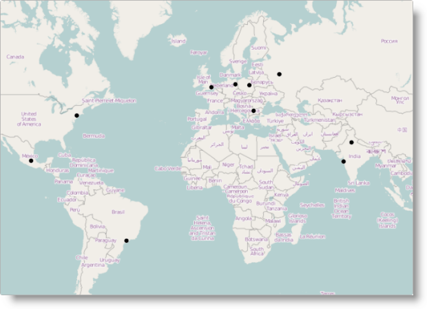

<!--
|metadata|
{
    "fileName": "adding-igmap",
    "controlName": "igMap",
    "tags": ["Charting","Data Presentation","Getting Started"]
}
|metadata|
-->

# Adding igMap

##Topic Overview


### Purpose

This topic is a walkthrough for adding a simple `igMap`™ control with basic features to a web page.

### Required background

The following table lists the topics and external articles required as a prerequisite to understanding this topic.


**Topics**

-	[Ignite UI Overview](NetAdvantage-for-jQuery-Overview.html): General information on the Ignite UI™ library.

-	[Using JavaScript Resouces in Ignite UI](Deployment-Guide-JavaScript-Resources.html): This topic provides general guidance on adding required JavaScript resources to use controls from the Ignite UI library.

-	[igMap Overview](Overview-igMap.html): This topic provides conceptual information about the `igMap` control including its main features, minimum requirements, and user interaction capabilities.


**External Resources**

-   [jQuery](http://docs.jquery.com/Main_Page), [jQuery UI](http://jqueryui.com)
-   [ASP.NET MVC](http://www.asp.net/mvc)


### In this topic

This topic contains the following sections:

-   [Adding igMap to a Web Page](#addig-igMap-html)
    -   [Introduction](#html-introduction)
    -   [Requirements](#html-requirements)
    -   [Preview](#html-preview)
    -   [Prerequisites](#html-prerequisites)
    -   [Overview](#html-overview)
    -   [Steps](#html-steps)
-   [Adding igMap to an ASP.NET MVC View](#adding-igMap-mvc)
    -   [Introduction](#mvc-introduction)
    -   [Requirements](#mvc-requirements)
    -   [Preview](#mvc-preview)
    -   [Prerequisites](#mvc-prerequisites)
    -   [Overview](#mvc-overview)
    -   [Steps](#mvc-steps)
-   [Related Content](#related-content)
    -   [Topics](#topics)
    -   [Samples](#samples)


##<a id="addig-igMap-html"></a>Adding igMap to a Web Page


### <a id="html-introduction"></a>Introduction

This procedure guides you through the steps for adding a map with basic functionality to a web page in the context of the geographic symbol series that plots points on the map. Geographic coordinates in the data bound to the control specifies these plotted points. The example shows an HTML/jQuery implementation. It includes the proper `igLoader`™ configuration for using the `igMap` control, binding to a local JavaScript array and configuring the essential options for the operation of the control.

### <a id="html-requirements"></a>Requirements

Following are the requirements for adding a map to a web page:

-   References to the required resources. The required resources are:
    -   The jQuery, jQueryUI and Modernizr JavaScript resources (must reside in the scripts folder of your web site or web application)
    -   The Ignite UI CSS files (must reside in the Infragistics® content folder of your web site or web application; topic for details, see the [Styling and Theming Ignite UI](Deployment-Guide-Styling-and-Theming.html))
    -   The Ignite UI JavaScript (must reside in the Infragistics scripts folder your web site or web application; for details, see the [Using JavaScript Resources in Ignite UI](Deployment-Guide-JavaScript-Resources.html) topic).

You can add the references either manually or using the [Infragistics Loader](Using-Infragistics-Loader.html) (recommended).

For loading the resources with the Loader, use the following code to include the `igLoader` script in the page:

**In HTML:**

```html
<script type="text/javascript" src="/Scripts/ig/js/infragistics.loader.js"></script>
```

…and then instantiate the Loader for HTML views:

**In HTML:**

```html
<script type="text/javascript">
    $.ig.loader({
        scriptPath: "/Scripts/ig/",
        cssPath: "/Content/ig/",
        resources: "igMap"
    });
</script>
```

If you prefer to load resources statically, refer to the topic [Overview (igMap), Minimum Requirements](Overview-igMap.html#min-requirements) to see which resource files must be linked to use maps.

-   A data source. For illustration purposes, the following local JavaScript array is used in the procedure:

**In HTML:**

```html
<script type="text/javascript">
    var data = [
        { Name: "Warsaw", Country: "Poland", Latitude: 52.21, Longitude: 21 },
        { Name: "London", Country: "England", Latitude: 51.50, Longitude: 0.12 },
        { Name: "Berlin", Country: "Germany", Latitude: 52.50, Longitude: 13.33 },
        { Name: "Moscow", Country: "Russia", Latitude: 55.75, Longitude: 37.51 },
        { Name: "Sydney", Country: "Australia", Latitude: -33.83, Longitude: 151.2 },
        { Name: "Tokyo", Country: "Japan", Latitude: 35.6895, Longitude: 139.6917 },
        { Name: "Seoul", Country: "South Korea", Latitude: 37.5665, Longitude: 126.9780 },
        { Name: "Delhi", Country: "India", Latitude: 28.6353, Longitude: 77.2250 },
        { Name: "Mumbai", Country: "India", Latitude: 19.0177, Longitude: 72.8562 },
        { Name: "Manila", Country: "Philippines", Latitude: 14.6010, Longitude: 120.9762 },
        { Name: "Shanghai", Country: "China", Latitude: 31.2244, Longitude: 121.4759 },
        { Name: "Mexico City", Country: "Mexico", Latitude: 19.4270, Longitude: -99.1276 },
        { Name: "New York", Country: "United States", Latitude: 40.7561, Longitude: -73.9870 },
        { Name: "Sao Paulo", Country: "Brasil", Latitude: -23.5489, Longitude: -46.6388 },
        { Name: "Los Angeles", Country: "United States", Latitude: 34.0522, Longitude: -118.2434 },
        { Name: "Sofia", Country: "Bulgaria", Latitude: 42.697845, Longitude: 23.321925 }
    ];
</script>
```

### <a id="html-preview"></a>Preview

The following screenshot is a preview of the result.



### <a id="html-prerequisites"></a>Prerequisites

To complete the procedure, you need an HTML5 web page.

### <a id="html-overview"></a>Overview

Following is a conceptual overview of the process:

1.  [Adding HTML markup required by the igMap control](#html-adding-igMap)
2.  [Instantiating the map](#html-instantiating-igMap)
3.  [(Optional) Verifying the result](#html-verifying-result)

### <a id="html-steps"></a>Steps

The following steps demonstrate how to add a basic `igMap` control instance to a web page.

1. <a id="html-adding-igMap"></a>Add the HTML markup required by the `igMap` control.

	The `igMap` control requires the addition of a div element to the page. The control, with all required markups to display a map on the page, updates the div element.

	**In HTML:**

	```html
	<div id="map"></div>
	```

2. <a id="html-instantiating-igMap"></a>Instantiate the map.

	The `igMap` control must be instantiated in a script tag of the HTML page so that it can wrap the div element created in step [1. Adding the HTML markup required by the igMap control](Adding-igMap.html#html-adding-igMap). The code instantiates the map. Additional information is available following the code snippet.

	**In HTML:**

	```html
	<script type="text/javascript">
	    $.ig.loader(function () {
	        $("#map").igMap({
	            width: "700px",
	            height: "500px",
	            backgroundContent: {
	                type: "openStreet"
	            },
	            series: [{
	                type: "geographicSymbol",
	                name: "worldCities",
	                dataSource: data,
	                latitudeMemberPath: "Latitude",
	                longitudeMemberPath: "Longitude",
	                markerType: "automatic"
	            }],
	            windowRect: {
	                left: 0.27,
	                top: 0.20,
	                height: 0.45,
	                width: 0.45 
	            }
	        });
	    });
	</script>
	```

	The width and height options set the size of the map on the page. Due to the tight coupling between the map window position and its aspect ratio it is important to set a specific (for your application) aspect ratio when displaying a particular area of the World map.

	The `backgroundContent` option sets, which map provider to use. This example uses the OpenStreetMap provider. This is the default provider; use it if you omit the backgroundContent option. You can refer to the [Configuring Map Provider](igMap-Configuring-Map-Provider.html) topic for details on using Bing® Maps and OpenStreetMap.

	The definition of the geographicSymbol series configures the visualization data series options. You must specify a name for the series, and a dataSource containing the visualization data. Additionally, you need to specify which attributes of the incoming data are the geographic coordinates with the `latitudeMemberPath` and `longitudeMemberPath` options. Finally, the `markerType` configures the control for automatically selecting which markers to use when  displaying the geographic points. For details on configuring other series types, refer to the [Creating Different Kinds of Maps](igMap-Creating-Different-Kinds-Maps.html) landing page and the topics linked from there.

	The windowRect option specifies the exact rectangular region of the World map initially rendered by the control. The values specified are in relative units between 0 and 1, where 0 is the extreme Northern (top most) or Western (left most) point from the World map. For more details, refer to the [Configuring Navigation Features](igMap-Configuring-Navigation-Features.html) topic.

3. <a id="html-verifying-result"></a>(Optional) Verify the result.

	To verify the result, save the page and view the final result in a web browser. If you have done the steps correctly, the map will look like the one shown in the [Preview](Adding-igMap.html#html-preview).


##<a id="adding-igMap-mvc"></a>Adding igMap to an ASP.NET MVC View


### <a id="mvc-introduction"></a>Introduction

This procedure guides you through the steps for adding a map with basic functionality to an ASP.NET MVC view. Done in the context of the geographic symbol series that plots points on the map specified by the geographic coordinate’s data bound to the control. The example uses the ASP.NET MVC syntax together with the required Loader configuration, binding to a data model object passed by a controller action method and setting essential options for the operation of the control to accomplish this.

### <a id="mvc-requirements"></a>Requirements

Following are the requirements for adding a map to an ASP.NET MVC View:

-   References to the required resources. The required resources are:
   -   The jQuery, jQueryUI and Modernizr JavaScript resources (must reside in the scripts folder of your web site or web application)
    -   The Ignite UI CSS files (must reside in the Infragistics® content folder of your web site or web application; topic for details, see the [Styling and Theming Ignite UI](Deployment-Guide-Styling-and-Theming.html))
    -   The Ignite UI JavaScript (must reside in the Infragistics scripts folder your web site or web application; for details, see the [Using JavaScript Resources in Ignite UI](Deployment-Guide-JavaScript-Resources.html) topic).

You can the references either manually or using the [Infragistics Loader](Using-Infragistics-Loader.html) (recommended).

For loading the resources with the Loader, use the following code to
include the `igLoader` script in the page:

**In HTML:**

```html
<script type="text/javascript" src="/Scripts/ig/js/infragistics.loader.js"></script>
```

…and then reference the `Infragistics.Web.Mvc` assembly in your ASP.NET MVC project and the `Infragistics.Web.Mvc` namespace in your view. For details, see [Using JavaScript Resources in Ignite UI](Deployment-Guide-JavaScript-Resources.html). In the interest of clarity, the code to reference the namespace follows below.

**In ASPX:**

```csharp
<%@ Import Namespace="Infragistics.Web.Mvc" %>
. . .
<%= Html.Infragistics().Loader()
        .ScriptPath(Url.Content("~/Scripts/ig/")
        .CssPath(Url.Content("~/Content/ig/")
        .Render()
%>
```

If you prefer to load resources statically,,refer to the topic [Overview (igMap), Minimum Requirements](Overview-igMap.html) to see which resource files must be linked to use maps.

-   **A data source.** For illustration purposes, the following code for the Index method is used in the procedure:

    **In C#:**

    ```csharp
    public ActionResult Index()
    {
        List<WorldCity> worldCities = new List<WorldCity>
        {
            new WorldCity { Name = "Warsaw", Country = "Poland", 
                Latitude = 52.21, Longitude = 21 },
            new WorldCity { Name = "London", Country = "England", 
                Latitude = 51.50, Longitude = 0.12 },
            new WorldCity { Name = "Berlin", Country = "Germany", 
                Latitude = 52.50, Longitude = 13.33 },
            new WorldCity { Name = "Moscow", Country = "Russia", 
                Latitude = 55.75, Longitude = 37.51 },
            new WorldCity { Name = "Sydney", Country = "Australia", 
                Latitude = -33.83, Longitude = 151.2 },
            new WorldCity { Name = "Tokyo", Country = "Japan", 
                Latitude = 35.6895, Longitude = 139.6917 },
            new WorldCity { Name = "Seoul", Country = "South Korea", 
                Latitude = 37.5665, Longitude = 126.9780 },
            new WorldCity { Name = "Delhi", Country = "India", 
                Latitude = 28.6353, Longitude = 77.2250 },
            new WorldCity { Name = "Mumbai", Country = "India", 
                Latitude = 19.0177, Longitude = 72.8562 },
            new WorldCity { Name = "Manila", Country = "Philippines", 
                Latitude = 14.6010, Longitude = 120.9762 },
            new WorldCity { Name = "Shanghai", Country = "China", 
                Latitude = 31.2244, Longitude = 121.4759 },
            new WorldCity { Name = "Mexico City", Country = "Mexico", 
                Latitude = 19.4270, Longitude = -99.1276 },
            new WorldCity { Name = "New York", Country = "United States", 
                Latitude = 40.7561, Longitude = -73.9870 },
            new WorldCity { Name = "Sao Paulo", Country = "Brasil", 
                Latitude = -23.5489, Longitude = -46.6388 },
            new WorldCity { Name = "Los Angeles", Country = "United States", 
                Latitude = 34.0522, Longitude = -118.2434 },
            new WorldCity { Name = "Sofia", Country = "Bulgaria", 
                Latitude = 42.697845, Longitude = 23.321925 }
        };
        return View(worldCities.AsQueryable());
    }
    ```

### <a id="mvc-preview"></a>Preview

The following screenshot is a preview of the result.


### <a id="mvc-prerequisites"></a>Prerequisites

To complete the procedure, you need an ASP.NET MVC web application in Visual Studio.

### <a id="mvc-overview"></a>Overview

Following is a conceptual overview of the process:

1.  [Adding the data model](#mvc-adding-data-model)
2.  [Adding the controller action method](#mvc-adding-controller-action)
3.  [Creating the ASP.NET View](#mvc-view)
4.  [Instantiating the igMap control](#mvc-instantiating-igMap)
5.  [*(Optional)* Verifying the result](#mvc-verifying-result)

### <a id="mvc-steps"></a>Steps

The following steps demonstrate how to add a basic `igMap` control instance to an MVC application.

1. <a id="mvc-adding-data-model"></a>Add the data model.

	The way to supply data for an ASP.NET MVC view is through a controller method using an appropriate data model definition. The following code illustrates the data model part. Create a new empty class, name it WorldCity, save it to your ASP.NET MVC application’s Models folder, and add the following code.

	**In C#:**

	```csharp
	namespace SampleMvcApp.Models
	{
	    public class WorldCity
	    {
	        public string Name { get; set; }
	        public string Country { get; set; }
	        public double Latitude { get; set; }
	        public double Longitude { get; set; }
	    }
	}
	```

	By design the model class stores data about the location of a city on the World map with its Name, Country, and geographic coordinates (Latitude and Longitude).

2. <a id="mvc-adding-controller-action"></a>Add the controller action method.

	Add an empty controller class in the Controllers folder of your ASP.NET MVC application.

	The controller action initializes a list of WorldCity objects with data provided by either a database or an external data service in your application and invokes the default view for the controller with the data.

3. <a id="mvc-view"></a>Create the ASP.NET View.

	Create the view corresponding to the controller action method. Add the following code to make the view strongly-typed and point to the data model class created above:

	**In ASPX:**

	```csharp
	<%@ Page Language="C#" Inherits="IQueryable<SampleMvcApp.Models.WorldCity>"
	    MasterPageFile="~/Views/Shared/MvcSite.Master" %>
	```

4. <a id="mvc-instantiating-igMap"></a>Instantiate the `igMap` control.

	Use the code provided here to instantiate your map. Additional information is available following the code snippet below.

	**In ASPX:**

	```csharp
	<%= Html.Infragistics().Map(Model)
	        .ID("map")
	        .Width("700px")
	        .Height("500px")
	        .BackgroundContent(bgr => bgr.OpenStreetMaps())
	        .Series(series => {
	            series.GeographicSymbol("worldCities")
	                .LatitudeMemberPath(item => item.Latitude)
	                .LongitudeMemberPath(item => item.Longitude)
	                .MarkerType(MarkerType.Automatic)
	        })
	        .WindowRect(0.27, 0.20, 0.5, 0.5)
	        .DataBind()
	        .Render()
	%>
	```

	Assignment of the data model object declared for the view to the control occurs in the Map(Model) call. The members of the model are referenced in the map series definition.

	The Width and Height calls set the size of the map on the page. Due to the tight coupling between the map window position and its aspect ratio, it is important to set a specific (for your application) aspect ratio when displaying a particular area of the World map.

	The BackgroundContent call specifies which map provider your application uses. This example uses the OpenStreetMap provider. This is the default provider, used if you omit the `BackgroundContent()` call. You can refer to the [Configuring Map Provider](igMap-Configuring-Map-Provider.html) topic for details on using Bing® Maps and OpenStreetMap.

	The Series call configures the definition of the `GeographicSymbol` series. Specify, within the call, the name “worldCities” for use in the series. You need to specify which attributes of the incoming data are the geographic coordinates using the `LatitudeMemberPath` and `LongitudeMemberPath` options. Finally, the `MarkerType` call  configures the control to select automatically what markers to use for the displayed geographic points. For details on configuring other series types, refer to the [Creating Different Kinds of Maps](igMap-Creating-Different-Kinds-Maps.html) landing page and the topics linked therein.

	The WindowRect call specifies the exact rectangular region of the World map initially rendered by the control. The values specified are in relative units between 0 and 1 with 0 representing the extreme Northern (top most) or Western (left most) point on the World map. For more details, refer to the [Configuring Navigation Features](igMap-Configuring-Navigation-Features.html) topic.

5. <a id="mvc-verifying-result"></a>(Optional) Verify the result.

	To verify the result, save the page and view the result in a web browser. If you have done the steps correctly, the map will look like the one shown in the [Preview](#mvc-preview).


##<a id="related-content"></a>Related Content


### <a id="topics"></a>Topics

The following topics provide additional information related to this topic.

-	[Data Binding (igMap)](Data-Binding-igMap.html):This topic explains how to bind the `igMap` control to different data sources depending on the map series visualized.

-	[Styling Maps (igMap)](Styling-igMap.html):This topic explains to customize the look-and-feel of the `igMap` control using themes.

-	[Configuring Features (igMap)](igMap-Configuring-Features.html):The topics in this group explain how to configure the various features of the `igMap` control. Features covered include navigation to specific geographic area, enabling/disabling of the Overview Plus Detail panel, getting the currently displayed area on the map, configuring interaction with the user regarding panning and zooming, configuring tooltip templates, and setting a custom marker.

-	[Configuring the Map Series (igMap)](igMap-Creating-Different-Kinds-Maps.html):The topics in this group explain how to configure all supported map types (map series) of the `igMap` control in order to produce many different kinds of maps.

-	[API Links (igMap)](igMap-API-Links.html):This topic provides links to the API documentation for the jQuery and its ASP.NET MVC helper class for the `igMap` control.


### <a id="samples"></a>Samples

The following samples provide additional information related to this topic.

-	[Map Tooltips](igmap-configuring-visual-features.html#map-tooltips-sample):This sample demonstrates how to set map tooltips in a map control and bind a View Model to the control.

-	[Geographic Symbol Series](%%SamplesUrl%%/map/geo-symbol-series):This sample demonstrates how to create maps and visualize Geographic Symbol series.