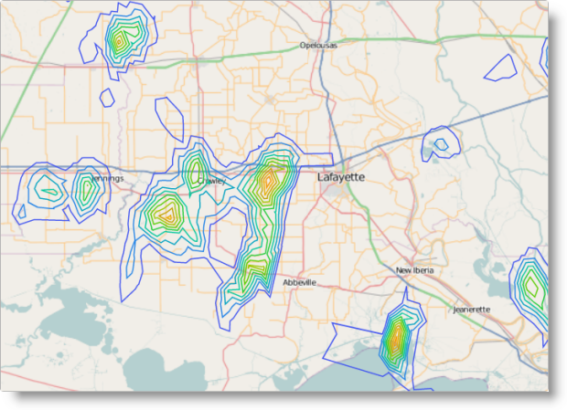

<!--
|metadata|
{
    "fileName": "igmap-configuring-geographic-contour-line-series",
    "controlName": "igMap",
    "tags": ["Charting","Data Presentation","How Do I"]
}
|metadata|
-->

# Configuring Geographic Contour Line Series (igMap)

##Topic Overview

### Purpose

This topic explains how to configure geographic contour line series using the `igMap`™ control.

### Required background

The following topics are prerequisites to understanding this topic:

- [igMap Overview](Overview-igMap.html): This topic provides conceptual information about the `igMap` control including its main features, minimum requirements and user interaction capabilities.

- [Adding an igMap](Adding-igMap.html): This topic is a walkthrough for adding a simple `igMap` control with basic features to a web page.


### In this topic

This topic contains the following sections:

-   [Introduction](#introduction)
-   [Geographic contour line series Configuration Summary](#config-summary)
-   [Code Examples Summary](#code-example-summary)
    -   [Configure Geographic Contour Line Series in JavaScript](#config-geographic-js)
    -   [Configure Geographic Contour Line Series in ASP.NET MVC](#config-geographic-mvc)
    -   [Configure Custom Triangulation Data Source](#config-custom-datasource)
-   [Related Content](#related-content)
    -   [Topics](#topics)
    -   [Samples](#samples)
    -   [External resources](#external-resources)


##<a id="introduction"></a>Introduction

### Geographic contour line series summary

The purpose of the geographic contour line series of the `igMap` control is to differentiate regions specified by triangular irregular networks (TINs) from triangulation ITF files or other custom data source. The TINs describe mathematically geographic surfaces in three dimensions.

Triangles from the source data are grouped in ranges with similar or close values, and colored lines (contour lines) are drawn between ranges, for example, between triangles with values falling into different value ranges.

The range of possible values in the data source is divided into sub ranges, with a sub range for each color in the palette specified in the map series. Thus, colors are distributed evenly in the range between the minimum and maximum value from the data that are also configurable parameters. The first and last colors from the palette represent the minimum and maximum values respectively.

The geographic contour line series can be used to represent terrain, weather information or any other data describing a geospatial field, for example the distribution of some value in space. This map series is compounded by the scatter area series that draws filled areas on the map instead of contour lines. On the picture below, you can see the geographic contour line series used to depict precipitation data for an area in the United States.



You can control the palette color of polylines by using either CSS styles or options of the series object. Refer to the topic [Styling Maps (igMap)](Styling-igMap.html) for more information.

Note:It is recommended to use smaller triangulation data sets when targeting mobile devices. Rendering geospatial data requires more computing resources and most mobile devices offer lower performance compared to desktop and laptop computers.


##<a id="config-summary"></a>Geographic Contour Line Series Configuration Summary

### Geographic contour line series configuration summary chart

The following table lists the configurable aspects of the `igMap` control available in the geographic contour line series.

<table cellspacing="0" cellpadding="0" class="table table-striped">
	<tbody>
		<tr>
			<th>
				Configurable aspect
			</th>

			<th>
				Details
			</th>

			<th>
				Properties
			</th>
		</tr>

		<tr>
			<td>
				Set up geographic contour line series
			</td>

			<td>
				Use these mandatory settings to configure the type of the map series to geographic contour line and set series name.
			</td>

			<td>
				In JavaScript:

				<ul>
					<li><a href="%%jQueryApiUrl%%/ui.igMap#options:series.type" target="_blank">series.type</a></li>

					<li><a href="%%jQueryApiUrl%%/ui.igMap#options:series.name" target="_blank">series.name</a></li>
				</ul>Value:

				series.type: “geographicContourLine”,

				series.type: “seriesName”

				In ASP.NET MVC:

				<ul>
					<li>
						<a href="Infragistics.Web.Mvc~Infragistics.Web.Mvc.MapSeriesBuilder`1.html" data-auto-update-caption="true">MapSeriesBuilder&lt;T&gt; Class</a>

						<ul>
							<li><a href="Infragistics.Web.Mvc~Infragistics.Web.Mvc.MapSeriesBuilder`1~GeographicContourLine.html">.GeographicContourLine()</a></li>
						</ul>
					</li>
				</ul>Value:

				series.GeographicContourLine(“seriesName”)
			</td>
		</tr>

		<tr>
			<td>
				Bind to an ITF file
			</td>

			<td>
				Configures the triangulation file’s URL.
			</td>

			<td>
				In JavaScript:

				<a href="%%jQueryApiUrl%%/ui.igMap#options:series.triangulationDataSource" target="_blank">series.triangulationDataSource</a>

				In ASP.NET MVC:

				<ul>
					<li>
						<a href="Infragistics.Web.Mvc~Infragistics.Web.Mvc.GeographicContourLineSeries`1.html" data-auto-update-caption="true">GeographicContourLineSeries&lt;T&gt; Class</a>

						<ul>
							<li><a href="Infragistics.Web.Mvc~Infragistics.Web.Mvc.GeographicXYTriangulatingSeries`3~TriangulationDataSource.html">.TriangulationDataSource()</a></li>
						</ul>
					</li>
				</ul>
			</td>
		</tr>

		<tr>
			<td>
				Bind to a custom triangles data source
			</td>

			<td>
				Configure an array of objects with geospatial data that describe a field of geographical points and their corresponding numeric values.
			</td>

			<td>
				In JavaScript:

				<ul>
					<li><a href="%%jQueryApiUrl%%/ui.igMap#options:series.dataSource" target="_blank">series.dataSource</a></li>

					<li><a href="%%jQueryApiUrl%%/ui.igMap#options:series.longitudeMemberPath" target="_blank">series.longitudeMemberPath</a></li>

					<li><a href="%%jQueryApiUrl%%/ui.igMap#options:series.latitudeMemberPath" target="_blank">series.latitudeMemberPath</a></li>

					<li><a href="%%jQueryApiUrl%%/ui.igMap#options:series.valueMemberPath" target="_blank">series.valueMemberPath</a></li>
				</ul>

				Optional:

				<ul>
					<li><a href="%%jQueryApiUrl%%/ui.igMap#options:series.triangleVertexMemberPath1" target="_blank">series.triangleVertexMemberPath1</a></li>

					<li><a href="%%jQueryApiUrl%%/ui.igMap#options:series.triangleVertexMemberPath2" target="_blank">series.triangleVertexMemberPath2</a></li>

					<li><a href="%%jQueryApiUrl%%/ui.igMap#options:series.triangleVertexMemberPath3" target="_blank">series.triangleVertexMemberPath3</a></li>
				</ul>

				In ASP.NET MVC:

				<ul>
					<li>
						<a href="Infragistics.Web.Mvc~Infragistics.Web.Mvc.GeographicContourLineSeries`1.html" data-auto-update-caption="true">GeographicContourLineSeries&lt;T&gt; Class</a>

						<ul>
							<li><a href="Infragistics.Web.Mvc~Infragistics.Web.Mvc.GeographicXYTriangulatingSeries`3~LongitudeMemberPath.html">.LongitudeMemberPath()</a></li>

							<li><a href="Infragistics.Web.Mvc~Infragistics.Web.Mvc.GeographicXYTriangulatingSeries`3~LatitudeMemberPath.html">.LatitudeMemberPath()</a></li>

							<li><a href="Infragistics.Web.Mvc~Infragistics.Web.Mvc.GeographicContourLineSeries`1~ValueMemberPath.html">.ValueMemberPath()</a></li>
						</ul>
					</li>
				</ul>

				Optional:

				<ul>
					<li>
						<a href="Infragistics.Web.Mvc~Infragistics.Web.Mvc.GeographicContourLineSeries`1.html" data-auto-update-caption="true">GeographicContourLineSeries&lt;T&gt; Class</a>

						<ul>
							<li><a href="Infragistics.Web.Mvc~Infragistics.Web.Mvc.GeographicXYTriangulatingSeries`3~TriangleVertexMemberPath1.html">.TriangleVertexMemberPath1()</a></li>

							<li><a href="Infragistics.Web.Mvc~Infragistics.Web.Mvc.GeographicXYTriangulatingSeries`3~TriangleVertexMemberPath2.html">.TriangleVertexMemberPath2()</a></li>

							<li><a href="Infragistics.Web.Mvc~Infragistics.Web.Mvc.GeographicXYTriangulatingSeries`3~TriangleVertexMemberPath3.html">.TriangleVertexMemberPath3()</a></li>
						</ul>
					</li>
				</ul>
			</td>
		</tr>

		<tr>
			<td>
				Color palette
			</td>

			<td>
				This mandatory setting configures the color palette for the triangles values.

				There is no default value for the setting.
			</td>

			<td>
				In JavaScript:

				<ul>
					<li><a href="%%jQueryApiUrl%%/ui.igMap#options:series.fillScale.brushes" target="_blank">series.fillScale.brushes</a></li>
				</ul>

				In ASP.NET MVC:

				<ul>
					<li><a href="Infragistics.Web.Mvc~Infragistics.Web.Mvc.FillScale`1~Brushes.html">FillScale.Brushes()</a></li>
				</ul>
			</td>
		</tr>

		<tr>
			<td>
				Minimum value for color palette
			</td>

			<td>
				Configure the minimum value for calculating value sub ranges.
			</td>

			<td>
				In JavaScript:

				<ul>
					<li><a href="%%jQueryApiUrl%%/ui.igMap#options:series.fillScale.minimumValue" target="_blank">series.fillScale.minimumValue</a></li>
				</ul>

				In ASP.NET MVC:

				<ul>
					<li><a href="Infragistics.Web.Mvc~Infragistics.Web.Mvc.ValueBrushScale~MinimumValue.html">FillScale.MinimumValue()</a></li>
				</ul>
			</td>
		</tr>

		<tr>
			<td>
				Maximum value for color palette
			</td>

			<td>
				Configure the maximum value for calculating value sub ranges.
			</td>

			<td>
				In JavaScript:

				<ul>
					<li><a href="%%jQueryApiUrl%%/ui.igMap#options:series.fillScale.maximumValue" target="_blank">series.fillScale.maximumValue</a></li>
				</ul>

				In ASP.NET MVC:

				<ul>
					<li><a href="Infragistics.Web.Mvc~Infragistics.Web.Mvc.ValueBrushScale~MaximumValue.html">FillScale.MaximumValue()</a></li>
				</ul>
			</td>
		</tr>

		<tr>
			<td>
				Set logarithmic color palette
			</td>

			<td>
				Configure the map series to use logarithmic mapping of values to colors.
			</td>

			<td>
				In JavaScript:

				<ul>
					<li><a href="%%jQueryApiUrl%%/ui.igMap#options:series.fillScale.isLogarithmic" target="_blank">series.fillScale.isLogarithmic</a></li>

					<li><a href="%%jQueryApiUrl%%/ui.igMap#options:series.fillScale.logarithmBase" target="_blank">series.fillScale.logarithmBase</a></li>
				</ul>

				In ASP.NET MVC:

				<ul>
					<li><a href="Infragistics.Web.Mvc~Infragistics.Web.Mvc.ValueBrushScale~IsLogarithmic.html">FillScale.IsLogarithmic()</a></li>

					<li><a href="Infragistics.Web.Mvc~Infragistics.Web.Mvc.ValueBrushScale~LogarithmBase.html">FillScale.LogarithmBase()</a></li>
				</ul>
			</td>
		</tr>
	</tbody>
</table>


##<a id="code-example-summary"></a>Code Examples Summary

### Code examples summary chart

The following table lists the code examples included in this topic.

Example|Description
---|---
[Configure Geographic Contour Line Series in JavaScript](#config-geographic-js)|This code example shows how to configure an `igMap` control to display geographic contour line series in JavaScript.
[Configure Geographic Contour Line Series in ASP.NET MVC](#config-geographic-mvc)|This code example shows how to configure an `igMap` control to display geographic contour line series in ASP.NET MVC.
[Configure Custom Triangulation Data Source](#config-custom-datasource)|This code example shows how to configure an `igMap` control to display geographic contour line series with custom triangulation data source.


##<a id="config-geographic-js"></a>Code Example: Configure Geographic Contour Line Series in JavaScript

### Description

This code example shows how to configure an `igMap` control to display the geographic contour line series in JavaScript. The example shows how to specify the URL for the triangulated file, and define the color palette with minimum and maximum values. Shown here for clarity are the optional data binding options.

### Code

**In JavaScript:**

```js
Code
$("#map").igMap({
    ...
    series: [{
        type: "geographicContourLine",
        name: "seriesName",
        fillScale: {
            type: "value",
            brushes: [
                "#3300CC", "#4775FF", "#0099CC", "#00CC99", "#33CC00", 
                "#99CC00", "#CC9900", "#FFC20A", "#CC3300"
            ]
        },
        triangleVertexMemberPath1: "v1",
        triangleVertexMemberPath2: "v2",
        triangleVertexMemberPath3: "v3",
        longitudeMemberPath: "pointX",
        latitudeMemberPath: "pointY",
        valueMemberPath: "value",
        triangulationDataSource: "/Data/triangulation.itf"
    }],
    ...
});
```


##<a id="config-geographic-mvc"></a>Code Example: Configure Geographic Contour Line Series in ASP.NET MVC

### Description

This code example shows how to configure an `igMap` control to display geographic contour line series in ASP.NET MVC. The example shows how to specify URL for triangulated file, and define a color palette with minimum and maximum values. Shown here, for clarity, are the optional data binding options.

### Code

**In ASPX:**

```csharp
Code
<%= Html.Infragistics().Map()
        .ID("map")
        ...
        .Series(series => {
            series.GeographicContourLine("seriesName")
                .FillScale(scale => scale
                    .Value()
                    .MinimumValue(0.15)
                    .MaximumValue(0.95)
                    .Brushes(new List<string>() { 
                        "#3300CC", "#4775FF", "#0099CC", "#00CC99", "#33CC00", 
                        "#99CC00", "#CC9900", "#FFC20A", "#CC3300" 
                    })
                )
                .TriangleVertexMemberPath1("v1")
                .TriangleVertexMemberPath2("v2")
                .TriangleVertexMemberPath3("v3")
                .LongitudeMemberPath("pointX")
                .LatitudeMemberPath("pointY")
                .ValueMemberPath("value")
                .TriangulationDataSource(Url.Content("~/Data/triangulation.itf"));
        })
        ...
        .DataBind()
        .Render()
%>
```


##<a id="config-custom-datasource"></a>Code Example: Configure Custom Triangulation Data Source

### Description

This code example shows how to configure an `igMap` control to display the geographic contour line series with a custom triangulation data source. The example shows the general structure of the data objects expected by the control along with how to configure the `igMap` control’s series object.

### Code

The following code snippet defines a JavaScript array that contains information about geographic points and numeric values associated with them. The array contains identical objects with three data members. The latitude and longitude data members define the geographical coordinates of the corresponding point, while the value data member contains a numeric value associated with the point.

**In JavaScript:**

```js
var data = [
    { longitude: 0, latitude: 0, value: 1 },
    { longitude: 50, latitude: 0, value: 2 },
    { longitude: 50, latitude: 50, value: 3 },
    { longitude: 0, latitude: 50, value: 1 }
];
```

The following code snippet configures the geographic contour line series with the custom data source specified in the preceeding code snippet. The code explicitly sets the `latitudeMemberPath`, `longitudeMemberPath` and `valueMemberPath` options with the names of the corresponding data members from the data array.

**In JavaScript:**

```js
$("#map").igMap({
    ...
    series: [{
        type: "geographicContourLine",
        name: "seriesName",
        dataSource: data,
        latitudeMemberPath: "latitude",
        longitudeMemberPath: "longitude",
        valueMemberPath: "value",
        fillScale: {
            type: "value",
            brushes: [ "darkgreen", "green", "limegreen", "lightgreen" ]
        }
    }],
    ...
});
```

Prior to screen rendering, the data points defined in the data array are triangulated in order for the correct position of all contour lines to be found. You can find more information about the process of triangulation following the links given in the [Related Content: External Resources](igMap-Configuring-Geographic-Contour-Line-Series.html#external-resources) section.

##<a id="related-content"></a>Related Content

### <a id="topics"></a>Topics

The following topics provide additional information related to this topic.

-	[Configuring the Map Series (igMap)](igMap-Creating-Different-Kinds-Maps.html): This topic is a landing page linking to the topics explaining how to configure all supported map visualizations by the `igMap` control and how to use different background content (map providers).

-	[Configuring Features (igMap)](igMap-Configuring-Features.html):This topic is a landing page linking to the topics explaining how to configure various features of the `igMap` control.

-	[Data Binding (igMap)](Data-Binding-igMap.html): This topic explains how to bind the `igMap` control to different data sources depending on the map series visualized.

-	[Styling Maps (igMap)](Styling-igMap.html):This topic explains how the `igMap` control can be configured with regard to visual styling.


### <a id="samples"></a>Samples

The following sample provides additional information related to this topic.


-	[Geographic Contour Line Series](%%SamplesUrl%%/map/geo-contour-line): This sample demonstrates how to bind pre-triangulated files (.ITF) to a map control and configure the geographic contour line series.


### <a id="external-resources"></a>External resources

The following material (available outside the Infragistics family of content) provides additional information related to this topic.

-	[Triangulation (geometry)](http://en.wikipedia.org/wiki/Triangulation_%28geometry%29): This topic describes what the process of triangulation is from geometrical perspective.

-	[Triangulation](http://en.wikipedia.org/wiki/Triangulation): This Wikipedia topic describes what the process of triangulation is and provides some additional references to the subject.


 

 


