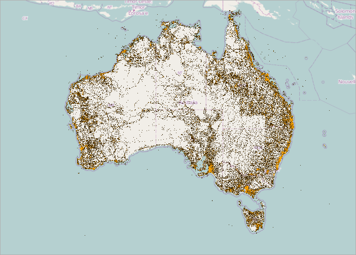

<!--
|metadata|
{
    "fileName": "igmap-using-geographic-high-density-scatter-series",
    "controlName": "",
    "tags": []
}
|metadata|
-->

# Configuring Geographic High-Density Scatter Series (igMap)

##Topic Overview

### Purpose

This topic explains how to configure Geographic High Density Scatter Series using the `igMap`™ control.

### Required background

The following topics are prerequisites to understanding this topic:

- [igMap Overview](Overview-igMap.html):This topic provides conceptual information about the `igMap` control including its main features, minimum requirements and user interaction capabilities.

- [Adding an igMap](Adding-igMap.html):This topic is a walkthrough for adding a simple `igMap` control with basic features to a web page.


### In this topic

This topic contains the following sections:

-   [**Introduction**](#introduction)
-   [**Data Binding**](#data-binding)
    -   [Data binding summary](#data-binding-summary)
    -   [Data binding summary chart](#data-binding-chart)
-   [**Geographic High Density Scatter Series Configuration Summary**](#geo-scatter-series-config)
-   [**Code Examples Summary**](#code-example)
    -   [Configuring Geographic High Density Scatter Series in JavaScript](#config-series-js)
    -   [Configuring Geographic High Density Scatter Series in ASP.NET MVC](#config-series-mvc)
-   [**Configuring the Heat Color Scale**](#config-heat-color-scale)
-   [**Configuring the Resolution**](#config-resolution)
-   [**Configuring the Loading Mode**](#config-loading-mode)
-   [**Configuring the Mouse-Over Behavior**](#config-mouse-over-behavior)
-   [**Configuring the Rendering Mode**](#config-rendering-mode)
-   [**Configuring the Minimum Point Size**](#config-min-points)
-   [**Related Content**](#related-content)
    -   [Topics](#topics)
    -   [Samples](#samples)


##<a id="introduction"></a>Introduction

### Geographic high density scatter series summary

Use the `igMap` control’s `geographicHighDensityScatterSeries` series to bind and show scatter data ranging from hundreds to millions of data points requiring exceedingly little loading time. Because there are so many data points, the series displays the scatter data as tiny dots as opposed to full size markers, and displays areas with the most data using a higher color density representing a cluster of data points.

The following screenshot is a preview of the `geographicHighDensityScatterSeries` series in the `igMap` control bound to hundreds or even thousands of data points representing Australia’s population density. The map plot area with more densely populated data points represented as coalescences of red pixels and loosely distributed data points by discrete blue pixels.




##<a id="data-binding"></a>Data Binding

### <a id="data-binding-summary"></a>Data binding summary

Similar to other types of scatter series in the `igMap` control, the `geographicHighDensityScatterSeries` series has the `itemsSource`  property for data binding. This property can be bound to objects implementing an iEnumerable interface. In addition, each item in the items source must have two data columns that store geographic longitude and latitude coordinates and uses the `longitudeMemberPath` and `latitudeMemberPath` properties to map these data columns.

### <a id="data-binding-chart"></a>Data binding summary chart

The following table summarizes the `geographicHighDensityScatterSeries` series properties used for data binding.

**Property Name**| **Property Type**| **Description**
---|---|---
itemsSource|iEnumerable|Gets or sets the items source
longitudeMemberPath|string|Uses the `itemsSource` property to determine the location of the longitude values on the assigned items
latitudeMemberPath|string|Uses the `itemsSource` property to determine the location of the latitude values on the assigned items


##<a id="geo-scatter-series-config"></a>Geographic High Density Scatter Series Configuration Summary

### Geographic high density scatter series configuration summary chart

The following table lists the configurable aspects of the `igMap` control’s geographic high density scatter series.

<table cellspacing="0" cellpadding="0" class="table table-bordered">
	<tbody>
		<tr>
			<th>
				Configurable aspect
			</th>

			<th>
				Details
			</th>

			<th>
				Properties
			</th>
		</tr>

		<tr>
			<td>
				Set up geographic high density scatter series
			</td>

			<td>
				These mandatory settings are where you configure the type of map series to the geographic shape and set series name.
			</td>

			<td>
				In JavaScript:

				<ul>
					<li><a href="%%jQueryApiUrl%%/ui.igMap#options" target="_blank">series.type</a></li>

					<li><a href="%%jQueryApiUrl%%/ui.igMap#options" target="_blank">series.name</a></li>
				</ul>Value:<br>

				series.type: “geographicHighDensityScatterSeries”,<br>

				series.type: “seriesName”<br>

				In ASP.NET MVC:

				<ul>
					<li>
						<a href="Infragistics.Web.Mvc~Infragistics.Web.Mvc.MapSeriesBuilder`1.html" data-auto-update-caption="true">MapSeriesBuilder&lt;T&gt; Class</a>

						<ul>
							<li><a href="Infragistics.Web.Mvc~Infragistics.Web.Mvc.GeographicHighDensityScatterSeries`1.html" data-auto-update-caption="true">GeographicHighDensityScatterSeries&lt;T&gt; Class</a></li>
						</ul>
					</li>
				</ul>Value:<br>

				series.GeographicHighDensityScatterSeries(“seriesName”)<br>
			</td>
		</tr>

		<tr>
			<td>
				Data binding options of geographic high density scatter series
			</td>

			<td>
				These mandatory settings are where you configure the URLs for the shape and database files, or a custom shape data source.
			</td>

			<td>
				In JavaScript:

				<ul>
					<li><a href="%%jQueryApiUrl%%/ui.igMap#options" target="_blank">series.itemsSource</a></li>

					<li><a href="%%jQueryApiUrl%%/ui.igMap#options" target="_blank">series.longitudeMemberPath</a></li>

					<li><a href="%%jQueryApiUrl%%/ui.igMap#options" target="_blank">series.latitudeMemberPath</a></li>
				</ul>

				In ASP.NET MVC:

				<ul>
					<li>
						<a href="Infragistics.Web.Mvc~Infragistics.Web.Mvc.GeographicHighDensityScatterSeries`1.html" data-auto-update-caption="true">GeographicHighDensityScatterSeries&lt;T&gt; Class</a>

						<ul>
							<li><a href="Infragistics.Web.Mvc~Infragistics.Web.Mvc.GeographicHighDensityScatterSeries`1.html">.ItemsSource()</a></li>

							<li><a href="Infragistics.Web.Mvc~Infragistics.Web.Mvc.GeographicHighDensityScatterSeries`1~LongitudeMemberPath.html">.LongitudeMemberPath()</a></li>

							<li><a href="Infragistics.Web.Mvc~Infragistics.Web.Mvc.GeographicHighDensityScatterSeriesModel~LatitudeMemberPath.html">.LatitudeMemberPath()</a></li>
						</ul>
					</li>
				</ul>
			</td>
		</tr>

		<tr>
			<td>
				Tooltips visibility
			</td>

			<td>
				Configure to enable tooltips rendering.

				By default, tooltips are disabled.
			</td>

			<td>
				In JavaScript:

				<ul>
					<li><a href="%%jQueryApiUrl%%/ui.igMap#options" target="_blank">series.showTooltip</a></li>
				</ul>

				In ASP.NET MVC:

				<ul>
					<li>
						<a href="Infragistics.Web.Mvc~Infragistics.Web.Mvc.GeographicHighDensityScatterSeries`1.html" data-auto-update-caption="true">GeographicHighDensityScatterSeries&lt;T&gt; Class</a>

						<ul>
							<li><a href="Infragistics.Web.Mvc~Infragistics.Web.Mvc.Series`3~ShowTooltip.html">.ShowTooltip()</a></li>
						</ul>
					</li>
				</ul>
			</td>
		</tr>

		<tr>
			<td>
				Tooltip template
			</td>

			<td>
				Configure to specify which template to use for rendering tooltips.
			</td>

			<td>
				In JavaScript:

				<ul>
					<li><a href="%%jQueryApiUrl%%/ui.igMap#options" target="_blank">series.tooltipTemplate</a></li>
				</ul>

				In ASP.NET MVC:

				<ul>
					<li>
						<a href="Infragistics.Web.Mvc~Infragistics.Web.Mvc.GeographicHighDensityScatterSeries`1.html" data-auto-update-caption="true">GeographicHighDensityScatterSeries&lt;T&gt; Class</a>

						<ul>
							<li><a href="Infragistics.Web.Mvc~Infragistics.Web.Mvc.Series`3~TooltipTemplate.html">.TooltipTemplate()</a></li>
						</ul>
					</li>
				</ul>
			</td>
		</tr>

		<tr>
			<td>
				Heat maximum color
			</td>

			<td>
				Configure the color of the heat maximum color.

				The default color is red.
			</td>

			<td>
				In JavaScript:

				<ul>
					<li><a href="%%jQueryApiUrl%%/ui.igMap#options" target="_blank">series.heatMaximumColor</a></li>
				</ul>

				In ASP.NET MVC:

				<ul>
					<li>
						<a href="Infragistics.Web.Mvc~Infragistics.Web.Mvc.GeographicHighDensityScatterSeries`1.html" data-auto-update-caption="true">GeographicHighDensityScatterSeries&lt;T&gt; Class</a>

						<ul>
							<li>.HeatMaximumColor()</li>
						</ul>
					</li>
				</ul>
			</td>
		</tr>

		<tr>
			<td>
				Heat minimum color
			</td>

			<td>
				Configure the color of the heat minimum color.

				The default color is black.
			</td>

			<td>
				In JavaScript:

				<ul>
					<li><a href="%%jQueryApiUrl%%/ui.igMap#options" target="_blank">series.heatMinimumColor</a></li>
				</ul>

				In ASP.NET MVC:

				<ul>
					<li>
						<a href="Infragistics.Web.Mvc~Infragistics.Web.Mvc.GeographicHighDensityScatterSeries`1.html" data-auto-update-caption="true">GeographicHighDensityScatterSeries&lt;T&gt; Class</a>

						<ul>
							<li>.HeatMinimumColor()</li>
						</ul>
					</li>
				</ul>
			</td>
		</tr>
	</tbody>
</table>


##<a id="code-example"></a>Code Examples Summary

### Code examples summary chart

The following table lists the code examples included in this topic.

Example|Description
---|---
[Configuring Geographic High Density Scatter Series in JavaScript](#config-series-js)|This code example shows how to configure an `igMap` control to display the geographic high density scatter series in  JavaScript.
[Configuring Geographic High Density Scatter Series in ASP.NET MVC](#config-series-mvc)|This code example shows how to configure an igMap control to display the geographic high density scatter series in ASP.NET MVC
[Configuring the Heat Color Scale](#config-heat-color-scale)|This code example shows how to configure the heat color scale.
[Configuring the Resolution ](#config-resolution)|This code example shows how to configure the resolution.
[Configuring the Loading Mode ](#config-loading-mode)|This code example shows how to configure the loading mode.
[Configuring the Mouse-Over Behavior ](#config-mouse-over-behavior)|
This code example shows how to configure the mouse over behavior. [Configuring the Rendering Mode](#config-rendering-mode)|This code example shows how to configure the rendering mode. [Configuring the Minimum Point Size](#config-min-points)|This code example shows how to configure the minimum point size.


##<a id="config-series-js"></a>Code Example: Configuring Geographic High Density Scatter Series in JavaScript

### Description

This code example shows how to configure an `igMap` control to display the geographic high density scatter series in JavaScript. The example shows how to specify the latitude and longitude as well as the maximum and minimum heat colors.

### Code

**In JavaScript:**

```js
Code
$("#map").igMap({
    ...
    series: [{
        type: "geographicHighDensityScatter",
        name: "australiaMap",
        dataSource: placeData,
        latitudeMemberPath: "lat",
        longitudeMemberPath: "lon",
        heatMaximumColor: "orange",
        heatMinimumColor: "black"
    }],
    ...
});
```


##<a id="config-series-mvc"></a>Code Example: Configuring Geographic High Density Scatter Series in ASP.NET MVC


### Description

This code example shows how to configure an `igMap` control to display the geographic high density scatter series in ASP.NET MVC. The example shows how to specify the latitude and longitude as well as the maximum and minimum heat colors.

### Code

**In ASPX:**

```csharp
Code
<%= Html.Infragistics().Map()
        ...
        .Series(series => {
            series.GeographicHighDensityScatter("seriesName")
                .DataSource(placeData)
                .LatitudeMemberPath("lat")
                .LongitudeMemberPath("lon")
                .HeatMaximumColor("orange")
                .HeatMinimumColor("black");
        })
        ...
        .DataBind()
        .Render()
%>
```


##<a id="config-heat-color-scale"></a>Code Example: Configuring the Heat Color Scale


### Description

The Heat Color Scale, an optional feature, determines the color pattern within the series. The following table summarizes the properties used for determining the color scale.

**Property Name**| **Property Type**| **Description**
---|---|---
heatMinimum|double|Defines the double value representing the minimum end of the color scale
heatMaximum|double|Defines the double value representing the maximum end of the color scale
heatMinimumColor|color|Defines the point density color used at the bottom end of the color scale
heatMaximumColor|color|Defines the point density color used at the top end of the color scale
 

### Code

The following code snippet demonstrates how to set the `heatMinimumColor` and `heatMaximumColor` properties.

**In JavaScript:**

```js
$("#map").igMap({
    ...
    series: [{
        type: "geographicHighDensityScatter",
        name: "australiaMap",
        dataSource: placeData,
        latitudeMemberPath: "lat",
        longitudeMemberPath: "lon",
        heatMaximumColor: "orange",
        heatMinimumColor: "black"
    }],
    ...
});
```


##<a id="config-resolution"></a>Code Example: Configuring the Resolution


### Description

The `geographicHighDensityScatterSeries` series’ resolution property determines how aggressively the series consolidates display data. The higher the value, the more aggressively data is merged, and the greater the performance of the series. While using lower values enhances display resolution, it does so with correspondingly diminished performance.

### Code

The following code snippet demonstrates how to set the resolution property.

**In JavaScript:**

```js
$("#map").igMap({
    ...
    series: [{
        type: "geographicHighDensityScatter",
        name: "australiaMap",
        dataSource: placeData,
        latitudeMemberPath: "lat",
        longitudeMemberPath: "lon",
        resolution: 10
    }],
    ...
});
```


##<a id="config-loading-mode"></a>Code Example: Configuring the Progressive Load


### Description

The `igMap` control progressively renders the `geographichHighDensityScatterSeries` series loading the data in pieces so that the UI remains responsive for the entire time it takes to load the `igMap`. By default, the progressiveLoad property is set to true. While `igMap` is rendering, the `geographichHighDensityScatterSeries` series provides two ways for displaying the loading status:

-   Listens for the progressiveLoadStatusChanged event allowing the loading status to display
-   The progressiveStatus property represents the progressive load series status with values ranging from 0 to 100; 100 being fully loaded. This property binds to controls that indicate the loading status such as a progress bar.

### Code

The following code snippet demonstrates how to call the progressiveLoadStatusChanged event.

**In JavaScript:**

```js
$("#map").igMap({    ...
    series: [{
        type: "geographicHighDensityScatter",
        name: "australiaMap",
        dataSource: placeData,
        latitudeMemberPath: "lat",
        longitudeMemberPath: "lon",
        progressiveLoadStatusChanged: function (evt, ui) {                }
    }],
    ...
});
```


##<a id="config-mouse-over-behavior"></a>Code Example: Configuring the Mouse-Over Behavior

### Description

The `geographicHighDensityScatterSeries` series’ `mouseOverEnabled` property specifies whether or not the `mouseOver` event fires whose default property is false. The mouse over support for this series can be extraordinarily expensive in terms of memory and performance. The main disadvantage of setting this value to false is the inability to render Tooltips.

### Code

The following code snippet demonstrates how to set the `mouseOverEnabled` property to true.

**In JavaScript:**

```js
$("#map").igMap({
    ...
    series: [{
        type: "geographicHighDensityScatter",
        name: "australiaMap",
        dataSource: placeData,
        latitudeMemberPath: "lat",
        longitudeMemberPath: "lon",
        mouseOverEnabled: "true"
    }],
    ...
});
```


##<a id="config-rendering-mode"></a>Code Example: Configuring the Rendering Mode

### Description

The `useBruteForce` property of the `geographicHighDensityScatterSeries` series determines how the series renders. Renders all the data points every time, when true, rather than building its internal data structures, affording quicker initial load time and less memory usage; however, subsequent navigation through the data is significantly slower.

### Code

The following code snippet demonstrates how to set the `useBruteForce` property to true.

**In JavaScript:**

```js
$("#map").igMap({
    ...
    series: [{
        type: "geographicHighDensityScatter",
        name: "australiaMap",
        dataSource: placeData,
        latitudeMemberPath: "lat",
        longitudeMemberPath: "lon",
        useBruteForce: "true"
    }],
    ...
});
```


##<a id="config-min-points"></a>Code Example: Configuring the Minimum Point Size

### Description

The `geographicHighDensityScatterSeries` series’ `pointExtent` property increases the minimum point size used for rendering high density scatter series’ points. The point size directly affects the series performance, where the higher the `pointExtent` property value the lower the performance.

### Code

The following code snippet demonstrates how to set the `pointExtent` property to 7.

**In JavaScript:**

```js
$("#map").igMap({
    ...
    series: [{
        type: "geographicHighDensityScatter",
        name: "australiaMap",
        dataSource: placeData,
        latitudeMemberPath: "lat",
        longitudeMemberPath: "lon",
        pointExtent: 7 
    }],
    ...
});
```

 

##<a id="related-content"></a>Related Content

### <a id="topics"></a>Topics

The following topics provide additional information related to this topic.


- [Configuring the Map Series (igMap)](igMap-Creating-Different-Kinds-Maps.html): This topic is a landing page linking to the topics explaining how to configure all supported map visualizations by the `igMap` control and how to use different background content (map providers).

- [Configuring Features (igMap)](igMap-Configuring-Features.html):This topic is a landing page linking to the topics explaining how to configure various features of the `igMap` control.

- [Data Binding (igMap)](Data-Binding-igMap.html): This topic explains how to bind the `igMap` control to different data sources depending on the map series visualized.

- [Styling Maps (igMap)](Styling-igMap.html): This topic explains how the igMap control can be configured with regard to visual styling.

### <a id="samples"></a>Samples

The following samples provide additional information related to this topic.

- [Geographic High Density Scatter Series](%%SamplesUrl%%/map/geo-high-density-scatter-series): This sample demonstrates how a high density scatter series in the `igMap` control can be used to show millions of data points. The map plot area with more densely populated data points are represented by condensed orange color pixels and loosely distributed data points are represented by black color pixels. In addition, there is an option to change minimum and maximum heat properties of the series in order to adjust how heat colors are mapped.


 

 

