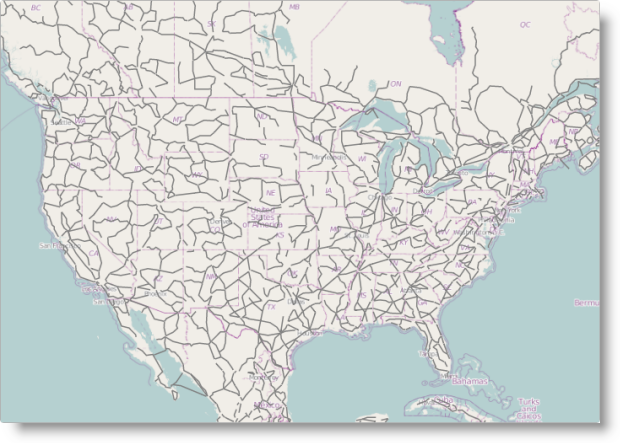

<!--
|metadata|
{
    "fileName": "igmap-configuring-geographic-polyline-series",
    "controlName": "igMap",
    "tags": ["Charting","Data Presentation","How Do I"]
}
|metadata|
-->

# Configuring Geographic Polyline Series (igMap)


##Topic Overview

### Purpose

This topic explains how to configure Geographic Polyline series using the `igMap`™ control.

### Required background

The following topics are prerequisites to understanding this topic:

-	[igMap Overview](Overview-igMap.html):This topic provides conceptual information about the `igMap` control including its main features, minimum requirements, and user interaction capabilities.

-	[Adding an igMap](Adding-igMap.html): This topic demonstrates how to add a simple map with basic features to a web page.


### In this topic

This topic contains the following sections:

-   [Introduction](#introduction)
-   [Geographic Polyline Series Configuration Summary](#configuration-summary)
-   [Code Examples Summary](#code-example)
    -   [Configuring Geographic Polyline Series in JavaScript](#config-series-js)
    -   [Configuring Geographic Polyline Series in ASP.NET MVC](#config-series-mvc)
    -   [Configuring Custom Shape Data Source](#config-custom-datasource)
-   [Related Content](#related-content)
    -   [Topics](#topics)
    -   [Samples](#samples)


##<a id="introduction"></a>Introduction

### Geographic Polyline series summary

The Geographic Polyline series of the `igMap` control is intended to draw polylines for geographic regions specified by shape file provided by your application. Polylines are open paths like roads or rivers described by the coordinates in a shape (SHP) file.

The shape files and their corresponding database DBF are always delivered in pairs with the corresponding database DBF files containing information related to each shape. Geographic Polyline series are useful for highlighting paths of interest on the map. This is suitable for depicting supply routes, major roads or tracking vehicles movements using GPS data.



You can control the color of polylines using CSS styles or options of the series object. Refer to the topic [Styling igMap](Styling-igMap.html) for more information.

Note:It is recommended to use smaller shape data sets when targeting mobile devices. Rendering geospatial data requires more computing resources and most mobile devices offer lower performance compared to desktop and laptop computers.


##<a id="configuration-summary"></a>Geographic Polyline Series Configuration Summary


### Geographic Polyline series configuration summary chart

The following table lists the configurable aspects of the `igMap` control available to the Geographic Polyline series.

<table class="table table-striped">
	<thead>
		<tr>
            <th>
Configurable aspect
			</th>

            <th>
Details
			</th>

            <th>
Properties
			</th>
        </tr>
	</thead>
	<tbody>
        

        <tr>
            <td>
Setting up the series type
			</td>

            <td>
These mandatory settings configure the type of the map series to Geographic Polyline and set series name.
			</td>

            <td>
                **In JavaScript:**

                <ul>
                    <li>
[series.type](%%jQueryApiUrl%%/ui.igMap#options:series.type)
					</li>

                    <li>
[series.name](%%jQueryApiUrl%%/ui.igMap#options:series.name)
					</li>
                </ul>
                Value:
                <br>**series.type: “geographicPolyline”** **series.type: “seriesName”**
                <br>
                
                    

                
                In ASP.NET MVC :
                <br>

                <ul>
                    <li>
                        [MapSeriesBuilder<t> Class](Infragistics.Web.Mvc~Infragistics.Web.Mvc.MapSeriesBuilder`1.html)</t>

                        <ul>
                            <li>
[.GeographicPolyline()](Infragistics.Web.Mvc~Infragistics.Web.Mvc.MapSeriesBuilder`1~GeographicPolyline.html)
							</li>
                        </ul>
                    </li>
                </ul>
                Value:
                <br>**series.GeographicPolyline(“seriesName”)**
            </td>
        </tr>

        <tr>
            <td>
Data binding options
			</td>

            <td>
These mandatory settings configure the URLs belonging to the shape and database files, or a custom data source.
			</td>

            <td>
                In JavaScript:

                <ul>
                    <li>
[series.shapeDataSource](%%jQueryApiUrl%%/ui.igMap#options:series.shapeDataSource)
					</li>

                    <li>
[series.databaseSource](%%jQueryApiUrl%%/ui.igMap#options:series.databaseSource)
					</li>
                </ul>In ASP.NET MVC:

                <ul>
                    <li>
                        [GeographicPolylineSeries<t> Class](Infragistics.Web.Mvc~Infragistics.Web.Mvc.GeographicPolylineSeries`1.html)</t>

                        <ul>
                            <li>
[.ShapeDataSource()](Infragistics.Web.Mvc~Infragistics.Web.Mvc.GeographicShapeSeriesBase`3~ShapeDataSource.html)
							</li>

                            <li>
[.DatabaseSource()](Infragistics.Web.Mvc~Infragistics.Web.Mvc.GeographicShapeSeriesBase`3~DatabaseSource.html)
							</li>
                        </ul>
                    </li>
                </ul>
            </td>
        </tr>

        <tr>
            <td>
Polyline color
			</td>

            <td>
This aspect configures the color of polylines whose default outline is white.
			</td>

            <td>
                In JavaScript:

                <ul>
                    <li>
[series.outline](%%jQueryApiUrl%%/ui.igMap#options:series.outline)
					</li>

                    <li>
[series.shapeStyle.stroke](%%jQueryApiUrl%%/ui.igMap#options:series.shapeStyle)
					</li>
                </ul>In ASP.NET MVC:

                <ul>
                    <li>
                        [GeographicPolylineSeries<t> Class](Infragistics.Web.Mvc~Infragistics.Web.Mvc.GeographicPolylineSeries`1.html)</t>

                        <ul>
                            <li>
[.Outline()](Infragistics.Web.Mvc~Infragistics.Web.Mvc.Series`3~Outline.html)
							</li>

                            <li>
[.ShapeStyle()](Infragistics.Web.Mvc~Infragistics.Web.Mvc.GeographicShapeSeriesBase`3~ShapeStyle.html)
							</li>
                        </ul>
                    </li>
                </ul>
            </td>
        </tr>

        <tr>
            <td>
Polyline thickness
			</td>

            <td>
This aspect configures the thickness of the polylines whose default thickness is 0.
			</td>

            <td>
                In JavaScript:

                <ul>
                    <li>
[series.thickness](%%jQueryApiUrl%%/ui.igMap#options:series.thickness)
					</li>

                    <li>
[series.shapeStyle.thickness](%%jQueryApiUrl%%/ui.igMap#options:series.shapeStyle)
					</li>
                </ul>In ASP.NET MVC:

                <ul>
                    <li>
                        [GeographicPolylineSeries<t> Class](Infragistics.Web.Mvc~Infragistics.Web.Mvc.GeographicPolylineSeries`1.html)</t>

                        <ul>
                            <li>
[.Thickness()](Infragistics.Web.Mvc~Infragistics.Web.Mvc.Series`3~Thickness.html)
							</li>

                            <li>
[.ShapeStyle()](Infragistics.Web.Mvc~Infragistics.Web.Mvc.GeographicShapeSeriesBase`3~ShapeStyle.html)
							</li>
                        </ul>
                    </li>
                </ul>
            </td>
        </tr>
    </tbody>
</table>


##<a id="code-example"></a>Code Examples Summary

### Code examples summary chart

The following table lists the code examples included in this topic.

Example|Description
---|---
[Configuring Geographic Polyline Series in JavaScript](#config-series-js)|This code example shows how to configure an `igMap` control to display Geographic Polyline series in JavaScript.
[Configuring Geographic Polyline Series in ASP.NET MVC](#config-series-mvc)|This code example shows how to configure an `igMap` control to display Geographic Polyline series in ASP.NET MVC.
[Configuring Custom Shape Data Source](#config-custom-datasource)|This code example shows how to configure an `igMap` control to display Geographic Polyline series with custom shape data source.

##<a id="config-series-js"></a>Code Example: Configuring Geographic Polyline Series in JavaScript

### Description

This code example shows how to configure an `igMap` control to display the Geographic Polyline series in JavaScript. The example shows how to specify the URLs for shape and database files along with the polyline color.

### Code

**In JavaScript:**

```js
Code
$("#map").igMap({
    ...
    series: [{
        type: "geographicPolyline",
        name: "seriesName",
        shapeDataSource: "/Data/America/geopolylines.shp",
        databaseSource: "/Data/geopolylines.dbf",
        outline: "grey"
    }],
    ...
    }
});
```


##<a id="config-series-mvc"></a>Code Example: Configuring Geographic Polyline Series in ASP.NET MVC

### Description

This code example shows how to configure an `igMap` control to display the Geographic Polyline series in ASP.NET MVC. The example demonstrates how to specify the URLs for shape and database files. Additionally, it configures the shape outline and fill colors; automatic marker selection; and marker outline and fill colors.

### Code

**In ASPX:**

```csharp
Code
<%= Html.Infragistics().Map()
        .ID("map")
        ...
        .Series(series => {
            series.GeographicPolyline("seriesName")
                .ShapeDataSource(Url.Content("~/Data/geopolylines.shp"))
                .DatabaseSource(Url.Content("~/Data/geopolylines.dbf"))
                .Outline("grey");
        })
        ...
        .DataBind()
        .Render()
%>
```


##<a id="config-custom-datasource"></a>Code Example: Configuring Custom Shape Data Source

### Description

This code example shows how to configure an `igMap` control to display the Geographic Polyline series with custom shape data source. The example shows the general structure of the data objects expected by the control. Additionally, it shows how to use the `igMap` control to configure the series object.

### Code

The following code snippet defines a JavaScript array that contains information about two shapes. Each shape contains a member called points that stores an array of paths. Each path is an array of geographical points and thus one polyline may contain multiple paths.

**In JavaScript:**

```js
var data = [
    {
        points: [
            [
                { x: 0, y: 0 },
                { x: 30, y: 0 },
                { x: 30, y: 30 },
                { x: 0, y: 30 }
            ],
            [
                { x: 5, y: 5 },
                { x: 35, y: 5 },
                { x: 35, y: 35 },
                { x: 5, y: 35 }
            ]
        ]
    }, 
    {
        points: [
            [
                { x: 40, y: 0 },
                { x: 70, y: 0 },
                { x: 70, y: 30 },
                { x: 40, y: 30 }
            ]
        ]
    }
];
```

The following code snippet configures the Geographic Polyline series using the custom data source specified in the previous example. The code explicitly sets the `shapeMemberPath` option to the name of the points data member of the shape objects. This allows you to store your shape data in an arbitrary object with different property names.

**In JavaScript:**

```js
$("#map").igMap({
    ...
    series: [{
        type: 'geographicPolyline',
        name: 'customShapeSource',
        dataSource: data,
        shapeMemberPath: "points",
        outline: "black"
    }],
    ...
});
```


##<a id="related-content"></a>Related Content

### <a id="topics"></a>Topics

The following topics provide additional information related to this topic.

-	[Configuring the Map Series (igMap)](igMap-Creating-Different-Kinds-Maps.html): This topic is a landing page linking to the topics explaining how to configure all supported map visualizations by the `igMap` control and how to use different background content (map providers).

-	[Configuring Features (igMap)](igMap-Configuring-Features.html): The topics in this group explain how to configure the various features of the `igMap` control. Features covered include navigation to specific geographic area, enabling/disabling of the Overview Plus Detail panel, getting the currently displayed area on the map, configuring interaction with the user regarding panning and zooming, configuring tooltip templates, and setting a custom marker.

-	[Data Binding (igMap)](Data-Binding-igMap.html): This topic explains how to bind the `igMap` control to different data sources depending on the map series visualized.

-	[Styling Maps (igMap)](Styling-igMap.html):This topic explains to customize the look-and-feel of the `igMap` control using themes.


### <a id="samples"></a>Samples

The following samples provide additional information related to this topic.

-	[Geographic Polyline Series](%%SamplesUrl%%/map/geo-polyline-series): This sample shows how to bind shape, database files and configure Geographic Polyline series.


 

 


