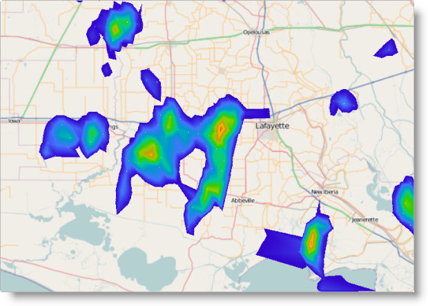

<!--
|metadata|
{
    "fileName": "igmap-configuring-geographic-scatter-area-series",
    "controlName": "igMap",
    "tags": ["Charting","Data Presentation","How Do I"]
}
|metadata|
-->

# Configuring Geographic Scatter Area Series (igMap)


##Topic Overview

### Purpose

This topic explains how to configure geographic scatter area series with the `igMap`™ control.

### Required background

The following topics are prerequisites to understanding this topic:

-	[igMap Overview](Overview-igMap.html): This topic provides conceptual information about the `igMap` control including its main features, minimum requirements and user interaction capabilities.

-	[Adding an igMap](Adding-igMap.html): This topic is a walkthrough for adding a simple `igMap` control with basic features to a web page.

### In this topic

This topic contains the following sections:

-   [Introduction](#introduction)
-   [Geographic Scatter Area Series Configuration Summary](#config-summary)
-   [Code Examples](#code-example)
    -   [Configuring Geographic Scatter Area Series in JavaScript](#config-series-js)
    -   [Configuring Geographic Scatter Area Series in ASP.NET MVC](#config-series-mvc)
    -   [Configuring Custom Triangulation Data Source](#config-custom-datasource)
-   [Related Content](#related-content)
    -   [Topics](#topics)
    -   [Samples](#samples)
    -   [External resources](#external-resources)


##<a id="introduction"></a>Introduction

### Geographic scatter area series summary

The geographic scatter area series of the `igMap` control plots regions specified by triangular irregular networks (TINs) from triangulation ITF files or other custom data sources. The TINs are a way to describe mathematically geographic surfaces in three dimensions.

Triangles from the source data are grouped in ranges with similar or close values and all triangles in these ranges are filled with specific color picked from a palette of colors configured with the map series object.

The range of possible values is divided into sub ranges with a sub range for each color in the palette. Thus, distributing colors evenly in the range between the minimum and maximum value from the data that are also configurable parameters. For every particular triangle, the correct sub range is found and the corresponding color picked. The minimum and the maximum values are drawn using the first and last colors from the palette respectively.

The geographic scatter area series are useful to represent terrain, weather information or any other data that describe a geospatial field. This could include, for example, the distribution of some value in space. This map series is compounded by the geographic contour line series that draws colored contour lines between areas to delineate them instead of filling entire ranges with color. On the picture, below you can see the geographic scatter area series used to depict precipitation data for an area in the United States.



You can control the palette color of polylines using CSS styles or options of the series object. Refer to the topic [Styling Maps (igMap)](Styling-igMap.html) for more information.

>**Note:**It is recommended to use smaller triangulation data sets when targeting mobile devices. Rendering geospatial data requires more computing resources and most mobile devices offer lower performance compared to desktop and laptop computers.


##<a id="config-summary"></a>Geographic Scatter Area Series Configuration Summary

### Geographic scatter area series configuration summary chart

The following table lists the configurable aspects of the `igMap` control regarding geographic scatter area series.

<table cellspacing="0" cellpadding="0" class="table table-striped">
	<tbody>
		<tr>
			<th>
				Configurable aspect
			</th>

			<th>
				Details
			</th>

			<th>
				Properties
			</th>
		</tr>

		<tr>
			<td>
				Set up geographic scatter area series
			</td>

			<td>
				These mandatory setting configures the type of the map series to geographic scatter area and sets the series’ name.
			</td>

			<td>
				In JavaScript:

				<ul>
					<li><a href="%%jQueryApiUrl%%/ui.igMap#options" target="_blank">series.type</a></li>

					<li><a href="%%jQueryApiUrl%%/ui.igMap#options" target="_blank">series.name</a></li>
				</ul><br/>Value:<br/>

				**series.type: “geographicScatterArea”**

				**series.type: “seriesName”**
				<br/><br/>
				In ASP.NET MVC:
				<br/>
				<ul>
					<li>
						<a href="Infragistics.Web.Mvc~Infragistics.Web.Mvc.MapSeriesBuilder`1.html" data-auto-update-caption="true">MapSeriesBuilder&lt;T&gt; Class</a>

						<ul>
							<li><a href="Infragistics.Web.Mvc~Infragistics.Web.Mvc.MapSeriesBuilder`1~GeographicScatterArea.html">.GeographicScatterArea()</a></li>
						</ul>
					</li>
				</ul><br />Value:<br />

				<br />**series.GeographicScatterArea(“seriesName”)**
			</td>
		</tr>

		<tr>
			<td>
				Bind to an ITF file
			</td>

			<td>
				Use this setting to configure for triangulation file’s URL.
			</td>

			<td>
				In JavaScript:

				<ul>
					<li><a href="%%jQueryApiUrl%%/ui.igMap#options:series.triangulationDataSource" target="_blank">series.triangulationDataSource</a></li>
				</ul>

				In ASP.NET MVC:

				<ul>
					<li>
						<a href="Infragistics.Web.Mvc~Infragistics.Web.Mvc.GeographicScatterAreaSeries`1.html" data-auto-update-caption="true">GeographicScatterAreaSeries&lt;T&gt; Class</a>

						<ul>
							<li><a href="Infragistics.Web.Mvc~Infragistics.Web.Mvc.GeographicXYTriangulatingSeries`3~TriangulationDataSource.html">.TriangulationDataSource()</a></li>
						</ul>
					</li>
				</ul>
			</td>
		</tr>

		<tr>
			<td>
				Bind to a custom triangles data source
			</td>

			<td>
				Use These settings to configure an array of objects with geospatial data that describe a field of geographical points and their associated numeric values.
			</td>

			<td>
				In JavaScript:

				<ul>
					<li><a href="%%jQueryApiUrl%%/ui.igMap#options:series.dataSource" target="_blank">series.dataSource</a></li>

					<li><a href="%%jQueryApiUrl%%/ui.igMap#options:series.longitudeMemberPath" target="_blank">series.longitudeMemberPath</a></li>

					<li><a href="%%jQueryApiUrl%%/ui.igMap#options:series.latitudeMemberPath" target="_blank">series.latitudeMemberPath</a></li>

					<li><a href="%%jQueryApiUrl%%/ui.igMap#options:series.colorMemberPath" target="_blank">series.colorMemberPath</a></li>
				</ul>

				Optional:

				<ul>
					<li><a href="%%jQueryApiUrl%%/ui.igMap#options:series.triangleVertexMemberPath1" target="_blank">series.triangleVertexMemberPath1</a></li>

					<li><a href="%%jQueryApiUrl%%/ui.igMap#options:series.triangleVertexMemberPath2" target="_blank">series.triangleVertexMemberPath2</a></li>

					<li><a href="%%jQueryApiUrl%%/ui.igMap#options:series.triangleVertexMemberPath3" target="_blank">series.triangleVertexMemberPath3</a></li>
				</ul>

				In ASP.NET MVC:

				<ul>
					<li>
						<a href="Infragistics.Web.Mvc~Infragistics.Web.Mvc.GeographicScatterAreaSeries`1.html" data-auto-update-caption="true">GeographicScatterAreaSeries&lt;T&gt; Class</a>

						<ul>
							<li><a href="Infragistics.Web.Mvc~Infragistics.Web.Mvc.GeographicXYTriangulatingSeries`3~LongitudeMemberPath.html">.LongitudeMemberPath()</a></li>

							<li><a href="Infragistics.Web.Mvc~Infragistics.Web.Mvc.GeographicXYTriangulatingSeries`3~LatitudeMemberPath.html">.LatitudeMemberPath()</a></li>

							<li><a href="Infragistics.Web.Mvc~Infragistics.Web.Mvc.GeographicScatterAreaSeries`1~ColorMemberPath.html">.ColorMemberPath()</a></li>
						</ul>
					</li>
				</ul>

				Optional:

				<ul>
					<li>
						<a href="Infragistics.Web.Mvc~Infragistics.Web.Mvc.GeographicScatterAreaSeries`1.html" data-auto-update-caption="true">GeographicScatterAreaSeries&lt;T&gt; Class</a>

						<ul>
							<li><a href="Infragistics.Web.Mvc~Infragistics.Web.Mvc.GeographicXYTriangulatingSeries`3~TriangleVertexMemberPath1.html">.TriangleVertexMemberPath1()</a></li>

							<li><a href="Infragistics.Web.Mvc~Infragistics.Web.Mvc.GeographicXYTriangulatingSeries`3~TriangleVertexMemberPath2.html">.TriangleVertexMemberPath2()</a></li>

							<li><a href="Infragistics.Web.Mvc~Infragistics.Web.Mvc.GeographicXYTriangulatingSeries`3~TriangleVertexMemberPath3.html">.TriangleVertexMemberPath3()</a></li>
						</ul>
					</li>
				</ul>
			</td>
		</tr>

		<tr>
			<td>
				Color palette
			</td>

			<td>
				Use this mandatory setting to configure the color palette for the triangles values.

				There is no default color palette value.
			</td>

			<td>
				In JavaScript:

				<ul>
					<li><a href="%%jQueryApiUrl%%/ui.igMap#options:series.colorScale.palette" target="_blank">series.colorScale.palette</a></li>
				</ul>

				In ASP.NET MVC:

				<ul>
					<li><a href="Infragistics.Web.Mvc~Infragistics.Web.Mvc.CustomPalette~Palette.html">CustomPalette.Palette()</a></li>
				</ul>
			</td>
		</tr>

		<tr>
			<td>
				Interpolation mode for values to colors mapping
			</td>

			<td>
				Use this setting to configure the logic that maps values to colors.
			</td>

			<td>
				In JavaScript:

				<ul>
					<li><a href="%%jQueryApiUrl%%/ui.igMap#options:series.colorScale.interpolationMode" target="_blank">series.colorScale.interpolationMode</a></li>
				</ul>

				In ASP.NET MVC:

				<ul>
					<li><a href="Infragistics.Web.Mvc~Infragistics.Web.Mvc.CustomPalette~InterpolationMode.html">CustomPalette.InterpolationMode()</a></li>
				</ul>
			</td>
		</tr>

		<tr>
			<td>
				Minimum value for color palette
			</td>

			<td>
				Use this setting to configure the minimum value for calculating value sub ranges.
			</td>

			<td>
				In JavaScript:

				<ul>
					<li><a href="%%jQueryApiUrl%%/ui.igMap#options:series.colorScale.minimumValue" target="_blank">series.colorScale.minimumValue</a></li>
				</ul>

				In ASP.NET MVC:

				<ul>
					<li><a href="Infragistics.Web.Mvc~Infragistics.Web.Mvc.CustomPalette~MinimumValue.html">CustomPalette.MinimumValue()</a></li>
				</ul>
			</td>
		</tr>

		<tr>
			<td>
				Maximum value for color palette
			</td>

			<td>
				Use this setting to configure the maximum value for calculating value sub ranges.
			</td>

			<td>
				In JavaScript:

				<ul>
					<li><a href="%%jQueryApiUrl%%/ui.igMap#options:series.colorScale.maximumValue" target="_blank">series.colorScale.maximumValue</a></li>
				</ul>

				In ASP.NET MVC:

				<ul>
					<li><a href="Infragistics.Web.Mvc~Infragistics.Web.Mvc.CustomPalette~MaximumValue.html">CustomPalette.MaximumValue()</a></li>
				</ul>
			</td>
		</tr>
	</tbody>
</table>


##<a id="code-example"></a>Code Examples

### Code examples summary

The following table lists the code examples included in this topic.

Example|Description
---|---
[Configuring Geographic Scatter Area Series in JavaScript](#config-series-js)|This code example shows how to configure an `igMap` control to display geographic scatter area series in JavaScript.
[Configuring Geographic Scatter Area Series in ASP.NET MVC](#config-series-mvc)|This code example shows how to configure an `igMap` control to display geographic shape series in ASP.NET MVC.
[Configuring Custom Triangulation Data Source](#config-custom-datasource)|This code example shows how to configure an `igMap` control to display geographic scatter area series with custom triangulation data source. 


##<a id="config-series-js"></a>Code Example: Configuring Geographic Scatter Area Series in JavaScript

### Description

This code example shows how to configure an `igMap` control to display the geographic scatter area series in JavaScript. The example shows how to specify the URL for a triangulated file, and define the color palette, with interpolation mode and minimum value.

### Code

**In JavaScript:**

```js
Code
$("#map").igMap({
    ...
    series: [{
        type: "geographicScatterArea",
        name: "seriesName",
        colorScale: {
            type: "customPalette",
            interpolationMode: "interpolateRGB",
            minimumValue: 0.15,
            palette: ["#3300CC", "#4775FF", "#0099CC", "#00CC99", "#33CC00", 
                "#99CC00", "#CC9900", "#FFC20A", "#CC3300"]
        },
        triangleVertexMemberPath1: "v1",
        triangleVertexMemberPath2: "v2",
        triangleVertexMemberPath3: "v3",
        longitudeMemberPath: "pointX",
        latitudeMemberPath: "pointY",
        colorMemberPath: "value",
        triangulationDataSource: "/Data/triangulation.itf"
    }],
    ...
});
```


##<a id="config-series-mvc"></a>Code Example: Configuring Geographic Scatter Area Series in ASP.NET MVC


### Description

This code example shows how to configure an `igMap` control to display the geographic scatter area series in ASP.NET MVC. The example shows how to specify the URL for a triangulated file, and define the color palette with interpolation mode and minimum value.

### Code

**In ASPX:**

```csharp
Code
<%= Html.Infragistics().Map()
        .ID("map")
        ...
        .Series(series => {
            series.GeographicScatterArea("seriesName")
                .ColorScale(cs => 
                    cs.CustomPalette()
                    .InterpolationMode(InterpolationMode.InterpolateRGB)
                    .MinimumValue(0.15)
                    .Palette(new List<string>() { 
                        "#3300CC", "#4775FF", "#0099CC", "#00CC99", "#33CC00", 
                        "#99CC00", "#CC9900", "#FFC20A", "#CC3300" 
                    })
                )
                .TriangleVertexMemberPath1("v1")
                .TriangleVertexMemberPath2("v2")
                .TriangleVertexMemberPath3("v3")
                .LongitudeMemberPath("pointX")
                .LatitudeMemberPath("pointY")
                .ColorMemberPath("value")
                .TriangulationDataSource(Url.Content("~/Data/triangulation.itf"));
        })
        ...
        .DataBind()
        .Render()
%>
```


##<a id="config-custom-datasource"></a>Code Example: Configuring Custom Triangulation Data Source

### Description

This code example shows how to configure an `igMap` control to display the geographic scatter area series with a custom triangulation data source. The example shows the general structure of the data objects expected by the control. The example also explains how to configure the igMap control’s series object.

### Code

The following code snippet defines a JavaScript array containing information about geographic points and their associated numeric values. The array contains identical objects with three data members. The latitude and longitude data members of every object define the geographical coordinates of the corresponding point. The value data member contains a numeric value associated with the point.

**In JavaScript:**

```js
var data = [
    { longitude: 0, latitude: 0, value: 1 },
    { longitude: 50, latitude: 0, value: 2 },
    { longitude: 50, latitude: 50, value: 3 },
    { longitude: 0, latitude: 50, value: 1 }
];
```

The following code snippet configures the geographic contour line series with the custom data source specified in the previous example. The code explicitly sets the `latitudeMemberPath`, `longitudeMemberPath` and `valueMemberPath` options with the names of the corresponding data members from the data array.

**In JavaScript:**

```js
$("#map").igMap({
    ...
    series: [{
        type: "geographicScatterArea",
        name: "seriesName",
        dataSource: data,
        latitudeMemberPath: "latitude",
        longitudeMemberPath: "longitude",
        colorMemberPath: "value",
        colorScale: {
            minimumValue: 1,
            interpolationMode: "select",
            palette: ["darkgreen", "green", 'limegreen', 'lightgreen']
        }
    }],
    ...
});
```

The data points defined in the data array need to be triangulated before rendering the control on the screen. This is done to help ensure the correct position and size of all colored areas to be found. You can find more information about the process of triangulation following the links given in the [Related Content: External resources](igMap-Configuring-Geographic-Scatter-Area-Series.html#external-resources) section.


##<a id="related-content"></a>Related Content

### <a id="topics"></a>Topics

The following topics provide additional information related to this topic.

-	[Configuring the Map Series (igMap)](igMap-Creating-Different-Kinds-Maps.html): This topic is a landing page linking to the topics explaining how to configure all supported map visualizations by the `igMap` control and how to use different background content (map providers).

-	[Configuring Features (igMap)](igMap-Configuring-Features.html): This topic is a landing page linking to the topics explaining how to configure various features of the `igMap` control.

-	[Data Binding (igMap)](Data-Binding-igMap.html): This topic explains how to bind the `igMap` control to different data sources depending on the map series visualized.

-	[Styling Maps (igMap)](Styling-igMap.html): This topic explains how the `igMap` control can be configured with regard to visual styling.


### <a id="samples"></a>Samples

The following samples provide additional information related to this topic.

-	[Geographic Scatter Area Series](%%SamplesUrl%%/map/geo-scatter-area):This sample demonstrates how to bind pre-triangulated files (.ITF) to a map control with the help of the geographic scatter area series.


### <a id="external-resources"></a>External resources

The following material (available outside the Infragistics family of content) provides additional information related to this topic.

-	[Triangulation (geometry)](http://en.wikipedia.org/wiki/Triangulation_%28geometry%29):This topic describes what the process of triangulation is from geometrical perspective.

-	[Triangulation](http://en.wikipedia.org/wiki/Triangulation): This Wikipedia topic describes what the process of triangulation is and provides some additional references to the subject.


 

 


