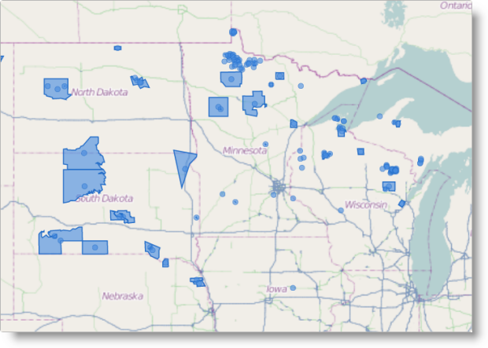

<!--
|metadata|
{
    "fileName": "igmap-configuring-geographic-shapes",
    "controlName": "igMap",
    "tags": ["Charting","Data Presentation","How Do I"]
}
|metadata|
-->

# Configuring Geographic Shapes Series (igMap)


##Topic Overview

### Purpose

This topic explains how to configure Geographic Shape Series using the `igMap`™ control.

### Required background

The following topics are prerequisites to understanding this topic:

-	[igMap Overview](Overview-igMap.html): This topic provides conceptual information about the `igMap` control including its main features, minimum requirements and user interaction capabilities.

- [Adding an igMap](Adding-igMap.html): This topic is a walkthrough for adding a simple `igMap` control with basic features to a web page.

### In this topic

This topic contains the following sections:

-   [Introduction](#introduction)
-   [Geographic Shape Series Configuration Summary](#config-summary)
-   [Code Examples Summary](#code-example)
    -   [Configuring Geographic Shape Series in JavaScript](#config-series-js)
    -   [Configuring Geographic Shape Series in ASP.NET MVC](#config-series-mvc)
    -   [Configuring Custom Shape Data Source](#config-custom-datasource)
-   [Related Content](#related-content)
    -   [Topics](#topics)
    -   [Samples](#samples)


##<a id="introduction"></a>Introduction

### Geographic shape series summary

The practical application of Geographic Shape Series of the `igMap` control is to draw shapes (or closed paths) for geographic regions specified by a shape file or a custom shape data source provided by your application. Shape files are always paired with corresponding database DBF files that contain information related to each shape. Custom shape data sources may provide information related to each shape in the form of properties or data objects as part of their internal structure.

The Geographic Shape series is useful for highlighting areas of interest on the world map. This is suitable for depicting political or administrative maps, market regions, or any other geographic region.



You can configure the `igMap` control to draw markers along with shapes, and you can create your custom markers. Refer to the topic [Configuring the Visual Features (igMap)](igMap-Configuring-Visual-Features.html) for more information.

You can control the outline and color of shapes and markers using CSS styles or options of the series object. Refer to the topic [Styling Maps (igMap)](Styling-igMap.html) for more information.

>**Note:** It is recommended to use smaller shape data sets when targeting mobile devices. Rendering geospatial data requires more computing resources and most mobile devices offer lower performance compared to desktop and laptop computers.


##<a id="config-summary"></a>Geographic Shape Series Configuration Summary

### Geographic Shape series configuration summary chart

The following table lists the configurable aspects of the `igMap` control’s geographic shape series.

<table cellspacing="0" cellpadding="0" class="table table-striped">
	<tbody>
		<tr>
			<th>
				Configurable aspect
			</th>

			<th>
				Details
			</th>

			<th>
				Properties
			</th>
		</tr>

		<tr>
			<td>
				Set up geographic shape series
			</td>

			<td>
				These mandatory settings are where you configure the type of map series to the geographic shape and set series name.
			</td>

			<td>
				In JavaScript:

				<ul>
					<li><a href="%%jQueryApiUrl%%/ui.igMap#options" target="_blank">series.type</a></li>

					<li><a href="%%jQueryApiUrl%%/ui.igMap#options" target="_blank">series.name</a></li>
				</ul><br>Value:
				<br>
				**series.type: “geographicShape”**,

				**series.type: “seriesName”**<br>

				In ASP.NET MVC:<br>

				<ul>
					<li>
						<a href="Infragistics.Web.Mvc~Infragistics.Web.Mvc.MapSeriesBuilder`1.html" data-auto-update-caption="true">MapSeriesBuilder&lt;T&gt; Class</a>

						<ul>
							<li><a href="Infragistics.Web.Mvc~Infragistics.Web.Mvc.MapSeriesBuilder`1~GeographicShape.html">.GeographicShape()</a></li>
						</ul>
					</li>
				</ul><br>Value:<br>

				**series.GeographicShape(“seriesName”)**
			</td>
		</tr>

		<tr>
			<td>
				Data binding options of geographic shape series
			</td>

			<td>
				These mandatory settings are where you configure the URLs for the shape and database files, or a custom shape data source.
			</td>

			<td>
				In JavaScript:

				<ul>
					<li><a href="%%jQueryApiUrl%%/ui.igMap#options" target="_blank">series.shapeDataSource</a></li>

					<li><a href="%%jQueryApiUrl%%/ui.igMap#options" target="_blank">series.databaseSource</a></li>
				</ul>

				In ASP.NET MVC:

				<ul>
					<li>
						<a href="Infragistics.Web.Mvc~Infragistics.Web.Mvc.GeographicShapeSeries`1.html" data-auto-update-caption="true">GeographicShapeSeries&lt;T&gt; Class</a>

						<ul>
							<li><a href="Infragistics.Web.Mvc~Infragistics.Web.Mvc.GeographicShapeSeriesBase`3~ShapeDataSource.html">.ShapeDataSource()</a></li>

							<li><a href="Infragistics.Web.Mvc~Infragistics.Web.Mvc.GeographicShapeSeriesBase`3~DatabaseSource.html">.DatabaseSource()</a></li>
						</ul>
					</li>
				</ul>
			</td>
		</tr>

		<tr>
			<td>
				Tooltips visibility
			</td>

			<td>
				Configure to enable tooltips rendering.

				By default, tooltips are disabled.
			</td>

			<td>
				In JavaScript:

				<ul>
					<li><a href="%%jQueryApiUrl%%/ui.igMap#options" target="_blank">series.showTooltip</a></li>
				</ul>

				In ASP.NET MVC:

				<ul>
					<li>
						<a href="Infragistics.Web.Mvc~Infragistics.Web.Mvc.GeographicShapeSeries`1.html" data-auto-update-caption="true">GeographicShapeSeries&lt;T&gt; Class</a>

						<ul>
							<li><a href="Infragistics.Web.Mvc~Infragistics.Web.Mvc.Series`3~ShowTooltip.html">.ShowTooltip()</a></li>
						</ul>
					</li>
				</ul>
			</td>
		</tr>

		<tr>
			<td>
				Tooltip template
			</td>

			<td>
				Configure to specify which template to use for rendering tooltips.
			</td>

			<td>
				In JavaScript:

				<ul>
					<li><a href="%%jQueryApiUrl%%/ui.igMap#options" target="_blank">series.tooltipTemplate</a></li>
				</ul>

				In ASP.NET MVC:

				<ul>
					<li>
						<a href="Infragistics.Web.Mvc~Infragistics.Web.Mvc.GeographicShapeSeries`1.html" data-auto-update-caption="true">GeographicShapeSeries&lt;T&gt; Class</a>

						<ul>
							<li><a href="Infragistics.Web.Mvc~Infragistics.Web.Mvc.Series`3~TooltipTemplate.html">.TooltipTemplate()</a></li>
						</ul>
					</li>
				</ul>
			</td>
		</tr>

		<tr>
			<td>
				Shape outline
			</td>

			<td>
				Configure the color of shape outlines.

				The default shape outline is black.
			</td>

			<td>
				In JavaScript:

				<ul>
					<li><a href="%%jQueryApiUrl%%/ui.igMap#options" target="_blank">series.outline</a></li>

					<li><a href="%%jQueryApiUrl%%/ui.igMap#options" target="_blank">series.shapeStyle.stroke</a></li>
				</ul>

				In ASP.NET MVC:

				<ul>
					<li>
						<a href="Infragistics.Web.Mvc~Infragistics.Web.Mvc.GeographicShapeSeries`1.html" data-auto-update-caption="true">GeographicShapeSeries&lt;T&gt; Class</a>

						<ul>
							<li><a href="Infragistics.Web.Mvc~Infragistics.Web.Mvc.Series`3~Outline.html">.Outline()</a></li>
						</ul>
					</li>
				</ul>
			</td>
		</tr>

		<tr>
			<td>
				Shape outline thickness
			</td>

			<td>
				Configure the thickness of shape outlines.

				By default, thickness is 0.
			</td>

			<td>
				In JavaScript:

				<ul>
					<li><a href="%%jQueryApiUrl%%/ui.igMap#options" target="_blank">series.thickness</a></li>

					<li><a href="%%jQueryApiUrl%%/ui.igMap#options" target="_blank">series.shapeStyle.thickness</a></li>
				</ul>

				In ASP.NET MVC:

				<ul>
					<li>
						<a href="Infragistics.Web.Mvc~Infragistics.Web.Mvc.GeographicShapeSeries`1.html" data-auto-update-caption="true">GeographicShapeSeries&lt;T&gt; Class</a>

						<ul>
							<li><a href="Infragistics.Web.Mvc~Infragistics.Web.Mvc.Series`3~Thickness.html">.Thickness()</a></li>

							<li><a href="Infragistics.Web.Mvc~Infragistics.Web.Mvc.GeographicShapeSeriesBase`3~ShapeStyle.html">.ShapeStyle()</a></li>
						</ul>
					</li>
				</ul>
			</td>
		</tr>

		<tr>
			<td>
				Shape fill
			</td>

			<td>
				Configure the fill color for shapes.

				The default shape fill is black.
			</td>

			<td>
				In JavaScript:

				<ul>
					<li><a href="%%jQueryApiUrl%%/ui.igMap#options" target="_blank">series.brush</a></li>

					<li><a href="%%jQueryApiUrl%%/ui.igMap#options" target="_blank">series.shapeStyle.fill</a></li>
				</ul>

				In ASP.NET MVC:

				<ul>
					<li>
						<a href="Infragistics.Web.Mvc~Infragistics.Web.Mvc.GeographicShapeSeries`1.html" data-auto-update-caption="true">GeographicShapeSeries&lt;T&gt; Class</a>

						<ul>
							<li><a href="Infragistics.Web.Mvc~Infragistics.Web.Mvc.Series`3~Brush.html">.Brush()</a></li>

							<li><a href="Infragistics.Web.Mvc~Infragistics.Web.Mvc.GeographicShapeSeriesBase`3~ShapeStyle.html">.ShapeStyle()</a></li>
						</ul>
					</li>
				</ul>
			</td>
		</tr>

		<tr>
			<td>
				Marker type
			</td>

			<td>
				Configure the control to specify marker selection for rendering.

				By default the control chooses the type and marker to render.
			</td>

			<td>
				In JavaScript:

				<ul>
					<li><a href="%%jQueryApiUrl%%/ui.igMap#options" target="_blank">series.markerType</a></li>
				</ul>

				In ASP.NET MVC:

				<ul>
					<li>
						<a href="Infragistics.Web.Mvc~Infragistics.Web.Mvc.GeographicShapeSeries`1.html" data-auto-update-caption="true">GeographicShapeSeries&lt;T&gt; Class</a>

						<ul>
							<li><a href="Infragistics.Web.Mvc~Infragistics.Web.Mvc.GeographicShapeSeries`1~MarkerType.html">.MarkerType()</a></li>
						</ul>
					</li>
				</ul>
			</td>
		</tr>

		<tr>
			<td>
				Custom marker template
			</td>

			<td>
				Configure an object with callback functions that render content directly on the Canvas element used for the map.
			</td>

			<td>
				In JavaScript:

				<ul>
					<li><a href="%%jQueryApiUrl%%/ui.igMap#options">series.markerTemplate</a></li>
				</ul>

				In ASP.NET MVC:

				<ul>
					<li>
						<a href="Infragistics.Web.Mvc~Infragistics.Web.Mvc.GeographicShapeSeries`1.html" data-auto-update-caption="true">GeographicShapeSeries&lt;T&gt; Class</a>

						<ul>
							<li><a href="Infragistics.Web.Mvc~Infragistics.Web.Mvc.GeographicShapeSeries`1~MarkerTemplate.html">.MarkerTemplate()</a></li>
						</ul>
					</li>
				</ul>
			</td>
		</tr>

		<tr>
			<td>
				Marker outline
			</td>

			<td>
				Configures the marker’s color outline.

				By default, the outline is black.
			</td>

			<td>
				In JavaScript:

				<ul>
					<li><a href="%%jQueryApiUrl%%/ui.igMap#options" target="_blank">series.markerOutline</a></li>
				</ul>

				In ASP.NET MVC:

				<ul>
					<li>
						<a href="Infragistics.Web.Mvc~Infragistics.Web.Mvc.GeographicShapeSeries`1.html" data-auto-update-caption="true">GeographicShapeSeries&lt;T&gt; Class</a>

						<ul>
							<li><a href="Infragistics.Web.Mvc~Infragistics.Web.Mvc.GeographicSymbolSeries`1~MarkerOutline.html">.MarkerOutline()</a></li>
						</ul>
					</li>
				</ul>
			</td>
		</tr>

		<tr>
			<td>
				Marker fill
			</td>

			<td>
				Configures the marker’s fill color.

				By default, the fill is black.
			</td>

			<td>
				In JavaScript:

				<ul>
					<li><a href="%%jQueryApiUrl%%/ui.igMap#options" target="_blank">series.markerBrush</a></li>
				</ul>

				In ASP.NET MVC:

				<ul>
					<li>
						<a href="Infragistics.Web.Mvc~Infragistics.Web.Mvc.GeographicShapeSeries`1.html" data-auto-update-caption="true">GeographicShapeSeries&lt;T&gt; Class</a>

						<ul>
							<li><a href="Infragistics.Web.Mvc~Infragistics.Web.Mvc.GeographicSymbolSeries`1~MarkerBrush.html">.MarkerBrush()</a></li>
						</ul>
					</li>
				</ul>
			</td>
		</tr>
	</tbody>
</table>

##<a id="code-example"></a>Code Examples Summary

### Code examples summary chart

The following table lists the code examples included in this topic.

Example|Description
---|---
[Configuring Geographic Shape Series in JavaScript](#config-series-js)|This code example shows how to configure an `igMap` control to display the geographic shape series in JavaScript.
[Configuring Geographic Shape Series in ASP.NET MVC](#config-series-mvc)|This code example shows how to configure an `igMap` control to display the geographic shape series in ASP.NET MVC
[Configuring Custom Shape Data Source](#config-custom-datasource)|This code example shows how to configure an `igMap` control to display the Geographic Shape series with a custom shape data source.


##<a id="config-series-js"></a>Code Example: Configuring Geographic Shape Series in JavaScript

### Description

This code example shows how to configure an `igMap` control to display the geographic shape series in JavaScript. The example shows how to specify the URLs for shape and database files. Configures the shape’s outline and fill colors area; automatic marker selection; and marker outline and fill colors.

### Code

**In JavaScript:**

```js
Code
$("#map").igMap({
    ...
    series: [{
        type: "geographicShape",
        name: "seriesName",
        markerType: "automatic",
        shapeMemberPath: "points",
        shapeDataSource: '/Data/geoshapes.shp',
        databaseSource: '/Data/geoshapes.dbf',
        brush: "rgba(68,138,223,.6)",
        outline: "blue",
        markerBrush: "rgba(50,100,100,0.7)", 
        markerOutline: "blue"
    }],
    ...
});
```


##<a id="config-series-mvc"></a>Code Example: Configuring Geographic Shape Series in ASP.NET MVC

### Description

This code example shows how to configure an `igMap` control to display the geographic shape series in ASP.NET MVC. The example shows how to specify the URLs for shape and database files. It configures the shape outline; fill colors area; automatic marker selection; and marker outline and fill colors.

### Code

**In ASPX:**

```csharp
Code
<%= Html.Infragistics().Map()
        ...
        .Series(series => {
            series.GeographicShape("seriesName")
                .ShapeDataSource(Url.Content("~/Data/geoshapes.shp"))
                .DatabaseSource(Url.Content("~/Data/geoshapes.dbf"))
                .ShapeMemberPath("points")
                .MarkerType(MarkerType.Automatic)
                .Brush("rgba(68,138,223,.6)")
                .Outline("blue");
                .MarkerBrush("rgba(50,100,100,0.7)")
                .MarkerOutline("blue");
        })
        ...
        .DataBind()
        .Render()
%>
```


##<a id="config-custom-datasource"></a>Code Example: Configuring Custom Shape Data Source

### Description

This code example shows how to configure an `igMap` control to display the geographic shape series with a custom shape data source. The shape source contains geospatial data about the location of individual shapes and its data attributes.

### Code

The following code snippet defines a JavaScript array containing information about two shapes. Each shape contains a member called points that stores an array of shapes. Each shape is an array of geographical points. The two objects in the array contain a data member called data, which can hold an arbitrary number of fields with shape related data. These data objects are bound to the corresponding shape by the control and are available in tooltip templates and event handing functions.

**In JavaScript:**

```js
var data = [
    {
        data: {
            attribute1: "String value 1",
            attribute2: 3.1415,
            attribute3: "12/21/2012"
        },
        points: [
            [
                { x: 0, y: 0 },
                { x: 30, y: 0 },
                { x: 30, y: 30 },
                { x: 0, y: 30 }
            ],
            [
                { x: 5, y: 5 },
                { x: 35, y: 5 },
                { x: 35, y: 35 }
            ]
        ]
    }, 
    {
        data: {
            attribute1: "String value 2",
            attribute2: 2.71828,
            attribute3: "03/14/2001"
        },
        points: [
            [
                { x: 40, y: 0 },
                { x: 70, y: 0 },
                { x: 70, y: 30 },
                { x: 40, y: 30 }
            ]
        ]
    }
];
```

The following code snippet configures Geographic Shape Series with the custom data source specified above. The code explicitly sets the `shapeMemberPath` option to the name of the points data member of the shape objects. This way you may store your shape data in an arbitrary object with different member names.

**In JavaScript:**

```js
$("#map").igMap({
    ...
    series: [{
        type: 'geographicShape',
        name: 'customShapeSource',
        dataSource: data,
        shapeMemberPath: "points",
        outline: "black",
        markerType: 'automatic',
        shapeStyle: {
            fill: "lightblue",
            stroke: "black",
            thickness: 8.0
        }
    }],
    ...
});
```


##<a id="related-content"></a>Related Content


### <a id="topics"></a>Topics

The following topics provide additional information related to this topic.

-	[Configuring the Map Series (igMap)](igMap-Creating-Different-Kinds-Maps.html): This topic is a landing page linking to the topics explaining how to configure all supported map visualizations by the `igMap` control and how to use different background content (map providers).

-	[Configuring Features (igMap)](igMap-Configuring-Features.html): This topic is a landing page linking to the topics explaining how to configure various features of the `igMap` control.

-	[Data Binding (igMap)](Data-Binding-igMap.html): This topic explains how to bind the `igMap` control to different data sources depending on the map series visualized.

-	[Styling Maps (igMap)](Styling-igMap.html):This topic explains how the `igMap` control can be configured with regard to visual styling.

### <a id="samples"></a>Samples

The following samples provide additional information related to this topic.

-	[Geographic Shapes Series](%%SamplesUrl%%/map/geo-shapes-series): This sample demonstrates how to bind shape files and database files to a map control and produce geographic shapes visualization.


 

 


