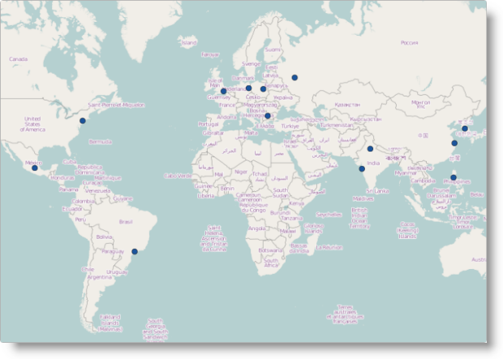

<!--
|metadata|
{
    "fileName": "igmap-configuring-geographic-symbol-series",
    "controlName": "igMap",
    "tags": ["Charting","Data Presentation","How Do I"]
}
|metadata|
-->

# Configuring Geographic Symbol Series (igMap)


##Topic Overview

### Purpose

This topic explains how to configure the Geographic Symbol series using the `igMap`™ control.

### Required background

The following topics are prerequisites to understanding this topic:

- [igMap Overview](Overview-igMap.html): This topic provides conceptual information about the `igMap` control including its main features, minimum requirements and user interaction capabilities.

- [Adding an igMap](Adding-igMap.html): This topic is a walkthrough for adding a simple `igMap` control with basic features to a web page.


### In this topic

This topic contains the following sections:

-   [Introduction](#introduction)
-   [Geographic Symbol Series Configuration Summary](#config-summary)
-   [Code Examples Summary](#code-example-summary)
    -   [Configuring Geographic Symbol Series in JavaScript](#config-series-js)
    -   [Configuring Geographic Symbol Series in ASP.NET MVC](#config-series-mvc)
-   [Related Content](#related-content)
    -   [Topics](#topics)
    -   [Samples](#samples)


##<a id="introduction"></a>Introduction


### Geographic symbol series summary

The geographic symbol series of the `igMap` plots the markers for the geographic points specified by the data in your application. This map series can be useful for highlighting points of interest in your particular business case like department stores, warehouses, or offices. Additional uses of this map series may be in a fleet management system or a GPS system for dynamic vehicle tracking.



With the help of the custom marker feature you can draw your own markers to convey information to the user in a different way. Refer to the topic [Configuring the Visual Features (igMap)](igMap-Configuring-Visual-Features.html) for more information.

You can control the outline and color of the markers using either the CSS styles or options of the series object. Refer to the topic [Styling Maps (igMap)](Styling-igMap.html) for more information.


## <a id="config-summary"></a>Geographic Symbol Series Configuration Summary

### Geographic Symbol series configuration summary chart

The following table lists the `igMap` control’s configurable aspects pertaining to the geographic symbol series.

<table class="table table-bordered">
	<thead>
		<tr>
            <th>
Configurable aspect
			</th>

            <th>
Details
			</th>

            <th>
Properties
			</th>
        </tr>
	</thead>
	<tbody>
        

        <tr>
            <td>
Set up geographic symbol series
			</td>

            <td>
Use these mandatory settings to configure the type of map series to the geographic symbol and set series name.
			</td>

            <td>
                In JavaScript:

                <ul>
                    <li>
[series.type](%%jQueryApiUrl%%/ui.igMap#options:series.type)
					</li>

                    <li>
[series.name](%%jQueryApiUrl%%/ui.igMap#options:series.name)
					</li>
                </ul>**
Value:


				**series.type: “geographicSymbol”**,

				**series.type: “seriesName”**


				In ASP.NET MVC:


				
					
						[MapSeriesBuilder Class](Infragistics.Web.Mvc~Infragistics.Web.Mvc.MapSeriesBuilder`1.html)

						
							[.GeographicSymbol()](Infragistics.Web.Mvc~Infragistics.Web.Mvc.MapSeriesBuilder`1~GeographicSymbol.html)
						
					
				
Value:


				**series.GeographicSymbol(“seriesName”)**
			**</td>
		</tr>

		<tr>
			<td>
Data binding options of geographic symbol series
			</td>

			<td>
Use these mandatory settings to configure which properties of the input data contain the geographic coordinates for drawing the points on the map.
			</td>

			<td>
				In JavaScript:

				<ul>
					<li>
[series.latitudeMemberPath](%%jQueryApiUrl%%/ui.igMap#options:series.latitudeMemberPath)
					</li>

					<li>
[series.longitudeMemberPath](%%jQueryApiUrl%%/ui.igMap#options:series.longitudeMemberPath)
					</li>
				</ul>

				In ASP.NET MVC:

				<ul>
					<li>
						[GeographicSymbolSeries<t> Class](Infragistics.Web.Mvc~Infragistics.Web.Mvc.GeographicSymbolSeries`1.html)</t>

						<ul>
							<li>
[.LatitudeMemberPath()](Infragistics.Web.Mvc~Infragistics.Web.Mvc.GeographicSymbolSeries`1~LatitudeMemberPath.html)
							</li>

							<li>
[.LongitudeMemberPath()](Infragistics.Web.Mvc~Infragistics.Web.Mvc.GeographicSymbolSeries`1~LongitudeMemberPath.html)
							</li>
						</ul>
					</li>
				</ul>
			</td>
		</tr>

		<tr>
			<td>
Tooltips visibility
			</td>

			<td>
Use these settings to enable or disable tooltip rendering.

				The default, settings for this control does not render tooltips.
			</td>

			<td>
				In JavaScript:

				<ul>
					<li>
[series.showTooltip](%%jQueryApiUrl%%/ui.igMap#options:series.showTooltip)
					</li>
				</ul>

				In ASP.NET MVC:

				<ul>
					<li>
						[GeographicSymbolSeries<t> Class](Infragistics.Web.Mvc~Infragistics.Web.Mvc.GeographicSymbolSeries`1.html)</t>

						<ul>
							<li>
[.ShowTooltip()](Infragistics.Web.Mvc~Infragistics.Web.Mvc.Series`3~ShowTooltip.html)
							</li>
						</ul>
					</li>
				</ul>
			</td>
		</tr>

		<tr>
			<td>
Tooltip template
			</td>

			<td>
Use this setting to configure which template to use for rendering the tooltips.
			</td>

			<td>
				In JavaScript:

				<ul>
					<li>
[series.tooltipTemplate](%%jQueryApiUrl%%/ui.igMap#options:series.tooltipTemplate)
					</li>
				</ul>

				In ASP.NET MVC:

				<ul>
					<li>
						[GeographicSymbolSeries<t> Class](Infragistics.Web.Mvc~Infragistics.Web.Mvc.GeographicSymbolSeries`1.html)</t>

						<ul>
							<li>
[.TooltipTemplate()](Infragistics.Web.Mvc~Infragistics.Web.Mvc.Series`3~TooltipTemplate.html)
							</li>
						</ul>
					</li>
				</ul>
			</td>
		</tr>

		<tr>
			<td>
Marker type
			</td>

			<td>
Use this setting to configure what marker is to be rendered by the control.

				By default marker is rendered and its type is chosen by the control.
			</td>

			<td>
				In JavaScript:

				<ul>
					<li>
[series.markerType](%%jQueryApiUrl%%/ui.igMap#options:series.markerType)
					</li>
				</ul>

				In ASP.NET MVC:

				<ul>
					<li>
						[GeographicSymbolSeries<t> Class](Infragistics.Web.Mvc~Infragistics.Web.Mvc.GeographicSymbolSeries`1.html)</t>

						<ul>
							<li>
[.MarkerType() ](Infragistics.Web.Mvc~Infragistics.Web.Mvc.GeographicSymbolSeries`1~MarkerType.html)
							</li>
						</ul>
					</li>
				</ul>
			</td>
		</tr>

		<tr>
			<td>
Custom marker template
			</td>

			<td>
Configure an object with callback functions which render content directly on the Canvas element used for the map.
			</td>

			<td>
				In JavaScript:

				<ul>
					<li>
[series.markerTemplate](%%jQueryApiUrl%%/ui.igMap#options:series.markerTemplate)
					</li>
				</ul>

				In ASP.NET MVC:

				<ul>
					<li>
						[GeographicSymbolSeries<t> Class](Infragistics.Web.Mvc~Infragistics.Web.Mvc.GeographicSymbolSeries`1.html)</t>

						<ul>
							<li>
[.MarkerTemplate()](Infragistics.Web.Mvc~Infragistics.Web.Mvc.GeographicSymbolSeries`1~MarkerTemplate.html)
							</li>
						</ul>
					</li>
				</ul>
			</td>
		</tr>

		<tr>
			<td>
Marker collision avoidance logic
			</td>

			<td>
Configures the behavior of the control when two or more markers overlap.

				By default overlapping markers are drawn one over the other.
			</td>

			<td>
				In JavaScript:

				<ul>
					<li>
[series.markerCollisionAvoidance](%%jQueryApiUrl%%/ui.igMap#options:series.markerCollisionAvoidance)
					</li>
				</ul>

				In ASP.NET MVC:

				<ul>
					<li>
						[GeographicSymbolSeries<t> Class](Infragistics.Web.Mvc~Infragistics.Web.Mvc.GeographicSymbolSeries`1.html)</t>

						<ul>
							<li>
[.MarkerCollisionAvoidance()](Infragistics.Web.Mvc~Infragistics.Web.Mvc.GeographicSymbolSeries`1~MarkerCollisionAvoidance.html)
							</li>
						</ul>
					</li>
				</ul>
			</td>
		</tr>

		<tr>
			<td>
Marker outline
			</td>

			<td>
Configures the color of marker outline.

				By default the outline is black.
			</td>

			<td>
				In JavaScript:

				<ul>
					<li>
[series.markerOutline](%%jQueryApiUrl%%/ui.igMap#options:series.markerOutline)
					</li>
				</ul>

				In ASP.NET MVC:

				<ul>
					<li>
						[GeographicSymbolSeries<t> Class](Infragistics.Web.Mvc~Infragistics.Web.Mvc.GeographicSymbolSeries`1.html)</t>

						<ul>
							<li>
[.MarkerOutline()](Infragistics.Web.Mvc~Infragistics.Web.Mvc.GeographicSymbolSeries`1~MarkerOutline.html)
							</li>
						</ul>
					</li>
				</ul>
			</td>
		</tr>

		<tr>
			<td>
Marker fill
			</td>

			<td>
Configures the fill color for markers.

				By default the fill is black.
			</td>

			<td>
				In JavaScript:

				<ul>
					<li>
[series.markerBrush](%%jQueryApiUrl%%/ui.igMap#options:series.markerBrush)
					</li>
				</ul>

				In ASP.NET MVC:

				<ul>
					<li>
						[GeographicSymbolSeries<t> Class](Infragistics.Web.Mvc~Infragistics.Web.Mvc.GeographicSymbolSeries`1.html)</t>

						<ul>
							<li>
[.MarkerBrush()](Infragistics.Web.Mvc~Infragistics.Web.Mvc.GeographicSymbolSeries`1~MarkerBrush.html)
							</li>
						</ul>
					</li>
				</ul>
			</td>
		</tr>
	</tbody>
</table>


##<a id="code-example-summary"></a>Code Examples Summary

### Code examples summary chart

The following table lists the code examples included in this topic.

Example|Description
---|---
[Configure Geographic Symbol Series in JavaScript](#config-series-js)|This code example shows how to configure an `igMap` control to display geographic symbol series in JavaScript.
[Configure Geographic Symbol Series in ASP.NET MVC](#config-series-mvc)|This code example shows how to configure an `igMap` control to display geographic symbol series in ASP.NET MVC.


##<a id="config-series-js"></a>Code Example: Configuring Geographic Symbol Series in JavaScript

### Description

This code example shows how to configure an `igMap` control to display geographic symbol series in JavaScript. The example shows how to specify the data binding options of the series. Automatic marker selection is configured along with marker collision avoidance logic, and marker outline and fill colors are specified too.

### Code

**In JavaScript:**

```js
$("#map").igMap({
    ...
    series: [{
        type: "geographicSymbol",
        name: "seriesName",
        dataSource: data,
        latitudeMemberPath: "Latitude",
        longitudeMemberPath: "Longitude",
        markerType: "automatic",
        markerCollisionAvoidance: "fade", 
        markerBrush: "rgba(50,100,100,0.7)", 
        markerOutline: "black"
    }],
    ...
    }
});
```


##<a id="config-series-mvc"></a>Code Example: Configuring Geographic Symbol Series in ASP.NET MVC

### Description

This code example shows how to configure an `igMap` control to display Geographic Symbol Series in ASP.NET MVC. The example shows how to specify the data model to be used for regular and strongly-typed view. Configure automatic marker selection along with marker collision avoidance logic, and marker outline and fill colors are specified too.

### Code

This code snippet configures geographic symbol series for a regular view.

**In ASPX:**

```csharp
<%= Html.Infragistics().Map<SampleApp.Models.GeoSymbols>()
        .ID("map")
        ...
        .Series(series => {
            series.GeographicSymbol("seriesName")
                .LatitudeMemberPath(item => item.Latitude)
                .LongitudeMemberPath(item => item.Longitude)
                .MarkerType(MarkerType.Automatic)
                .MarkerCollisionAvoidance(CollisionAvoidanceType.Fade)
                .MarkerBrush("rgba(50,100,100,0.7)")
                .MarkerOutline("black");
        })
        ...
        .DataBind()
        .Render()
%>
```

This code snippet configures geographic symbol series for a strongly-typed view.

**In ASPX:**

```csharp
<%= Html.Infragistics().Map(Model)
        .ID("map")
        ...
        .Series(series => {
            series.GeographicSymbol("seriesName")
                .LatitudeMemberPath(item => item.Latitude)
                .LongitudeMemberPath(item => item.Longitude)
                .MarkerType(MarkerType.Automatic)
                .MarkerCollisionAvoidance(CollisionAvoidanceType.Fade)
                .MarkerBrush("rgba(50,100,100,0.7)")
                .MarkerOutline("black");
        })
        ...
        .DataBind()
        .Render()
%>
```

##<a id="related-content"></a>Related Content

### <a id="topics"></a>Topics

The following topics provide additional information related to this topic.

-	[Configuring the Map Series (igMap)](igMap-Creating-Different-Kinds-Maps.html): This topic is a landing page linking to the topics explaining how to configure all supported map visualizations by the `igMap` control and how to use different background content (map providers).

-	[Configuring Features (igMap)](igMap-Configuring-Features.html): This topic is a landing page linking to the topics explaining how to configure various features of the `igMap` control.

-	[Data Binding (igMap)](Data-Binding-igMap.html): This topic explains how to bind the `igMap` control to different data sources depending on the map series visualized.

-	[Styling Maps (igMap)](Styling-igMap.html):This topic explains how the igMap control can be configured with regard to visual styling.


### <a id="samples"></a>Samples

The following samples provide additional information related to this topic.

-	[Geographic Symbol Series](%%SamplesUrl%%/map/geo-symbol-series): This sample demonstrates how to create maps and visualize geographic symbol series.


 

 


