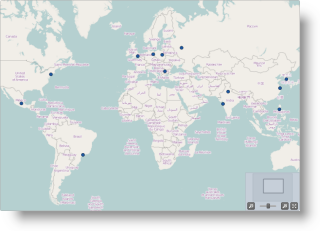
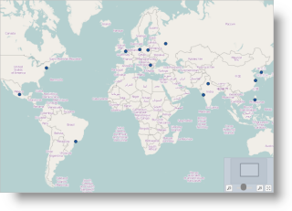

<!--
|metadata|
{
    "fileName": "styling-igmap",
    "controlName": "igMap",
    "tags": ["Charting","How Do I","Styling"]
}
|metadata|
-->

# Styling igMap


##Topic Overview

### Purpose

This topic explains to customize the look-and-feel of the `igMap`™ control using themes.

### Required background

The following table lists the topics, and external articles required as a prerequisite to understanding this topic.


**Concepts**

-   Cascading Style Sheets
-   Applying themes by changing linked CSS files

**Topics**

- [Styling and Theming in Ignite UI](Deployment-Guide-Styling-and-Theming.html): General information and a procedure for updating styles and themes in Ignite UI™ library.

-	[igMap Overview](Overview-igMap.html): This topic provides conceptual information about the `igMap` control including its main features, minimum requirements and user interaction capabilities.

-	[Adding an igMap](Adding-igMap.html): This topic is a walkthrough for adding a simple `igMap` control with basic features to a web page.


**External Resources**

-   [jQuery UI](http://jqueryui.com/)
-   [Theming jQuery UI](http://docs.jquery.com/UI/Theming)
-   [jQuery UI CSS Framework](http://docs.jquery.com/UI/Theming/API)


#### In this topic

This topic contains the following sections:

-   [Introduction](#introduction)
-   [Themes Overview](#overview)
-   [Required Cascading Style Sheets (CSS)](#required-css)
    -   [Required CSS summary](#required-css-summary)
    -   [Required CSS code: HTML](#required-css-html)
    -   [Required CSS code: ASPX](#required-css-aspx)
-   [Map Styling Options Reference](#map-styling-reference)
    -   [Map styling options reference summary](#map-styling-summary)
    -   [Map styling options reference summary chart](#map-styling-chart)
-   [Code Examples](#code-example)
-   [Code Example: Changing the Marker Fill and Outline](#marker-fill-outline)
-   [Code Example: Changing the Shape Fill and Outline](#shape-fill-outline)
-   [Code Example: Applying a Color Scale](#applying-color-scale)
-   [Code Example: Applying a Fill Scale](#applying-fill-scale)
-   [Code Example: Providing Custom Logic for the Shape Style](#custom-logic-shape-style)
-   [Related Content](#related-content)
    -   [Topics](#topics)
    -   [Samples](#samples)
    -   [Resources](#resources)


##<a id="introduction"></a>Introduction

### igMap summary

The `igMap` control is intended to allow developers to easily plot maps with application-specific overlays. The `igMap` control uses the jQuery UI CSS Framework for the purposes of applying styles and themes. By default, the `igMap` uses the IG theme which is a jQuery UI theme provided by Infragistics® for use in your applications. In addition to that, the IG theme has some map-specific styles. This is because, for the purpose of customizing the look of the maps, a general jQuery UI theme would not be sufficient. You will need to provide additional style classes that alter some map-specific elements like tooltips and Overview Plus Detail (OPD) screen.

Map series’ colors are controlled by options and depend on the particular series type used. For example, the Geographic Symbol and Geographic Shape series support markers, while the rest of the map series have other visual representation like polylines and contour lines or employ colored regions which depend on map data.

Detailed information about using themes with the Ignite UI library is available in the [Styling and Theming in Ignite UI](Deployment-Guide-Styling-and-Theming.html) topic.

>**Note:** The base theme of Ignite UI is not required for maps and you may safely omit it on pages containing only maps.


##<a id="overview"></a>Themes Overview

### Themes summary

Ignite UI offers the following themes you can use with the `igMap` control:

-   IG
-   Metro

They are explained in the [Themes summary chart](#themes-summary-chart) text block.

### <a id="themes-summary-chart"></a>Themes summary chart

The following table summarizes the available themes for the `igMap` control.
<table cellspacing="0" cellpadding="0" class="table">
	<tbody>
		<tr>
			<th colspan="2">
				Theme
			</th>

			<th>
				Description
			</th>
		</tr>

		<tr>
			<td>
				IG
			</td>

			<td>
				
			</td>

			<td>
				Path: {IG CSS root}/themes/infragistics/

				File: infragistics.theme.css

				This theme defines general visual features for all Ignite UI controls. Detailed information for using the IG theme is available in the <a class="ig-topic-link" href="Deployment-Guide-Styling-and-Theming.html" data-auto-update-caption="true">Styling and Theming in Ignite UI</a> topic.
			</td>
		</tr>

		<tr>
			<td>
				Metro
			</td>

			<td>
				
			</td>

			<td>
				Path: {IG CSS root}/themes/metro/

				File: infragistics.theme.css

				This theme defines visual features with regard to the new Windows® 8 Metro user interface and touch enabled devices. It features sharp corners and some different colors on the OPD panel.
			</td>
		</tr>
	</tbody>
</table>


##<a id="required-css"></a>Required Cascading Style Sheets (CSS)

### <a id="required-css-summary"></a>Required CSS summary

The following CSS resources are necessary to correctly render maps:

-   `infragistics.theme.css` – contains the IG Theme
-   `infragistics.ui.map.css` – contains the Chart Structure classes

In the code snippets that follow, it is assumed that the CSS resources are located in the **Content/ig** folder under the web site/application root.

>**Note:** The following blocks provide information for manually including required CSS files but the recommended way to load these files into your page is to use the Infragistics Loader control.

### <a id="required-css-html"></a>Required CSS code: HTML

**In HTML:**

```html
<link href="Content/ig/themes/Infragistics/infragistics.theme.css" rel="Stylesheet" />
<link href="Content/ig/structure/modules/infragistics.ui.map.css" rel="Stylesheet" />
```

### <a id="required-css-aspx"></a>Required CSS code: ASPX

**In ASPX:**

```csharp
<link href='<%= Url.Content("~/Content/ig/themes/Infragistics/infragistics.theme.css")%>' rel="stylesheet" type="text/css" />
<link href='<%= Url.Content("~/Content/ig/structure/modules/infragistics.ui.map.css")%>' rel="stylesheet" type="text/css" />
```

##<a id="map-styling-reference"></a>Map Styling Options Reference

### <a id="map-styling-summary"></a>Map styling options reference summary

The `igMap` control is predominantly a graphic-content control and has properties and styling options to manage all visual aspects of the control.

With individual options you can define:

-   Map series outline and fill color
-   Marker outline and fill color for a particular series
-   Palette of colors for a geographic scatter area or contour line series
-   Custom functions to calculate style for individual shapes in geographic shapes series
-   The background content provider and, optionally, the imagery set to be used from the provider
-   the background color to be displayed until all map tiles are loaded from the provider

When set, the map properties have precedence over style classes in CSS files. These properties provide for programmatically changing the look of maps at run-time

### <a id="map-styling-chart"></a>Map styling options reference summary chart

The following table summarizes the purpose and functionality of the `igMap` control’s featured properties.

Property|Description|Relevant to
---|---|---
[backgroundContent](%%jQueryApiUrl%%/ui.igMap#options:backgroundContent)|Configures the background content provider to be used for plotting the map. Currently supported providers are Bing® Maps and OpenStreetMap. For details, see the [Configuring the Map Provider (igMap)](igMap-Configuring-Map-Provider.html) topic.|All series
[plotAreaBackground](%%jQueryApiUrl%%/ui.igMap#options:plotAreaBackground)|Configures the brush used for the background for the current plot area, i.e. the background of the map which is shown while some map tiles are still being downloaded.|All series
[series[“key”].brush](%%jQueryApiUrl%%/ui.igMap#options:series.brush)|Configures the fill color for the main visual element of map series with name key.|Shape
[series[“key”].outline](%%jQueryApiUrl%%/ui.igMap#options:series.outline)|Configures the outline color for the main visual element of map series with name key.|<ul><li>Shape</li><li>Polyline</li></ul>
[series[“key”].markerBrush](%%jQueryApiUrl%%/ui.igMap#options:series.markerBrush)|Configures the fill color for the markers for map series with name key.|<ul><li>Symbol</li><li>Shape</li></ul>
[series[“key”].markerOutline](%%jQueryApiUrl%%/ui.igMap#options:series.markerOutline)|Configures the outline color for the map series with name key.|<ul><li>Symbol</li><li>Shape</li></ul>
[series[“key”].colorScale](%%jQueryApiUrl%%/ui.igMap#options:series.colorScale)|Configures a palette of colors to be used to represent the data range for geographic scatter area series.|Scatter area
[series[“key”].fillScale](%%jQueryApiUrl%%/ui.igMap#options:series.fillScale)|Configures a palette of colors to be used to plot lines for geographic contour line series.|Contour line
[series[“key”].shapeStyleSelector](%%jQueryApiUrl%%/ui.igMap#options:series.shapeStyleSelector)|Configures custom function for the  geographic shape series with name key which returns brush and outline settings for individual shapes.|Shape


##<a id="code-example"></a>Code Examples

### Code examples summary

The following table lists the code examples included in this topic.

Example|Description
---|---
[Code Example: Changing the Marker Fill and Outline](#marker-fill-outline)|This example shows how to configure custom fill and outline color to markers.
[Code Example: Changing the Shape Fill and Outline](#shape-fill-outline)|This example shows how to configure custom fill and outline color to geographic shapes.
[Code Example: Applying a Color Scale](#applying-color-scale)|This example shows how to configure color scale to geographic scatter area series.
[Code Example: Applying a Fill Scale](#applying-fill-scale)|This example shows how to configure color scale to geographic contour line series.
[Code Example: Providing Custom Logic for the Shape Style](#custom-logic-shape-style)|This example shows how to set custom shape style selection logic for geographic shapes series.


##<a id="marker-fill-outline"></a>Code Example: Changing the Marker Fill and Outline

### Description

This example shows how to configure custom fill and outline color to markers. Markers are plotted in geographic symbol and geographic shapes series. The example is shown in the context of geographic symbol series. The actual colors can be one of the [HTML color name constants](http://www.computerhope.com/htmcolor.htm) (e.g. “red”), the rgba syntax (e.g. rgba(100,100,100,0.5)) or hexadecimal color codes (e.g. “#347235”).

The table below shows how the same map looks by default and with the custom marker fill and outline colors from the example.

Default Markers|Custom Markers
---|---
|


### Code

The following code sets a black marker outline and a red marker fill in JavaScript with the help of the `markerBrush` and `markerOutline` options of the series object.

**In JavaScript:**

```js
$("#map").igMap({
    width: "700px",
    height: "500px",
    backgroundContent: {
        type: "openStreet"
    },
    series: [{
        type: "geographicSymbol",
        name: "worldCities",
        dataSource: data,
        latitudeMemberPath: "Latitude",
        longitudeMemberPath: "Longitude",
        markerType: "automatic",
        markerBrush: "red", 
        markerOutline: "black"
    }],
    windowRect: {
        left: 0.27,
        top: 0.20,
        height: 0.45,
        width: 0.45 
    }
});
```

The following code sets a black marker outline and a red marker fill in ASP.NET MVC with the help of the `MarkerBrush()` and `MarkerOutline()` calls of the MVC helper for the `igMap` control.

**In ASPX:**

```csharp
<%= Html.Infragistics().Map(Model)
        .ID("map")
        .Width("700px")
        .Height("500px")
        .BackgroundContent(bgr => bgr.OpenStreetMaps())
        .Series(series => {
            series.GeographicSymbol("worldCities")
                .LatitudeMemberPath(item => item.Latitude)
                .LongitudeMemberPath(item => item.Longitude)
                .MarkerType(MarkerType.Automatic)
                .MarkerBrush("red")
                .MarkerOutline("black");
        })
        .WindowRect(0.27, 0.20, 0.5, 0.5)
        .DataBind()
        .Render()
%>
```


##<a id="shape-fill-outline"></a>Code Example: Changing the Shape Fill and Outline

### Description

This example shows how to configure custom fill and outline color to geographic shapes. Shapes are plotted in Geographic Shapes series. The actual colors can be one of the [HTML color name constants](http://www.computerhope.com/htmcolor.htm) (e.g. “red”), the rgba syntax (e.g. rgba(100,100,100,0.5)) or hexadecimal color codes (e.g. “#347235”).

The table below shows how the same map looks by default and with the custom fill and outline colors from the example.

Default Colors|Custom Colors
---|---
|


### Code

The following code sets a blue outline and a light blue fill in JavaScript with the help of the brush and outline options of the series object.

**In JavaScript:**

```js
$("#map").igMap({
    width: "700px",
    height: "500px",
    backgroundContent: {
        type: "openStreet"
    },
    series: [{
        type: "geographicShape",
        name: "indianLands",
        shapeMemberPath: "points",
        shapeDataSource: '/Data/indlan.shp',
        databaseSource: '/Data/indlan.dbf',
        brush: "Lightblue",
        outline: "Blue"
    }],
    windowRect: {
        left: 0.2470, 
        top: 0.34, 
        width: 0.06, 
        height: 0.06
    }
});
```

The following code sets a blue outline and a light blue fill in ASP.NET MVC with the help of the `Brush()` and `Outline()` calls to the MVC helper for the `igMap` control.

**In ASPX:**

```csharp
<%= Html.Infragistics().Map()
        .ID("map")
        .Width("700px")
        .Height("500px")
        .BackgroundContent(bgr => bgr.OpenStreetMaps())
        .Series(series => {
            series.GeographicShape("indianLands")
                .ShapeMemberPath("points")
                .ShapeDataSource(Url.Content("~/Data/indlan.shp"))
                .DatabaseSource(Url.Content("~/Data/indlan.dbf"))
                .Brush("Lightblue")
                .Outline("Blue");
        })
        .WindowRect(0.2470, 0.34, 0.06, 0.06)
        .DataBind()
        .Render()
%>
```


##<a id="applying-color-scale"></a>Code Example: Applying a Color Scale

### Description

This example shows how to configure a custom-color scale palette to Geographic Scatter Area series. The actual colors can be one of the [HTML color name constants](http://www.computerhope.com/htmcolor.htm) (e.g. “red”), the rgba syntax (e.g. rgba(100,100,100,0.5)) or hexadecimal color codes (e.g. “#347235”).

The color scale palette is a set of colors from which the control chooses when plotting individual triangles from the triangulation data source. The color for each triangle depends on the value of the data bound to the triangle. The data member is designated by the `colorMemberPath` option.

The whole range of values in the file is divided by the number of colors in the palette provided and an index of ranges is calculated for each color. A color is selected depending on which range the value belongs to. An optional `minimumValue` and `maximumValue` options can narrow the range of values for triangles which are colored. For more details about the color selection logic see the [Configuring Geographic Scatter Area Series (igMap)](igMap-Configuring-Geographic-Scatter-Area-Series.html) topic.

The picture below shows how the map looks with the color scale from the example.


### Code

The following code in JavaScript sets a palette of colors with the help of the `colorScale` option of the series object.

**In JavaScript:**

```js
$("#map").igMap({
    width: "700px",
    height: "500px",
    series: [{
        type: "geographicScatterArea",
        name: "precipitation",
        colorScale: {
            type: "customPalette",
            interpolationMode: "interpolateRGB",
            minimumValue: 0.15,
            palette: [
                "#3300CC", "#4775FF", "#0099CC", "#00CC99", "#33CC00",
                "#99CC00", "#CC9900", "#FFC20A", "#CC3300"
            ]
        },
        colorMemberPath: "value",
        triangulationDataSource: "/Data/precipitation.itf"
    }],
    windowRect: {
        left: 0.31,
        top: 0.375,
        height: 0.025,
        width: 0.025
    }
});
```

The following code in ASP.NET MVC sets a palette of colors with the help of the `ColorScale()` call of the MVC helper for the `igMap` control.

**In ASPX:**

```csharp
<%= Html.Infragistics().Map()
        .ID("map")
        .Width("700px")
        .Height("500px")
        .Series(series => {
            series.GeographicScatterArea("precipitation")
                .ColorScale(cs =>
                    cs.CustomPalette()
                        .InterpolationMode(InterpolationMode.InterpolateRGB)
                        .MinimumValue(0.15)
                        .Palette(new List<string>() { 
                            "#3300CC", "#4775FF", "#0099CC", "#00CC99", "#33CC00",
                            "#99CC00", "#CC9900", "#FFC20A", "#CC3300" 
                        }))
                .ColorMemberPath("value")
                .TriangulationDataSource(Url.Content("~/Data/ precipitation.itf"));
        })
        .WindowRect(0.31, 0.375, 0.025, 0.025)
        .DataBind()
        .Render()
%>
```


##<a id="applying-fill-scale"></a>Code Example: Applying a Fill Scale

### Description

This example shows how to configure a custom fill scale palette to Geographic Contour Line series. The actual colors can be one of the [HTML color name constants](http://www.computerhope.com/htmcolor.htm) (e.g. “red”), the rgba syntax (e.g. rgba(100,100,100,0.5)) or hexadecimal color codes (e.g. “#347235”).

The fill scale palette is a set of colors from which the control chooses when plotting contour lines. The contour line delineates regions on the map where the values associated to the triangles differ between two ranges. The data member is designated by the `valueMemberPath` option. The whole range of values in the file is divided by the number of colors in the palette provided and an index of ranges is calculated for each color. A color is selected depending on which range the value belongs to. An optional `minimumValue` and `maximumValue` options can narrow the range of values for triangles which are colored. For details about the color selection logic, see the [Configuring Geographic Contour Line Series (igMap)](igMap-Configuring-Geographic-Contour-Line-Series.html) topic.

The picture below shows how the map looks with the fill scale from the example.


### Code

The following code in JavaScript sets a palette of colors with the help of the `fillScale` option of the series object.

**In JavaScript:**

```js
$("#map").igMap({
    width: "700px",
    height: "500px",
    verticalZoomable: true,
    horizontalZoomable: true,
    series: [{
        type: "geographicContourLine",
        name: "precipitation",
        fillScale: {
            type: "value",
            brushes: [
                "#3300CC", "#4775FF", "#0099CC", "#00CC99", "#33CC00",
                "#99CC00", "#CC9900", "#FFC20A", "#CC3300"
            ]
        },
        valueMemberPath: "value",
        triangulationDataSource: "/Data/precipitation.itf"
    }],
    windowRect: {
        left: 0.31,
        top: 0.375,
        height: 0.025,
        width: 0.025
    }
});
```

The following code in ASP.NET MVC sets a palette of colors with the help of the `FillScale()` call of the MVC helper for the `igMap` control.

**In ASPX:**

```csharp
<%= Html.Infragistics().Map()
        .ID("map")
        .Width("700px")
        .Height("500px")
        .Series(series => {
            series.GeographicContourLine("precipitation")
                .FillScale(scale => scale.Value()
                    .Brushes(new List<string>() { 
                        "#3300CC", "#4775FF", "#0099CC", "#00CC99", "#33CC00", 
                        "#99CC00", "#CC9900", "#FFC20A", "#CC3300" 
                    })
                )
                .ValueMemberPath("value")
                .TriangulationDataSource(Url.Content("~/Data/ precipitation.itf"));
        })
        .WindowRect(0.31, 0.375, 0.025, 0.025)
        .DataBind()
        .Render()
%>
```


##<a id="custom-logic-shape-style"></a>Code Example: Providing Custom Logic for the Shape Style

### Description

There are many applications for geographic shapes maps with custom colors for individual shapes. These can be political maps showing different map regions, demographic maps showing population or population density, or financial maps showing different key performance indicators for different regions.

The igMap control allows, for the Geographic Shapes Series, a function to be specified which applies custom logic to select proper fill and outline color for individual shapes. It is called before each shape is drawn on the map and is passed the data bound to the shape.

The picture below shows the World map with countries drawn in different colors based on the population size.


### Code

1.  Color selection logic.

	The custom color selection logic in the example works based on a palette of colors and a range of values. It calculates interval of values based on the range size and the number of available colors in the palette. After that, whenever the logic is invoked with a concrete value for a map shape, it calculates to which interval the value belongs and returns the corresponding color from the palette.
	
	The following code defines a variable `colorPicker` and assigns it with a `ColorPickerByIndex` object initialized with 100 000 and 500 000 000 as minimum and maximum values.
	
	**In JavaScript:**
	
	```js
	var colorPicker = new ColorPickerByIndex(100000, 500000000);
	function ColorPickerByIndex(min, max) {
	    //  Initialize internal state
	    var brushes = ["DeepSkyBlue", "blue", "DarkCyan", "coral", "orange", "Darkorange" ];
	    var min = min;
	    var max = max;
	    var interval = (max - min) / (brushes.length - 1)
	    this.getColorByIndex = function (val) {
	        var index = Math.round(val / interval);
	        if (index < 0) {
	            index = 0;
	        }
	        else if (index > (brushes.length - 1)) {
	            index = brushes.length - 1;
	        }
	        return brushes[index];
	    }
	}
	```

2.  Map instantiation.

	The following code in JavaScript defines a variable named `populationStyleSelector` and assigns a color selection object to it. The `selectStyle` member of the color selection object points to an anonymous function which receives an argument called shape with all data bound to the shape. The anonymous function gets the POP_COUNTRY field from the data and invokes the `colorPicker` object’s `getColorByIndex()` method with the country population to get the proper fill color for the shape.
	
	**In JavaScript:**
	
	```js
	var populationStyleSelector = {
	    selectStyle: function (shape) {
	        var pop = shape.fields.item("POP_CNTRY");
	        var popInt = parseInt(pop);
	        var colString = colorPicker.getColorByIndex(popInt);
	        return {
	            fill: colString,
	            stroke: "gray"
	        };
	    }
	}
	```
	
	The following code in JavaScript instantiates an `igMap` control with Geographic Shape series and assigns the color selection object from the variable `populationStyleSelector` to the `shapeStyleSelector` option of the series object.
	
	**In JavaScript:**
	
	```js
	$("#map").igMap({
	    width: "700px",
	    height: "500px",
	    backgroundContent: {
	        type: "openStreet"
	    },
	    series: [{
	        type: "geographicShape",
	        name: "worldCountries",
	        markerType: "none",
	        shapeMemberPath: "points",
	        shapeDataSource: "/Data/world.shp",
	        databaseSource: "/Data/world.dbf",
	        shapeStyleSelector: populationStyleSelector
	    }],
	    windowRect: {
	        left: 0.27,
	        top: 0.2,
	        height: 0.5,
	        width: 0.5
	    }
	});
	```
	
	Here follows an identical map instantiation code in ASP.NET MVC. In this case, the shape style selector must be configured after the map has been created.
	
	**In ASPX:**
	
	```csharp
	<%= Html.Infragistics().Map()
	        .ID("map")
	        .Width("700px")
	        .Height("500px")
	        .BackgroundContent(bgr => bgr.OpenStreetMaps())
	        .Series(series =>
	        {
	            series.GeographicShape("worldCountries")
	                .ShapeMemberPath("points")
	                .ShapeDataSource(Url.Content("~/Data/world.shp"))
	                .DatabaseSource(Url.Content("~/Data/world.dbf"))
	                .ShapeStyleSelector("populationStyleSelector")
	                .MarkerType(MarkerType.None);
	        })
	        .WindowRect(0.27, 0.20, 0.5, 0.5)
	        .DataBind()
	        .Render()
	%>
	```


##<a id="related-content"></a>Related Content

### <a id="topics"></a>Topics

The following topics provide additional information related to this topic.

- [Configuring the Visual Features (igMap)](igMap-Configuring-Visual-Features.html): This topic shows how to configure visual features of the `igMap` control like cross hairs, tooltip templates, marker templates and other.

- [Configuring the Map Series (igMap)](igMap-Creating-Different-Kinds-Maps.html): This topic is a landing page linking to the topics explaining how to configure all supported map visualizations by the `igMap` control and how to use different background content (map providers).


### <a id="samples"></a>Samples

The following samples provide additional information related to this topic.

- [Geographic Symbol Series](%%SamplesUrl%%/map/geo-symbol-series): This sample demonstrates how to create maps and visualize geographic symbol series.

- [Geographic Shapes Series](%%SamplesUrl%%/map/geo-shapes-series): This sample demonstrates how to bind shape files and database files to a map control and produce geographic shapes visualization.

- [Geographic Polyline Series](%%SamplesUrl%%/map/geo-polyline-series): This sample shows how to bind shape and database files and configures geographic polyline map series.

- [Geographic Scatter Area Series](%%SamplesUrl%%/map/geo-scatter-area):This sample demonstrates how to bind pre-triangulated (ITF) files to a map control with the help of the geographic scatter area series.

- [Geographic Contour Line Series](%%SamplesUrl%%/map/geo-contour-line): This sample demonstrates how to bind pre-triangulated (ITF) files to a map control and configure geographic contour line series.

### <a id="resources"></a>Resources

The following material (available outside the Infragistics family of content) provides additional information related to this topic.

- [jQuery Themeroller](http://jqueryui.com/themeroller/): Provides jQuery UI themes for preview and download.