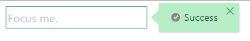
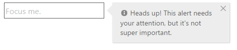
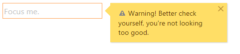
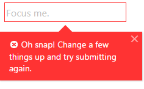
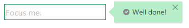

<!--
|metadata|
{
    "fileName": "ignotifier-overview",
    "controlName": "igNotifier",
    "tags": ["Getting Started"]
}
|metadata|
-->

# igNotifier Overview

The `igNotifier` is a new control extending the existing `igPopover` widget to provide a notification control that can display messages, optional icons and also apply state styles on its targets. The notifications can be in four states in order of importance: success, info, warning and error. The controllable notification level allows to limit the types of notification.

The main purpose of the `igNotifier` is to offer more informative feedback about the state of the `igEditors` or other editor targets. The notifications that are displayed are not only related to the errors or success messages that may appear, but also provide warnings and additional information messages that are related to the specifics of the different editors. What is more from user experience point of view the notifier is offering different UI depending on the type of the message. With easy to recognize and intuitive styles and images the different notifications bring meaningful messages.

###In this topic

This topic contains the following sections:

- [Levels of importance](#levels-importance)
	- [Success](#success)
	- [Info](#info)
	- [Warning](#warning)
	- [Error](#error)
-	[Setting up the igNotifier](#setting-up)
-	[Related Content](#related-content)


## <a id="levels-importance"></a>Levels of importance

The different messages can be are ordered in level of importance in the hierarchy starting from the success message and ending with the error one. The `igNotifier` defines styles and default messages applied for each.

### <a id="success"></a>Success

The text of all the messages can be customize. Later in this topic we will see how to accomplish this task.

The success notification is visually displayed with the input container as well as the respective message in green. The default message text is "Success" and the "√" icon is also provided if enabled though the `showIcon` option.  

```js
$('#success').igNotifier({
  showOn: "focus",
  state: "success" ,
  showIcon: "true",
  mode:"popover",
  direction:"right"
});
```



### <a id="info"></a>Info

The gray color is accompanying the info message notifications so they would appear neutral in most themes. This type of notification is the second in the hierarchy level. Since the message in intended to provide information about the specific state of the system or the action expected from the user, there is no default and it can be set via the [`messages`](%%jQueryApiUrl%%/ui.igNotifier#options:messages) option. The input border remains unchanged for this state.

```js
$('#info').igNotifier({
    direction: "right",
	showIcon: "true",
    messages: {
      info: "Heads up! This alert needs your attention, but it's not super important."
    }
}).igNotifier("notify", "info");  
```



### <a id="warning"></a>Warning

At the third level is the warning message. The borders of the input container as well as the notification are colored in yellow. The role that this notification message plays is to notify the users when they interacted with the system not quite right, but their actions will not prevent the system to proceed to the next step.


```js
$('#warning').igNotifier({
    direction: "right",
	showIcon: "true",
    messages: {
      warning: "Warning! Better check yourself, you're not looking too good."
    }
}).igNotifier("notify", "warning");
```



### <a id="error"></a>Error

Last but not least is the error messages. As expected the representative color is red. Those messages are used to inform the users that they did something wrong and the system won't be able to proceed unless the issue is fixed. Please note that if you want your message to be displayed in a popover, you should explicitly set the mode property.

```js
$('#error').igNotifier({
    mode: "popover",
	showIcon: "true",
    messages: {
      error: "Oh snap! Change a few things up and try submitting again."
    }
}).igNotifier("notify", "error");
```



## <a id="setting-up"></a>Setting up the igNotifier

The `igNotifier` can be initialized on any target, however to use with complex controls such as the igEditors, both should be initialized on the same containing DIV DOM element - this is to ensure the actual target and the border CSS applied to it remain visible. The following example demonstrates how to accomplish that:

```html
<div id="notifier"></div>
```

```js
$('#notifier').igTextEditor({
  placeHolder: "Focus me."
});

$('#notifier').igNotifier({
    direction: "right",
    messages: {
      success: "Well done!"
    }
}).igNotifier("notify", "success");

```



As every other control, the `igNotifier` has its own properties that allow the users to customize the way the notifications look. You can for example use the `direction` property to specify the position of the messages. It can be situated on either side of the editors input.

Another worth mentioning option is the [`mode`](%%jQueryApiUrl%%/ui.igNotifier#options:mode). You can choose between `popover` and `inline` display modes. The default value is auto. This means that the notifier sets popover mode for info and warning messages and inline for the success and the error messages.

You can use the `messages` property to customize the default text that is going to be displayed for a specific state or provide it as a last parameter of the `notify` method.

The whole list of available options and detailed description can be found in the [igNotifier jQuery API](%%jQueryApiUrl%%/ui.igNotifier) API documentation.

## <a id="related-content"></a> Related Content

- [Notifier Basic Usage sample](%%SamplesUrl%%/notifier/basic-usage)
- [Notifier Inline messages sample](%%SamplesUrl%%/notifier/inline-messages)
- [Notifier with igEditors sample](%%SamplesUrl%%/editors/with-igEditors)
-	[igNotifier jQuery API](%%jQueryApiUrl%%/ui.igNotifier)
