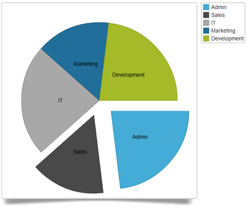
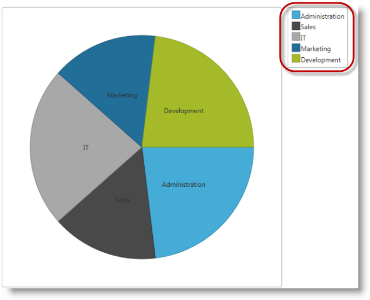
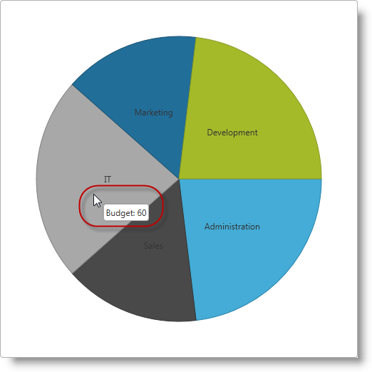
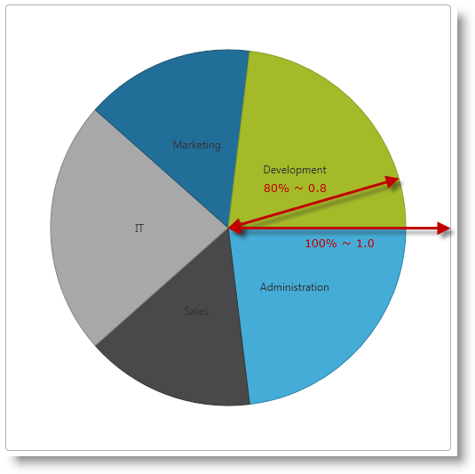
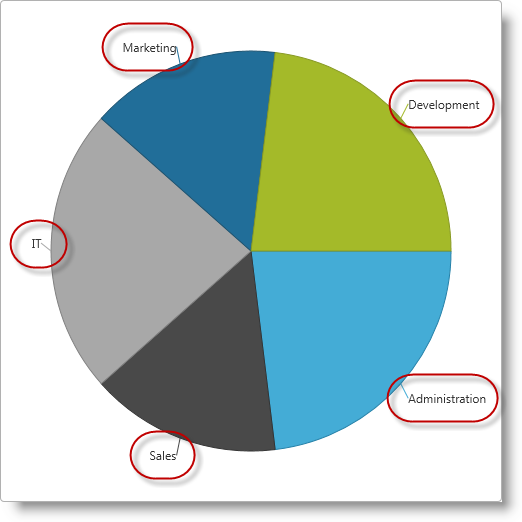
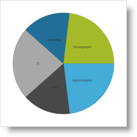
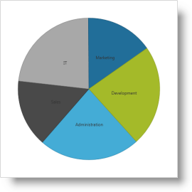
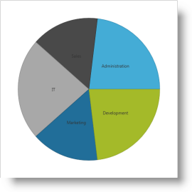
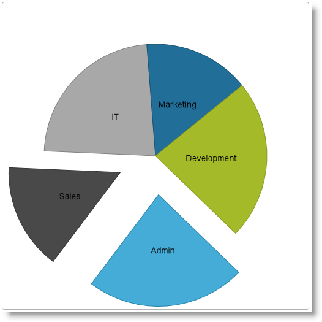

<!--
|metadata|
{
    "fileName": "igpiechart-overview",
    "controlName": "igDataChart",
    "tags": ["Charting","Getting Started"]
}
|metadata|
-->

# igPieChart Overview

##Topic Overview

### Purpose

This topic provides conceptual information about the `igPieChart`™ control including its main features, minimum requirements, and user functionality.

### Required background

The following table lists the materials required as a prerequisite to understanding this topic.

**Concepts**

-   Charting
-   Pie Charts
-   Data visualization

**Topics**

- [%%ProductName%% Overview](NetAdvantage-for-jQuery-Overview.html): General information on the %%ProductName%%™ library.

### In this topic

This topic contains the following sections:

-   [**Introduction**](#introduction)
-   [**Minimum Requirements**](#min-requirements)
    -   [Introduction](#min-requirements-introduction)
    -   [Requirements summary chart](#requirements-summary-chart)
	-   [Main Features](#main-features)
-   [**User Interaction and Usability**](#user-interaction)
-   [**Related Content**](#related-content)

##Introduction

### Introduction to igPieChart

The `igPieChart` is a charting control for rendering pie charts into HTML5 Web applications and sites. It uses the new HTML5 Canvas tag to plot pie charts on web pages.

The main features of `igPieChart` include legend, tooltips based on templates, controlling pie radius, controlling pie label position, start angle, sweep direction, exploded slices and distance from center for exploded slices. For details on individual features refer to [Main Features](#main-features).

##Minimum Requirements

### Introduction

The igPieChart control is a jQuery UI widget and, therefore, depends on the jQuery and jQuery UI libraries. The Modernzr library is also used internally for detecting browser and device capabilities. The control uses several %%ProductName%%™ shared resources for functionality and data binding. References to these resources are needed nevertheless, in spite of pure jQuery or ASP.NET MVC helpers being used. The `Infragistics.Web.Mvc` assembly is required when the control is used in the context of ASP.NET MVC.

### Requirements summary chart

The following table summarizes the requirements for using the `igPieChart` control

<table class="table">
	<thead>
		<tr>
            <th>
Requirement
			</th>

            <th>
Description
			</th>
        </tr>
	</thead>
	<tbody>
        

        <tr>
            <td>
HTML5 canvas API
			</td>

            <td>
The functionality of the charting library is based on the HTML5 Canvas tag and its related API. Any web browser that supports these will be able to render and display charts generated by the igPieChart control. No other HTML5 features are required for the operation of the igPieChart control. The topic [Canvas Element: Support](http://en.wikipedia.org/wiki/Canvas_element#Support) from [Wikipedia™](http://en.wikipedia.org/wiki/Main_Page) details which versions of the most popular desktop and mobile web browsers support the HTML5 Canvas API.
			</td>
		</tr>

		<tr>
			<td>
jQuery and jQuery UI JavaScript resources
			</td>

			<td>
				%%ProductName%% is built on top of these frameworks:

				<ul>
					<li>
[jQuery](http://docs.jquery.com/Main_Page)
					</li>

					<li>
[jQuery UI](http://jqueryui.com/)
					</li>
				</ul>
			</td>
		</tr>

		<tr>
			<td>
Modernizr
			</td>

			<td>
				The Modernizr library is used by the igPieChart to detect browser and device capabilities. It is not mandatory and if not included the control will behave as if it works in a normal desktop environment with HTML5 compatible browser.

				<ul>
					<li>
[Modernizr](http://modernizr.com/docs/)
					</li>
				</ul>
			</td>
		</tr>

		<tr>
			<td>
Charting JavaScript resources
			</td>

			<td>
				The charting functionality of the %%ProductName%% library is distributed across several files depending on the series type. Also, there is a separate pie chart JavaScript file which must be linked to you HTML or MVC views.

				In case you wish to include resources manually, you need to use the dependencies listed in the following table.

				<table class="table">
	<thead>
		<tr>
							<th>
JS Resource
			</th>

							<th>
Description
			</th>
						</tr>
	</thead>
	<tbody>
						

						<tr>
							<td>
						`infragistics.util.js` 
						`infragistics.util.jquery.js`
			</td>

							<td>
%%ProductName%% utilities
			</td>
						</tr>

						<tr>
							<td>
`infragistics.datasource.js`
			</td>

							<td>
The igDataSource control
			</td>
						</tr>
						
						<tr>
						    <td>
						        `infragistics.ext_core.js` 
						        `infragistics.ext_collections.js` 
						        `infragistics.ext_ui.js` 
								`infragistics.dv_jquerydom.js` 
						        `infragistics.dv_core.js` 
						        `infragistics.dv_geometry.js` 
						    </td>
						    <td>
						        Data visualization core functionality
						    </td>
						</tr>

						<tr>
							<td>
`infragistics.dvcommonwidget.js`
			</td>

							<td>
Chart and map common widget
			</td>
						</tr>

						<tr>
							<td>
`infragistics.ui.chart.js`
			</td>

							<td>
Chart base functionality
			</td>
						</tr>
						<tr>
							<td>
`infragistics.piechart.js`
			</td>

							<td>
The igPieChart control
			</td>
						</tr>
					</tbody>
</table> 
			</td>
		</tr>

		<tr>
			<td>
IG theme
			</td>

			<td>
This theme contains custom visual styles created for the %%ProductName%% library. It is contained in the following file:

				`{IG CSS root}/themes/Infragistics/infragistics.theme.css`
			</td>
		</tr>

		<tr>
			<td>
Chart structure
			</td>

			<td>
This CSS resource is used by the charting components for rendering different elements of the controls:

				`{IG CSS root}/structure/modules/infragistics.ui.chart.css`
			</td>
		</tr>
	</tbody>
</table>

##Main Features

### Features Overview

The following table summarizes the main features of the `igPieChart` control. Additional details are available in the text blocks following the summary table.

Feature|Description
---|---
[Legend](#legend)|A pie chart can have a legend configured to display the title of every data item visualized.
[Tooltips](#tooltips)|Tooltips can be displayed by hovering over the chart. Tooltips are based on templates that define the concrete structure and data displayed in the tooltip.
[Pie Radius](#pie-radius)|The Pie Radius feature allows controlling the size of the pie chart.
[Pie Labels](#pie-label)|The Pie Labels feature is responsible for displaying and controlling labels designating each slice. The labels of different pieces of the pie chart can be configured to be displayed in different places relative to the corresponding slice.
[Start Angle](#start-angle)|This feature allows controlling the position of the first slice of the chart.
[Sweep Direction](#sweep-direction)|This feature allows controlling the direction in which consecutive slices are plotted on the chart.
[Exploded Slices and Distance](#explode-slices)|The control allows some slices to be exploded, i.e. to be drawn detached from the others, and also the distance to which they are detached can be controlled.

### Legend

The Legend is a visual panel that shows an icon and a title for each data series in the chart.

Legends are implemented with a separate control from the %%ProductName%% library called `igChartLegend`™ and require a separate div element on the page. This div element is referred in the pie chart and displays a label for each data item specified by the `labelMemberPath` option. The `igChartLegend` is a very simple control covered in the topic referred below.

By default, the pie chart legend option is null and no legend is rendered.

### Tooltips

Tooltips are small panels that appear on the current mouse position when hovering over chart items and display information predefined in a tooltip template. Usually that is the numeric value depicted on the pie chart on the particular slice and/or some other related information.

Tooltip templates follow the jQuery template syntax and are rendered by the `igTemplate` engine. In general, tooltip templates are HTML strings assigned to the `tooltipTemplate` option of an `igPieChart` control which are internally rendered and displayed by the controls. Values to be substituted are defined with the jQuery templating syntax, e.g. `${department.Expenses}`.

By default, no tooltips are displayed when hovering over pie slices and the tooltipTemplate option is null.

### Pie Radius

The `igPieChart` control allows the pie radius to be set as a fraction of the rectangular frame of the chart control specified by the width and height options. The center of the pie lies in the center of the frame and the 100% or 1.0 radius is the shortest distance from the center to the side of the rectangle. The 100% or 1.0 radius is when the ends of the pie touch closest sides of the rectangle, and 50% or 0.5 radius is when the ends of the pie go to half the distance from the sides of the rectangle.

By default, the `radiusFactor` option for the chart is 0.9.

### Pie Labels

Pie labels are used to designate the entity or data item represented by individual slices.

Slice labels can be placed in different places relative to the corresponding slice. Available settings allow for no labels, labels on the center of the slices, on the inside edge and outside of the slice, and an automatic best fit.

By default, labels are displayed in the center of slices and the `labelsPosition` option is “center”.

### Start Angle

Pie chart slices are plotted for consecutive data items in clockwise direction by default. The Start Angle of a pie chart determines where the first slice is placed relative to a starting point of 0 degrees which corresponds to an imaginary line going horizontally from the center to the right.

Start Angle = 0? (Default)|Start Angle = 45?
---|---
|

### Sweep Direction

By default, the `igPieChart` control draws consecutive slices in the clockwise direction starting from an imaginary horizontal line going from the center to the right. It is possible to configure the pie chart control to draw the consecutive slices in counter-clockwise direction starting from the same imaginary line.

Sweep Direction Clockwise (Default)|Sweep Direction Counterclockwise
---|---
|

### Exploded Slices and Distance

The `igPieChart` control allows some or all slices to appear “exploded” and detached from the center of the chart and the other pieces.

You can control how much the exploded slices are offset from the center of the chart as a fraction of the chart radius.

By default, no slices are displayed detached from the pie chart and the default value for `explodedRadius` option is 0.2.

##User Interaction and Usability

The following table summarizes the user interaction capabilities of the `igPieChart` control.

The user can…|Using…|Details|Configurable?
---|---|---|---
Select slice(s)|<ul><li>Mouse click</li><li>Screen tap</li><li>Ctrl + click</li></ul>|The `igPieChart` allows the user to select one or more  slices to perform some other task on them (e.g. drill-down).|

##Related Content

### Topics

The following topics provide additional information related to this topic.

- [igDataChart Overview](igDataChart-Overview.html): This topic provides conceptual information about the `igDataChart`™ control including its main features, minimum requirements for using charts and user functionality.

- [Adding igDataChart](igDataChart-Adding.html): This topic demonstrates how to add the `igPieChart`™ control to a web page and bind it to data.

- [jQuery and ASP.NET MVC Helper API Reference Links (igPieChart)](igPieChart-API-Links.html): This topic provides links to the API documentation for jQuery and ASP.NET MVC helper class for `igPieChart`™.

- [Data Binding (igPieChart)](igPieChart-DataBinding.html): This topic explains how to bind various data sources to the `igPieChart`™ control.

- [Styling igPieChart with Themes](igPieChart-Styling-Themes.html): Demonstrates using styles and applying themes with `igPieChart`™.

### Samples

The following samples provide additional information related to this topic.

- [JSON Binding](%%SamplesUrl%%/pie-chart/json-binding): This is a basic example of the pie chart bound to JSON data.