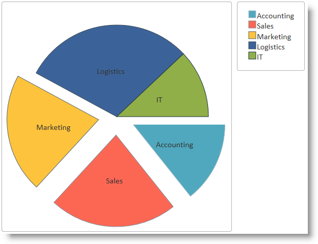

<!--
|metadata|
{
    "fileName": "igpiechart-adding",
    "controlName": "igDataChart",
    "tags": ["Charting","Getting Started","How Do I"]
}
|metadata|
-->

# Adding an igPieChart


### Purpose

This topic demonstrates how to add the `igPieChart`™ control to a web page and bind it to data.

### Required background

The following table lists the materials required as a prerequisite to understanding this topic.

**Concepts**

-   [jQuery](http://docs.jquery.com/Main_Page), [jQuery UI](http://jqueryui.com/)
-   [ASP.NET MVC](http://www.asp.net/mvc)

**Topics**


- [Ignite UI Overview](NetAdvantage-for-jQuery-Overview.html): General information on the Ignite UI™ library.

- [Using JavaScript Resources in Ignite UI](Deployment-Guide-JavaScript-Resources.html): This topic provides general guidance on adding required JavaScript resources to use controls from the Ignite UI library.

- [igPieChart Overview](igPieChart-Overview.html): This topic provides conceptual information about the `igPieChart` control including its main features, minimum requirements for using charts and user functionality.

### In this topic

This topic contains the following sections:

-   [Add Pie Chart to a Web Page](#add-pie-chart)
-   -   [Introduction](#introduction)
    -   [Preview](#preview)
    -   [Prerequisites](#prerequisites)
    -   [Overview](#overview)
    -   [Steps](#steps)
-   [Related Content](#related-content)
-   -   [Topics](#topics)
    -   [Samples](#samples)
    -   [Resources](#resources)


##<a id="add-pie-chart"></a>Add Pie Chart to a Web Page

### <a id="introduction"></a>Introduction

This procedure guides you through the process of adding a pie chart control with legend to a web page. The data for the chart in the example is supplied into a JavaScript array.

### <a id="preview"></a>Preview

The following screenshot is a preview of the final result.



### <a id="prerequisites"></a>Prerequisites

To complete the procedure, you need the following:

-   For the MVC examples: an ASP.NET MVC web application in Visual Studio
-   For the HTTP examples: an HTML5 web page

### <a id="overview"></a>Overview

This topic takes you step-by-step toward adding a pie chart to a web page The following is a conceptual overview of the process:

1.  Adding references to the required resources
    -   Overview
    -   Referencing resources in JavaScript using the `igLoader`
    -   Referencing resources in MVC using the MVC Loader
    -   Referencing resources manually
2.  Add HTML markup required by the `igPieChart`
3.  Add the data source
4.  Instantiate the pie chart
5.  (Optional) Verifying the result

### <a id="steps"></a>Steps

The following steps demonstrate how to add an `igPieChart` control to a web page.


1. Add references to the required resources.

	**Overview**

	Reference the required resources. Referencing resources includes:

	-   Adding the jQuery, jQueryUI and Modernizr JavaScript resources to a folder named Scripts in your web site or web application.
	-   Adding the Ignite UI CSS files to a folder named Content/ig in your web site or web application (see the [Styling and Theming in Ignite UI](Deployment-Guide-Styling-and-Theming.html) topic for details).
	-   Adding the Ignite UI JavaScript files to a folder named Scripts/ig in your web site or web application (see the [Using JavaScript Resources in Ignite UI](Deployment-Guide-JavaScript-Resources.html) topic for details).

	The resources can be added either manually or using loaders (recommended).

	**Referencing resources in JavaScript using the `igLoader`**

	The `igLoader`™ control is the recommended way to load JavaScript and CSS resources required by the Ignite UI library controls. First the `igLoader` script must be included in the page:

	**In HTML:**

	```html
	<script  type="text/javascript" src="Content/ig/infragistics.loader.js"></script>
	```

	For HTML views the `igLoader` must be instantiated this way:

	**In HTML:**

	```html
	<script type="text/javascript">
	    $.ig.loader({
	        scriptPath: "Scripts/ig/",
	        cssPath: "Content/ig/",
	        resources: "igPieChart"
	    });
	<script>
	```

	The resources option specifies that the `igPieChart` control will be rendered.

	**Referencing resources in MVC using the MVC Loader**

	The `Infragistics.Web.Mvc` assembly must be referenced in your ASP.NET MVC project and the corresponding namespace must be referenced in your view. For details, see [Using JavaScript Resources in Ignite UI](Deployment-Guide-JavaScript-Resources.html) but for clarity the code to reference the namespace is given here.

	For MVC views the `igLoader` MVC helper must be used:

	**In ASPX:**

	```csharp
	<%@ Import Namespace="Infragistics.Web.Mvc" %>
	<%= Html.Infragistics().Loader()
	        .ScriptPath(Url.Content("~/Scripts/ig/"))
	        .CssPath(Url.Content("~/Content/ig/"))
	        .Render()
	%>
	```

	The MVC helper for `igLoader` automatically detects required resources and specifying resources is not necessary.

	**Referencing resources manually**

	For manual loading, refer to the [Minimum Requirements](igPieChart-Overview.html#min-requirements) block in the [igPieChart Overview](igPieChart-Overview.html) topic to see which resource files must be linked to use pie charts.

2. Add HTML markup required by the `igPieChart`.

	HTML example

	Add the `div` elements for the chart and the legend which will be referred in the chart instantiation code.

	**In HTML:**

	```html
	<div id="chart" class="chartContainer"></div>
	<div id="legend" class="chartContainer"></div>
	```

	**ASP.NET Example**

	For ASP.NET MVC, no container elements are needed because the MVC helper adds the required markup automatically.

3. Add the data source.

	**HTML example**

	**For the HTML example some JavaScript code must be added that defines an array with several data records for company budget data.** In order to get information on binding to other data sources you may refer to the [Data Binding (igPieChart)](igPieChart-DataBinding.html) topic.

	Include the following code in the head section of your HTML document.

	**In HTML:**

	```html
	<script type="text/javascript">
	    var data = [
	            { "Budget": 950000, "Department": "Accounting" },
	            { "Budget": 1500000, "Department": "Sales" },
	            { "Budget": 1400000, "Department": "Marketing" },
	            { "Budget": 2000000, "Department": "Logistics" },
	            { "Budget": 800000, "Department": "IT" }
	        ];
	</script>
	```

	**ASP.NET example**

	**The way to supply data for an ASP.NET MVC view is through a controller method and appropriate data model definition.** Here follows the data model part. Create a new empty class into the Models folder of you ASP.NET MVC application and add the following code.

	**In C#:**

	```csharp
	public class DepartmentSpending
	{
	    public string Department { get; set; }
	    public decimal Budget { get; set; }
	}
	```

	Add an empty controller class in the Controllers folder and the following code for the Index (or whatever your view is named) method:

	**In C#:**

	```csharp
	public ActionResult Index()
	{
	    List<DepartmentSpending> companyBudget = new List<DepartmentSpending>
	    {
	        new DepartmentSpending { Budget = 950000, Department = "Accounting" },
	        new DepartmentSpending { Budget = 1500000, Department = "Sales" },
	        new DepartmentSpending { Budget = 1400000, Department = "Marketing" },
	        new DepartmentSpending { Budget = 2000000, Department = "Logistics" },
	        new DepartmentSpending { Budget = 500000, Department = "IT" }
	    };
	    return View(companyBudget.AsQueryable());
	}
	```

	Add the following code in your ASP.NET MVC view to make it strongly-typed and point to the data model class created above.

	**In ASPX:**

	```csharp
	<%@ Page Language="C#" Inherits="System.Web.Mvc.ViewPage<IQueryable<PieChartSample.Models.DepartmentSpending>>" %>
	```

4. Instantiate the pie chart.

	**HTML example**

	 the chart and legend div tags to be wrapped and chart drawn, the `igPieChart` control must be instantiated and its main options set. Add the code below to the existing code in the `<script>` tag used above for data array definition:

	**In Javascript:**

	```js
	$(function () {
	    $("#chart").igPieChart({
	        width: "450px",
	        height: "450px",
	        dataSource: data,
	        valueMemberPath: "Budget",
	        labelMemberPath: "Department",
	        radiusFactor: 0.8,
	        explodedSlices: '0 1 2',
	        legend: { element: "legend", type: "item"}
	    });
	});
	```

	The width and height options set explicitly the size of the chart container but may be omitted and the control will calculate appropriate size automatically.

	The option `radiusFactor` sets the size of the pie relative to the size of the container element set by width and height and by default it is 0.9. The option `explodedSlices` is a space delimited list of indices of slices and determines which slices are displayed detached from the main pie. Slices start from an imaginary line to the right from the center of the pie and are counted clockwise.

	Note how the previously defined array data has been assigned to the `dataSource` option of the chart control. The options `valueMemberPath` and `labelMemberPath` are mandatory since they configure which members from the input data will be displayed on the chart. The option `valueMemberPath` is visualized in the form of slice size, i.e. the relative value (or percentage) of this member related to the sum of all members determines the slice size. The option `labelMemberPath` is visualized in the form of slice labels to denote each slice and also in the legend if such exists.

	An important setting for the legend is the legend type specified by the type option in the legend object. The type item must be specified whenever a pie chart is used because this creates legend item for each data item in the data source depicted.

	**ASP.NET example**

	The code below instantiates and sets the main features of the `igPieChart` using the MVC helper for pie chart provided in the `Infragistics.Web.Mvc` assembly. The data model is associated with the control with the PieChart(Model) call and the rest of the calls act similarly to the HTML example.

	**In ASPX:**

	```csharp
	<%= Html.Infragistics().PieChart(Model)
	        .ID("chart")
	        .Height("450px")
	        .Width("450px")
	        .ValueMemberPath(item => item.Budget)
	        .LabelMemberPath(item => item.Department)
	        .RadiusFactor(0.8)
	        .ExplodedSlices("0 1 2")
	        .Legend(legend => legend.ID("legend").LegendType(LegendType.Item))
	        .DataBind()
	        .Render()
	%>
	```
5. (Optional)Verify the result.

To verify the result, save the page and view the final result in a web browser. The pie chart should render as shown in the [Preview](#preview).

##<a id="related-content"></a>Related Content

### <a id="topics"></a>Topics

The following topics provide additional information related to this topic.

- [Data Binding (igPieChart)](igPieChart-DataBinding.html): This topic explains how to bind various data sources to the `igPieChart`™ control.

- [jQuery and ASP.NET MVC Helper API Reference Links (igPieChart)](igPieChart-API-Links.html): This topic provides links to the API documentation for jQuery and ASP.NET MVC helper class for `igDataChart`™ control.

- [Styling igPieChart with Themes](igPieChart-Styling-Themes.html): Demonstrates using styles and applying themes with `igPieChart`™.

### <a id="samples"></a>Samples

The following samples provide additional information related to this topic.

- [JSON Binding](%%SamplesUrl%%/pie-chart/json-binding):This is a basic example of the pie chart bound to JSON data.


### <a id="resources"></a>Resources

The following material (available outside the Infragistics family of content) provides additional information related to this topic.

- [jQuery Home Page](http://jquery.com/): The home page of the jQuery library where more detailed information on installing and features of the library can be found.

- [ASP.NET MVC Home Page](http://www.asp.net/mvc): The home page of ASP.NET MVC where more detailed information on installing and using ASP.NET MVC can be found.


 

 


