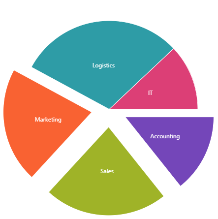

<!--
|metadata|
{
    "fileName": "igpiechart-databinding",
    "controlName": "igDataChart",
    "tags": ["Charting","Data Binding","MVC"]
}
|metadata|
-->

# Data Binding (igPieChart)

### Purpose

This topic explains how to bind various data sources to the igPieChart™ control.

### Required Background

**Concepts**

-   Data Binding
-   JSON
-   XML
-   Web Services
-   WCF Services
-   [ASP.NET MVC](http://www.asp.net/mvc)

**Topics**

- [igDataSource](igDataSource-igDataSource.html): This is a reference page that links to all topics related to the `igDataSource`™.

- [igDataSource Overview](igDataSource-igDataSource-Overview.html): This topic introduces the `igDataSource` control and demonstrates its basic usage and features.

- [igPieChart Overview](igPieChart-Overview.html): Contains basic information about the `igPieChart` control for displaying pie charts in web pages.

- [Adding an igPieChart](igPieChart-Adding.html): Provides step by step instructions for adding an `igPieChart` to a web page.


### In This Topic

This topic contains the following sections:

-   [**Binding to Data Sources**](#bind-data-source)
   -   [Supported data sources](#supported-data-source)
    -   [Requirements for binding](#requirements-for-binding)
    -   [Data sources summary](#data-source-summary)
-   [**Bind to a JavaScript Array**](#bind-js)
   -   [Introduction](#js-introduction)
    -   [Preview](#js-preview)
    -   [Steps](#js-steps)
-   [**Bind to XML**](#bind-xml)
   -   [Introduction](#xml-introduction)
    -   [Preview](#xml-preview)
    -   [Steps](#xml-steps)
-   [**Bind to an `IQueryable<T>` in ASP.NET MVC**](#bind-iqueryable-mvc)
  -   [Introduction](#mvc-introduction)
    -   [Preview](#mvc-preview)
    -   [Steps](#mvc-steps)
-   [**Bind to a WCF Service**](#bind-wcf-service)
   -   [Introduction](#wcf-introduction)
    -   [Preview](#wcf-preview)
    -   [Steps](#wcf-steps)
-   [**Related Content**](#related-content)
   -   [Topics](#topics)
    -   [Samples](#samples)


##<a id="bind-data-source"></a>Binding to Data Sources

### <a id="supported-data-source"></a>Supported data sources

The `igPieChart` control supports the following data sources:

Data Source|Binding
---|---
igDataSource|Used internally by the control to manage data operations 
`IQueryable<T>`|Used to supply data from an MVC controller method


### <a id="requirements-for-binding"></a>Requirements for binding

Each data source has different requirements for data binding to the `igDataSource` control. The following table lists each requirement category.

Requirement category|Requirement listing
---|---
Data structure|<ul><li>JSON (client side or from a web or WCF service)</li> <li>XML (client side or from a web or WCF service)</li><li>JavaScript array</li><li>`IQueryable<T>` in ASP.NET MVC</li></ul>
Data types|<ul><li>String: for category axes only</li><li>Number</li><li>Date</li></ul>


### <a id="data-source-summary"></a>Data sources summary

Data binding for `igPieChart` is done identically to binding for other controls from the Ignite UI™ library. The way to bind data is by either by assigning a data source to the `dataSource` option or to provide a URL in the `dataSourceUrl` if data is provided by a web or WCF service.


##<a id="bind-js"></a>Bind to a JavaScript Array

### <a id="js-introduction"></a>Introduction

This procedure shows in simple steps how to bind a JavaScript data array to an `igPieChart` control.

### Prerequisites

To complete the procedure, you need the following:

-   An HTML5 web page
-   All required JavaScript and CSS files added to your web site or web application project. For detailed information on instantiation and configuration of an `igPieChart` see [Adding an igPieChart](igPieChart-Adding.html).

### <a id="js-preview"></a>Preview

The following screenshot is a preview of the final result.



### <a id="js-steps"></a>Steps

The following steps demonstrate how to bind JavaScript data array to an `igPieChart` control.


1. Define a JavaScript data array.

	For the sake of the example, use the following JavaScript array.

	**In HTML:**

	```html
	<script type="text/javascript">
	    var data = [
	            { "Budget": 950000, "Department": "Accounting" },
	            { "Budget": 1500000, "Department": "Sales" },
	            { "Budget": 1400000, "Department": "Marketing" },
	            { "Budget": 2000000, "Department": "Logistics" },
	            { "Budget": 800000, "Department": "IT" }
	        ];
	</script>
	```

2. Instantiate chart control and set data source.

	1. Add the chart div element to the web page.

		Add a div element in the body part of your web page using the following code:

		**In HTML:**

		```html
		<body>
		    ...
		    <div id="chart"></div>
		    ...
		</body>
		```

	2. Instantiate the igPieChart control and configure the data source.

		Add the following code into a script tag in order to instantiate and configure an `igPieChart`. Note how the data array defined in the previous step is assigned to the `dataSource` options of the `igPieChart` control.

		**In HTML:**

		```html
		<script type="text/javascript">
		    $(function () {
		        $("#chart").igPieChart({
		            width: "450px",
		            height: "450px",
		            dataSource: data,
		            dataValue: "Budget",
		            dataLabel: "Department",
		            radiusFactor: 0.8,
		            explodedSlices: "[0,1,2]",
		            legend: { element: "legend", type: "item" }
		        });
		    });
		</script>
		```


### <a id="data-source-summary"></a>Data sources summary

Data binding for `igPieChart` is done identically to binding for other controls from the Ignite UI™ library. The way to bind data is by either by assigning a data source to the `dataSource` option or to provide a URL in the `dataSourceUrl` if data is provided by a web or WCF service.


##<a id="bind-xml"></a>Bind to XML

### <a id="xml-introduction"></a>Introduction

This procedure shows in several steps how to bind an XML string to an `igPieChart` control.

### Prerequisites

To complete the procedure, you need the following:

-   An HTML5 web page
-   All required JavaScript and CSS files added to your web site or web application project. For detailed information on instantiation and configuration of an `igPieChart` see [Adding an igPieChart](igPieChart-Adding.html).

### <a id="xml-preview"></a>Preview

The following screenshot is a preview of the final result.


### <a id="xml-steps"></a>Steps

The following steps demonstrate how to bind an XML string to an `igPieChart` control. In order to link the XML data to the chart it will require to specify a `DataSchema` as well and pass both to an instance of `igDataSource`. The main role of this data component is to output data in a readable for IgniteUI widgets format.

1. Prepare the data in a readable for `igPieChart` format. 
	
	1. At first, define an XML data sting. In this example, it will be the following XML data.

		**In HTML:**

		```html
		<script type="text/javascript">
			//Sample XML Data
			var xmlDoc = '<Countries>' +
				'<Country Name="China" Population="1333" />' +
				'<Country Name="India" Population="1140" />' +
				'<Country Name="United States" Population="304" />' +
				'<Country Name="Indonesia" Population="228" />' +
				'<Country Name="Brazil" Population="192" />' +
			'</Countries>';
		</script>
		```

	2. [Binding to XML](igdatasource-binding-to-xml.html) requires a [igDataSchema](%%jQueryApiUrl%%/ig.dataschema) to define data fields. This component handles transformations for Array, JSON and XML data objects for the [igDataSource](%%jQueryApiUrl%%/ig.datasource). Specify where the records in the date source are located using [searchField](%%jQueryApiUrl%%/ig.dataschema#options:schema.searchField) option. Notice how the [fields](%%jQueryApiUrl%%/ig.dataschema#options:schema.fields) are defined by specifying an `“xpath”` property for every field definition. This is unique to XML data sources. In this way, you are telling the data source the path to the property you are binding, in every hierarchical object that is in the list. 

		```html
		<script type="text/javascript">
			var xmlSchema = new $.ig.DataSchema("xml",
				{ 
					//searchField serves as the base node(s) for the XPaths
					searchField: "//Country", 
					fields: [
						{ name: "Name", xpath: "./@Name" },
						{ name: "Population", xpath: "./@Population", type: "number" },
					]
				}
			);
		</script>
		```

	3. Create an [Infragistics datasource](igdatasource-igdatasource-overview.html) which can be consumed by the chart from the already configured XML Data and `igDataSchema`. 

		```html
		<script type="text/javascript">
			var ds = new $.ig.DataSource({
				type: "xml",
				dataSource: xmlDoc,
				schema: xmlSchema 
			});
		</script>
		```

2. Instantiate chart control and set data source.

	1. Add the chart div element to the web page.

		Add a div element in the body part of your web page using the following code:

		**In HTML:**

		```html
		<body>
		    ...
		    <div id="chart"></div>
		    ...
		</body>
		```

	2. Instantiate the igPieChart control and configure the data source.

		**In HTML:**

		```html
		<script type="text/javascript">
		    $(function () {
		        $("#chart").igPieChart({
					width: "435px",
					height: "435px",
					dataSource: ds, //$.ig.DataSource defined above
					dataValue: "Population",
					dataLabel: "Name",
					labelsPosition: "bestFit",
					explodedSlices: [0,2,3,4]
		        });
		    });
		</script>
		```

The following sample implements the above steps.
<div class="embed-sample">
   [%%SamplesEmbedUrl%%/pie-chart/xml-binding](%%SamplesEmbedUrl%%/pie-chart/xml-binding)
</div>


##<a id="bind-iqueryable-mvc"></a>Bind to an IQueryable&lt;T&gt; in ASP.NET MVC

### <a id="mvc-introduction"></a>Introduction

This procedure shows how to bind a list of data objects from a backend controller method to a pie chart using the ASP.NET helper provided in the Ignite UI library.

### Prerequisites

To complete the procedure, you need the following:

-   An ASP.NET MVC application
-   All required JavaScript and CSS files added to your web site or web application project. For detailed information on instantiation and configuration of an `igPieChart` see [Adding an igPieChart](igPieChart-Adding.html).

### <a id="mvc-preview"></a>Preview

The following screenshot is a preview of the final result.


### <a id="mvc-steps"></a>Steps

The following steps demonstrate how to instantiate and bind an `igPieChart` control in ASP.NET MVC by providing a list of data objects to a strongly typed view and use the MVC helper for data chart.

1. Define data model.

	Add the following data model class:

	**In C#:**

	```csharp
	public class DepartmentSpending
	{
	    public string Department { get; set; }
	    public decimal Budget { get; set; }
	}
	```

2. Define the controller method.

	Add the following logic to a controller method in order to instantiate an array of `DepartmentSpending` objects. Note that in this place you can add custom logic that gets data from data base, for example.

	**In C#:**

	```csharp
	public ActionResult Index()
	{
	    List<DepartmentSpending> companyBudget = new List<DepartmentSpending>
	    {
	        new DepartmentSpending { Budget = 950000, Department = "Accounting" },
	        new DepartmentSpending { Budget = 1500000, Department = "Sales" },
	        new DepartmentSpending { Budget = 1400000, Department = "Marketing" },
	        new DepartmentSpending { Budget = 2000000, Department = "Logistics" },
	        new DepartmentSpending { Budget = 500000, Department = "IT" }
	    };
	    return View(companyBudget.AsQueryable());
	}
	```

	Note how the list of `DepartmentSpending` objects is converted to an `IQueryable< DepartmentSpending>` before submitting to the view. This can alternatively be done in the MVC helper call in the view but the implementation provided is cleaner.

3. Instantiate chart control and set data source.

	Add the following code into your ASP.NET MVC view in order to instantiate an `igPieChart` and assign the list. Note how the data model of the strongly-typed view is mapped to the chart with the `PieChart(Model)` call. Further, the `DataValue()` method maps the item.Budget property to the slices’ size and the `DataLabel()` method maps the item.Department property for each data item to slices’ names. The `DataBind()` method does the actual data binding and at the end the `Render()` method emits the final JavaScript code to be executed on the client-side.

	**In ASPX:**

	```csharp
	<%@ Page Language="C#" Inherits="System.Web.Mvc.ViewPage<IQueryable<PieChartSample.Models.DepartmentSpending>>" %>
	<%@ Import Namespace="Infragistics.Web.Mvc" %>
	...
	<%= Html.Infragistics().PieChart(Model)
	        .ID("chart")
	        .DataValue(item => item.Budget)
	        .DataLabel(item => item.Department)
	        .DataBind()
	        .Render()
	%>
	```

##<a id="bind-wcf-service"></a>Bind to a WCF Service


### <a id="wcf-introduction"></a>Introduction

This procedure shows how to bind an `igPieChart` to a WCF service with the help of the `dataSourceUrl` option. Binding to a Web service is identical.

### Prerequisites

To complete the procedure, you need the following:

-   An HTML5 web page
-   All required JavaScript and CSS files added to your web site or web application project. For detailed information on instantiation and configuration of an `igPieChart` see [Adding an igPieChart](igPieChart-Adding.html).

### <a id="wcf-preview"></a>Preview

The following screenshot is a preview of the final result.


### <a id="wcf-steps"></a>Steps

The following steps demonstrate how to bind an `igPieChart` control to a WCF service.


1. WCF Service interface.

	The full implementation of the WCF service is omitted because it is not relevant to the example. Here follows a sample service contract class and operation contract method that serves data to the client upon a GET HTTP request. The data model class is the same as in the previous procedure “[Bind to an `IQueryable<T>` in ASP.NET MVC](#bind-iqueryable-mvc)”.

	Here follows the interface of the sample BudgetData WCF service that serves financial data to clients in the form of a `List` of `DepartmentSpending` objects.

	**In C#:**

	```csharp
	[ServiceContract]
	[AspNetCompatibilityRequirements(RequirementsMode = AspNetCompatibilityRequirementsMode.Allowed)]
	public class BudgetData
	{
	    [OperationContract]
	    [WebGet(BodyStyle = WebMessageBodyStyle.Bare, ResponseFormat = WebMessageFormat.Json)]
	    public List<DepartmentSpending> GetCompanyBudget()
	    {
	        return CompanyBudgetDB.GetBudgetsByDepartment();
	    }
	}
	```

	The important things to note here is the WebGet attribute applied to the server method `GetCompanyBudget()`. It declares that this method will respond to GET requests and that the response will be a bare (not wrapped) JSON encoded array of data.

2. Instantiate chart control and set data source.

	**HTML/jQuery**

	Add the following code into the head part of your HTML5 page in order to instantiate an `igPieChart`. The WCF service address is set as data source by assigning the address to the `dataSourceUrl` option.

	The option `dataValue` is set to point to the Budget property of the data provided by the server and the `dataLabel` is set to point to the Department property.

	In this example it is assumed that the WCF service is installed and running on the address [http://www.example.com](http://www.example.com)/Services/BudgetData.svc/GetCompanyBudget.

	**In Javascript:**

	```js
	$(function () {
	    $("#chart").igPieChart({
	        dataSourceUrl: "http://www.example.com/Services/BudgetData.svc/GetCompanyBudget",
	        dataValue: "Budget",
	        dataLabel: "Department"
	    });
	});
	```

	**ASP.NET MVC**

	Add the following code into your ASP.NET MVC view in order to instantiate an `igPieChart` and set the WCF service address. The meaning of the code is the same as in the HTML example.

	**In ASPX:**

	```csharp
	<%@ Page Language="C#" Inherits="System.Web.Mvc.ViewPage<dynamic>" %>
	<%@ Import Namespace="Infragistics.Web.Mvc" %>
	...
	<%= Html.Infragistics().PieChart()
	        .ID("chart")
	        .DataValue("Budget")
	        .DataLabel("Department")
	        .DataSourceUrl("http://www.example.com/Services/BudgetData.svc/GetCompanyBudget")
	        .DataBind()
	        .Render()
	%>
	```


##<a id="related-content"></a>Related Content

### <a id="topics"></a>Topics

The following topics provide additional information related to this topic.

- [Binding igDataSource to Client-Side Data](igDataSource-Binding-igDataSource-to-Client-Side-Data.html): This topic explains how to bind `igDataSource` to client-side JavaScript arrays and JSON data.

- [Binding igDataSource to REST Services](igDataSource-Binding-to-REST-Services.html): This topic explains how to bind an `igDataSource` control to REST services.

- [Binding igDataSource to WCF Data Services](igDataSource-Binding-to-WCF-Data-Services.html): This topic explains how to bind an `igDataSource` component to a WCF service.


### <a id="samples"></a>Samples

The following samples provide additional information related to this topic.

- [Pie Chart Overview](%%SamplesUrl%%/pie-chart/overview):This sample demonstrates creating a simple pie chart and configuring some of its  features.