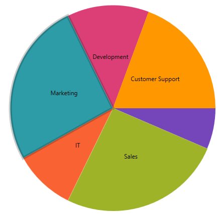
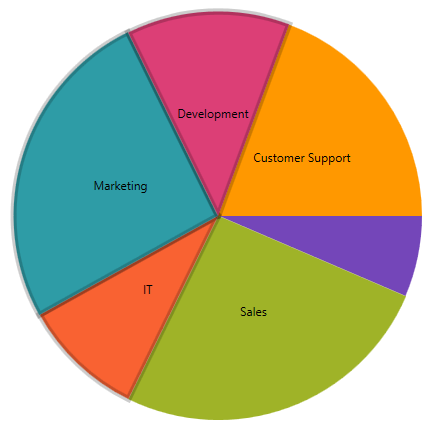

<!--
|metadata|
{
    "fileName": "igpiechart-selection",
    "controlName": "igPieChart",
    "tags": ["Charting","Getting Started","How Do I"]
}
|metadata|
-->

# Selection

This topic provides information for enabling and using the selection feature in the `igPieChart`™ control. 

### In this topic

This topic contains the following sections:

-   [Requirements](#Requirements)
-   [Overview](#Overview)
-   [Enabling Selection](#EnablingSelection)
-   [Selection Modes](#SelectionModes)
-   [Selecting the Others Slices](#SelectingOthers)
-   [Related Topics](#RelatedTopics)


### <a id="Requirements"></a> Requirements

This article assumes you have already read the [Data Binding](igPieChart_DataBinding.html) topic, and uses the code therein as a starting point.

### <a id="Overview"></a> Overview

The Pie Chart supports slice selection by mouse click as the default behavior. You can determine the selected slices by using the 'selectedItem' option. The selected slice is highlighted as demonstrated in the following image:



### <a id="EnablingSelection"></a> Enabling Selection

There is an option called `selectionMode` which is how you set what mode you want the pie chart to use.  The default is “Single”.  In order to disable selection, set the property to “Manual”.  

The following code snippet demonstrates how to disable selection.

**In Javascript:**

```
$(function () {
    $("#chart").igPieChart({
        dataSource: data, 
        dataValue: "Pop2008",
        dataLabel: "CountryName",
        labelsPosition: "bestFit",
        selectionMode: "manual",
    }
});
```

### <a id="SelectionModes"></a> Selection Modes

The pie chart supports three different selection modes.  

-  Single
-  Multiple
-  Manual

### Single

When the mode is set to single, only one slice can be selected at a time.  When you select a new slice the previously selected slice will be deselected and the new one will become selected.


### Multiple

when the mode is set to Multiple, many slices can be selected at once.  If you click on a slice, it will become selected and clicking on a different slice will also select that slice leaving the previous slice selected.



### Manual 

When the mode is set to Manual, selection is disabled.

### <a id="SelectionEvents"></a> Selection Events

The pie chart has 4 events associated with selection:

- `selectedItemChanging`
- `selectedItemChanged`
- `selectedItemsChanging`
- `selectedItemsChanged`

The events that end in “Changing” are cancelable events which means you can stop the selection of a slice by setting the event argument property “Cancel” to true.  When set to true the associated property will not update and the slice will not become selected.  This is useful for scenarios where you want to keep users from being able to select certain slices based on the data inside it.

**In Javascript:**

```
$(function () {
    $("#chart").igPieChart({
        dataSource: data, 
        dataValue: "Pop2008",
        dataLabel: "CountryName",
        labelsPosition: "bestFit",
        selectedItemChanging: function (evt, ui) {
            ui.cancel;
        }
    }
});
```


### <a id="SelectingOthers"></a> Selecting the Others Slice

For scenarios where you click on the Others slice, the pie chart will return an object called `pieSliceOthersContext`.  This object contains a list of the data items contained within the Others slice.

### <a id="RelatedTopics"></a> Related Topics

- [Data Binding (igPieChart)](igPieChart-DataBinding.html): This topic explains how to bind various data sources to the `igPieChart`™ control.

- [jQuery and ASP.NET MVC Helper API Reference Links (igPieChart)](igPieChart-API-Links.html): This topic provides links to the API documentation for jQuery and ASP.NET MVC helper class for `igDataChart`™ control.

- [Styling igPieChart with Themes](igPieChart-Styling-Themes.html): Demonstrates using styles and applying themes with `igPieChart`™.