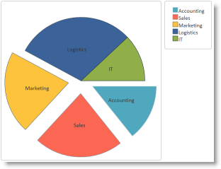
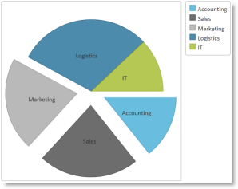

<!--
|metadata|
{
    "fileName": "igpiechart-styling-themes",
    "controlName": "igDataChart",
    "tags": ["Charting","Styling","Theming"]
}
|metadata|
-->

# Styling igPieChart with Themes


##Topic Overview


### Purpose

Demonstrates using styles and applying themes with `igPieChart`™.

### Required Background

**Concepts**

-   Cascading Style Sheets
-   Applying themes by changing linked CSS files

**Topics**

-	[Styling and Theming in %%ProductName%%](Deployment-Guide-Styling-and-Theming.html): Provides general information and procedure for updating styles and themes in %%ProductName%%™ library.

**External Resources**

- [jQuery UI](http://jqueryui.com/): jQuery UI library home page

- [Theming jQuery UI](http://docs.jquery.com/UI/Theming): Detailed  explanation of the approach taken and inner workings of themes with the jQuery UI.

- [jQuery UI CSS Framework](http://docs.jquery.com/UI/Theming/API): Explains in detail the jQuery UI CSS framework.


### In This Topic

This topic contains the following sections:

-   [**Introduction**](#introduction)
-   [**Themes Summary**](#theme-summary)
-   [**Required Cascading Style Sheets (CSS)**](#required-css)
    -   [Required CSS summary](#required-css-summary)
    -   [Required CSS code: HTML](#required-css-htm)
    -   [Required CSS code: ASPX](#required-css-aspx)

-   [**Chart Styles Reference**](#chart-style-reference)
-   [**Pie Chart Styling Options**](#pie-chart-style-options)
-   -   [Introduction](#options-introduction)
    -   [Style reference summary](#style-reference)
-   [**Modifying the Chart-Specific Visual Elements Using Themes**](#modify-chart-specific)
-   -   [Introduction](#chart-specific-introduction)
    -   [Preview](#chart-specific-preview)
    -   [Requirements](#chart-specific-requirements)
    -   [Overview](#chart-specific-overview)
    -   [Steps](#chart-specific-steps)
-   [**Related Content**](#related-content)
-   -   [Topics](#topics)
    -   [Resources](#resources)


##<a id="introduction"></a>Introduction

### Introduction to themes

The igPieChart uses the jQuery UI CSS Framework for the purpose of applying styles and themes. By default, the igPieChart uses the IG Theme, part of the jQuery UI theme, provided by Infragistics for use in your application along with some additional chart specific styles. This means that a general jQuery UI theme is insufficient to customize the looks of charts. You will need to provide additional style classes that alter chart specific elements like data series and axes.

You can use `ThemeRoller` to customize a theme. `ThemeRoller` is a tool provided by jQuery UI which facilitates the creation of custom themes that are compatible with jQuery UI widgets. Many pre-built themes are available for download and use in your website. The `igPieChart` control supports the use of `ThemeRoller` themes.

Detailed information for using themes with %%ProductName%% library is available in the [Styling and Theming](Deployment-Guide-Styling-and-Theming.html) topic.

>**Note:** The base theme of %%ProductName%% is unnecessary for charts and may be omitted on pages that contain only charts.


##<a id="theme-summary"></a>Themes Summary


### Themes summary chart

The following table summarizes the themes available with the `igPieChart`.

<table cellspacing="0" cellpadding="0" class="table table-bordered">
    <tbody>
        <tr>
            <th colspan="2">
                Theme
            </th>

            <th>
                Description
            </th>
        </tr>

        <tr>
            <td>
                IG Theme
            </td>

            <td>
                Path: {IG CSS root}/themes/Infragistics/

                File: infragistics.theme.css
            </td>

            <td>
                This theme defines general visual features for all %%ProductName%% controls. Detailed information for using the IG theme is available in the <a href="Deployment-Guide-Styling-and-Theming.html" data-auto-update-caption="true">Styling and Theming in %%ProductName%%</a> topic.
            </td>
        </tr>

        <tr>
            <td>
                Chart Structure
            </td>

            <td>
                <table cellspacing="0" cellpadding="0" class="table table-bordered">
    <tbody>
        <tr>
            <th colspan="2">
                Theme
            </th>

            <th>
                Description
            </th>
        </tr>

        <tr>
            <td>
                IG Theme
            </td>

            <td>
                Path: {IG CSS root}/themes/Infragistics/

                File: infragistics.theme.css
            </td>

            <td>
                This theme defines general visual features for all %%ProductName%% controls. Detailed information for using the IG theme is available in the <a href="Deployment-Guide-Styling-and-Theming.html" data-auto-update-caption="true">Styling and Theming in %%ProductName%%</a> topic.
            </td>
        </tr>

        <tr>
            <td>
                Chart Structure
            </td>

            <td>
                *Path:* `{IG CSS root}/structure/modules/`

                *File:* `infragistics.ui.chart.css`
            </td>

            <td>
                This theme defines charts specific visual elements.
            </td>
        </tr>
    </tbody>
</table>*Path:* `{IG CSS root}/structure/modules/`

                *File:* `infragistics.ui.chart.css`
            </td>

            <td>
                This theme defines charts specific visual elements.
            </td>
        </tr>
    </tbody>
</table>


##<a id="required-css"></a>Required Cascading Style Sheets (CSS)


### <a id="required-css-summary"></a>Required CSS summary

The following CSS resources are necessary for the correct rendering of charts:

-   `infragistics.theme.css` – Contains the IG Theme
-   `infragistics.ui.chart.css` – Contains the Chart Structure classes

In the code snippets that follow, it is assumed that the CSS resources are located into `Content/ig` folder below the web site/application root.

>**Note:** The following blocks provide information on manually including required CSS files; however, we recommended using the Infragistics Loader control to load these files into your page.

### <a id="required-css-htm"></a>Required CSS code: HTML

**In HTML:**

```html
<link href="Content/ig/themes/Infragistics/infragistics.theme.css" rel="Stylesheet" />
<link href="Content/ig/structure/modules/infragistics.ui.chart.css" rel="Stylesheet" />
```

### <a id="required-css-aspx"></a>Required CSS code: ASPX

**In ASPX:**

```csharp
<link href='<%= Url.Content("~/Content/ig/themes/Infragistics/infragistics.theme.css")%>'      rel="stylesheet" type="text/css" />
<link href='<%= Url.Content("~/Content/ig/structure/modules/infragistics.ui.chart.css")%>'      rel="stylesheet" type="text/css" />
```


##<a id="chart-style-reference"></a>Chart Styles Reference

### Style reference summary

A summary of the `igDataChart` control’s styles and functions.

Property|Description
---|---
.ui-chart-palette-1 to .ui-chart-palette-N | Sets border and background color for data series 1 to data series N. You can have as many `ui-chart-palette` classes as needed by your application.
.ui-chart-axis|Sets border and background color for chart axes.
.ui-chart-legend-items-list|Sets all styling options for chart legends.
.ui-chart-legend-item-text|Sets all styling options for legend item text.
.ui-chart-legend-item-badge|Sets all styling options for legend item icon.
.ui-chart-tooltip|Sets all styling options for chart tooltips.


>**Note:** In all style classes the border-color setting determines the outline of the corresponding element and the background-color setting determines the background or fill color of the element.


##<a id="pie-chart-style-options"></a>Pie Chart Styling Options


### <a id="options-introduction"></a>Introduction

The `igPieChart` control is all about visual content and has a lot of properties and styling options for changing a charts layout and colors. Use CSS to define:

-   colors of data items,
-   colors for legend list items, for text and icons and
-   colors, shades, fonts and other CSS properties for tooltip formatting.

**With individual pie chart control options you can define:**

-   colors and outline for data items and
-   style for slice labels text.

The following reference table catalogs all options for changing chart element colors and their purpose. When set, pie chart options have precedence over style classes defined in CSS files. These options provide programmatic runtime changes to the rendering of charts.

### <a id="style-reference"></a>Style reference summary

A summary of the `igPieChart` styles’ purpose and function.

Property|Description
---|---
brushes|Defines the palette for selecting automatically assigned slice colors.
textStyle|Overrides the label rendering style.
outlines|Defines the palette for automatically assigned slice outline colors.


##<a id="modify-chart-specific"></a>Modifying the Chart-Specific Visual Elements Using Themes

### <a id="chart-specific-introduction"></a>Introduction

This procedure explains how to alter the default settings for various visual elements of the `igPieChart` control by changing the styles in the chart specific `infragistics.ui.chart.css` file.

Use an existing page with a pie chart, as this example does not provide the procedure for creating a pie chart. In this example, we modify the chart styles by changing the colors of the pie slices.

### <a id="chart-specific-preview"></a>Preview

The following screenshot shows the default view of a sample chart with the default styles along with an example of updated slice colors.

Default slice colors|Updated slice colors
---|---
|


### <a id="chart-specific-requirements"></a>Requirements

-   To complete the procedure, you need the following:
   -   HTML5 web page with an existing `igPieChart` control.

### <a id="chart-specific-overview"></a>Overview

Step-by-step instructions for creating a custom chart theme. The following is a conceptual overview of the process:

1.  [Copy the default chart CSS file](#copy-css-style)
2.  [Modify styles for chart visual elements](#modify-styles)
3.  [Change the link from the default chart CSS file to the modified file](#change-default-style)
4.  [Observe the result](#observe-result)

### <a id="chart-specific-steps"></a>Steps

Demonstrate how to modify the default IG Chart styles with your preferred settings.


1. <a id="copy-css-style"></a>Copy the default chart CSS file 

	**Copy the CSS file with the default chart styles ( `infragistics.ui.chart.css` ) from the %%ProductName%% installation to the themes folder of your web site or application.**

	For instance, if you have a folder Content/themes in your web site or application where you keep the CSS files used by the application, make a copy of the default chart CSS file mentioned above paste it here, `Content/themes/MyChartTheme/ig.ui.chart.custom.css`.

2. <a id="modify-styles"></a>Modify styles for chart visual elements

	Open the copy of the CSS file and make the desired style changes. (Refer to the [Chart Styles Reference](#chart-style-reference) section for details about the individual `igPieChart` styles.)

	**In CSS:**

	```css
	.ui-chart-palette-1
	{
	    border-color: rgb(35, 128, 168);
	    border-color: rgba(35, 128, 168, .8);
	    background-color: rgb(68, 172, 214);
	    background-color: rgba(68, 172, 214, .8);
	}
	.ui-chart-palette-2
	{
	    border-color: rgb(51, 51, 51);
	    border-color: rgba(51, 51, 51, .8);
	    background-color: rgb(73, 73, 73);
	    background-color: rgba(73, 73, 73, .8);
	}
	.ui-chart-palette-3
	{
	    border-color: rgb(128, 128, 128);
	    border-color: rgba(128, 128, 128, .8);
	    background-color: rgb(168, 168, 168);
	    background-color: rgba(168, 168, 168, .8);
	}
	.ui-chart-palette-4
	{
	    border-color: rgb(24, 81, 112);
	    border-color: rgba(24, 81, 112, .8);
	    background-color: rgb(33, 110, 153);
	    background-color: rgba(33, 110, 153, .8);
	}
	.ui-chart-palette-5
	{
	    border-color: rgb(135, 153, 34);
	    border-color: rgba(135, 153, 34, .8);
	    background-color: rgb(164, 186, 41);
	    background-color: rgba(164, 186, 41, .8);
	}
	.ui-chart-axis
	{
	    border-color: #989EA3;
	    background-color: #989EA3;
	}
	.ui-chart-legend-items-list
	{
	    padding: 10;
	    margin: 5px;
	}
	.ui-chart-legend-item-text
	{
	    vertical-align: text-bottom;
	}
	.ui-chart-legend-item-badge
	{
	    vertical-align: baseline;   
	}
	.ui-chart-tooltip
	{
	    -moz-box-shadow: 5px 5px rgba(0,0,0,0.5);
	    -webkit-box-shadow: 5px 5px rgba(0,0,0,0.5);
	    box-shadow: 5px 5px rgba(0,0,0,0.5);
	}
	```

3. <a id="change-default-style"></a>Change the link from the default chart CSS file to the modified file

	Update the link to the default chart CSS file to point to the CSS file modified in the previous step.

	**In HTML:**

	```html
	<link href="/Content/themes/MyChartTheme/ig.ui.chart.custom.css"      rel="Stylesheet" type="text/css" />
	```

	**In ASPX:**

	```csharp
	<link href='<%= Url.Content("~/Content/themes/MyChartTheme/ig.ui.chart.custom.css")%>'      rel="stylesheet" type="text/css" />
	```

4. <a id="observe-result"></a>(Optional) Observe the result

	To verify that the chart colors and styles have changed, save the web page and open it in your browser.


##<a id="related-content"></a>Related Content

### <a id="topics"></a>Topics

The following topics provide additional information related to this topic.

- [igPieChart Overview](igPieChart-Overview.html): Provides conceptual information about the `igPieChart` control including its main features, minimum requirements for using charts and user functionality.

- [Adding an igPieChart](igPieChart-Adding.html): Demonstrates how to create add the `igPieChart` control and bind it to data.

### <a id="resources"></a>Resources

The following third party material provides additional information related to this topic.

- [jQuery Themeroller](http://jqueryui.com/themeroller/): Provides jQuery UI themes for preview and download.


 

 


